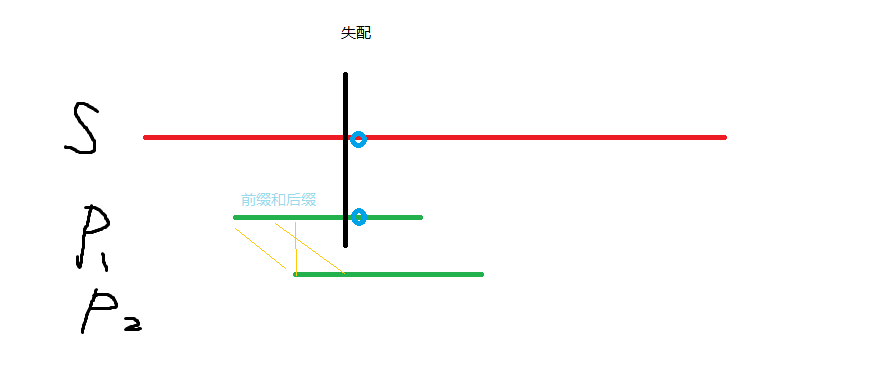

# KMP算法

KMP算法是著名的字符串匹配算法，将原来暴力匹配$O(mn)$的时间复杂度缩小到了$O(m+n)$  ，先介绍一些基本概念：

* 模式串：`s[ ]`，是比较长的待匹配的字符串
* 模板串：`p[ ]`, 较短的串。
* “非平凡前缀”： 指除了最后一个字符以外，一个字符串的全部头部组合。
* “非平凡后缀” ： 指除了第一个字符以外，一个字符串的全部尾部组合。
* `next[ ]`数组： 即存储每一个下标对应的，**前缀和后缀的最长共有元素的长度**，是KMP算法的核心。

核心思想：

在每次失去匹配时，不是把p串往后移一位，而是把p串往后移动至下一次可以和前面部分匹配的位置，这样就可以跳过大多数的失配步骤，每次p串移动的步数就是通过查找`next[ ]`数组来确定的。


图示：




给定一个模式串 S，以及一个模板串 P，所有字符串中只包含大小写英文字母以及阿拉伯数字。

模板串 p 在模式串 S 中多次作为子串出现。

求出模板串 p 在模式串 S 中所有出现的位置的起始下标。

#### 输入格式

第一行输入整数 N，表示字符串 p 的长度。

第二行输入字符串 p。

第三行输入整数 M，表示字符串 S 的长度。

第四行输入字符串 S。

#### 输出格式

共一行，输出所有出现位置的起始下标（下标从 0 开始计数），整数之间用空格隔开。

#### 数据范围

$1≤N≤10^5$
$1≤M≤10^6$

#### 输入样例：

```
3
aba
5
ababa
```

#### 输出样例：

```
0 2
```


> 注意：先写KMP匹配过程，再写求next[] 的过程

```c++
模板: 

```


```C++
#include<iostream>

using namespace std;

const int N = 100010, M =  1e6 + 10;

int n,m;
char p[N], s[M];
int ne[N];

int main(){
    //两个字符串的下标都从 1 开始， 所以 p + 1, s + 1;
    //下标从1开始，有助于节省代码
    cin >> n >> p + 1 >> m >> s + 1;
    
    // 求ne过程，是p[]自己和自己匹配的过程；
    // 起始i = 2 要注意
    for( int i = 2, j = 0; i <=n; i++){
        while( j && p[i] != p[ j + 1])   j = ne[j];
        if( p[i] == p[j + 1]) j ++;
        ne[i] = j;
    }
    
    // kmp匹配过程
    for(int i = 1, j = 0 ; i <= m; i++){
        // j 表示是否退回起点
        while( j && s[i] != p[ j  + 1 ])    j = ne[j];
        
        if ( s[i] == p [ j + 1 ])    j++;
        if( j == n){
            // 匹配成功，这里的 i - n 是第一个匹配元素的下标，本应该是 i - n + 1， 由于数组是从1开始计数，所以为 i - n
            printf("%d " , i - n );
            // 匹配成功后找下一个匹配
            j = ne[j];
        }
    }
    
}
```

