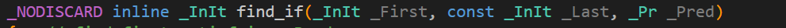

## STL用于算法

### vector

变长数组

```c++
vector<int> a(10,3);    // 定义一个长度为10的vector, 每个数都是3
vector<int> a[10];     // 定义了10个vector
a.empty();
a.size();				// empty()和size() 是所有容器都有的，时间复杂度为O(1)
a.clear();             // 并不是所有容器都有清空的函数clear()
vector.swap(vector2);
v.insert(v.begin(),8);//在最前面插入新元素。  
v.insert(v.begin()+2,1);//在迭代器中第二个元素前插入新元素  
v.insert(v.end(),3);//在向量末尾追加新元素。  
v.insert(v.end(),4,1);//在尾部插入4个1
v.erase():           // 有两种函数原型：
	iteratorerase(iterator position);                    // 删除某个迭代器位置的元素
	iteratorerase(iterator first, iterator last);			// 删除一段迭代器的位置

```

关于`erase()`函数的常见使用错误：

```c++
// 下面这段使用是错误的，因为erase(iter)后，iter成为了野指针，给野指针++会导致内存错误
for(auto iter=vec.begin();iter!=vec.end(); iter++)
{
      if(*iter == 3)
            veci.erase(iter);
}

// 正确写法
for(auto iter=vec.begin();iter!=vec.end(); )
{
     if( *iter == 3)
          iter = veci.erase(iter);//当删除时erase函数自动指向下一个位置，就不需要进行++
      else
            iter ++ ;    //当没有进行删除的时候，迭代器++
}


```


解决删除连续数字的一种方法：

```c++
veci.erase(remove(vec.begin(),vec.end(),3),vec.end());
```


倍增的思想：

> 系统为某一个程序分配空间的时候, 所需的时间与空间大小无关，与申请次数有关。所以，优化目标是变长数组要减小申请空间的次数；

首先先分配32个空间，当数组空间不够的时候，数组新分配的空间大小为64，再把原来的元素copy过来；

假设申请长度为n的数组，申请空间的次数`O(logn)`, 插入操作均摊下来是`O(1)`;

```c++
vector.front() /  vector.back();
push_back(); pop_back();
begin(); end();			// end()是最后一个数的后面一位
支持比较运算：按照字典序来进行比较"< >"
```


### pair<int, int>

```c++
pair<int, string> p;
p.first; p.second
支持比较运算，也是按照字典序来比，以first为第一关键字，以second为第二关键字。
p = make_pair(10,"ysq");
p = { 20, "abc"}; 
```

pair最经典的用法就是某个变量有两个属性，并且要按照其中一个属性来进行排序，就可以把需要排序的属性放到first里

如果某个变量有三个属性：

```c++
pair<int, pair<int,int>> p;
```


### string

字符串

```c++
string s;
    size();length();
    empty();
    clear();
	erase();  // 支持删除某一项
 	支持用大于号、小于号直接进行比较；当两个字符串的长度相同时，按照字典序排序进行比较。
    s.substr(1, 2); 		// 第一个参数是字串的开始下标，第二个参数是子串长度(若很大，直接输出到最后一个元素)
printf("%s\n", s.c_str())
    s.c_str()   // 返回字符串最开始的指针
```


### queue

`push(), front() , pop(), back()`

> 注意，queue, priority_queue , stack都没有clear函数

清空queue容器的方法：

```c++
q = queue<int>();
```


### priority_queue

优先队列,实际上就是堆，默认是大顶堆；

```c++
push(); //插入一个元素
top();  //返回堆顶元素
pop();  //弹出堆顶元素

// 将大顶堆改成小顶堆
1. heap.push(-x);
2. 
    #include<queue>
    #include<vector>
    priority_queue<int, vector<int>, greater<int>> heap;       // 小根堆
```


### stack

```c++
push();			// 栈顶插入
top(); 			// 栈顶元素
pop();         // 弹出栈顶元素
size();
empty();
```


### deque

双端队列, 效率偏低；

```c++
size();
empty();
clear();
front();
back();
push_back();
pop_back();
push_front();   pop_front();
[]
begin()/ end()
```


### set,map,multiset, multimap

基于平衡二叉树（红黑树）来实现的，动态维护有序序列；


```c++
// set里不能有重复元素
set<int> s;
s.insert();			// O(logn)
size();
empty();
find();			// 查找一个数，不存在返回end迭代器
count()       // 返回某一个数的个数, 通常可以用count()函数来判断set和map里是否包含某个元素
erase();	// 如果输入一个数x，删除所有x；如果输入一个迭代器，删除这个迭代器；  O( k + logn)
begin()/ end();  //++ --的时间复杂度也是O(logn)

// multiset里可以有重复元素
multiset<int> ms;

lower_bound() / upper_bound();
lower_bound(x)  返回大于等于x的最小的数的迭代器;
upper_bound(x)	返回大于x的最小的数的迭代器，不存在返回end();

```

* map, multimap

```c++
insert();     // 插入的数是一个pair
erase();     // 输入的参数是pair或者迭代器键值对
find();
[];          //可以像用数组一样使用map, 时间复杂度是O(logn),数组的下标是O(1)
iter->first; iter->second;
map<string, int> a;
a["yxc"] = 1;
cout<< a["yxc"]<<endl;


```


### unordered_set, unordered_map, unordered_multiset, unordered_multimap

基于哈希表来实现的， 和上面类似，增删改查的时间复杂度是O(1)；

缺点是不支持lower_bound() / upper_bound(), 也不支持迭代器的++ 和 --;

```c++
// //复制一个已有的unordered_map
unordered_map<char, int> hs(hw);

// 注意，如果要判断hash表中是否含有某个键，不能用if(map[key] == 0) ，这会自动建立一个key
if(map.count(key)){}
```


### bitset

压位， 节省内存；

比如想要开辟一个10000 * 10000 bool数组，如果直接开辟，就需要$10^8 = 100MB$内存，但是如果限制内存为64MB, 那么就需要用bitset来存储；

```c++
bitset<10000> s;
~, &, |, ^;
>>, << ;
== , !=;
[]; 取出来某一位
count(); //返回有多少个1
any/ none() ;     // 判断是否至少有一个1， noen()判断是否全为空
set(); //把所有位置设为1
set(k,v);
reset();		// 把所有位变成0
flip();        // 等价于~
flip(k)			// 把第k位取反
```


### 函数对象

* 重载**函数调用操作符**的类，其对象常称为**函数对象**
* **函数对象**使用重载的()时，行为类似函数调用，也叫**仿函数**

本质： 函数对象(仿函数)是一个**类**，不是一个函数

**特点：**

* 函数对象在使用时，可以像普通函数那样调用, 可以有参数，可以有返回值；
* 函数对象超出普通函数的概念，函数对象可以有自己的状态, 在自己的类里面添加成员属性值；
* **函数对象可以作为参数传递。**

```c++
class MyAdd {
public:
	int operator()( int v1, int v2){
		return v1 + v2;
	}
};

void test() {
	MyAdd myAdd;
	cout << myAdd(10, 10) << endl;
}

int main() {
	test();
	return 0;
}
```


###  谓词

####  谓词概念


**概念：**

* 返回**bool类型的仿函数**称为**谓词**
* 如果operator()接受一个参数，那么叫做一元谓词
* 如果operator()接受两个参数，那么叫做二元谓词


####  一元谓词

**示例：**

```C++
#include <vector>
#include <algorithm>

//1.一元谓词
class GreaterFive{
	bool operator()(int val) {
		return val > 5;
	}
};

void test01() {

	vector<int> v;
	for (int i = 0; i < 10; i++)
	{
		v.push_back(i);
	}
	// 传递GreaterFive() 匿名的函数对象
	vector<int>::iterator it = find_if(v.begin(), v.end(), GreaterFive());
	if (it == v.end()) {
		cout << "没找到!" << endl;
	}
	else {
		cout << "找到:" << *it << endl;
	}

}

int main() {

	test01();

	system("pause");

	return 0;
}
```

总结：参数只有一个的谓词，称为一元谓词



出现`Pred`时，表示是一个谓词；


#### 二元谓词

**经典sort示例：**

```C++
#include <vector>
#include <algorithm>
//二元谓词
class MyCompare
{
public:
	bool operator()(int num1, int num2)
	{
		return num1 > num2;
	}
};

void test01()
{
	vector<int> v;
	v.push_back(10);
	v.push_back(40);
	v.push_back(20);
	v.push_back(30);
	v.push_back(50);

	//默认从小到大
	sort(v.begin(), v.end());
	for (vector<int>::iterator it = v.begin(); it != v.end(); it++)
	{
		cout << *it << " ";
	}
	cout << endl;
	cout << "----------------------------" << endl;

	//使用函数对象改变算法策略，排序从大到小
	sort(v.begin(), v.end(), MyCompare());
	for (vector<int>::iterator it = v.begin(); it != v.end(); it++)
	{
		cout << *it << " ";
	}
	cout << endl;
}

int main() {

	test01();

	system("pause");

	return 0;
}
```


### 内建函数对象

####  内建函数对象意义

**概念：**

* STL内建了一些函数对象

**分类:**

* 算术仿函数，加减乘除

* 关系仿函数，对比，大于小于，相等不相等

* 逻辑仿函数; 基本用不到

**用法：**

* 这些仿函数所产生的对象，用法和一般函数完全相同
* 使用**内建函数对象**，需要引入头文件 `#include<functional>`、


#### 算术仿函数

**功能描述：**

* 实现四则运算
* 其中`negate`是一元运算，其他都是二元运算


**仿函数原型：**

* `template<class T> T plus<T>`                //加法仿函数
* `template<class T> T minus<T>`              //减法仿函数
* `template<class T> T multiplies<T>`    //乘法仿函数
* `template<class T> T divides<T>`         //除法仿函数
* `template<class T> T modulus<T>`         //取模仿函数
* `template<class T> T negate<T>`           //取反仿函数  10 --》 -10


**示例：**

```C++
#include <functional>
//negate
void test01()
{
	negate<int> n;
	cout << n(50) << endl;
}

//plus
void test02()
{
    // 这里默认加法的两个类型是相同的
	plus<int> p;
	cout << p(10, 20) << endl;
}

int main() {

	test01();
	test02();

	system("pause");

	return 0;
}
```

总结：使用内建函数对象时，需要引入头文件 `#include <functional>`


####  关系仿函数

**功能描述：**

- 实现关系对比


**仿函数原型：**

* `template<class T> bool equal_to<T>`                    //等于
* `template<class T> bool not_equal_to<T>`            //不等于
* `template<class T> bool greater<T>`                      //大于
* `template<class T> bool greater_equal<T>`          //大于等于
* `template<class T> bool less<T>`                           //小于
* `template<class T> bool less_equal<T>`               //小于等于


**示例：**

```C++
#include <functional>
#include <vector>
#include <algorithm>

class MyCompare
{
public:
	bool operator()(int v1,int v2)
	{
		return v1 > v2;
	}
};
void test01()
{
	vector<int> v;

	v.push_back(10);
	v.push_back(30);
	v.push_back(50);
	v.push_back(40);
	v.push_back(20);

	for (vector<int>::iterator it = v.begin(); it != v.end(); it++) {
		cout << *it << " ";
	}
	cout << endl;

	//自己实现仿函数
	//sort(v.begin(), v.end(), MyCompare());
	//STL内建仿函数  大于仿函数
	sort(v.begin(), v.end(), greater<int>());

	for (vector<int>::iterator it = v.begin(); it != v.end(); it++) {
		cout << *it << " ";
	}
	cout << endl;
}

int main() {

	test01();

	system("pause");

	return 0;
}
```

总结：关系仿函数中最常用的就是greater<>大于， 不写默认是less<int>()


### STL常用算法

**概述**:

* 算法主要是由头文件`<algorithm>` `<functional>` `<numeric>`组成。


* `<algorithm>`是所有STL头文件中最大的一个，范围涉及到比较、 交换、查找、遍历操作、复制、修改等等
* `<numeric>`体积很小，只包括几个在序列上面进行简单数学运算的模板函数
* `<functional>`定义了一些模板类,用以声明函数对象。


#### 遍历算法: for_each, transform

以下的算法也可以调用普通函数

```c++
for_each(iterator beg, iterator end, _func);   // _func普通函数或者函数对象
//遍历算法
void print01(int val){
    cout << val << " ";
}
// 调用普通函数不加括号，传递的是函数指针
for_each(v.begin(), v.end(), print01);


class print02{
public:
    void operator()(int val){
        cout << val << " ";
    }
}; 


for_each(v.begin(), v.end(), print02());		//调用函数对象

// ============ //
class TransForm
{
public:
	int operator()(int val)
	{
		return val;
	}
};
transform(iterator beg1, iterator end1, iterator beg2, _func);
vector<int>vTarget; //目标容器
vTarget.resize(v.size()); // 目标容器需要提前开辟空间
transform(v.begin(), v.end(), vTarget.begin(), TransForm());

```


#### 查找算法:find,count

```c++
find(iterator beg, iterator end, value);       // value为要查找的元素
find_if(iterator beg, iterator end, _Pred);  
adjacent_find(iterator beg, iterator end);   //查找相邻重复元素，两个元素相邻，并且相等。返回迭代器；找不到返回end()
bool binary_search(iterator beg, iterator end, value);  // 二分查找。必须原来的元素是有序的
count(iterator beg, iterator end, value);       //统计元素个数
count_if(iterator beg, iterator end, _Pred);     // 按照谓词来统计元素个数
```


#### 排序算法:sort,merge,reverse,lower_bound()， upper_bound()

```c++
sort(iterator beg, iterator end, _Pred);    // 比较函数可以是谓词，可以是普通函数
random_shuffle(iterator beg, iterator end);  // 指定范围内的元素随机调整次序，使用时记得加随机数种子
//merge中容器元素合并，并存储到另一容器中
// 注意: 两个容器必须是有序的 ; dest :目标容器开始迭代器, 合并出来的元素不是有序的
merge(iterator beg1, iterator end1, iterator beg2, iterator end2, iterator dest);  
reverse(iterator beg, iterator end);              //用的多！
lower_bound(), upper_bound()用于有序数组或容器中:
	lower_bound(first, last, val)用来寻找数组或容器的[first,last)范围内第一个值大于等于val的元素位置，若是数组，返回指针；若是容器，返回迭代器。
    upper_bound(first, last, val)返回第一个大于val值的元素位置。
```


#### 拷贝和替换算法:copy,swap,replace

```c++
copy(iterator beg, iterator end, iterator dest);       // dest目标起始迭代器 记得提前开辟空间
replace(iterator beg, iterator end, oldvalue, newvalue);   // 将区间内的旧元素替换成新元素
replace_if(iterator beg, iterator end, _pred, newvalue);   //利用谓词来替换
swap(container c1, container c2);             // 两个容器需要同种类型
```


#### 算术生成算法: accumulate,fill

算术生成算法属于小型算法，使用时包含的头文件为 `#include <numeric>`

```c++
// 计算容器元素累计总和
// beg 开始迭代器
// end 结束迭代器
// value 起始值
accumulate(iterator beg, iterator end, value);
// res = accumulate(euler + 1, euler + n + 1, (LL)0);    从euler[1] 到euler[n]的累计求和，且返回类型为long long
fill(iterator beg, iterator end, value);        // 填充指定的值
// 二维数组使用fill来填充
fill(&g[0][0], &g[0][0] + N * N, '.');
// 一维数组使用fill来填充
fill(col, col + N, false);
```


#### 常用的集合算法:求交集并集，差集

```c++
// 求两个容器的交集 注意:两个集合必须是有序序列
set_intersection(iterator beg1, iterator end1, iterator beg2, iterator end2, iterator dest);
// 使用方法
#include <vector>
#include <algorithm>

class myPrint
{
public:
	void operator()(int val)
	{
		cout << val << " ";
	}
};

void test01()
{
	vector<int> v1;
	vector<int> v2;
	for (int i = 0; i < 10; i++)
    {
		v1.push_back(i);
		v2.push_back(i+5);
	}

	vector<int> vTarget;
	//取两个里面较小的值给目标容器开辟空间
	vTarget.resize(min(v1.size(), v2.size()));

	//返回目标容器的最后一个元素的迭代器地址
	vector<int>::iterator itEnd = 
        set_intersection(v1.begin(), v1.end(), v2.begin(), v2.end(), vTarget.begin());

	for_each(vTarget.begin(), itEnd, myPrint());
	cout << endl;
}

int main() {

	test01();

	system("pause");

	return 0;
}
```

**总结：** 

* 求交集的两个集合必须的有序序列
* 目标容器开辟空间需要从**两个容器中取小值**
* set_intersection返回值既是交集中最后一个元素的位置


```c++
// 求两个集合的并集 注意:两个集合必须是有序序列   set_union返回值是并集中最后一个元素的位置
set_union(iterator beg1, iterator end1, iterator beg2, iterator end2, iterator dest); 
//求两个集合的差集  注意:两个集合必须是有序序列
set_difference(iterator beg1, iterator end1, iterator beg2, iterator end2, iterator dest);
```

