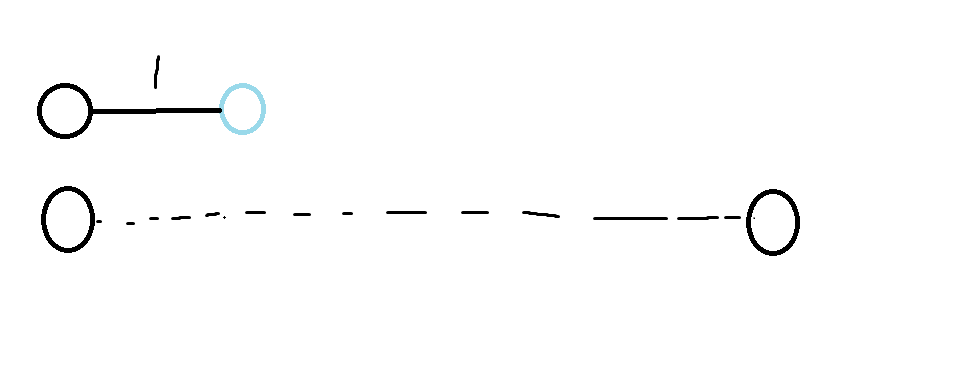
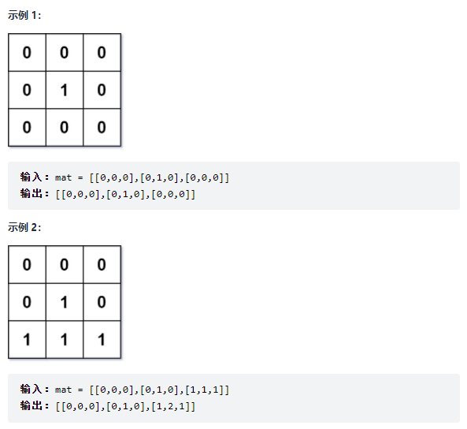

## BFS

BFS算法,从数据结构来看：使用队列queue, 所需要的空间是$O(2^h)$,  但是BFS第一次扩展到的点，具有"最短路"的性质；

图的边权都是1的时候，计算最短距离用BFS解答；

####  模板：

```c++
queue<int> q;
st[1] = true;       // 表示1号点已经被遍历过
while(q.size())
{
	int t = q.front();
    q.pop();
    
    for(int i = h[t]; i != -1; i = ne[i]){
        int j = e[i];
        if (!st[j]){
            st[j] = true;      // 表示j是已经被遍历过了
            q.push(j);
        }
    }
}
```


#### 经典例题：走迷宫

给定一个 n×m 的二维整数数组，用来表示一个迷宫，数组中只包含 0 或 1，其中 0 表示可以走的路，1 表示不可通过的墙壁。

最初，有一个人位于左上角 (1,1) 处，已知该人每次可以向上、下、左、右任意一个方向移动一个位置。

请问，该人从左上角移动至右下角 (n,m) 处，至少需要移动多少次。

数据保证 (1,1) 处和 (n,m) 处的数字为 0，且一定至少存在一条通路。

#### 输入格式

第一行包含两个整数 n 和 m。

接下来 n 行，每行包含 m 个整数（0 或 1），表示完整的二维数组迷宫。

#### 输出格式

输出一个整数，表示从左上角移动至右下角的最少移动次数。

#### 数据范围

1≤n,m≤100

#### 输入样例：

```
5 5
0 1 0 0 0
0 1 0 1 0
0 0 0 0 0
0 1 1 1 0
0 0 0 1 0
```

#### 输出样例：

```
8
```


#### 解答

类似于这种格子题上下左右都可以走的，构造方向向量数组的技巧使用的非常多，并且非常方便，可以省下很多的if条件判断语句。

```c++
#include<iostream>
#include<queue>
#include<algorithm>
#include<cstring>

using namespace std;

typedef pair<int, int> PII;
queue<PII> q;
const int N = 110;
int g[N][N];
// d数组存储每一个点到起始点的距离,
// 既保留了距离,又能判断该点是否之前访问过,很巧妙， dfs里至少需要一个bool数组
int d[N][N];
int n,m;
// PII Prev[N][N];
int bfs(){
    memset(d, -1 ,sizeof(d));
    q.push({1,1});
    d[1][1] = 0;
    // 点的上右下左移动可以用图里的向量来表示
    int dx[4] = {-1,0,1,0}, dy[4] = {0,1,0,-1};
    while(!q.empty()){
        auto t = q.front();
        q.pop();
        for(int i = 0; i < 4; i++){
            int x = t.first + dx[i], y = t.second + dy[i];

            if(x >= 1 && x <= n && y>=1 && y<=m && g[x][y] == 0 && d[x][y] == -1){
                // Prev[x][y] = t;
                d[x][y] = d[t.first][t.second] + 1;
                q.push({x,y});
            }
        }
    }
    
    /*
    如果要输出迷宫的路径，则每次保留前一次的位置就可以了
    int x = n, y = m;
    while( x != 1 || y!= 1 ){
        cout<<x << " "<< y << endl;
        auto t = Prev[x][y];
        x = t.first, y = t.second;
    }
    
    */
    return d[n][m];
}


int main(){
    scanf("%d%d", &n, &m);
    for(int i = 1 ; i <= n; i++){
        for(int j = 1 ; j <= m; j++){
            scanf("%d", &g[i][j]);
        }
    }
    cout << bfs() << endl;

    return 0;
}
```


#### 经典例题2： 八数码问题

在一个 3×3 的网格中，1∼8 这 8 个数字和一个 `x` 恰好不重不漏地分布在这 3×3的网格中。

例如：

```
1 2 3
x 4 6
7 5 8
```

在游戏过程中，可以把 `x` 与其上、下、左、右四个方向之一的数字交换（如果存在）。

我们的目的是通过交换，使得网格变为如下排列（称为正确排列）：

```
1 2 3
4 5 6
7 8 x
```

例如，示例中图形就可以通过让 `x` 先后与右、下、右三个方向的数字交换成功得到正确排列。

交换过程如下：

```
1 2 3   1 2 3   1 2 3   1 2 3
x 4 6   4 x 6   4 5 6   4 5 6
7 5 8   7 5 8   7 x 8   7 8 x
```

现在，给你一个初始网格，请你求出得到正确排列至少需要进行多少次交换。

##### 输入格式

输入占一行，将 3×3 的初始网格描绘出来。

例如，如果初始网格如下所示：

```
1 2 3 
x 4 6 
7 5 8 
```

则输入为：`1 2 3 x 4 6 7 5 8`

##### 输出格式

输出占一行，包含一个整数，表示最少交换次数。

如果不存在解决方案，则输出 −1。

##### 输入样例：

```
2  3  4  1  5  x  7  6  8
```

##### 输出样例

```
19
```


##### 思路

把`x`看成是空格，相当于每次都要把一个数移动到空格的位置，这个数字它原本的位置就变成了空格。题目要求“最少进行多少次交换”，可以看成是最短距离问题，并且每一次“交换一次”，可以看成是当前的状态经过一次变化，变成了另一个状态。



每次变化的距离都是1，所以可以用BFS来解决。

难点：

1. BFS需要一个queue， 队列中存储的是当前的状态，如何将一个3*3的图转变成一个状态？ 用一个string来存储当前的状态。

2. BFS需要记录当前状态到终点的距离，用什么来表示？ 使用`unordered_map<string , int> d`来记录距离。
3. 数字和'x'的交换，需要表达出一维列表中的下标和3*3矩阵中的下标的对应关系。

##### 解答

```c++
#include<iostream>
#include<algorithm>
#include<unordered_map>
#include<queue>

using namespace std;

int bfs(string start)
{
    string end = "12345678x";

    queue<string> q;
    unordered_map<string , int> d;

    q.push(start);
    // 起点到终点的距离定义为d，初始步数为0
    d[start] = 0;

    // 四个方向分别是上右下左
    int dx[4] = {-1,0,1,0}, dy[4] = {0 , 1, 0, -1};

    while(q.size()){
        auto t = q.front();
        q.pop();

        int distance = d[t];

        if( t == end)   return d[t];

        // 状态转移

        int k = t.find('x');
        // 把x 所在的一维数组的下标 转换成二维数组的下标
        int x = k / 3, y = k % 3;
        // 四个方向都尝试一遍
        for(int i = 0; i < 4; i++){
            int a = x + dx[i], b = y + dy[i];
            if(a >= 0 && a < 3 && b >=0 && b < 3){
                // 在string状态里交换两个字符的位置
                swap(t[k] , t[a * 3 + b]);
                // d.count(t)返回t在map里的个数, 通常只有1和0, 可以用来判断map里是否包含
                // 某个键；
                if(! d.count(t))
                {
                    d[t] = distance + 1;
                    q.push(t);
                }
                // 恢复交换之前的状态，继续交换下一个位置
                swap(t[k] , t[a * 3 + b]);
            }
        }

    }

    return -1;
}

int main()
{
    string start;
    for(int i = 0 ; i< 9 ; i++){
        char c;
        cin >> c;
        start += c;
    }
    cout << bfs(start) << endl;

    return 0;
}
```


## 有向无环图的拓扑序列（BFS的一个应用）

拓扑序列就是，当把一张图的结点按照拓扑排列好后，它的结点都是从前指向后的。


### 模板思想和步骤：

1. 在存储图的时候，额外存储一下每一个结点的入度值，把入度为0的结点入队；

2. 接下来出队，删除出队的结点与其他结点相连的边，将其他结点的入度值减小，当减为0的时候，入队；
3. 出队的顺序就是拓扑排序的结果。

```c++
bool topsort()
{
    int hh = 0, tt = -1;

    // d[i] 存储点i的入度
    for (int i = 1; i <= n; i ++ )
        if (!d[i])
            q[ ++ tt] = i;

    while (hh <= tt)
    {
        int t = q[hh ++ ];

        for (int i = h[t]; i != -1; i = ne[i])
        {
            int j = e[i];
            if (-- d[j] == 0)
                q[ ++ tt] = j;
        }
    }

    // 如果所有点都入队了，说明存在拓扑序列；否则不存在拓扑序列。
    return tt == n - 1;
}
```


如果存在有环，所有点的入度都不为0，


### 经典例题：输出有向图的任意一个合法的拓扑排序

给定一个 n个点 m 条边的有向图，点的编号是 1 到 n，图中可能存在重边和自环。

请输出任意一个该有向图的拓扑序列，如果拓扑序列不存在，则输出 −1。

若一个由图中所有点构成的序列 A 满足：对于图中的每条边 (x,y)，x 在 A 中都出现在 y 之前，则称 A 是该图的一个拓扑序列。

#### 输入格式

第一行包含两个整数 n 和 m。

接下来 m 行，每行包含两个整数 x 和 y，表示存在一条从点 x 到点 y 的有向边 (x,y)。

#### 输出格式

共一行，如果存在拓扑序列，则输出任意一个合法的拓扑序列即可。

否则输出 −1。

#### 数据范围

$1≤n,m≤10^5$

#### 输入样例：

```
3 3
1 2
2 3
1 3
```

#### 输出样例：

```
1 2 3
```


```c++
// 使用两个queue队列，其中一个用来保存结果
#include<iostream>
#include<algorithm>
#include<cstring>
#include<queue>
using namespace std;

const int N = 1e5 + 10;

int n,m;
int e[N], h[N], ne[N], idx;

queue<int> q;
queue<int> res;
// 用d[]数组来存储入度
int d[N];

void add(int a, int b){
    e[idx] = b, ne[idx] = h[a], h[a] = idx++;
}

bool topsort(){
    // 把所有入度为0的结点入队
    for(int i = 1; i <= n ; i++){
        if(!d[i]){
            q.push(i);
        }
    }
    
    while(q.size()){
        // 出队的顺序就是拓扑序
        int t = q.front(); q.pop();
        res.push(t);
        for(int i = h[t]; i != -1; i = ne[i]){
            int j = e[i];
            // 让它的入度--
            d[j]--;
            if(d[j] == 0){
                q.push(j);
            }
        }
    }
    // 判断是否所有点都入队过了
    return res.size() == n;
}

int main(){
    cin >> n >> m;
    memset(h , -1, sizeof(h));
    while( m -- ){
        int a, b ; 
        cin>> a >> b;
        add(a, b);
        // b的入度++
        d[b] ++;
    }
    
    if(topsort()){
        while(res.size()){
            cout << res.front() << " ";
            res.pop();
        }
    }else{
        printf("-1\n");
    }
    return 0;
}
```


```c++
#include<bits/stdc++.h>

using namespace std;

const int N = 1e5 + 10;

int h[N], e[N], ne[N], idx;

void add(int a, int b)  // 添加一条边a->b
{
    e[idx] = b, ne[idx] = h[a], h[a] = idx ++ ;
}
int n,m;
queue<int> q;
int d[N];

bool st[N];
int bfs(){
    q.push(1);
    memset(d,0x3f, sizeof(d));
    d[1] = 0;
    while(q.size()){
        auto t = q.front();
        q.pop();
        st[t] = true;
        int distance = 0;
        for(int i = h[t]; i != -1 ; i = ne[i]){
            int j = e[i];
            if(!st[j]){
                q.push(j);
                d[j] = d[t] + 1;
                if(j == n)  return d[n];
            }
        }
    }
    if(d[n] == 0x3f3f3f3f)  return -1;
    else    return d[n];
}
int main()
{
    cin >> n >> m;
    memset(h, -1, sizeof h);
    while (m -- ){
        int a,b;
        cin >> a >> b;
        add(a, b);
    }
    cout<< bfs() << endl;
    return 0;
}
```


### 补充一个格子运动的题目：Acwing756 蛇形矩阵

输入两个整数 n 和 m，输出一个 n 行 m 列的矩阵，将数字 1 到 n×m 按照回字蛇形填充至矩阵中。

具体矩阵形式可参考样例。

#### 输入格式

输入共一行，包含两个整数 n 和 m。

#### 输出格式

输出满足要求的矩阵。

矩阵占 n 行，每行包含 m 个空格隔开的整数。

#### 数据范围

1≤n,m≤100

#### 输入样例：

```
3 3
```

#### 输出样例：

```
1 2 3
8 9 4
7 6 5
```


#### 思路与解答

按照坐标轴位置的不同，同样设置方向向量。并且用`d = (d + 1) % 4`来进行方向的90°旋转。

设置`dx[], dy[]`数组的方法非常有效，一定要注意！

```c++
#include<bits/stdc++.h>

using namespace std;

const int N = 110;

int n,m;
int q[N][N];

int main(){
    cin >> n >> m;
    int dx[4] = {-1, 0, 1, 0}, dy[4] = {0, 1, 0 , -1};
    int x = 0, y = 0, d = 1;

    for(int i = 1; i <= n * m; i ++){
        q[x][y] = i;
        int a = x + dx[d], b = y + dy[d];
        if( a < 0 || a >= n || b < 0 || b >= m || q[a][b]){
            d = (d + 1) % 4;
            a = x + dx[d], b = y + dy[d];
        }
        x = a, y = b;
    }

    for(int i = 0; i < n; i ++){
        for(int j = 0; j < m; j ++){
            cout << q[i][j] << " ";
        }
        cout << endl;
    }

    return 0;
}
```


### 多源BFS经典问题

> https://leetcode-cn.com/problems/01-matrix/submissions/

给定一个由 0 和 1 组成的矩阵 mat ，请输出一个大小相同的矩阵，其中每一个格子是 mat 中对应位置元素到最近的 0 的距离。

两个相邻元素间的距离为 1 。



**提示：**
$$
m == mat.length   \\
n == mat[i].length \\
1 <= m, n <= 10^4 \\
1 <= m * n <= 10^4 \\
mat[i][j] \space is \space either \space  0  \space or \space 1. \\
mat 中至少有一个 0
$$


#### 思路与模板

整个矩阵只充满两种元素，要求一堆元素到另一堆元素之间的最小距离。在图论问题中多源距离通常可以构造一个虚拟的源结点，并将这个虚拟的源结点到第一批结点之间的距离构造为（0或者1），又因为所有格子之间的距离为1，所以可以使用`BFS`来求距离。

`BFS`需要一个队列，只需要把所有的矩阵中的0（**把问题中距离的目标**）都放入队列中初始化队列元素，达到虚拟源结点的效果。

> 把目标作为起点反向求距离，也是经常使用的方法！

```c++
#define x first
#define y second
class Solution {
public:
    typedef pair<int, int> PII;
    vector<vector<int>> res;
    queue<PII> q;
    int dx[4] = {-1, 0, 1, 0}, dy[4] = {0, 1, 0, -1};
    int n,m;
    vector<vector<int>> updateMatrix(vector<vector<int>>& mat) {
        n = mat.size(), m = mat[0].size();
        // 用-1来表示是否被访问过 经典做法
        res = vector<vector<int>>(n, vector<int>(m, -1));
        for(int i = 0; i < n; i ++){
            for(int j = 0; j < m; j ++){
                if(mat[i][j] == 0){
                    // 多源BFS最重要的一步: 把所有满足要求的初始结点放入队列中
                    // 单源BFS只需要放入一个初始点即可（起点 or 终点倒推）
                    q.push({i,j});
                    res[i][j] = 0;
                }   
            }
        }

        while(q.size()){
            auto t = q.front();
            q.pop();
            for(int i = 0; i < 4; i ++){
                int a = t.x + dx[i], b = t.y + dy[i];
                if(a >= 0 && a < n && b >= 0 && b < m && res[a][b] == -1){
                    res[a][b] = res[t.x][t.y] + 1;
                    q.push({a,b});
                }
            }
        }
        return res;
    }
};
```


### BFS寻找路径

> [Acwing 魔板](https://www.acwing.com/problem/content/1109/)

题目大意：用一个字符串表示状态：12345678，有固定的操作，来更改这个状态表示，最后判断题目要求的“最终状态”和“初始状态”之间需要进行最少几步操作，然后打印出操作步骤。

```cpp
#include <bits/stdc++.h>
using namespace std;

string state = "12345678";
string final;

queue<string> q;
// st状态
unordered_map<string, bool> st;
// dist数组
unordered_map<string, int> dist;

// path[dst_string] = {init_string, 'op'}
// 用path来存储当前状态是由哪个状态，通过什么操作产生的
// 类似于int path[N];int idx = 0; 
unordered_map<string, pair<string, char>> path;

// a, b, c操作都是在string 状态下进行计算的
// 并且操作顺序一定是a, b, c；这样能保证操作序列是字典序最小的。
// a操作
string op_a(string s)
{
    reverse(s.begin(), s.end());
    return s;
}

// b操作
string op_b(string s)
{
    char c = s[3];
    s.erase(3, 1);
    s = c + s;
    
    char b = s[4];
    s.erase(4, 1);
    s += b;
    
    return s;
}

// c操作
string op_c(string s)
{
    swap(s[1], s[2]);
    swap(s[1], s[6]);
    swap(s[5], s[6]);
    return s;
}

int bfs() {
    q.push(state);
    st[state] = true;
    dist[state] = 0;
    while (q.size()) {
        auto t = q.front();
        q.pop();
        
        if (t == final) {
            return dist[final];
        }
        
        for (int i = 0; i < 3; i ++) {
            string changeStr;
            char op;
            switch(i){
                case 0:
                    changeStr = op_a(t);
                    op = 'A';
                    break;
                case 1:
                    changeStr = op_b(t);
                    op = 'B';
                    break;
                case 2:
                    changeStr = op_c(t);
                    op = 'C';
                    break;
            }

            if (!st.count(changeStr)) {
                q.push(changeStr);
                st[changeStr] = true;
                dist[changeStr] = dist[t] + 1;
                path[changeStr] = {t, op};
            }
        }
    }
    return -1;
}

int main()
{
    for (int i = 0; i < 8; i ++) {
        char c;
        cin >> c;
        final += c;
    }
    
    int res = bfs();
    cout << res << endl;
    
    // 用while循环倒着遍历map
    string cur_state = final;
    string op_str;
    while (cur_state != "12345678"){
        op_str += path[cur_state].second;
        cur_state = path[cur_state].first;
    }
    
    // 倒序找的path， 要顺序输出
    reverse(op_str.begin(), op_str.end());
    for (int i = 0; i < op_str.size(); i ++) 
        cout << op_str[i];

    return 0;
}


```


### Leetcode经典题目 多源bfs + dfs + 格子找寻 最短的桥

> https://leetcode-cn.com/problems/shortest-bridge/

You are given an `n x n` binary matrix grid where `1` represents land and `0` represents water.

An island is a 4-directionally connected group of 1's not connected to any other 1's. There are exactly two islands in grid.

You may change 0's to 1's to connect the two islands to form one island.

Return the smallest number of 0's you must flip to connect the two islands.


**Example 1:**

```
Input: grid = [[0,1],[1,0]]
Output: 1
```

**Example 2:**

```
Input: grid = [[0,1,0],[0,0,0],[0,0,1]]
Output: 2
```

**Example 3:**

```
Input: grid = [[1,1,1,1,1],[1,0,0,0,1],[1,0,1,0,1],[1,0,0,0,1],[1,1,1,1,1]]
Output: 1
```


**Constraints:**

```
n == grid.length == grid[i].length
2 <= n <= 100
grid[i][j] is either 0 or 1.
There are exactly two islands in grid.
```


#### 思路和解答：

题目的意思其实是，整个地图上有两堆岛屿（由1构成），他们之间被0阻隔开来，题目要求的就是，将0翻转成1后，两堆连在一起的最小翻转次数，也就是两堆岛屿之间的最小距离 - 1；


首先找1，然后通过dfs遍历整个岛屿所有的1，将它们的坐标全部存在queue中，然后依次出队，利用`bfs()`每次多寻找一次，直到遇到下一个岛屿中的1。


```c++
#define x first
#define y second
typedef pair<int, int> PII;
class Solution {
public:
    vector<vector<int>> g;
    int n,m;
    int dx[4] = {-1, 0, 1, 0}, dy[4] = {0, 1, 0, -1};
    queue<PII> q;
    vector<vector<int>> dist;
    int shortestBridge(vector<vector<int>>& grid) {
        g = grid;
        n = g.size(), m = g[0].size();
        dist = vector<vector<int>> (n, vector<int>(m, 1e8));
        for(int i = 0; i < n; i ++){
            for(int j = 0; j < m; j++){
                if(g[i][j]){
                    dfs(i,j);
                    return bfs();
                }
            }
        }
        return -1;
    }

    void dfs(int x, int y){
        dist[x][y] = 0;
        g[x][y] = 0;
        q.push({x,y});   
        for(int i = 0; i < 4; i ++){
            int a = x + dx[i], b = y + dy[i];
            if(a >= 0 && a < n && b >= 0 && b < m && g[a][b]){
                dfs(a,b);
            }
        }
    }

    int bfs(){
        while(q.size()){
            auto t = q.front();
            q.pop();
            for(int i = 0; i < 4; i++){
                int a = t.x + dx[i], b = t.y + dy[i];
                if(a >= 0 && a < n && b >=0 && b < m && dist[a][b] > dist[t.x][t.y] + 1){
                    dist[a][b] = dist[t.x][t.y] + 1;
                    // 这里 -1 的目的就是距离为2的，只需要翻转1次即可
                    if(g[a][b])   return dist[a][b] - 1;
                    q.push({a,b});
                }
            }
        }
        return -1;
    }
};
```


