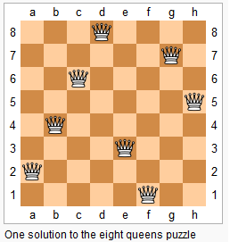
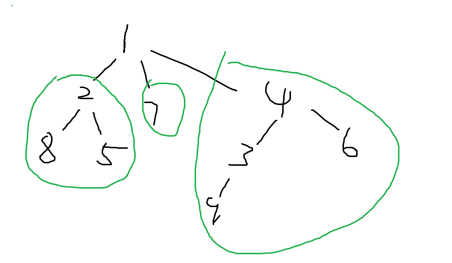

# 图的DFS 和 BFS

## 有向图和无向图

无向图可以看成是特殊的有向图，每一条无向图中的边，可以看成是有向图里加了两条对称的边。

所以图的存储的问题就可以看成是有向图如何存储的问题。

a -> b的边：

1. 用邻接矩阵存储`g[a][b]`, 如果边有权重，那么`g[a][b]`存储的是权重值；如果没有权重，那么存储的是1或者0；注意：邻接矩阵不能保存重边，但是求最短路径的时候，可以把重边优化成最短边。**空间复杂度O(n^2)**, 适合存储稠密图。
2. 邻接表，类似于拉链法解决hash冲突。数组 + 单链表，单链表中点的顺序是可以不一样的。示意图如下：

> 邻接表存储新的边，一般采用头插法。


树是一种图，无向图是特殊的有向图，所以树的遍历可以看成是有向图是如何遍历的。

有向图的遍历：

深度优先搜索：DFS可以很方便地求出每个子树所含节点的数量；


DFS算法,从数据结构来看：使用栈， 并且每次只需要记录从根节点到目前结点的路径就可以，所需要的空间是`O(h)`的； 

BFS算法,从数据结构来看：使用队列queue, 所需要的空间是$O(2^h)$,  但是BFS第一次扩展到的点，具有"最短路"的性质；

**DFS使用的是一棵树的形式来进行搜索**，一般用递归来做；递归也一般画一棵树；

每次存都是取一条路径，并且回溯的时候一定要记得**恢复现场**。

### DFS

#### **递归模板**

```c++
// 由于深度优先遍历必须要有一个能够记录节点是否被访问过的变量
// 或者能不能访问当前这个点，剪枝
bool st[N];
// 八皇后里,需要三个Bool变量
bool col[N], dg[N], udg[N];
// u 表示当前正在访问的节点

void dfs(int u){
    st[u] = true;
    
    for(int i = h[u]; i != -1; i = ne[i]){
        int j = e[i];
        if(!st[j])	dfs(j);
    }
}
```


### 经典例题1：排列数字

给定一个整数 n，将数字 1∼n 排成一排，将会有很多种排列方法。

现在，请你按照字典序将所有的排列方法输出。

#### 输入格式

共一行，包含一个整数 n。

#### 输出格式

按字典序输出所有排列方案，每个方案占一行。

#### 数据范围

1≤n≤7

#### 输入样例：

```
3
```

#### 输出样例：

```
1 2 3
1 3 2
2 1 3
2 3 1
3 1 2
3 2 1
```


#### 解答：

```c++
#include<iostream>

const int N = 10;
int path[N], n;
// st表示记录当前已经有哪些数被使用过了
bool st[N];


// 参数表示的是位置，u = 0表示先看三位数的第0位
void dfs(int u){
    if( u == n){
        for(int i = 0; i< n; i++)   printf("%d ",path[i]);
        printf("\n");
        return;
    }
    for(int i = 0; i<=n; i++){
        if(!st[i]){
            path[u] = i;
            st[i] = true;
            // 向下深搜
            dfs( u + 1);
            // 恢复现场
            path[u] = 0;
            st[i] = false;
        }
    }
}

int main(){
    scanf("%d", &n);
    // 从第0个位置开始看
    dfs(0);
    
    return 0;
}

```


### Leetcode 78 (Hot100) 子集

给你一个整数数组 `nums` ，数组中的元素 **互不相同** 。返回该数组所有可能的子集（幂集）。

解集 **不能** 包含重复的子集。你可以按 **任意顺序** 返回解集。

**示例 1：**


```
输入：nums = [1,2,3]
输出：[[],[1],[2],[1,2],[3],[1,3],[2,3],[1,2,3]]
```

**示例 2：**

```
输入：nums = [0]
输出：[[],[0]]
```

**提示：**

- `1 <= nums.length <= 10`
- `-10 <= nums[i] <= 10`
- `nums` 中的所有元素 **互不相同**


#### 思路和解答

- 方法1： dfs递归法

每一个数选或者不选实际上构成一棵决策树的形式，并且这棵决策树是完全二叉树。

不需要使用`st[]`的原因是，在`nums`向量中，从前往后选，人为控制`u + 1`，这样就只能沿着一个方向走，不需要使用st[]。


```c++
class Solution {
public:
    vector<vector<int>> res;
    vector<int> path;

    void dfs(vector<int> & nums, int u){
        // 当走到子节点，全部数都决策完
        if(u >= nums.size()){
            res.push_back(path);
            return;
        }
        // 选择第u个数
        path.push_back(nums[u]);
        dfs(nums, u + 1);
		// 弹出最后一个选的数
        path.pop_back();
        dfs(nums, u + 1);
        
    }


    vector<vector<int>> subsets(vector<int>& nums) {
        dfs(nums, 0);
        return res;
    }
};
```


- 方法2：二进制方案迭代法

nums的长度为n， 每个元素都有选或者不选两种，那么最后`res.size()` = $2 ^ n$， 正好对应长度为n的二进制数的所有表达。比如000~111。 

这样我们可以枚举$0 - 2^n-1$, 其中每一种方案里，相应位数为1的，则表示选择这个元素；反之为0，则表示不选这个元素。

```c++
class Solution {
public:
    vector<vector<int>> subsets(vector<int>& nums) {
        vector< vector<int> > res;
        
        int len = nums.size();
        for(int i = 0; i < (1 << len); i ++){
            vector<int> temp;
            // 枚举每一位
            for(int j = 0; j < len; j++){
                if( i >> j & 1) temp.push_back(nums[j]);
            }
            res.push_back(temp);
        }
        return res;
    }
};
```


### Leetcode 270场Leetcode周赛

[5944. 从二叉树一个节点到另一个节点每一步的方向 - 力扣（LeetCode） (leetcode-cn.com)](https://leetcode-cn.com/problems/step-by-step-directions-from-a-binary-tree-node-to-another/)

给你一棵 二叉树 的根节点 root ，这棵二叉树总共有 n 个节点。每个节点的值为 1 到 n 中的一个整数，且互不相同。给你一个整数 **startValue** ，表示起点节点 s 的值，和另一个不同的整数 **destValue** ，表示终点节点 t 的值。

请找到从节点 s 到节点 t 的 **最短路径** ，并以字符串的形式返回每一步的方向。每一步用 大写 字母 'L' ，'R' 和 'U' 分别表示一种方向：

'L' 表示从一个节点前往它的 左孩子 节点。
'R' 表示从一个节点前往它的 右孩子 节点。
'U' 表示从一个节点前往它的 父 节点。
请你返回从 s 到 t 最短路径 每一步的方向。


#### 思路与解答：

非常经典的DFS解法，首先找`root ~ startValue`与`root ~ destValue`的路径里的最近公共节点`commonAncestor`，再把`startValue ~ commonAncestor `部分改成字符串"U", 其余的使用`root ~ destValue`里`commonAncestor ~ destValue`那一段的路径。


```c++
/**
 * Definition for a binary tree node.
 * struct TreeNode {
 *     int val;
 *     TreeNode *left;
 *     TreeNode *right;
 *     TreeNode() : val(0), left(nullptr), right(nullptr) {}
 *     TreeNode(int x) : val(x), left(nullptr), right(nullptr) {}
 *     TreeNode(int x, TreeNode *left, TreeNode *right) : val(x), left(left), right(right) {}
 * };
 */
class Solution {
public:
    string path, pathd, paths;

    void dfs(TreeNode * root, int startValue, int destValue){
        if(root -> val == startValue)    paths = path;
        if(root -> val == destValue)    pathd = path;
        if(root -> right){
            path += 'R';
            dfs(root -> right, startValue, destValue);
            // dfs的回溯
            path.pop_back();
        }

        if(root -> left){
            path += 'L';
            dfs(root -> left, startValue, destValue);
            // dfs的回溯
            path.pop_back();
        }
    }

    string getDirections(TreeNode* root, int startValue, int destValue) {
        dfs(root, startValue, destValue);    
        int i = 0, j = 0;
        while( paths[i] == pathd[j])    i++, j++;
        return string(paths.size() - i , 'U') + pathd.substr(j);
    }
};
```


### 经典例题2 n-皇后问题：

n−皇后问题是指将 n 个皇后放在 n×n 的国际象棋棋盘上，使得皇后不能相互攻击到，即任意两个皇后都不能处于同一行、同一列或同一斜线上。



现在给定整数 n，请你输出所有的满足条件的棋子摆法。

#### 输入格式

共一行，包含整数 n。

#### 输出格式

每个解决方案占 n 行，每行输出一个长度为 n 的字符串，用来表示完整的棋盘状态。

其中 `.` 表示某一个位置的方格状态为空，`Q` 表示某一个位置的方格上摆着皇后。

每个方案输出完成后，输出一个空行。

**注意：行末不能有多余空格。**

输出方案的顺序任意，只要不重复且没有遗漏即可。

#### 数据范围

1≤n≤9

#### 输入样例：

```
4
```

#### 输出样例：

```
.Q..
...Q
Q...
..Q.

..Q.
Q...
...Q
.Q..
```


#### 解答：使用全排列的方法来判断这种情况是否合理

* 时间复杂度为$O(n!) $, 这种方法默认了每行只有一个元素，所以此种方法不需要`row[N]`
* 为什么能输出所有的可能排列的结果？

* 答： 搜索顺序对于每一行进行深搜，当第一行放置过元素之后，就去下一行找可以放置的位置；当最后一行也已经放置了一个皇后之后，回溯返回至上一行，继续换下一列看能否放置皇后。

```c++
// 全排列的方式
#include<iostream>

using namespace std;

const int N = 20;

//  全排列的思路
char g[N][N];
int n;
// dg[]表示正对角线， udg[] 表示反对角线，两个bool映射过来的数组使得每一个位置对应一个dg[]和udg[]数组元素
bool col[N], dg[N], udg[N];

void dfs(int u){
    if( u == n){
        for(int i = 0 ; i< n ; i++)  puts(g[i]);
        puts("");
        return;
    }
    
    for(int i = 0; i < n; i ++){
        if(!col[i] && !dg[i + u] && !udg[n - u + i]){
            g[u][i] = 'Q';
            col[i] = dg[u + i] = udg[n - u + i] = true;
            dfs(u + 1);
            col[i] = dg[u + i] = udg[n - u + i] = false;
            g[u][i] = '.';
        }
    }
}

int main(){
    cin >> n;
    for(int i = 0 ; i < n ; i ++){
        for(int j = 0; j < n; j++){
            g[i][j] = '.';
        }
    }
    dfs(0);
    
    return 0;
}
```


#### 解答2：枚举棋盘中的每一个可以选择的空位，每一个格子都有放置皇后和不放置皇后两种，选择其中的一种，往下深搜。

时间复杂度为$O(2^{n^{2}})$

```c++
#include<iostream>

using namespace std;

const int N = 10;

char g[N][N];
int n;
// dg[]表示正对角线， udg[] 表示反对角线, 且至少是2 * N 才能保证dg数组下标和udg数组下标不越界
bool row[N], col[N], dg[2 * N], udg[2 * N];

void dfs(int x, int y, int s){
    if( y == n){
        // 搜索的位置到了表格某行的最后一列
        y = 0; x ++ ;
    }
    if(x == n){
        if(s == n){
            // 如果已经到了最后一行，且有n个皇后了，输出
            for(int i = 0 ;  i< n; i++) puts(g[i]);
            puts("");
        }
        return;
    }
    // 枚举一下在(x,y)位置放和不放的两种选择
    // 不放皇后
    dfs(x, y+1, s);
    
    // 放皇后
    if(!row[x] && !col[y] && !dg[x + y] && !udg[x - y + n]){
        g[x][y] = 'Q';
        row[x] = col[y] = dg[x + y] = udg[x - y + n] = true;
        dfs(x, y+1, s+ 1);
        row[x] = col[y] = dg[x + y] = udg[x - y + n] = false;
        g[x][y] = '.';
        
    }
}

int main(){
    cin >> n;
    for(int i = 0 ; i < n ; i ++){
        for(int j = 0; j < n; j++){
            g[i][j] = '.';
        }
    }
    // 从左上角开始搜，并记录当前一共有多少个皇后
    dfs(0,0,0);
    
    return 0;
}
```

#### 两种解答总结

方法一一般速度较快，方法二更容易理解；推荐记忆方法一。


### 经典例题3 树的重心

给定一颗树，树中包含 n 个结点（编号 1∼n）和 n−1 条无向边。

请你找到树的重心，并输出将重心删除后，剩余各个连通块中点数的最大值。

重心定义：重心是指树中的一个结点，如果将这个点删除后，剩余各个连通块中点数的最大值最小，那么这个节点被称为树的重心。

#### 输入格式

第一行包含整数 n，表示树的结点数。

接下来 n−1 行，每行包含两个整数 a 和 b，表示点 a 和点 b 之间存在一条边。

#### 输出格式

输出一个整数 m，表示将重心删除后，剩余各个连通块中点数的最大值。

#### 数据范围

$1≤n≤10^5$

#### 输入样例

```
9
1 2
1 7
1 4
2 8
2 5
4 3
3 9
4 6
```

#### 输出样例：

```
4
```


#### 解答

此题中，要注意“剩余各个连通块中点数的最大值”， 这个点数 ≠ 结点数。比如：



当把结点1删除后，剩余有三个连通块，其中连通块中点数最多的是4.

此题的思路是深度优先遍历，不断从树的叶结点开始，累计结点数量。

`Line41` 是关键，`n - sum`的含义： 比如以4为根节点，sum = 4, res = 5, n - sum = 5, 所以以4为根节点更新的ans = 5

```c++
#include<iostream>
#include<cstring>
#include<algorithm>

using namespace std;

const int N = 100010, M = N * 2;

// h[]存储n个链表的链表头，存储的是头节点的下标；e[]存储每个节点的值； ne[]存储next指针
// 单链表里就是head; 
int h[N], e[M], ne[M], idx;
bool st[N];

int ans = N;    // 初始值设置为N,表示最大的子树的结点数目
int n;

// 插入一条a指向b的边
// 这种用数组来模拟图的方法，适合于所有图
// 也适合于非二叉树的情况
void add(int a, int b) {
	e[idx] = b, ne[idx] = h[a], h[a] = idx++;
}
//  树和图的深度优先搜索的代码
// 返回以u为根的树的大小（树里的节点数量）
int dfs(int u) {
	st[u] = true;       // 标记已经被搜索过了

	int sum = 1;		// 存储以u为根的树的结点数
	int res = 0;
	for (int i = h[u]; i != -1; i = ne[i]) {
		// 记录一下列表里的节点对应的图里的节点的编号是多少
		int j = e[i];
		if (!st[j]) {
			// s存储当前子树的大小
			int s = dfs(j);
			// 当前子树也算是一个连通块，记录去掉u结点后，最大的连通块的大小
			res = max(res, s);
			sum += s;			// 以u为根的树的结点大小 需要 + 各子树的大小
		}
	}
	res = max(res, n - sum);	// 右式中的res：子树中的最大连通块数目
	ans = min(ans, res);     // dfs相当于遍历了一遍所有结点，取了剩余各个连通块中点数的最大值最小
    // cout << "u=" << u <<"\t sum=" << sum << "\t ans = " << ans << endl;   // 来进行调试
	return sum;
}


int main() {
	cin >> n;

	memset(h, -1, sizeof(h));
	for (int i = 0; i < n - 1; i++) {
		int a, b;
		cin >> a >> b;
		// 无向图的存储
		add(a, b);
		add(b, a);
	}
	// dfs(1)的值输出为树的大小：9
	dfs(1);
	
	cout << ans << endl;
	return 0;
}
```


### Leetcode417 太平洋大西洋水流问题

>https://leetcode-cn.com/problems/pacific-atlantic-water-flow/

给定一个 m x n 的非负整数矩阵来表示一片大陆上各个单元格的高度。“太平洋”处于大陆的左边界和上边界，而“大西洋”处于大陆的右边界和下边界。

规定水流只能按照上、下、左、右四个方向流动，且只能从高到低或者在同等高度上流动。

请找出那些水流既可以流动到“太平洋”，又能流动到“大西洋”的陆地单元的坐标。

**提示：**

1. 输出坐标的顺序不重要
2. *m* 和 *n* 都小于150


**示例：**

 ```
 给定下面的 5x5 矩阵:
 
   太平洋 ~   ~   ~   ~   ~ 
        ~  1   2   2   3  (5) *
        ~  3   2   3  (4) (4) *
        ~  2   4  (5)  3   1  *
        ~ (6) (7)  1   4   5  *
        ~ (5)  1   1   2   4  *
           *   *   *   *   * 大西洋
 
 返回:
 
 [[0, 4], [1, 3], [1, 4], [2, 2], [3, 0], [3, 1], [4, 0]] (上图中带括号的单元).
 ```


#### 思路与解答：

要求矩阵中有哪些点可以沿着非递增序列同时流到左上边界或者右下边界；我们可以知道，最左边的一列和最上面的一行肯定可以流到太平洋去，同理最下面一行和最右边一列肯定可以流到大西洋去。

题目就需要可以**反向思考**，从这些已知的点出发，按照非递减顺序，遍历整个图，更新所有点的状态，这样再遍历一次整个图的状态，就能知道哪些点既能留到太平洋，又能留到大西洋了。

时间复杂度为两次遍历整个图，O(n^2);

- 小技巧：表示状态时，可以开辟两个bool数组，也可以仅仅开辟一个int数组；利用位运算的方法来求解是否都满足，这样代码写起来就会非常简洁；
- 比如用int型数的二进制的最后一位0，1表示一个状态a，二进制的倒数第二位为0或1表示另一个状态b；如果a,b都满足，则值为3.

```
st[x][y] = 1 表示能流到太平洋去， st[a][b] = 2表示能流到大西洋去； st[x][y] & st[a][b]  = 0;
都满足 1 | 2 = 3
```


```c++
class Solution {
public:
    // 这里不同于题目的规定m * n, 而是看成平时常用的n * m
    int m,n;
    vector<vector<int>> g;

    vector<vector<int>> st;
    int dx[4] = {-1, 0, 1, 0}, dy[4] = {0, 1, 0, -1};
    vector<vector<int>> pacificAtlantic(vector<vector<int>>& heights) {
        g = heights;
        if(g.empty() || g[0].empty())   return {};
        n = g.size(), m = g[0].size();
        st = vector<vector<int>>(n, vector<int>(m));
        
        for(int i = 0; i < n; i ++)  dfs(i, 0, 1);
        for(int i = 0; i < m; i ++)     dfs(0, i, 1);
        for(int j = 0; j < n; j ++)     dfs(j, m-1, 2);
        for(int j = 0; j < m; j ++)     dfs(n-1, j, 2);

        vector<vector<int>> res;
        for(int i = 0; i < n; i++){
            for(int j = 0; j < m; j ++){
                if(st[i][j] == 3){
                    res.push_back({i,j});
                }
            }
        }

        return res;
    }

    void dfs(int x, int y, int t){
        // 1 & 1 > 0 return; 1 & 2 == 0 continue; 2 & 2 = 2 > 0 return; 0 & 1 == 0 continue; 0 & 2 == 0 continue;
        if(st[x][y] & t)    return;
        st[x][y] |= t;
        for(int i = 0; i < 4; i ++){
            int a = x + dx[i], b = y + dy[i];
            if(a >= 0 && a < n && b >= 0 && b < m && g[a][b] >= g[x][y])
                dfs(a, b, t);
        }
    }
};
```


---


### BFS

图的边权都是1的时候，计算最短距离用BFS解答；

####  模板：

```c++
queue <- 1;         // 初始化队头元素
while(queue.size())
{
	t <- 队头;
    拓展t的所有邻点x{
        if(x 未遍历){      // 遍历过与否在bfs里可以直接用距离数组来表示d[]，注意距离数组要先初始化
            queue <- x;     // x入队
            d[x] = d[t] + 1;
        }
    }
}
```


#### 经典例题：走迷宫

给定一个 n×m 的二维整数数组，用来表示一个迷宫，数组中只包含 0 或 1，其中 0 表示可以走的路，1 表示不可通过的墙壁。

最初，有一个人位于左上角 (1,1) 处，已知该人每次可以向上、下、左、右任意一个方向移动一个位置。

请问，该人从左上角移动至右下角 (n,m) 处，至少需要移动多少次。

数据保证 (1,1) 处和 (n,m) 处的数字为 0，且一定至少存在一条通路。

#### 输入格式

第一行包含两个整数 n 和 m。

接下来 n 行，每行包含 m 个整数（0 或 1），表示完整的二维数组迷宫。

#### 输出格式

输出一个整数，表示从左上角移动至右下角的最少移动次数。

#### 数据范围

1≤n,m≤100

#### 输入样例：

```
5 5
0 1 0 0 0
0 1 0 1 0
0 0 0 0 0
0 1 1 1 0
0 0 0 1 0
```

#### 输出样例：

```
8
```


#### 解答

类似于这种格子题上下左右都可以走的，构造方向向量数组的技巧使用的非常多，并且非常方便，可以省下很多的if条件判断语句。

```c++
#include<iostream>
#include<queue>
#include<algorithm>
#include<cstring>

using namespace std;

typedef pair<int, int> PII;
queue<PII> q;
const int N = 110;
int g[N][N];
// d数组存储每一个点到起始点的距离,
// 既保留了距离,又能判断该点是否之前访问过,很巧妙， dfs里至少需要一个bool数组
int d[N][N];
int n,m;
// PII Prev[N][N];
int bfs(){
    memset(d, -1 ,sizeof(d));
    q.push({1,1});
    d[1][1] = 0;
    // 点的上右下左移动可以用图里的向量来表示
    int dx[4] = {-1,0,1,0}, dy[4] = {0,1,0,-1};
    while(!q.empty()){
        auto t = q.front();
        q.pop();
        for(int i = 0; i < 4; i++){
            int x = t.first + dx[i], y = t.second + dy[i];

            if(x >= 1 && x <= n && y>=1 && y<=m && g[x][y] == 0 && d[x][y] == -1){
                // Prev[x][y] = t;
                d[x][y] = d[t.first][t.second] + 1;
                q.push({x,y});
            }
        }
    }
    
    /*
    如果要输出迷宫的路径，则每次保留前一次的位置就可以了
    int x = n, y = m;
    while( x != 1 || y!= 1 ){
        cout<<x << " "<< y << endl;
        auto t = Prev[x][y];
        x = t.first, y = t.second;
    }
    
    */
    return d[n][m];
}


int main(){
    scanf("%d%d", &n, &m);
    for(int i = 1 ; i <= n; i++){
        for(int j = 1 ; j <= m; j++){
            scanf("%d", &g[i][j]);
        }
    }
    cout << bfs() << endl;

    return 0;
}
```


#### 经典例题2： 八数码问题

在一个 3×3 的网格中，1∼8 这 8 个数字和一个 `x` 恰好不重不漏地分布在这 3×3的网格中。

例如：

```
1 2 3
x 4 6
7 5 8
```

在游戏过程中，可以把 `x` 与其上、下、左、右四个方向之一的数字交换（如果存在）。

我们的目的是通过交换，使得网格变为如下排列（称为正确排列）：

```
1 2 3
4 5 6
7 8 x
```

例如，示例中图形就可以通过让 `x` 先后与右、下、右三个方向的数字交换成功得到正确排列。

交换过程如下：

```
1 2 3   1 2 3   1 2 3   1 2 3
x 4 6   4 x 6   4 5 6   4 5 6
7 5 8   7 5 8   7 x 8   7 8 x
```

现在，给你一个初始网格，请你求出得到正确排列至少需要进行多少次交换。

##### 输入格式

输入占一行，将 3×3 的初始网格描绘出来。

例如，如果初始网格如下所示：

```
1 2 3 
x 4 6 
7 5 8 
```

则输入为：`1 2 3 x 4 6 7 5 8`

##### 输出格式

输出占一行，包含一个整数，表示最少交换次数。

如果不存在解决方案，则输出 −1。

##### 输入样例：

```
2  3  4  1  5  x  7  6  8
```

##### 输出样例

```
19
```


##### 思路

把`x`看成是空格，相当于每次都要把一个数移动到空格的位置，这个数字它原本的位置就变成了空格。题目要求“最少进行多少次交换”，可以看成是最短距离问题，并且每一次“交换一次”，可以看成是当前的状态经过一次变化，变成了另一个状态。


每次变化的距离都是1，所以可以用BFS来解决。

难点：

1. BFS需要一个queue， 队列中存储的是当前的状态，如何将一个3*3的图转变成一个状态？ 用一个string来存储当前的状态。

2. BFS需要记录当前状态到终点的距离，用什么来表示？ 使用`unordered_map<string , int> d`来记录距离。
3. 数字和'x'的交换，需要表达出一维列表中的下标和3*3矩阵中的下标的对应关系。

##### 解答

```c++
#include<iostream>
#include<algorithm>
#include<unordered_map>
#include<queue>

using namespace std;

int bfs(string start)
{
    string end = "12345678x";

    queue<string> q;
    unordered_map<string , int> d;

    q.push(start);
    // 起点到终点的距离定义为d，初始步数为0
    d[start] = 0;

    // 四个方向分别是上右下左，四个顺序可以自己定义
    int dx[4] = {-1,0,1,0}, dy[4] = {0 , 1, 0, -1};

    while(q.size()){
        auto t = q.front();
        q.pop();

        int distance = d[t];

        if( t == end)   return d[t];

        // 状态转移

        int k = t.find('x');
        // 把x 所在的一维数组的下标 转换成二维数组的下标
        int x = k / 3, y = k % 3;
        // 四个方向都尝试一遍
        for(int i = 0; i < 4; i++){
            int a = x + dx[i], b = y + dy[i];
            if(a >= 0 && a < 3 && b >=0 && b < 3){
                // 在string状态里交换两个字符的位置
                swap(t[k] , t[a * 3 + b]);
                // d.count(t)返回t在map里的个数, 通常只有1和0, 可以用来判断map里是否包含
                // 某个键；
                if(! d.count(t))
                {
                    d[t] = distance + 1;
                    q.push(t);
                }
                // 恢复交换之前的状态，继续交换下一个位置
                swap(t[k] , t[a * 3 + b]);
            }
        }

    }

    return -1;
}

int main()
{
    string start;
    for(int i = 0 ; i< 9 ; i++){
        char c;
        cin >> c;
        start += c;
    }
    cout << bfs(start) << endl;

    return 0;
}
```


## 有向无环图的拓扑序列（BFS的一个应用）

拓扑序列就是，当把一张图的结点按照拓扑排列好后，它的结点都是从前指向后的。


### 模板思想和步骤：

1. 在存储图的时候，额外存储一下每一个结点的入度值，把入度为0的结点入队；

2. 接下来出队，删除出队的结点与其他结点相连的边，将其他结点的入度值减小，当减为0的时候，入队；
3. 出队的顺序就是拓扑排序的结果。

```c++
queue <- 所有入度为0的点;
while(queue.size()){
    t <- 队头;
    枚举t的所有出边j{
        删掉t->j; d[j]--;
        if(d[j] == 0){
            queue <- j;
        }
    }
}
```


如果存在有环，所有点的入度都不为0，


### 经典例题：输出有向图的任意一个合法的拓扑排序

给定一个 n个点 m 条边的有向图，点的编号是 1 到 n，图中可能存在重边和自环。

请输出任意一个该有向图的拓扑序列，如果拓扑序列不存在，则输出 −1。

若一个由图中所有点构成的序列 A 满足：对于图中的每条边 (x,y)，x 在 A 中都出现在 y 之前，则称 A 是该图的一个拓扑序列。

#### 输入格式

第一行包含两个整数 n 和 m。

接下来 m 行，每行包含两个整数 x 和 y，表示存在一条从点 x 到点 y 的有向边 (x,y)。

#### 输出格式

共一行，如果存在拓扑序列，则输出任意一个合法的拓扑序列即可。

否则输出 −1。

#### 数据范围

$1≤n,m≤10^5$

#### 输入样例：

```
3 3
1 2
2 3
1 3
```

#### 输出样例：

```
1 2 3
```


```c++
// 使用两个queue队列，其中一个用来保存结果
#include<iostream>
#include<algorithm>
#include<cstring>
#include<queue>
using namespace std;

const int N = 1e5 + 10;

int n,m;
int e[N], h[N], ne[N], idx;

queue<int> q;
queue<int> res;
// 用d[]数组来存储入度
int d[N];

void add(int a, int b){
    e[idx] = b, ne[idx] = h[a], h[a] = idx++;
}

bool topsort(){
    // 把所有入度为0的结点入队
    for(int i = 1; i <= n ; i++){
        if(!d[i]){
            q.push(i);
        }
    }
    
    while(q.size()){
        // 出队的顺序就是拓扑序
        int t = q.front(); q.pop();
        res.push(t);
        for(int i = h[t]; i != -1; i = ne[i]){
            int j = e[i];
            // 让它的入度--
            d[j]--;
            if(d[j] == 0){
                q.push(j);
            }
        }
    }
    // 判断是否所有点都入队过了
    return res.size() == n;
}

int main(){
    cin >> n >> m;
    memset(h , -1, sizeof(h));
    while( m -- ){
        int a, b ; 
        cin>> a >> b;
        add(a, b);
        // b的入度++
        d[b] ++;
    }
    
    if(topsort()){
        while(res.size()){
            cout << res.front() << " ";
            res.pop();
        }
    }else{
        printf("-1\n");
    }
    return 0;
}
```


```c++
#include<bits/stdc++.h>

using namespace std;

const int N = 1e5 + 10;

int h[N], e[N], ne[N], idx;

void add(int a, int b)  // 添加一条边a->b
{
    e[idx] = b, ne[idx] = h[a], h[a] = idx ++ ;
}
int n,m;
queue<int> q;
int d[N];

bool st[N];
int bfs(){
    q.push(1);
    memset(d,0x3f, sizeof(d));
    d[1] = 0;
    while(q.size()){
        auto t = q.front();
        q.pop();
        st[t] = true;
        int distance = 0;
        for(int i = h[t]; i != -1 ; i = ne[i]){
            int j = e[i];
            if(!st[j]){
                q.push(j);
                d[j] = d[t] + 1;
                if(j == n)  return d[n];
            }
        }
    }
    if(d[n] == 0x3f3f3f3f)  return -1;
    else    return d[n];
}
int main()
{
    cin >> n >> m;
    memset(h, -1, sizeof h);
    while (m -- ){
        int a,b;
        cin >> a >> b;
        add(a, b);
    }
    cout<< bfs() << endl;
    return 0;
}
```


### 补充一个格子运动的题目：Acwing756 蛇形矩阵

输入两个整数 n 和 m，输出一个 n 行 m 列的矩阵，将数字 1 到 n×m 按照回字蛇形填充至矩阵中。

具体矩阵形式可参考样例。

#### 输入格式

输入共一行，包含两个整数 n 和 m。

#### 输出格式

输出满足要求的矩阵。

矩阵占 n 行，每行包含 m 个空格隔开的整数。

#### 数据范围

1≤n,m≤100

#### 输入样例：

```
3 3
```

#### 输出样例：

```
1 2 3
8 9 4
7 6 5
```


#### 思路与解答

按照坐标轴位置的不同，同样设置方向向量。并且用`d = (d + 1) % 4`来进行方向的90°旋转。

设置`dx[], dy[]`数组的方法非常有效，一定要注意！

```c++
#include<bits/stdc++.h>

using namespace std;

const int N = 110;

int n,m;
int q[N][N];

int main(){
    cin >> n >> m;
    int dx[4] = {-1, 0, 1, 0}, dy[4] = {0, 1, 0 , -1};
    int x = 0, y = 0, d = 1;

    for(int i = 1; i <= n * m; i ++){
        q[x][y] = i;
        int a = x + dx[d], b = y + dy[d];
        if( a < 0 || a >= n || b < 0 || b >= m || q[a][b]){
            d = (d + 1) % 4;
            a = x + dx[d], b = y + dy[d];
        }
        x = a, y = b;
    }

    for(int i = 0; i < n; i ++){
        for(int j = 0; j < m; j ++){
            cout << q[i][j] << " ";
        }
        cout << endl;
    }

    return 0;
}
```

