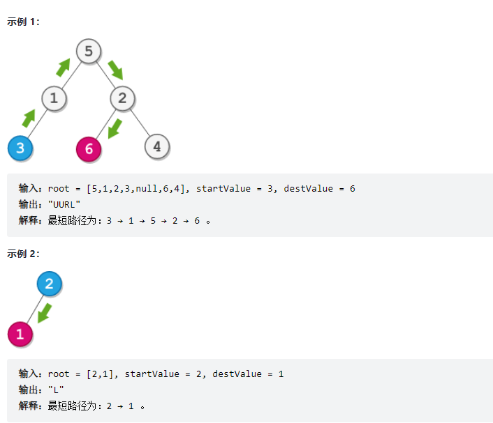
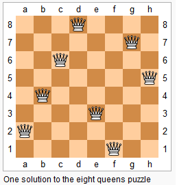
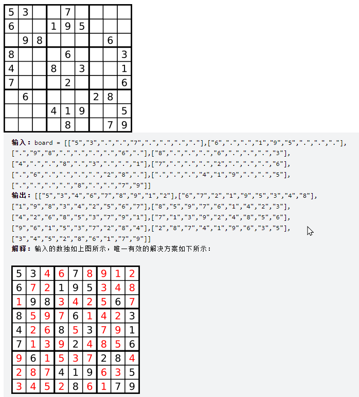
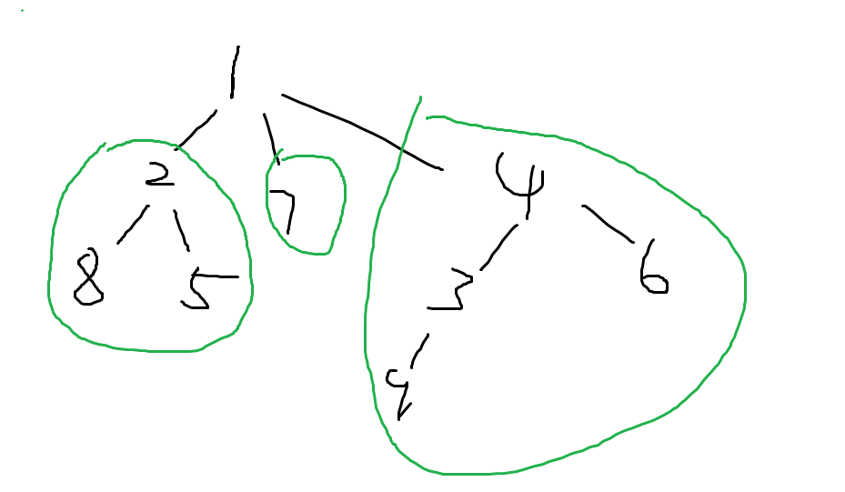

# 图的DFS 

### 有向图和无向图

无向图可以看成是特殊的有向图，每一条无向图中的边，可以看成是有向图里加了两条对称的边。

所以图的存储的问题就可以看成是有向图如何存储的问题。

a -> b的边：

1. 用邻接矩阵存储`g[a][b]`, 如果边有权重，那么`g[a][b]`存储的是权重值；如果没有权重，那么存储的是1或者0；注意：邻接矩阵不能保存重边，但是求最短路径的时候，可以把重边优化成最短边。**空间复杂度O(n^2)**, 适合存储稠密图。
2. 邻接表，类似于拉链法解决hash冲突。数组 + 单链表，单链表中点的顺序是可以不一样的。邻接表模板：

```c++
// 一定要注意，h[], e[], ne[]等数组的开辟的最大值应该是题目规定的最大边数
// 而如果是无向图，这里开辟的范围要翻倍。C++不对数组边界进行检查，很容易越界访问。
int h[N], e[N], ne[N], idx;
void add(int a, int b){
	e[idx] = b, ne[idx] = h[a], h[a] = idx++;
}
idx = 0;
memset(h, -1, sizeof h);
```

> 邻接表存储新的边，一般采用头插法。


树是一种图，无向图是特殊的有向图，所以树的遍历可以看成是有向图是如何遍历的。

目前为止，树的存储方法有：

1. 按照无向图存储。
2. 构造类或者结构体，用指针连接子树。
3. 类似于构造`Trie`树那样`int son[N][26]`， 由于子树节点最大个数已知，可以直接用这个方法。类似的还有堆排序，堆是优先级队列，也分左右子树，可以直接构造一个一维数组`h[N]`, 注意第一个元素从下标1开始存储，2 * index为它的左子树节点下标； 2 * index + 1为它的右子树节点下标。


有向图的遍历：

深度优先搜索：DFS可以很方便地求出每个子树所含节点的数量；

DFS算法,从数据结构来看：使用栈， 并且每次只需要记录从根节点到目前结点的路径就可以，所需要的空间是`O(h)`的； 


**DFS使用的是一棵树的形式来进行搜索**，一般用递归来做；递归也一般画一棵树；

每次存都是取一条路径，并且回溯的时候一定要记得**恢复现场**。

### DFS

#### **递归模板**

```c++
// 由于深度优先遍历必须要有一个能够记录节点是否被访问过的变量
// 或者能不能访问当前这个点，剪枝
bool st[N];
// 八皇后里,需要三个Bool变量
bool col[N], dg[N], udg[N];
// u 表示当前正在访问的节点

void dfs(int u){
    st[u] = true;
    
    for(int i = h[u]; i != -1; i = ne[i]){
        int j = e[i];
        if(!st[j])	dfs(j);
    }
}
```


### 经典例题1：排列数字

给定一个整数 n，将数字 1∼n 排成一排，将会有很多种排列方法。

现在，请你按照字典序将所有的排列方法输出。

#### 输入格式

共一行，包含一个整数 n。

#### 输出格式

按字典序输出所有排列方案，每个方案占一行。

#### 数据范围

1≤n≤7

#### 输入样例：

```
3
```

#### 输出样例：

```
1 2 3
1 3 2
2 1 3
2 3 1
3 1 2
3 2 1
```


#### 解答：

```c++
#include<iostream>

const int N = 10;
int path[N], n;
// st表示记录当前已经有哪些数被使用过了
bool st[N];

// 参数表示的是位置，u = 0表示先看三位数的第0位
void dfs(int u){
    if( u == n){
        for(int i = 0; i< n; i++)   printf("%d ",path[i]);
        printf("\n");
        return;
    }
    for(int i = 1; i<=n; i++){
        if(!st[i]){
            path[u] = i;
            st[i] = true;
            // 向下深搜
            dfs( u + 1);
            // 恢复现场
            path[u] = 0;
            st[i] = false;
        }
    }
}

int main(){
    scanf("%d", &n);
    // 从第0个位置开始看
    dfs(0);
    
    return 0;
}

```


### Leetcode 78 (Hot100) 子集

给你一个整数数组 `nums` ，数组中的元素 **互不相同** 。返回该数组所有可能的子集（幂集）。

解集 **不能** 包含重复的子集。你可以按 **任意顺序** 返回解集。

**示例 1：**


```
输入：nums = [1,2,3]
输出：[[],[1],[2],[1,2],[3],[1,3],[2,3],[1,2,3]]
```

**示例 2：**

```
输入：nums = [0]
输出：[[],[0]]
```

**提示：**

- `1 <= nums.length <= 10`
- `-10 <= nums[i] <= 10`
- `nums` 中的所有元素 **互不相同**


#### 思路和解答

- 方法1： dfs递归法

每一个数选或者不选实际上构成一棵决策树的形式，并且这棵决策树是完全二叉树。

不需要使用`st[]`的原因是，在`nums`向量中，从前往后选，人为控制`u + 1`，这样就只能沿着一个方向走，不需要使用st[]。


```c++
class Solution {
public:
    vector<vector<int>> res;
    vector<int> path;

    void dfs(vector<int> & nums, int u){
        // 当走到子节点，全部数都决策完
        if(u >= nums.size()){
            res.push_back(path);
            return;
        }
        // 选择第u个数
        path.push_back(nums[u]);
        dfs(nums, u + 1);
		// 弹出最后一个选的数
        path.pop_back();
        dfs(nums, u + 1);
        
    }


    vector<vector<int>> subsets(vector<int>& nums) {
        dfs(nums, 0);
        return res;
    }
};
```


- 方法2：二进制方案迭代法

nums的长度为n， 每个元素都有选或者不选两种，那么最后`res.size()` = $2 ^ n$， 正好对应长度为n的二进制数的所有表达。比如000~111。 

这样我们可以枚举$0 - 2^n-1$, 其中每一种方案里，相应位数为1的，则表示选择这个元素；反之为0，则表示不选这个元素。

```c++
class Solution {
public:
    vector<vector<int>> subsets(vector<int>& nums) {
        vector< vector<int> > res;
        
        int len = nums.size();
        for(int i = 0; i < (1 << len); i ++){
            vector<int> temp;
            // 枚举每一位
            for(int j = 0; j < len; j++){
                if( i >> j & 1) temp.push_back(nums[j]);
            }
            res.push_back(temp);
        }
        return res;
    }
};
```


### Leetcode 270场Leetcode周赛

[5944. 从二叉树一个节点到另一个节点每一步的方向 - 力扣（LeetCode） (leetcode-cn.com)](https://leetcode-cn.com/problems/step-by-step-directions-from-a-binary-tree-node-to-another/)

给你一棵 二叉树 的根节点 root ，这棵二叉树总共有 n 个节点。每个节点的值为 1 到 n 中的一个整数，且互不相同。给你一个整数 **startValue** ，表示起点节点 s 的值，和另一个不同的整数 **destValue** ，表示终点节点 t 的值。

请找到从节点 s 到节点 t 的 **最短路径** ，并以字符串的形式返回每一步的方向。每一步用 大写 字母 'L' ，'R' 和 'U' 分别表示一种方向：

'L' 表示从一个节点前往它的 左孩子 节点。
'R' 表示从一个节点前往它的 右孩子 节点。
'U' 表示从一个节点前往它的 父 节点。
请你返回从 s 到 t 最短路径 每一步的方向。





#### 思路与解答：

非常经典的DFS解法，首先找`root ~ startValue`与`root ~ destValue`的路径里的最近公共节点`commonAncestor`，再把`startValue ~ commonAncestor `部分改成字符串"U", 其余的使用`root ~ destValue`里`commonAncestor ~ destValue`那一段的路径。


```c++
/**
 * Definition for a binary tree node.
 * struct TreeNode {
 *     int val;
 *     TreeNode *left;
 *     TreeNode *right;
 *     TreeNode() : val(0), left(nullptr), right(nullptr) {}
 *     TreeNode(int x) : val(x), left(nullptr), right(nullptr) {}
 *     TreeNode(int x, TreeNode *left, TreeNode *right) : val(x), left(left), right(right) {}
 * };
 */
class Solution {
public:
    string path, pathd, paths;

    void dfs(TreeNode * root, int startValue, int destValue){
        if(root -> val == startValue)    paths = path;
        if(root -> val == destValue)    pathd = path;
        if(root -> right){
            path += 'R';
            dfs(root -> right, startValue, destValue);
            // dfs的回溯
            path.pop_back();
        }

        if(root -> left){
            path += 'L';
            dfs(root -> left, startValue, destValue);
            // dfs的回溯
            path.pop_back();
        }
    }

    string getDirections(TreeNode* root, int startValue, int destValue) {
        dfs(root, startValue, destValue);    
        int i = 0, j = 0;
        while( paths[i] == pathd[j])    i++, j++;
        return string(paths.size() - i , 'U') + pathd.substr(j);
    }
};
```


### 经典例题2 n-皇后问题：

n−皇后问题是指将 n 个皇后放在 n×n 的国际象棋棋盘上，使得皇后不能相互攻击到，即任意两个皇后都不能处于同一行、同一列或同一斜线上。



现在给定整数 n，请你输出所有的满足条件的棋子摆法。

#### 输入格式

共一行，包含整数 n。

#### 输出格式

每个解决方案占 n 行，每行输出一个长度为 n 的字符串，用来表示完整的棋盘状态。

其中 `.` 表示某一个位置的方格状态为空，`Q` 表示某一个位置的方格上摆着皇后。

每个方案输出完成后，输出一个空行。

**注意：行末不能有多余空格。**

输出方案的顺序任意，只要不重复且没有遗漏即可。

#### 数据范围

1≤n≤9

#### 输入样例：

```
4
```

#### 输出样例：

```
.Q..
...Q
Q...
..Q.

..Q.
Q...
...Q
.Q..
```


#### 解答：使用全排列的方法来判断这种情况是否合理

* 时间复杂度为$O(n!) $, 这种方法默认了每行只有一个元素，所以此种方法不需要`row[N]`.
* 为什么能输出所有的可能排列的结果？

* 答： 搜索顺序对于每一行进行深搜，当第一行放置过元素之后，就去下一行找可以放置的位置；当最后一行也已经放置了一个皇后之后，回溯返回至上一行，继续换下一列看能否放置皇后。

```c++
// 全排列的方式
#include<iostream>

using namespace std;
// 这里的N注意一定要是n最大值的两倍以上，因为dg[]的部分要用到两倍的部分；
const int N = 20;

//  全排列的思路
char g[N][N];
int n;
// dg[]表示正对角线， udg[] 表示反对角线，两个bool映射过来的数组使得每一个位置对应一个dg[]和udg[]数组元素
bool col[N], dg[N], udg[N];

// 这里的u表示第u行，一行一行来设置；前面的全排列问题，只有一行
void dfs(int u){
    if( u == n){
        for(int i = 0 ; i< n ; i++)  puts(g[i]);
        puts("");
        return;
    }
    
    for(int i = 0; i < n; i ++){
        if(!col[i] && !dg[i + u] && !udg[n - u + i]){
            g[u][i] = 'Q';
            col[i] = dg[u + i] = udg[n - u + i] = true;
            dfs(u + 1);
            col[i] = dg[u + i] = udg[n - u + i] = false;
            g[u][i] = '.';
        }
    }
}

int main(){
    cin >> n;
    for(int i = 0 ; i < n ; i ++){
        for(int j = 0; j < n; j++){
            g[i][j] = '.';
        }
    }
    dfs(0);
    
    return 0;
}
```


#### 解答2：枚举棋盘中的每一个可以选择的空位，每一个格子都有放置皇后和不放置皇后两种，选择其中的一种，往下深搜。

时间复杂度为$O(2^{n^{2}})$

```c++
#include<iostream>

using namespace std;

const int N = 10;

char g[N][N];
int n;
// dg[]表示正对角线， udg[] 表示反对角线, 且至少是2 * N 才能保证dg数组下标和udg数组下标不越界
bool row[N], col[N], dg[2 * N], udg[2 * N];

void dfs(int x, int y, int s){
    if( y == n){
        // 搜索的位置到了表格某行的最后一列
        y = 0; x ++ ;
    }
    if(x == n){
        if(s == n){
            // 如果已经到了最后一行，且有n个皇后了，输出
            for(int i = 0 ;  i< n; i++) puts(g[i]);
            puts("");
        }
        return;
    }
    // 枚举一下在(x,y)位置放和不放的两种选择
    // 不放皇后
    dfs(x, y+1, s);
    
    // 放皇后
    if(!row[x] && !col[y] && !dg[x + y] && !udg[x - y + n]){
        g[x][y] = 'Q';
        row[x] = col[y] = dg[x + y] = udg[x - y + n] = true;
        dfs(x, y+1, s+ 1);
        row[x] = col[y] = dg[x + y] = udg[x - y + n] = false;
        g[x][y] = '.';
        
    }
}

int main(){
    cin >> n;
    for(int i = 0 ; i < n ; i ++){
        for(int j = 0; j < n; j++){
            g[i][j] = '.';
        }
    }
    // 从左上角开始搜，并记录当前一共有多少个皇后
    dfs(0,0,0);
    
    return 0;
}
```

#### 两种解答总结

方法一一般速度较快，方法二更容易理解；推荐记忆方法一。


### 经典dfs爆搜题  解数独

>
> 链接：https://leetcode-cn.com/problems/sudoku-solver

编写一个程序，通过填充空格来解决数独问题。

数独的解法需 遵循如下规则：

数字 1-9 在每一行只能出现一次。
数字 1-9 在每一列只能出现一次。
数字 1-9 在每一个以粗实线分隔的 3x3 宫内只能出现一次。（请参考示例图）
数独部分空格内已填入了数字，空白格用 '.' 表示。



提示：

board.length == 9
board[i].length == 9
`board[i][j] `是一位数字或者 '.'
题目数据 保证 输入数独仅有一个解

```c++
class Solution {
public:
    bool row[9][9], col[9][9], field[3][3][9];
    void solveSudoku(vector<vector<char>>& board) {
        memset(row, 0, sizeof row);
        memset(col, 0, sizeof col);
        memset(field, 0, sizeof field);

        for(int i = 0; i < 9; i ++){
            for(int j = 0; j < 9; j ++){
                if(board[i][j] != '.'){
                    int num = board[i][j] - '1';
                    row[i][num] = col[j][num] = field[i / 3][j / 3][num] = true;
                }
            }
        }

        dfs(board, 0, 0);
    }
    

    bool dfs(vector<vector<char>> & g, int x, int y){
        // 这里有列有行，格子位置的变化要注意！
        if( y == 9) x++, y = 0;
        if(x == 9)  return true;

        if(g[x][y] != '.')  return dfs(g, x, y + 1);

        for(int i = 0; i < 9; i ++){
            if(!row[x][i] && !col[y][i] && !field[x/3][y/3][i]){
                g[x][y] = '1' + i;
                row[x][i] = col[y][i] = field[x/3][y/3][i] = true;
                if(dfs(g, x , y + 1))   return true;
                g[x][y] = '.';
                row[x][i] = col[y][i] = field[x/3][y/3][i] = false;                            
            }
        }

        return false;
    }

};
```


### 经典例题3 树的重心

给定一颗树，树中包含 n 个结点（编号 1∼n）和 n−1 条无向边。

请你找到树的重心，并输出将重心删除后，剩余各个连通块中点数的最大值。

重心定义：重心是指树中的一个结点，如果将这个点删除后，剩余各个连通块中点数的最大值最小，那么这个节点被称为树的重心。

#### 输入格式

第一行包含整数 n，表示树的结点数。

接下来 n−1 行，每行包含两个整数 a 和 b，表示点 a 和点 b 之间存在一条边。

#### 输出格式

输出一个整数 m，表示将重心删除后，剩余各个连通块中点数的最大值。

#### 数据范围

$1≤n≤10^5$

#### 输入样例

```
9
1 2
1 7
1 4
2 8
2 5
4 3
3 9
4 6
```

#### 输出样例：

```
4
```


#### 解答

此题中，要注意“剩余各个连通块中点数的最大值”， 这个点数 ≠ 结点数。比如：



当把结点1删除后，剩余有三个连通块，其中连通块中点数最多的是4.

此题的思路是深度优先遍历，不断从树的叶结点开始，累计结点数量。

`Line41` 是关键，`n - sum`的含义： 比如以4为根节点，sum = 4, res = 5, n - sum = 5, 所以以4为根节点更新的ans = 5

```c++
#include<iostream>
#include<cstring>
#include<algorithm>

using namespace std;

const int N = 100010, M = N * 2;

// h[]存储n个链表的链表头，存储的是头节点的下标；e[]存储每个节点的值； ne[]存储next指针
// 单链表里就是head; 
int h[N], e[M], ne[M], idx;
bool st[N];

int ans = N;    // 初始值设置为N,表示最大的子树的结点数目
int n;

// 插入一条a指向b的边
// 这种用数组来模拟图的方法，适合于所有图
// 也适合于非二叉树的情况
void add(int a, int b) {
	e[idx] = b, ne[idx] = h[a], h[a] = idx++;
}
//  树和图的深度优先搜索的代码
// 返回以u为根的树的大小（树里的节点数量）
int dfs(int u) {
	st[u] = true;       // 标记已经被搜索过了

	int sum = 1;		// 存储以u为根的树的结点数
	int res = 0;
	for (int i = h[u]; i != -1; i = ne[i]) {
		// 记录一下列表里的节点对应的图里的节点的编号是多少
		int j = e[i];
		if (!st[j]) {
			// s存储当前子树的大小
			int s = dfs(j);
			// 当前子树也算是一个连通块，记录去掉u结点后，最大的连通块的大小
			res = max(res, s);
			sum += s;			// 以u为根的树的结点大小 需要 + 各子树的大小
		}
	}
	res = max(res, n - sum);	// 右式中的res：子树中的最大连通块数目
	ans = min(ans, res);     // dfs相当于遍历了一遍所有结点，取了剩余各个连通块中点数的最大值最小
    // cout << "u=" << u <<"\t sum=" << sum << "\t ans = " << ans << endl;   // 来进行调试
	return sum;
}


int main() {
	cin >> n;

	memset(h, -1, sizeof(h));
	for (int i = 0; i < n - 1; i++) {
		int a, b;
		cin >> a >> b;
		// 无向图的存储
		add(a, b);
		add(b, a);
	}
	// dfs(1)的值输出为树的大小：9
	dfs(1);
	
	cout << ans << endl;
	return 0;
}
```


### Leetcode417 太平洋大西洋水流问题

>https://leetcode-cn.com/problems/pacific-atlantic-water-flow/

给定一个 m x n 的非负整数矩阵来表示一片大陆上各个单元格的高度。“太平洋”处于大陆的左边界和上边界，而“大西洋”处于大陆的右边界和下边界。

规定水流只能按照上、下、左、右四个方向流动，且只能从高到低或者在同等高度上流动。

请找出那些水流既可以流动到“太平洋”，又能流动到“大西洋”的陆地单元的坐标。

**提示：**

1. 输出坐标的顺序不重要
2. *m* 和 *n* 都小于150


**示例：**

 ```
 给定下面的 5x5 矩阵:
 
   太平洋 ~   ~   ~   ~   ~ 
        ~  1   2   2   3  (5) *
        ~  3   2   3  (4) (4) *
        ~  2   4  (5)  3   1  *
        ~ (6) (7)  1   4   5  *
        ~ (5)  1   1   2   4  *
           *   *   *   *   * 大西洋
 
 返回:
 
 [[0, 4], [1, 3], [1, 4], [2, 2], [3, 0], [3, 1], [4, 0]] (上图中带括号的单元).
 ```


#### 思路与解答：

要求矩阵中有哪些点可以沿着非递增序列同时流到左上边界或者右下边界；我们可以知道，最左边的一列和最上面的一行肯定可以流到太平洋去，同理最下面一行和最右边一列肯定可以流到大西洋去。

题目就需要可以**反向思考**，从这些已知的点出发，按照非递减顺序，遍历整个图，更新所有点的状态，这样再遍历一次整个图的状态，就能知道哪些点既能留到太平洋，又能留到大西洋了。

时间复杂度为两次遍历整个图，O(n^2);

- 小技巧：表示状态时，可以开辟两个bool数组，也可以仅仅开辟一个int数组；利用位运算的方法来求解是否都满足，这样代码写起来就会非常简洁；
- 比如用int型数的二进制的最后一位0，1表示一个状态a，二进制的倒数第二位为0或1表示另一个状态b；如果a,b都满足，则值为3.

```
st[x][y] = 1 表示能流到太平洋去， st[a][b] = 2表示能流到大西洋去; st[x][y] & st[a][b]  = 0;
都满足 1 | 2 = 3
```


```c++
class Solution {
public:
    // 这里不同于题目的规定m * n, 而是看成平时常用的n * m
    int m,n;
    vector<vector<int>> g;

    vector<vector<int>> st;
    int dx[4] = {-1, 0, 1, 0}, dy[4] = {0, 1, 0, -1};
    vector<vector<int>> pacificAtlantic(vector<vector<int>>& heights) {
        g = heights;
        if(g.empty() || g[0].empty())   return {};
        n = g.size(), m = g[0].size();
        st = vector<vector<int>>(n, vector<int>(m));
        
        for(int i = 0; i < n; i ++)  dfs(i, 0, 1);
        for(int i = 0; i < m; i ++)     dfs(0, i, 1);
        for(int j = 0; j < n; j ++)     dfs(j, m-1, 2);
        for(int j = 0; j < m; j ++)     dfs(n-1, j, 2);

        vector<vector<int>> res;
        for(int i = 0; i < n; i++){
            for(int j = 0; j < m; j ++){
                if(st[i][j] == 3){
                    res.push_back({i,j});
                }
            }
        }

        return res;
    }

    void dfs(int x, int y, int t){
        // 1 & 1 > 0 return; 1 & 2 == 0 continue; 2 & 2 = 2 > 0 return; 0 & 1 == 0 continue; 0 & 2 == 0 continue;
        if(st[x][y] & t)    return;
        st[x][y] |= t;
        for(int i = 0; i < 4; i ++){
            int a = x + dx[i], b = y + dy[i];
            if(a >= 0 && a < n && b >= 0 && b < m && g[a][b] >= g[x][y])
                dfs(a, b, t);
        }
    }
};
```


### 字符串的dfs遍历

> [leetcode 394 字符串解码](https://leetcode.cn/problems/decode-string/?favorite=2cktkvj)

给定一个经过编码的字符串，返回它解码后的字符串。

编码规则为: k[encoded_string]，表示其中方括号内部的 encoded_string 正好重复 k 次。注意 k 保证为正整数。

你可以认为输入字符串总是有效的；输入字符串中没有额外的空格，且输入的方括号总是符合格式要求的。

此外，你可以认为原始数据不包含数字，所有的数字只表示重复的次数 k ，例如不会出现像 3a 或 2[4] 的输入。

```
示例 1：
输入：s = "3[a]2[bc]"
输出："aaabcbc"

示例 2：
输入：s = "3[a2[c]]"
输出："accaccacc"

示例 3：
输入：s = "2[abc]3[cd]ef"
输出："abcabccdcdcdef"

示例 4：
输入：s = "abc3[cd]xyz"
输出："abccdcdcdxyz"
```


**思路和解答：**
字符串的dfs爆搜一般要注意： 传参是传值还是传引用，字符串传值的好处是当递归回来的时候字符串自动回归现场，不需要手动还原；字符串传引用通常用于字符串不变的情况？（待考虑）

具体到该题，由于括号是可以嵌套的，因此想到栈，想到递归。

```cpp
class Solution {
public:
    string decodeString(string s) {
        int u = 0;
        return dfs(s, u);
    }
	// string传引用，用来增加效率。u传引用，是因为递归过程中要改变
    string dfs(string &s, int &u) {
        string res;
        while (u < s.size() && s[u] != ']') {
            if (isalpha(s[u])) res += s[u ++];
            else if (isdigit(s[u])){
                int k = u;
                while (isdigit(s[k]))   k ++;
                int num = stoi(s.substr(u, k - u));
                u = k + 1;  // 去除左括号
                string y = dfs(s, u);
                u ++;   // 过滤掉右括号
                while (num --)  res += y;
            }
        }
        return res;
    }
};
```


### DFS解决图的连通性问题

这类题目往往用DFS的性质来判断图中两个节点之间是否连通，但不能用来判断两个点的最短距离。

#### 迷宫
> [acwing迷宫](https://www.acwing.com/problem/content/1114/)
```cpp
#include <bits/stdc++.h>

using namespace std;

const int N = 110;

char g[N][N];
bool st[N][N];

int T, n;
int xa, ya, xb, yb;			// 起点终点
int dx[4] = {-1, 0, 1, 0}, dy[4] = {0, 1, 0, -1};
// bool 返回类型的dfs
bool dfs(int x, int y)
{
    if (g[x][y] == '#') return false;		// 如果起点或者终点是#
    st[x][y] = true;
    if (x == xb && y == yb) return true;
    for (int i = 0; i < 4; i ++) {
        int a = x + dx[i], b = y + dy[i];
        if (a < 0 || a >= n || b < 0 || b >= n || g[a][b] == '#' || st[a][b]) {
            continue;
        }
        // 注意这里判断bool的dfs的方法, 递归型的dfs可以用if(dfs())来判断
        if (dfs(a, b))  return true;
    }
    // 如果四个方向都无法到达，返回false;
    return false;
}

int main()
{
    cin >> T;
    while (T --) {
        cin >> n;
        for (int i = 0; i < n; i ++) {
            cin >> g[i];
        }
        memset(st, false, sizeof st);
        cin >> xa >> ya >> xb >> yb;
        if (dfs(xa, ya))    puts("YES");
        else    puts("NO");
    }
    return 0;
}
```


### DFS搜索顺序问题

DFS在进行搜索的过程中，时间复杂度较高，通常用来解决NP完全问题，里面可能需要涉及到多种优化，比如剪枝或者按照组合数的形式来搜索，还需要考虑是否需要恢复现场。

#### 马走日
> [例题马走日](https://www.acwing.com/problem/content/1118/)

**题意分析：**
给定一个n * m的棋盘，和起始位置，计算马能有多少途径遍历棋盘中的每一个点。
马在棋盘上按照日字形走，一共有8个位置，每当它选择一个位置，就相当于它在“路径树（搜索状态树）”中往下走了一种情况，此时又存在8种选择。
这种性质非常适合dfs，当在此步之后的所有可能的路径搜索完，系统栈会自动恢复为上一步的情况。
**难点：** 1. 如何判断当前状态已经把所有棋盘格子都走了一遍？ 
用一个新的变量来记录已经走过的棋盘上的格子数，当cnt == 棋盘总数时，则完成一遍遍历。（计算机每当遇到有什么问题时，都可以新增记录变量，来解决。这种思想也是类似于新增一层接口来解决）
2. 8个位置，如何去走？ 答： 用dx[], dy[]来表示。

```cpp
#include <bits/stdc++.h>

using namespace std;

const int N = 10;
// st[][]来判断地图中
bool st[N][N];
int dx[8] = {-2, -1, 1, 2, 2, 1, -1, -2}, dy[8] = {1, 2, 2, 1, -1, -2, -2, -1};
int n, m, x, y;
int res;

void dfs(int a, int b, int cnt)
{
    if (cnt == n * m) {
        res ++;
        return;
    }    
    st[a][b] = true;
    for (int i = 0; i < 8; i ++) {
        int ta = a + dx[i], tb = b + dy[i];
        if (ta < 0 || ta >= n || tb < 0 || tb >= m || st[ta][tb])   continue;
        dfs(ta, tb, cnt + 1);
    }
    // 恢复现场
    st[a][b] = false;
}

int main()
{
    int T;
    scanf("%d", &T);
    while (T--) {
        scanf("%d%d%d%d", &n, &m, &x, &y);
        // 每一组数据都要把st[]全部置为false
        memset(st, false, sizeof st);
        res = 0;
        dfs(x, y, 1);
        cout << res << endl;
    }
    return 0;
}

```

#### 单词接龙
> [单词接龙](https://www.acwing.com/problem/content/1119/)

题目大意：
在两个单词相连时，其重合部分合为一部分，例如 beast 和 astonish ，如果接成一条龙则变为 beastonish。
每个单词最多使用两次。
要求求出：以要求输入的字母开头的最长的“龙”的长度。
```
输入：
5
at
touch
cheat
choose
tact
a

输出：
23（atoucheatactactouchoose）
```
**题意分析：**
要把能够接龙的单词作为一张图存储下来，比如单词word_a可以和word_b、word_c接龙，word_a -> word_b, word_a -> word_c应该存在一条边，这样才能搜索所有的情况。并且每一次拼接字符串后，也是相当于走了搜索树的一步，适合用dfs来解决。

问题： 1. 如何建图？ 2. 每个单词使用两次如何表示？

回答1：单词数不大，可以暴力两两枚举，再写一个for()循环枚举长度切分字符串子串，判断两个字符串能否拼接，图中存储的是最少重复的长度（这样接龙的长度才能最大）。

回答2：每个单词使用两次，可以用unordered_map<string, int> 来存，也可以直接用数组，每个单词有自己在单词数组中的下标，用used[]数组也可以存储。（推荐用数组）


```cpp
#include <bits/stdc++.h>

using namespace std;
const int N = 21;
int n;
string word[N];

// 表示哪些单词可以接到另一些单词后面
int g[N][N];        
int res;
// used[] 表示单词使用次数
int used[N];        

void dfs(string str, int last)
{
    res = max((int)str.size(), res);
    used[last] ++;
    for (int i = 0; i < n; i ++) {
        if (g[last][i] && used[i] < 2) {
            dfs(str + word[i].substr(g[last][i]), i);
        }
    }
    
    used[last] --;
}

int main()
{
    cin >> n;
    for (int i = 0; i < n; i ++) {
        cin >> word[i];
    }
    char start;
    cin >> start;
    
    // 建图
    for (int i = 0; i < n; i ++) {
        for (int j = 0; j < n; j ++) {
            string a = word[i], b = word[j];
            // 枚举长度
            for (int k = 1; k < min(a.size(), b.size()); k ++) {
                if (a.substr(a.size() - k, k) == b.substr(0, k)) {
                    g[i][j] = k;
                    // break是要让重合部分最少，这样拼接后整个字符串的长度才会最大
                    break;          
                }
            }
        }
    }
    
    for (int i = 0; i < n; i ++) {
    // 起始字符串
        if (word[i][0] == start) {
            dfs(word[i], i);
        }
    }
    
    cout << res << endl;
    return 0;
}
```


### DFS剪枝技巧
DFS爆搜的时间复杂度通常是指数级别的，不同题目略有不同，因此常常需要剪枝来确保代码所有用例能够跑通。

剪枝技巧：
1. 优化搜索顺序（通常情况下，应该优先搜索分支比较少的节点，比如先排序）
2. 等效冗余的搜索要去掉（或者跳过）
3. 可行性剪枝
4. 最优性剪枝