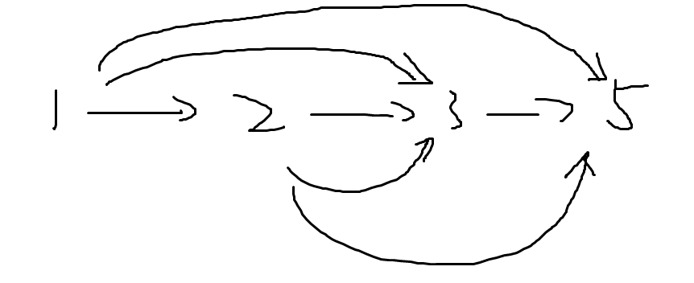
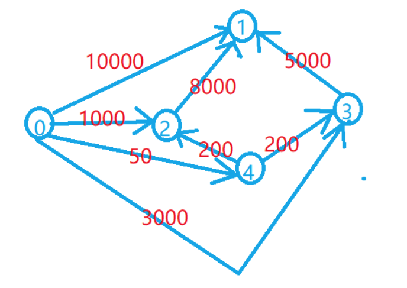

# 单源最短路建图技巧

### 乘法单源求最值

> [最小花费](https://www.acwing.com/solution/content/8010/)

- 题解与思路：

该题要得到最少需要多少钱，才能使得经过缴纳手续费后，到达终点手上人的价值是100.

假设最少需要的钱是$money$, 每次扣除$z$的手续费， 则应该求

$money * (1-z_1)*(1-z_2)*...*(1-z_n) = 100$

即，求权值乘积的最大值。

```c++
#include <iostream>
#include <cstring>
#include <algorithm>
#include <vector>
#include <queue>
using namespace std;
typedef pair<double, int> PDI;
priority_queue<PDI, vector<PDI>, less<PDI>> q;
const int N = 2010, M = 2e5 + 10;
int e[M], h[N], ne[M], idx;
double w[M], dist[N];
bool st[N];
int n, m;
void add(int a, int b, double c){
    e[idx] = b, ne[idx] = h[a], w[idx] = c;
    h[a] = idx++;
}

double dijskra(int src, int dst){
    q.push({1.0, src});
    dist[src] = 1.0;
    while(q.size()){
        auto t = q.top();
        q.pop();
        double distance = t.first;
        int node = t.second;
        if(st[node])    continue;
        st[node] = true;
        
        for(int i = h[node]; i != -1; i = ne[i]){
            int j = e[i];
            double k = w[i];
            // dist[j] < distance * k 
            // means to select the max weight's product. 
            if(!st[j] && dist[j] < distance * k){
                dist[j] = distance * k;
                q.push({dist[j], j});
            }
        }
    }
    return dist[dst];
  
}

int main(){
    cin >> n >> m;
    memset(h, -1, sizeof h);
    while(m --){
        int a, b;
        double c;
        cin >> a >> b >> c;
        c = (100 - c) / 100;
        add(a, b, c);
        add(b, a, c);
    }
    int src, dst;
    cin >> src >> dst;
    double res = dijskra(src, dst);
    res = 100 / res;
    printf("%.8lf\n", res);
    return 0;
}
```


### 公交旅游线路建图

> [Acwing920 最优乘车](https://www.acwing.com/problem/content/922/)

此类旅游路线题目要求最少换乘次数，统一可以如下方式建图：

**如果一条线路是：1 2 3 5， 即一辆公交车经过站台1，2，3，5； 那么从当前站台可以行驶到其它站台的所有车，均可以连线。**

即



按照如图方式建图，并且图中的所有边权重都是1.

```c++
#include <cstring>
#include <string>
#include <sstream>
#include <queue>
#include <iostream>

using namespace std;
queue<int> q;
const int N = 510;
bool g[N][N];
int dist[N];
int m, n;
int stop[N];

void bfs(){
    q.push(1);
    memset(dist, 0x3f, sizeof dist);
    dist[1] = 0;
    while(q.size()){
        int t = q.front(); q.pop();
        for(int i = 1; i <= n; i ++){
            // g[t][i] has the function of st[] and Adjacency matrix.
            if( g[t][i] && dist[i] > dist[t] + 1){
                dist[i] = dist[t] + 1;
                q.push(i);
            }
        }
    }
}

int main(){
    cin >> m >> n;
    string line;
    getchar();
    while(m --){
        getline(cin, line);
        stringstream ssin(line);
        int cnt = 0, p = 0;
        while( ssin >> p){
            stop[cnt ++] = p;
        }

        for(int i = 0; i < cnt; i ++){
            for(int j = i + 1; j < cnt; j ++){
                g[stop[i]][stop[j]] = true;
            }
        }
    }

    bfs();

    if(dist[n] == 0x3f3f3f3f){
        cout << "NO" << endl;
    }else{
        cout << max(dist[n] - 1, 0) << endl;
    }
    return 0;
}
```


### 虚拟源点建立

> [Acwing 905: 昂贵的聘礼](https://www.acwing.com/problem/content/905/)

题意分析：

- 建立一个超级源点0，从0建立一条边到每个物品，权值为物品的价值。代表花费多少钱就可以购买这个物品。
- 若某个物品拥有替代品，代表从替代品建立一条边到这个物品，价值为替代的价值。 代表我有了这个替代品，那么还需要花费多少就能买这个物品。
- 最后就是等级制度。我们可以枚举每个等级区间，每次求最短路是只能更新在这个区间里面的物品。枚举所有情况求一个最小值就可以了。 特别注意的是区间必须包含1点。 那么范围就是`[ L[1] - m, L[1] ]`. 位于这个范围内的点，做单源最短路。



```c++
#include <cstring>
#include <iostream>
#include <algorithm>

using namespace std;

const int N = 110, INF = 0x3f3f3f3f;

int n, m;
int w[N][N], level[N];
int dist[N];
bool st[N];

int dijkstra(int down, int up)
{
    memset(dist, 0x3f, sizeof dist);
    memset(st, 0, sizeof st);

    dist[0] = 0;
    for (int i = 1; i <= n + 1; i ++ )
    {
        int t = -1;
        // to find the minest distance node.
        for (int j = 0; j <= n; j ++ )
            if (!st[j] && (t == -1 || dist[t] > dist[j]))
                 t = j;

        st[t] = true;
        for (int j = 1; j <= n; j ++ )
            // level range.
            if (level[j] >= down && level[j] <= up)
                dist[j] = min(dist[j], dist[t] + w[t][j]);
    }

    return dist[1];
}

int main()
{
    cin >> m >> n;

    memset(w, 0x3f, sizeof w);
    for (int i = 1; i <= n; i ++ ) w[i][i] = 0;

    for (int i = 1; i <= n; i ++ )
    {
        int price, cnt;
        cin >> price >> level[i] >> cnt;
        w[0][i] = min(price, w[0][i]);
        while (cnt -- )
        {
            int id, cost;
            cin >> id >> cost;
            w[id][i] = min(w[id][i], cost);
        }
    }
    int res = INF;
    for (int i = level[1] - m; i <= level[1]; i ++ ) res = min(res, dijkstra(i, i + m));

    cout << res << endl;

    return 0;
}

```

