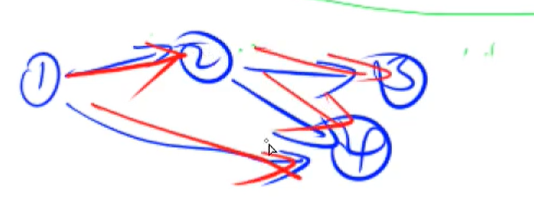
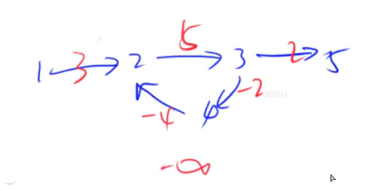

# 求最短路

## 最短路：

* 单源最短路： 求一个点到其他所有点的最短路问题。
  * 所有边权都是正数
    * 朴素Dijkstra算法，时间复杂度$O(n^2 + m)$， n表示点的数量，m表示边的数量,适合**稠密图**；
    * 堆优化Dijkstra算法，时间复杂度是$O(mlog(n))$; **稠密图m基本是$n^2$级别的**，所以不适合使用；稀疏图适合使用
  * 存在负权边
    * Bellman-Ford算法 $O(nm)$， 用于存在负权边，并且对于经过的边的数量有限制。
    * SPFA算法： 对Bellman-Ford算法进行优化，一般O(m)，最坏O(nm)；
* 多源汇最短路：可能不止一个起点，有很多询问，求任意两个点之间的最短路径。 一个算法，**Floyd算法**，时间复杂度：$O(n^3)$

> 图论里的题目侧重于抽象建模。

## 朴素Dijkstra算法

模板：

```c++
int g[N][N];          // 邻接矩阵存储图
bool st[N];           // 表示某个节点是否已经确定了最短路径
int dist[N];          // 存储1号点到x点的最短距离

int dijsktra(){
    memset(dist, 0x3f, sizeof dist);            // 初始化dist数组
    dist[1] = 0;                                // 起点
    for(int i = 0; i < n - 1; i ++){           // 起点的最短距离已经确定，迭代次数n-1次
        int t = -1;                                 // 用t来找当前所有未确定距离的点里最近的点
        for(int j = 1; j <= n; j ++){
            if(!st[j] && (t == -1 || dist[j] < dist[t]))
                t = j;
        }
																		        
        for(int j = 1; j <= n; j ++){                  // 用最近的点t来更新其它点距离
            dist[j] = min(dist[j], dist[t] + g[t][j]);
        }
        st[j] = true;
    }
    if(dist[n] == 0x3f3f3f3f)	return -1;
    return dist[n];
}

```


稠密图：用邻接矩阵来存，稀疏图：用邻接表来存

### 经典例题：朴素Dijkstra求最短路

给定一个 n 个点 m 条边的有向图，图中可能存在重边和自环，所有边权均为正值。

请你求出 1 号点到 n 号点的最短距离，如果无法从 1 号点走到 n 号点，则输出 −1。

#### 输入格式

第一行包含整数 n 和 m。

接下来 m 行每行包含三个整数 x,y,z，表示存在一条从点 x 到点 y 的有向边，边长为 z。

#### 输出格式

输出一个整数，表示 1 号点到 n 号点的最短距离。

如果路径不存在，则输出 −1。

#### 数据范围

$1≤n≤500$
$1≤m≤10^5$
图中涉及边长均不超过10000。

#### 输入样例：

```
3 3
1 2 2
2 3 1
1 3 4
```

#### 输出样例：

```
3
```


#### 解答

```c++
#include <iostream>
#include <cstring>
#include <algorithm>

using namespace std;

const int N = 510;

int n,m;
// 由题目的意思可知，稠密图最好使用邻接矩阵存储
int g[N][N];
// dist[]存储起点到每个结点的距离
int dist[N];
// st[]表示某个结点是否已经确认是最短的
bool st[N];

int dijkstra(){
    // 初始化距离数组
    memset(dist, 0x3f, sizeof dist);
    // 起点设置为最短0
    dist[1] = 0;
    // 要注意一开始不需要初始化st[1] = true;否则27行的t没办法及时更新 dijkstra算法和prim算法的初始st集合都设置为空
    for(int i = 0; i < n; i++){
        int t = -1;
        // 找待定的，距离最短的点，设置为t
        for(int j = 1; j<=n; j++){
            if(!st[j] && (t == -1 || dist[t] > dist[j]))
                t = j;
        }
        
        st[t] = true;
        
        for(int j = 1; j <=n; j++){
            dist[j] = min(dist[j], dist[t] + g[t][j]);
        }
    }
    // 到达不了n结点，没有最短路，返回-1
    if(dist[n] == 0x3f3f3f3f)   return -1;
    else    return dist[n];
}


int main(){
    scanf("%d%d", &n,&m);

    memset(g,0x3f, sizeof(g));
    
    while(m --){
        int a,b,c;
        scanf("%d%d%d",&a,&b,&c);
        // 如果有重边，将距离设置为最短的
        g[a][b] = min(g[a][b],c);
    }
    
    int t = dijkstra();
    
    printf("%d\n", t);
    
    return 0;
    
    
}
```


## 堆优化版的Dijkstra算法

引入的原因：**朴素的Dijkstra算法**适用于**稠密图**，但是如果边和点的数量都在$10^5$级别，即图是稀疏图，$n^2就是10^{10}级别$, 会超时；所以系数图需要使用堆优化版的Dijkstra算法；

再来看以下朴素Dijkstra算法的原理：

```c++
typedef pair<int, int> PII;
// 复用了堆的pair自动排序的功能
priority_queue<PII, vector<PII>, greater<PII>> q;		// pair.first = dist, pair.second = point_id

const int N = 1.5e5 + 10;
int h[N], e[N], ne[N], idx, W[N];			// 邻接表存稀疏图
int dist[N];								// 存储1 ~ i的最短距离
bool st[N];									// 判断节点是否已经确定了最短距离
int n, m;

int dijsktra(){
    memset(dist, 0x3f, sizeof dist);
    dist[1] = 0;
    q.push({0, 1});
    while(q.size()){
        auto t = q.top();
        q.pop();
        
        int d = t.first, u = t.second;
        if(st[u])   continue;
        st[u] = true;
        
        for(int i = h[u]; i != -1; i = ne[i]){
            int j = e[i], distance = W[i];				// distance表示i - j 的距离
            if(!st[j] && dist[j] > distance + d){
                dist[j] = distance + d;
                q.push({dist[j], j});
            }
        }
    }
    if(dist[n] == 0x3f3f3f3f)   return -1;
    return dist[n];
}
```



在堆里修改一个数，时间复杂度变成$O(logn)$，所以堆优化的Dijkstra算法，时间复杂度为$O(mlogn)$

优先队列： priority_queue() 。

一般不需要使用手写堆。


### 经典例题：

给定一个 n 个点 m 条边的有向图，图中可能存在重边和自环，所有边权均为非负值。

请你求出 1 号点到 n 号点的最短距离，如果无法从 1 号点走到 n 号点，则输出 −1。

#### 输入格式

第一行包含整数 n 和 m。

接下来 m 行每行包含三个整数 x,y,z，表示存在一条从点 x 到点 y 的有向边，边长为 z。

#### 输出格式

输出一个整数，表示 1 号点到 n 号点的最短距离。

如果路径不存在，则输出 −1。

#### 数据范围

1≤n,m≤1.5×105
图中涉及边长均不小于 0，且不超过 10000。

#### 输入样例：

```
3 3
1 2 2
2 3 1
1 3 4
```

#### 输出样例：

```
3
```


#### 解答

```c++
#include<cstring>
#include<iostream>
#include<algorithm>
#include<queue>
#include<vector>
using namespace std;

const int N = 1.5e5 + 10;
// 堆里存储的实际上是一个pair,维护距离的时候，需要知道结点编号是多少
// pair.first表示距离， pair.second 表示结点编号
typedef pair<int,int> PII;

int n,m;
int h[N], e[N], ne[N], idx, w[N];
int dist[N];
bool st[N];

void add(int a,int b, int c){
    e[idx] = b, w[idx] = c, ne[idx] = h[a], h[a] = idx++;
}


int dijkstra(){
    memset(dist, 0x3f, sizeof(dist));
    // 优先级队列的初始化方式，要注意！ 
    priority_queue<PII, vector<PII> , greater<PII>> heap;
    // 1号点已经知道是最短的
    heap.push({0,1});
    
    while(heap.size()){
        auto t = heap.top();
        heap.pop();
        
        int ver  = t.second, distance = t.first;
        // 如果这个点之前被更新过，那么这个点是冗余备份，直接continue，跳过它;
        if(st[ver] )  continue;
        st[ver] = true;
        // 否则来更新所有点
        
        for(int i = h[ver]; i != -1; i = ne[i]){
            int j = e[i];
            if(dist[j] > distance + w[i]){
                dist[j] = distance + w[i];
                heap.push({dist[j], j});
            }
        }
    }
    
    if(dist[n] == 0x3f3f3f3f)    return -1;
    return dist[n];
    
}

int main(){
    scanf("%d%d", &n, &m);
    memset(h, -1, sizeof h);
    
    while( m -- ){
        int a,b,c;
        scanf("%d%d%d", &a, &b, &c);
        // 堆优化版不需要对重边进行优化
        add(a,b,c);
    }
    
    printf("%d",dijkstra());
    
    return 0;
}
```


## Bellman_Ford 算法

**主要用于处理负权边**，存边的方式：

```c++
struct{
    int a,b,w;
}edge[M];
```


模板思路如下，时间复杂度O(nm)：

```c++
// 存边
struct{
    int a,b,w;
}edge[M];

for 1 ~ n:             //注意这里的循环次数是有实际物理含义的：n次表示最多只经过n条边
	备份dist中的所有数据到backup数组中;   // 备份的含义是，让此次迭代更新距离的所有结果都是来自上一次迭代。
	for 所有边 a,b,w:				// 表示一条从a 走向 b 的边，边权是w
		dist[b] = min(dist[b], dist[a] + w);         // 边权的更新方式--- 松弛操作
```


循环完所有边之后，就有一个等式成立：dist[b] <= dist[a] + w  （三角不等式）

> 注意：如果有负权回路，可能最短路是不存在，例子如下



每当走一个循环2 -> 3 -> 4, 路径的长度就减小1，所以算法可以无限循环，直到距离为负无穷，再到终点5。

**最外层循环次数k, 表示经过不超过k条边的最短路的距离。**所以，当题目**有负环，并且对于经过的边的数量有限制时，选择bellman_ford算法**。

### 经典例题：

给定一个 n 个点 m 条边的有向图，图中可能存在重边和自环， **边权可能为负数**。

请你求出从 1 号点到 n 号点的最多经过 k 条边的最短距离，如果无法从 1 号点走到nn 号点，输出 `impossible`。

注意：图中可能 **存在负权回路** 。

#### 输入格式

第一行包含三个整数 n,m,k。

接下来 m 行，每行包含三个整数 x,y,z，表示存在一条从点 x 到点 y 的有向边，边长为 z。

#### 输出格式

输出一个整数，表示从 1 号点到 n 号点的最多经过 k 条边的最短距离。

如果不存在满足条件的路径，则输出 `impossible`。

#### 数据范围

1≤n,k≤500，
1≤m≤10000，
任意边长的绝对值不超过 10000。

#### 输入样例：

```
3 3 1
1 2 1
2 3 1
1 3 3
```

#### 输出样例：

```
3
```

#### 解答

```c++
#include<bits/stdc++.h>

using namespace std;

const int N = 510;
const int M = 1e4 + 10;
int dist[N], backup[N];

struct Edge{
    int a,b,c;
}edges[M];

int n,m,k;

int bellman_ford(){
    memset(dist, 0x3f, sizeof (dist));
    dist[1] = 0;
    for(int i = 0; i < k; i++){
        memcpy(backup, dist, sizeof(dist));
        
        for(int j = 0; j < m; j ++){
            int a = edges[j].a, b = edges[j].b, w = edges[j].c;
            dist[b] = min(dist[b], backup[a] + w );
        }
    }
    
    if(dist[n] > 0x3f3f3f3f / 2)        return 0x3f;   // 也可以表示距离到不了，不用-1是因为距离存在负权值，可能
    												   // 最后的结果就是-1
    else dist[n];
}


int main(){

    scanf("%d%d%d", &n, &m, &k);
    for(int i = 0; i < m; i ++){
        int a,b,c;
        scanf("%d%d%d", &a,&b,&c);
        edges[i] = {a,b,c};
        
    }
    
    int t = bellman_ford();
    if (t == 0x3f)  puts("impossible");
    else printf("%d\n", t);
    
    return 0;
}
```


## SPFA算法

SPFA是对Bellman_ford算法的一个改进，**时间复杂度最坏是O(nm), 通常是O(m)**; 所以即使是正权边，能用Dijkstra算法求解的问题，也通常能用SPFA来求解。

回顾一下Bellman_Ford的思路：

```c++
for 1 ~ n:             //注意这里的循环次数是有实际物理含义的
	备份dist中的所有数据到backup数组中;   // 备份的含义是，让此次迭代更新距离的所有结果都是来自上一次迭代。
	for 所有边 a,b,w:				// 表示一条从a 走向 b 的边，边权是w
		dist[b] = min(dist[b], dist[a] + w);         // 边权的更新方式--- 松弛操作
```

以上的松弛操作里，实际上dist[b]更新的时候，一定是dist[a]变小了，dist[b]的更新才会减小；用**宽度优先搜索**来做优化, 设置一个队列，存储距离变小了的结点，也叫待更新的点。

```c++
queue <- 1;
while queue 不空：
    取出队头t;删掉队头;
	更新t的所有出边;
	queue <- b;
```


### 经典例题1：模板题

给定一个 n 个点 m 条边的有向图，图中可能存在重边和自环， **边权可能为负数**。

请你求出 1 号点到 n 号点的最短距离，如果无法从 1 号点走到 n 号点，则输出 `impossible`。

数据保证不存在负权回路。

#### 输入格式

第一行包含整数 n 和 m。

接下来 m 行每行包含三个整数 x,y,z，表示存在一条从点 x 到点 y 的有向边，边长为 z。

#### 输出格式

输出一个整数，表示 1 号点到 n 号点的最短距离。

如果路径不存在，则输出 `impossible`。

#### 数据范围

$$1≤n,m≤10^5$$,
图中涉及边长绝对值均不超过 10000。

#### 输入样例：

```
3 3
1 2 5
2 3 -3
1 3 4
```

#### 输出样例：

```
2
```

#### 解答：

```c++
#include<bits/stdc++.h>

using namespace std;

const int N = 1e5 + 10;

int n,m;

int h[N],e[N],idx, ne[N], w[N];

int dist[N];
// st[]用来存储当前的点是否在队列当中，防止队列中存储重复的点。
bool st[N];

void add(int x, int y, int z){
    e[idx] = y, ne[idx] = h[x], w[idx] = z, h[x] = idx++; 
}

int spfa(){
    memset(dist, 0x3f, sizeof(dist));
    dist[1] = 0;
    
    queue<int> q;
    q.push(1);
    st[1] = true;
    
    while(q.size()){
        auto t = q.front();
        q.pop();
        
        st[t] = false;
        
        for(int i = h[t]; i != -1; i = ne[i]){
            // 这里注意是取e[i],得到结点编号
            int j = e[i];
            if(dist[j] > dist[t] + w[i]){
                dist[j] = dist[t] + w[i];
                if(!st[j]){
                    q.push(j);
                    st[j] = true;
                }
            }
        }
    }
    
    if(dist[n] == 0x3f3f3f3f )   return 0x3f;
    else    return dist[n];
}

int main(){
    scanf("%d%d", &n, &m);
    
    memset(h, -1, sizeof(h));
    while(m --){
        int x,y,z;
        scanf("%d%d%d", &x,&y,&z);
        add(x,y,z);
    }
    int t = spfa();
    if(t == 0x3f)   puts("impossible");
    else    printf("%d\n", t);
    
    return 0;
}
```


>Bellman_ford算法里最后return-1的判断条件写的是dist[n]>0x3f3f3f3f/2;而spfa算法写的是dist[n]==0x3f3f3f3f;其原因在于Bellman_ford算法会遍历所有的边，因此不管是不是和源点连通的边它都会得到更新；但是SPFA算法不一样，它相当于采用了BFS，因此遍历到的结点都是与源点连通的，因此如果你要求的n和源点不连通，它不会得到更新，还是保持的0x3f3f3f3f。


### 经典例题2：用SPFA来判断是否存在负环

注意：**负环**只是路径之和是负数的环，不是指包含负权边的环。

用一个cnt[] 来表示当前最短路上的结点的边数, 在更新距离的时候：

```c++
dist[x] = dist[t] + w[i];
cnt[x] = cnt[t] + 1;		// 表示最短路的边数从cnt[t] -> cnt[x]， 并且t到x有一条短边被选中。
```

若cnt[x] >= n , 意味着从1 ~ x至少经过了n条边， 则至少经过了n + 1个点，抽屉原理可知，至少有两个点是相同的，故存在环；并且因为是最短路，所以一定有负环。


给定一个 n个点 m 条边的有向图，图中可能存在重边和自环， **边权可能为负数**。

请你判断图中是否存在负权回路。

#### 输入格式

第一行包含整数 n 和 m。

接下来 m 行每行包含三个整数 x,y,z，表示存在一条从点 x 到点 y的有向边，边长为 z。

#### 输出格式

如果图中**存在**负权回路，则输出 `Yes`，否则输出 `No`。

#### 数据范围

1≤n≤2000,
1≤m≤10000,
图中涉及边长绝对值均不超过 10000。

#### 输入样例：

```
3 3
1 2 -1
2 3 4
3 1 -4
```

#### 输出样例：

```
Yes
```

#### 解答

```c++
#include<bits/stdc++.h>

using namespace std;

const int N = 2010, M = 10010;
// 注意e[]数组中存的是边，所以开辟空间时，应该要最多开辟M个空间
int h[N], w[M], ne[M], idx, e[M];

int n,m;

int dist[N], cnt[N];
bool st[N];

void add(int a, int b , int c){
    e[idx] = b, ne[idx] = h[a], w[idx] =c , h[a] = idx++;
}

bool spfa(){
    queue<int> q;
    // 只判断是否有负环，不需要初始化dist数组，使得34行的if成立都是负权边
    // 由于负环不一定是从结点1开始，所以需要事先把所有结点都放入队列中
    for(int i = 1; i<=n; i++){
        q.push(i);
        st[i] = true;
    }
    
    while(q.size()){
        int t = q.front();
        q.pop();
        st[t] = false;
        
        for(int i = h[t]; i != -1; i = ne[i]){
            int j = e[i];
            if(dist[j] > dist[t] + w[i]){
                dist[ j ] = dist[t] + w[i];
                cnt[j] = cnt[t] + 1;
                
                if(cnt[j] >= n)     return true;
                
                if(!st[j]){
                    q.push(j);
                    st[j] = true;
                }
            }
        }
    }
    return false;
}

int main(){
    memset(h , -1, sizeof(h));
    scanf("%d%d", &n, &m);
    while(m -- ){
        int x,y,z;
        scanf("%d%d%d", &x,&y,&z);
        add(x,y,z);
    }
    
    if(spfa())  puts("Yes");
    else    puts("No");
    
    
    return 0;
}
```


## Floyd 算法

主要用于处理：多源汇最短路算法， 时间复杂度为$O(n^3)$.

```c++
初始化：
存储图：邻接矩阵;d[i,j];
for( k = 1; k <=n; k++){
    for( i = 1; i<=n; i++){
        for( j = 1; j <=n; j++){
            d[i,j] = min(d[i,j] , d[i,k] + d[k, j])
        }
    }
}
d[i,j]存储的就是从i到j的最小路。
```


### 经典例题

给定一个 n 个点 m 条边的有向图，图中可能存在重边和自环，边权可能为负数。

再给定 k 个询问，每个询问包含两个整数 x 和 y，表示查询从点 x 到点 y 的最短距离，如果路径不存在，则输出 `impossible`。

数据保证图中不存在负权回路。

#### 输入格式

第一行包含三个整数 n,m,k。

接下来 m 行，每行包含三个整数 x,y,z，表示存在一条从点 x到点 y 的有向边，边长为 z。

接下来 k 行，每行包含两个整数 x,y，表示询问点 x 到点 y 的最短距离。

#### 输出格式

共 kk 行，每行输出一个整数，表示询问的结果，若询问两点间不存在路径，则输出 `impossible`。

#### 数据范围

1≤n≤200,
$ 1≤k≤n^2 $,
1≤m≤20000

图中涉及边长绝对值均不超过 10000。

#### 输入样例：

```
3 3 2
1 2 1
2 3 2
1 3 1
2 1
1 3
```

#### 输出样例：

```
impossible
1
```


#### 解答：

```c++
#include<bits/stdc++.h>

using namespace std;

int n,m,k;
const int N = 210;

const int INF = 1E9;
// 稠密图，可以使用邻接矩阵来存储
int d[N][N];

void floyd(){
    for(int k = 1; k<= n ; k++){
        for(int i = 1; i <= n; i++){
            for(int j = 1; j <= n; j++){
                d[i][j] = min(d[i][j],  d[i][k] + d[k][j]);
            }
        }
    }
}


int main(){
    scanf("%d%d%d", &n, &m, &k);
    
    // 要注意邻接矩阵的初始化
    for(int i = 1; i<= n; i++){
        for(int j = 1; j <= n; j++){
            if( i == j) d[i][j] = 0;
            else    d[i][j] = INF;
        }
    }
    
    while(m -- ){
        int a,b,c;
        scanf("%d%d%d", &a, &b, &c);
        d[a][b] = min(d[a][b] , c);
    }
    floyd();
    
    while(k -- ){
        int a,b;
        scanf("%d%d" ,&a, &b);
        // 存在一些负权边，所以达到不了也有可能不是正无穷
        if(d[a][b] >  INF / 2 ){
            puts("impossible");
        }else{
            printf("%d\n", d[a][b]);
        }
    }
    
    return 0;
}
```

