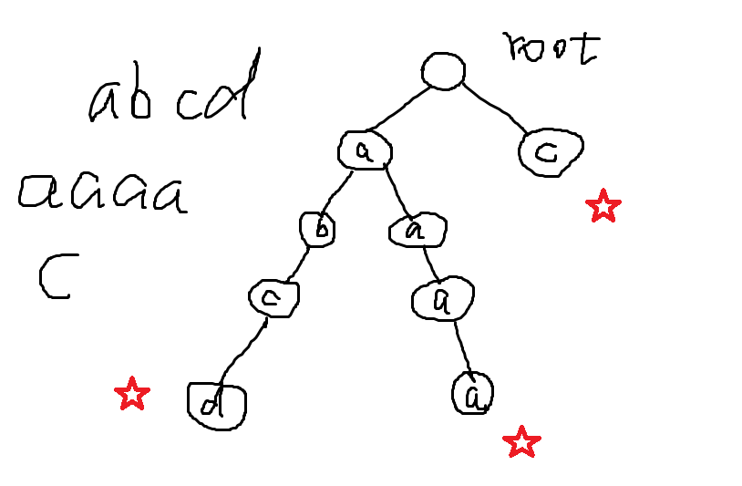
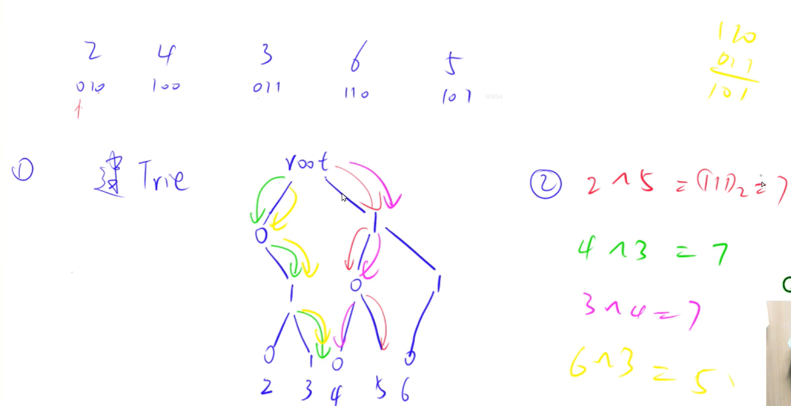

## Trie树

读作“try” 树， 也叫**前缀树**，**字典树** , **单词查找树**

**高效地存储和查找字符串集合的数据结构**，关于 Trie 的应用场景， 8 个字：**一次建树，多次查询**。

时间复杂度为 $O(|s|)$. |s|是每次插入或查询的字符串的长度。


### 典型例题1：字符串集合

维护一个字符串集合，支持两种操作：

1. `I x` 向集合中插入一个字符串 x；
2. `Q x` 询问一个字符串在集合中出现了多少次。

共有 N 个操作，输入的字符串总长度不超过 $10^5$，字符串仅包含小写英文字母。

#### 输入格式

第一行包含整数 N，表示操作数。

接下来 N 行，每行包含一个操作指令，指令为 `I x` 或 `Q x` 中的一种。

#### 输出格式

对于每个询问指令 `Q x`，都要输出一个整数作为结果，表示 x 在集合中出现的次数。

每个结果占一行。

#### 数据范围

$1≤N≤2∗10^4$

#### 输入样例：

```
5
I abc
Q abc
Q ab
I ab
Q ab
```

#### 输出样例：

```
1
0
1
```


思路：

设置一棵树，根结点是里面内容为空，每来一个单词，都对其中的所有字符构建一条路径；并在终止位置设置一个标记。



* 方法一：**使用指针来实现这棵树**。

```c++
#include<iostream>
#include<string>
#include<cstring>
using namespace std;

class Trie {
private:
    // 以当前字符为结尾的word的个数
	int cntEnd;
    // 26个子节点
	Trie * son[26];
public:
	Trie() {
		cntEnd = 0;
        // memset()函数是cstring头文件中，赋值0是可以用之后的NULL来进行推导
		memset(son, 0, sizeof(son));
	}
	void insert(string word) {
		Trie * cur = this;
		for (int i = 0; i < word.size(); i++) {
			int c = word[i] - 'a';
			if (cur->son[c] == NULL) {
				if( i == word.size() - 1)	cur->cntEnd += 1;
				else
				{
					cur->son[c] = new Trie();
					cur = cur->son[c];
				}
			}
			else {
				if (i == word.size() - 1) {
					cur->cntEnd += 1;
					return;
				}
				cur = cur->son[c];
			}
		}
		
	}

	int query(string word) {
		Trie * cur = this;
		for (int i = 0; i < word.size(); i++) {
			int c = word[i] - 'a';
			if (cur->son[c] == NULL) {
				if (i == word.size() - 1)    return cur->cntEnd;
				else    return 0;
			}
			else {
				if (i == word.size() - 1)  break;
				else   cur = cur->son[c];
			}
		}
		return cur->cntEnd;
	}
};

int main() {
	int n;
	scanf("%d", &n);
	Trie t;
	while (n--) {
		string op, word;
		cin >> op >> word;
		if (op == "I")   t.insert(word);
		else    printf("%d\n", t.query(word));

	}
	return 0;
}


```


* 方法二：用**二维数组**来模拟树。**速度大概是第一种方式四倍**, 推荐使用第二种

该方法的巧妙地利用了字符串中仅包含小写字母，所以每一个节点的子节点最多只有26个，是固定下来的，所以可以用数组来模拟。

```c++
#include<iostream>

using namespace std;
const int N = 1e5 + 10;
char mstr[N];
// son[][]数组存储当前结点的所有子节点下标, cnt[N]: 存储以当前点结尾的单词有多少个；idx下标
// 下标是0的点，既是根节点，又是空结点
int idx, son[N][26], cnt[N];

void insert(char str[]){
    // p = 0表示从根节点root开始
    int p = 0;
    // due to char[] end by '\0'，so we can use str[i] to judge isOver
    // for循环遍历整个char数组;
    for(int i = 0; str[i]; i ++){
        // u表示当前字母是哪一个
        int u = str[i] - 'a';
        // 如果没有结点，那么就建立一个结点
        if( !son[p][u] )  son[p][u] = ++ idx;
        // 再走过去
        p = son[p][u];
    }
    // 此时p就是最后一个结点的下标
    cnt[p] ++;
}

int query(char str[]){
    int p = 0;
    for(int i = 0; str[i]; i ++){
        int u = str[i] - 'a';
        // 提前返回0,剪枝的过程
        if( !son[p][u] )    return 0;
        else p = son[p][u];
    }
    return cnt[p];
}

int main(){
    int n;
    cin >> n;
    while( n -- ){
        char op[2];
        scanf("%s%s", op, mstr);
        if(op[0] == 'I')    insert(mstr);
        else    printf("%d\n", query(mstr));
    }
    return 0;
}
```


- 解法三，树也是图，经典邻接表建图的方法。

```c++
#include<bits/stdc++.h>

using namespace std;

const int N = 2e4 + 10,M = 26;
int n;
int h[M], e[N], ne[N], idx;
unordered_map<string , int > trie_map;

void add(int a, int b){     // 添加一条从a -> b的有向边
    e[idx] = b, ne[idx] = h[a], h[a] = idx++;
}

void insert(string x){
    if(trie_map.count(x)){
        trie_map[x]+=1;
        return;
    } 
    for(int i = 1; i < x.size(); i ++){
        int pre = x[i-1] - 'a';
        int cur = x[i] - 'a';
        add(pre,cur);
        if(i == x.size() - 1){
            trie_map[x] += 1;
        }
    }
}

int query(string x){
    return trie_map[x];
}

int main(){
    cin >> n;
    char op[2];
    while(n -- ){
        cin >> op;
        if(op[0] == 'I'){
            string x;
            cin >> x;
            insert(x);
        }else{
            string x;
            cin >> x;
            cout << query(x) << endl;
        }
    }
    return 0;
}
```


- 方法四：最简单直接用`unordered_map<string, int>`.

```c++
#include<bits/stdc++.h>

using namespace std;

unordered_map<string, int> trie_map;
int n;

void insert(string x){
    trie_map[x] += 1;
}

int query(string x){
    return trie_map[x];
}

int main(){
    cin >> n;
    char op[2];
    while(n--){
        cin >> op;
        if(op[0]=='I'){
            string x;
            cin >> x;
            insert(x);
        }else{
            string x;
            cin >> x;
            cout << query(x) << endl;
        }
    }
    return 0;
}
```


### 典型例题2： 最大异或对

在给定的 N 个整数 A1，A2……AN 中选出两个进行 xor（异或）运算，得到的结果最大是多少？

#### 输入格式

第一行输入一个整数 N。

第二行输入 N 个整数 A1～AN。

#### 输出格式

输出一个整数表示答案。

#### 数据范围

$$1≤N≤10^5 \\
0≤Ai<2^{31} $$

#### 输入样例：

```
3
1 2 3
```

#### 输出样例：

```
3
```




思路： 

这里的root没有什么实际意义，它的两个子节点分别表示数字x的二进制表示中最左边的一位是0还是1.

```c++
注意： i >= 0 等价于 ~i; 因为i = -1在计算机中表示为1111111...1, 全部取反变为00000..00。
```


#### 解答：

```c++
#include<bits/stdc++.h>

using namespace std;
// N表示一共有多少个数; M表示有N个数，每个数有31位的总长度;
const int N = 1e5 + 10, M = 31e5 + 10;
// idx表示Trie结点下标, son[M][2]表示一棵二叉树
int idx, son[M][2];
int n;

int a[N];
// insert就是建立索引
void insert(int x){
    int p = 0;
    for(int i = 30; i >= 0; i--){
        int & s = son[p][x >> i & 1];
        if(!s)  s = ++ idx;
        p = s;
    }
}
// query为从数x开始，找与它位数恰好相反的路径是否在Trie树中
int query(int x){
    int p = 0, res = 0;
    for(int i = 30; i >= 0; i--){           // i >= 0可以简写成~i
        int s = x >> i & 1;
        // 表示当前位取反在Trie树中存在结点
        if(son[p][!s]){
            res += 1 << i;          // 左移i位
            p = son[p][!s];         // p往下继续走
        }else{
            // 如果不存在节点，往另一条路走
            p = son[p][s];
        }
    }
    
    return res;
}


int main(){
    cin >> n;
    for(int i = 0 ; i < n; i ++){
        cin >> a[i];
        insert(a[i]);
    }
    // res值存储任意两个值异或后的结果
    int res = 0;
    for(int i = 0; i < n; i++ ) res=  max(res, query(a[i]));
    // 遍历后取max得到最大值
    cout << res << endl;
    
}
```


### Leetcode 820 单词的压缩编码 前缀树的应用：颠倒改为后缀树

>  https://leetcode-cn.com/problems/short-encoding-of-words/

```
输入：words = ["time", "me", "bell"]
输出：10
解释：一组有效编码为 s = "time#bell#" 和 indices = [0, 2, 5] 。
words[0] = "time" ，s 开始于 indices[0] = 0 到下一个 '#' 结束的子字符串，如加粗部分所示 "time#bell#"
words[1] = "me" ，s 开始于 indices[1] = 2 到下一个 '#' 结束的子字符串，如加粗部分所示 "time#bell#"
words[2] = "bell" ，s 开始于 indices[2] = 5 到下一个 '#' 结束的子字符串，如加粗部分所示 "time#bell#"
```


**题意解析**： 即如果其中有一个单词是另一个单词的后缀，则可以把这两个单词压缩在一起，用indice来分别表示它们的起始位置。

由于前缀树`Trie`是针对字符串相同的前缀，走相同的节点路径。因此可以把每个单词翻转一下，存入前缀树中。最后要求的压缩编码的长度实际上就是前缀树中所有叶子节点所在的单词的长度 + 1（#号）， 累加起来输出即可。

```c++
// 存储所有可能的节点长度
const int N = 2000 * 7 + 10;
// cnt[N] 来表示第i个节点有几个子节点，如果cnt[i] == 0, 则它是叶结点
// len[N] 表示第i个节点作为叶子节点结束的时候，单词长度是多少。
int son[N][26], cnt[N], len[N], idx;

class Solution {
public:
    void insert(string & word){
        // p 表示节点编号
        int p = 0;
        for(auto c : word){
            int u = c - 'a';
            if(!son[p][u])  son[p][u] = ++idx;
            cnt[p] += 1;
            p = son[p][u];
        }
        len[p] = word.size();
    }   
    int minimumLengthEncoding(vector<string>& words) {
        memset(son, 0, sizeof son);
        memset(cnt, 0, sizeof cnt);
        memset(len, 0, sizeof len);
        idx = 0;
        for(auto & word : words){
            // 翻转单词
            reverse(word.begin(), word.end());
            insert(word);
        }
        int res = 0;
        for(int i = 1; i <= idx; i ++){
            if(!cnt[i]){
                res += len[i] + 1;
            }
        }
        return res;   
    }
};
```


### Trie树代码模板

```c++
class Trie {
public:
    // 构造函数
    Trie() {
        root = new Node();
    }

    // 插入字符串的函数
    void insert(std::string word) {
        find(word, true, true);
    }

    // 查找字符串是否存在的函数
    bool search(std::string word) {
        return find(word, true, false);
    }

    // 查找是否存在以给定前缀开头的字符串的函数
    bool startsWith(std::string prefix) {
        return find(prefix, false, false);
    }

private:
    // 字典树节点的结构体
    struct Node {
        int count;  // 记录以该节点结尾的字符串的数量
        std::unordered_map<char, Node*> child;  // 存储子节点的映射
        Node(): count(0) {}  // 节点的构造函数，初始化计数为 0
    };

    Node* root;  // 字典树的根节点

    // 辅助查找函数
    bool find(const std::string& s, bool exact_match, bool insert_if_not_exist) {
        Node* curr = root;  // 从根节点开始遍历
        for (char c : s) {  // 遍历字符串中的每个字符
            if (curr->child.find(c) == curr->child.end()) {  // 如果当前字符不在子节点中
                if (!insert_if_not_exist) return false;  // 如果不允许插入，返回 false
                curr->child[c] = new Node();  // 允许插入则创建新节点
            }
            curr = curr->child[c];  // 移动到下一个节点
        }
        if (insert_if_not_exist) curr->count++;  // 如果允许插入，增加该节点的计数
        return exact_match ? curr->count > 0 : true;  // 根据是否需要精确匹配返回结果
    }
};
```

