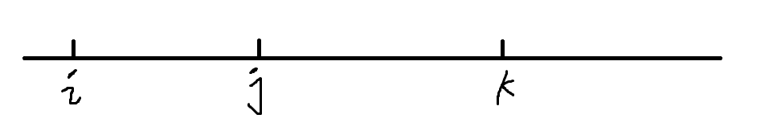

# 双指针算法

## 核心性质
双指针算法的核心在于优化思想，将原本$O(n^2)$的时间复杂度的公式优化为O(n);
具体的方法可以是发现某种单调性。


## 思考的模板：

```c++
for(int i=0, j = 0; i < n; i++){
    while( j < n && check(i,j) ) j++;
    //每道题的具体逻辑
}
```


## 经典例题1 输出一段文本当中的每一个单词

输出一段文本当中的每一个单词。

```c++
#include<iostream>
#include<cstring>
#include<string>
using namespace std;
int main(){
    char str[1000];
    //输入一串char型字符
    gets(str);
    for(int i=0,j=0; i< strlen(str); i++){
        j = i;
        while( j < strlen(str) && str[j] != ' ') j++;

        for(int k = i; k < j; k++)  cout<< str[k];

        cout<<endl;

        i = j;
    }
    return 0;
}

```


## 经典例题2 最长不重复子串

最长不重复子串( 最长连续不重复子序列 ):

```
给定一个长度为 n 的整数序列，请找出最长的不包含重复的数的连续区间，输出它的长度。

输入格式
第一行包含整数 n。

第二行包含 n 个整数（均在 0∼105 范围内），表示整数序列。

输出格式
共一行，包含一个整数，表示最长的不包含重复的数的连续区间的长度。

数据范围
1≤n≤10^5
输入样例：
5
1 2 2 3 5
输出样例：
3
```


```c++
#include <iostream>
#include<algorithm>
using namespace std;

const int N = 1e5 + 10;
// s数组来记录个数
int a[N],s[N];

int main(){
    int n;
    scanf("%d",&n);
    for(int i = 0; i< n; i++)
        scanf("%d",&a[i]);
    int res = 0;
    // 双指针，i指针在前，j指针在后，一旦遇到重复的元素，后指针++，并把
    // 记录个数的数组值减一
    for(int i = 0,j = 0; i< n; i++)
    {
        s[a[i]] ++ ;
        while(s[a[i]] > 1){
            j++;
            s[a[j]] --;
        }
        res = max(res, i - j + 1);
    }
    
    printf("%d\n",res);
    
    return 0;
}

```


## 常见问题的分类

* 对于一个序列，用两个指针维持一段区间。
* 对于两个序列，维护某种次序，比如归并排序中合并两个有序序列的操作。


## Leetcode 76 最小覆盖子串

给你一个字符串 `s` 、一个字符串 `t` 。返回 `s` 中涵盖 `t` 所有字符的最小子串。如果 `s` 中不存在涵盖 `t` 所有字符的子串，则返回空字符串 `""` 。

**注意：**

- 对于 `t` 中重复字符，我们寻找的子字符串中该字符数量必须不少于 `t` 中该字符数量。
- 如果 `s` 中存在这样的子串，我们保证它是唯一的答案。

**示例 1：**

```
输入：s = "ADOBECODEBANC", t = "ABC"
输出："BANC"
```

**示例 2：**

```
输入：s = "a", t = "a"
输出："a"
```

**示例 3:**

```
输入: s = "a", t = "aa"
输出: ""
解释: t 中两个字符 'a' 均应包含在 s 的子串中，因此没有符合条件的子字符串，返回空字符串。
```


**思路与解答：**

找到覆盖字符串t的s中的最小子串，使用双指针算法（`i,j`， `i >= j`）设计一个窗口，这个窗口的长度不断拓展，直到窗口中包含了字符串t中的所有元素。

- 如何判断是否一个窗口中包含了`t`中的所有元素呢？

首先遍历一遍t，维持一个哈希表，得到t中所有字母出现的次数；再维持一个哈希表hs，用来表示字符串s中的窗口里出现字符串t中的元素的个数。


```c++
class Solution {
public:
    string minWindow(string s, string t) {
        // 两个hashtable
        unordered_map<char, int> hs, ht;
        // cnt表示有效字符，即t中的字符，并且个数少于t中要求的个数
        int cnt = 0;
        for(int i = 0; i < t.size(); i ++){
            ht[t[i]] ++;
        }
        string res;
        for(int i =0, j = 0; i < s.size(); i++){
            // i ++ 表示： 窗口的长度 +1
            hs[s[i]]++;
            // if判断是否是有效字符
            if(hs[s[i]] <= ht[s[i]])    cnt ++;
			// 窗口左端边界 ++ 
            while(hs[s[j]] > ht[s[j]])  hs[s[j ++]] --;
            if(cnt == t.size()){
                // i -j + 1 < res.size() 即找到最小的字符串
                if(res.empty() || i - j + 1 < res.size()){
                    res = s.substr(j, i - j + 1);
                }
            }
        }
        return res;
    }
};
```


## Leetcode 15 三数之和
> [三数之和](https://leetcode.cn/problems/3sum/)

给你一个包含 n 个整数的数组 nums，判断 nums 中是否存在三个元素 a，b，c ，使得 a + b + c = 0 ？请你找出所有和为 0 且不重复的三元组。

注意：答案中不可以包含重复的三元组。

示例 1：

输入：nums = [-1,0,1,2,-1,-4]
输出：[[-1,-1,2],[-1,0,1]]

**题意分析：**
如果是找到两个元素之和等于一个特定值，很好想，直接排序加两个端点开始往中间的双指针做法。但是三个数之和等于一个特定值，实际上也是使用双指针算法，区别在于，在排好序的数组中首先要固定一个数，在剩下的元素中使用双指针算法。



让`num[i] <= nums[j] <= nums[k]`，且`i < j < k`， 下标的小于号严格成立。这样就不会出现重复使用两次的情况。

由于同一个数可能在排完序后位于相邻的位置上，所以方案可能重叠，因此需要在双指针for循环开头作特判。

要想遍历到所有的方案，`i`遍历所有元素，`j` 从 `i + 1`开始，`k`从`n-1`开始。`while(nums[i] + nums[j] + nums[k] > 0)  k -= 1;`，直到`nums[i] + nums[j] + nums[k] == 0`时，放入结果中; 或者`nums[i] + nums[j] + nums[k] < 0`了，这时候再移动j, 让nums[j]变大。

```cpp
class Solution {
public:
    vector<vector<int>> threeSum(vector<int>& nums) {
        vector<vector<int>> res;
        int n = nums.size();
        sort(nums.begin(), nums.end());

        for (int i = 0; i < n; i ++) {
            // 去除重复方案
            if (i && nums[i] == nums[i-1])   continue;
            for (int j = i + 1, k = n - 1; j < n; j ++) {
                // 去除重复方案
                if (j > i + 1 && nums[j] == nums[j - 1])  continue;
                while (j < k && nums[i] + nums[j] + nums[k] > 0)    k --;
                // 防止k == j
                if (k == j) continue;
                if (nums[i] + nums[j] + nums[k] == 0) {
                    res.push_back({nums[i], nums[j], nums[k]});
                }
            }
        }
        return res;
    }
};
```

> 总结**去重的**方法：
>
> 1. 先不考虑去重，全部放入res数组中；再用排序 + unique + erase处理。
> 2. 先排序，如果当前选中的值和（左边的）上一个元素选中的值相同，则在枚举的时候跳过这种情况。  （推荐使用这种，速度快）


## Leetcode 31 下一个排列

> [Leetcode 31](https://leetcode.cn/problems/next-permutation/submissions/)

题目大意：找出给定元素的所有排列中，比当前的输入大的，最小的一个排列。

```
输入：nums = [1,2,3]
输出：[1,3,2]

输入：nums = [3,2,1]
输出：[1,2,3]

输入：nums = [1,1,5]
输出：[1,5,1]
```


方法一：直接使用库函数`next_permutation()`

```cpp
class Solution {
public:
    void nextPermutation(vector<int>& nums) {
        next_permutation(nums.begin(), nums.end());
    }
};
```


方法二：思维题： 使用双指针法, 对于一个排列`[2, 3, 5, 4, 1]`， 要找比原来排列大的最小排列，所以我们希望左半部分的元素尽量不变，只修改右半元素。
从后往前找，后面的子数组`[5, 4, 1]` 呈降序排列，对这一部分修改已经没法让整个排列变大，所以肯定要再往前找元素修改，那么就找第一个不呈降序排列的元素，比如这里的3。 要让3变大一点，即在后面的子数组中找到第一个比3大的最小的元素4，让它俩交换位置，得到：`[2, 4, 5, 3, 1]`， 再把后面子数组从降序改为升序`[2, 4, 1, 3, 5]`，得到最后结果。

```cpp
class Solution {
public:
    void nextPermutation(vector<int>& nums) {
        int n = nums.size();
        int k = n - 1;
        while (k >= 1 && nums[k - 1] >= nums[k]) k--;
        if (k == 0) {
        // 已经呈降序排序，全部反转
            reverse(nums.begin(), nums.end());
        }else {
            int t = k;
            while (t < n && nums[t] > nums[k-1]) t ++;
            swap(nums[k-1], nums[t-1]);
            sort(nums.begin() + k, nums.end());
        }
    }
};
```


## Leetcode 438找到字符串中所有字母异位词
给定两个字符串 s 和 p，找到 s 中所有 p 的 异位词 的子串，返回这些子串的起始索引。不考虑答案输出的顺序。

异位词 指由相同字母重排列形成的字符串（包括相同的字符串）。

> 链接：https://leetcode.cn/problems/find-all-anagrams-in-a-string

```
示例 1:
输入: s = "cbaebabacd", p = "abc"
输出: [0,6]
解释:
起始索引等于 0 的子串是 "cba", 它是 "abc" 的异位词。
起始索引等于 6 的子串是 "bac", 它是 "abc" 的异位词。
 
示例 2:
输入: s = "abab", p = "ab"
输出: [0,1,2]
解释:
起始索引等于 0 的子串是 "ab", 它是 "ab" 的异位词。
起始索引等于 1 的子串是 "ba", 它是 "ab" 的异位词。
起始索引等于 2 的子串是 "ab", 它是 "ab" 的异位词。
```

**思路：**
使用滑动窗口双指针算法，用两个hash表比较的方法来判断s的子串和p是否是异位词。

```cpp
class Solution {
public:
    bool isSame(unordered_map<char, int> &a, unordered_map<char, int> &b) {
        if (a.size() != b.size())   return false;
        else {
            for (auto [k, v] : a) {
          		// 注意b.count(k)要写在前面，否则直接b[k]会在b中创建k这个key
                if (b.count(k) == 0 || b[k] != v)   return false;
            }
            return true;
        }
    }
    vector<int> findAnagrams(string s, string p) {
        vector<int> res;
        unordered_map<char, int> counter_p;

        for (auto c : p)    counter_p[c] ++;
        unordered_map<char, int> counter_s;
        for (int i = 0, j = 0; i < s.size(); i ++) {
            // 滑动窗口处理右端进入窗口的部分
            counter_s[s[i]] ++;
            // i - j + 1 > p.size() 处理滑动窗口左端出窗口的部分
            if (i - j + 1 > p.size()) {
                if (-- counter_s[s[j]] == 0) counter_s.erase(s[j]);
                j ++;
            }
            if (isSame(counter_s, counter_p))   res.push_back(j);
        }
        return res;
    }
};

// 直接用一个hashmap优化的方法：
class Solution {
public:
    vector<int> findAnagrams(string s, string p) {
        unordered_map<char, int> cnt;
        for (auto c: p) cnt[c] ++ ;
        vector<int> res;
        int tot = cnt.size();
        for (int i = 0, j = 0, satisfy = 0; i < s.size(); i ++ ) {
        // 左端进窗口的时候，让原来的cnt--
            if ( -- cnt[s[i]] == 0) satisfy ++ ;
            while (i - j + 1 > p.size()) {
                if (cnt[s[j]] == 0) satisfy -- ;
                // 出窗口的时候反而让原来的cnt ++
                cnt[s[j ++ ]] ++ ;
            }
            if (satisfy == tot) res.push_back(j);
        }
        return res;
    }
};

```


