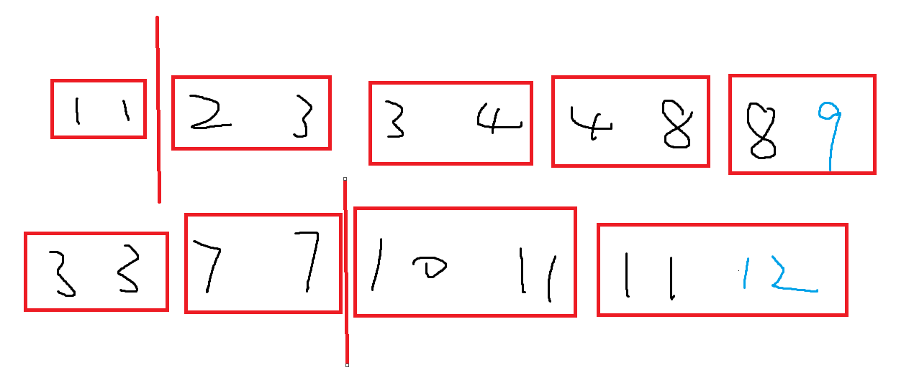

## 二分查找

二分查找的本质在于：

* 有一列“有序”数组，其中所有的元素被“某一性质”分成了两部分，需要找到其中某个元素的分界线。
* 当`l = r`时，即找到目标值。


### 整数二分

整数二分需要特别注意边界问题，有以下两个模板：

```c++
int a[];
int b_search1(int l, int r){         	// 区间[l, r]被划分为[l, mid]和[mid + 1, r]时使用
    while( l < r ){
        int mid = l + r >> 1;
        if( check(mid) )	r = mid;
        else	l = mid + 1;
    }
    return l;
}

int b_search2(int l , int r){			// 区间[l, r]被划分为[l, mid - 1]和[mid, r]时使用
    while ( l < r ){
        int mid = l + r + 1 >> 1;
        if ( check(mid) )  l = mid;
        else	r = mid - 1;
    }
    return l;
}


// 以单调递增的数组为例，找 大于等于某个target的第一个元素
int b_search1(int l, int r){  // l = 0, r = array.size() -1 
    while( l < r ){
        int mid = l + r >> 1;
        if( array[mid] >= target )	r = mid;
        else	l = mid + 1;
    }
    return l;
}

// 找小于等于某个target的最后一个元素
int b_search2(int l, int r){  // l = 0, r = array.size() -1 
    while( l < r ){
        int mid = l + r + 1 >> 1;
        if( array[mid] <= target )	l = mid;
        else	r = mid - 1;
    }
    return l;
}
```


* 两个模板中的 `check(mid)`函数都非常重要，因为二分法不断迭代，最终会落到最接近target的那个数上面。

1. 定义check条件。如果判断mid < target, 那么找到的是小于target但是最接近target的数，就是小于target的最大数。如果判断**mid >= target**, 那么找到的是大于或者**等于target**的最接近target的数，就是target或者比target大的最小数。所以`check(mid)`函数中一般都需要写`>= or <=`
2. 根据check的定义，然后压缩左右边界，确定要哪一边。
2. 无论使用哪个模板，最后返回的都是`l`下标。判断在数组中是否有要二分寻找的元素时，即可用`num[l] == query`来判断。


* 第一个模板用于， 当 mid 元素的性质属于前半部分时，如图所示：


第一个模板`int mid = l + r >> 1`即可。


* 第二个模板用于，mid元素的性质属于后一半部分，如图所示：


此时一定要注意`int mid = l + r + 1 >> 1` , 否则使用`l + r >> 1`容易出现死循环问题:

当元素最后只剩下两个元素时：


### 浮点数二分

```c++
double b_search3(double l, double r){
    while( r - l > 1e-8){
        double mid = (r + l ) / 2;
        if( check(mid) )   r = mid;
        else	l = mid;
    }
    return l;
}
```

浮点数二分需要注意的点：

* `r`和`l`设置为数的最大范围的两边。

* 输出精度的确定：如果要求保留小数点后的位数是6，一般r - l > $10^{-8}$ ; 多2是比较保险的做法。
* 传参数的$ l 和 r$ 要注意，如果题目是二分取平方根，小数的平方根会比原来的数要大，这样就超过了右边界。比如：0.01的平方根是0.1。 所以右边界常取为`max(1,x)`


### 经典例题 Leetcode 69 求sqrt(x)

> https://leetcode-cn.com/problems/sqrtx

给你一个非负整数 x ，计算并返回 x 的 算术平方根 。

由于返回类型是整数，结果只保留 整数部分 ，小数部分将被 舍去 。

注意：不允许使用任何内置指数函数和算符，例如 pow(x, 0.5) 或者 x ** 0.5 。

**示例 1：**

```
输入：x = 4
输出：2
```

**示例 2：**

```
输入：x = 8
输出：2
解释：8 的算术平方根是 2.82842..., 由于返回类型是整数，小数部分将被舍去。
```

**提示：**

- `0 <= x <= 2^31 - 1`

**思路：**

乍一看这个题是一个浮点数二分题，但是实际上结果保留整数部分，实际上是一个整数二分题。

```c++
class Solution {
public:
    int mySqrt(int x) {
        int l = 0, r = x;
        while( l < r){
            // 这里的处理非常细
            // l + 1ll + r； 由于加法是从左往右计算，所以先加1，加的是long long, 结果就是long long类型， 不会溢出
            // 除以2后就在mid的范围内了
            int mid = l + 1ll + r >> 1;
            // mid * mid 很有可能大于int, 所以一边变为除法也很重要
            if( mid <= x / mid)     l = mid;
            else    r = mid - 1;
        }
        return l;
    }
};
```


### 经典例题 Leetcode540 有序数组中的单一元素

> https://leetcode-cn.com/problems/single-element-in-a-sorted-array/

给你一个仅由整数组成的有序数组，其中每个元素都会出现两次，唯有一个数只会出现一次。

请你找出并返回只出现一次的那个数。

你设计的解决方案必须满足 O(log n) 时间复杂度和 O(1) 空间复杂度。

**示例 1:**

```
输入: nums = [1,1,2,3,3,4,4,8,8]
输出: 2
```

**示例 2:**

```
输入: nums =  [3,3,7,7,10,11,11]
输出: 10
```

**提示:**

- `1 <= nums.length <= 10^5`
- `0 <= nums[i] <= 10^5`


**思路与解答：**

之前遇到过一个题，完全打乱的数组，但是其中只有一个元素有1个，其余元素都有2个，如何快速找到仅存在一个的数。当时使用的算法是O(n)，将数组中所有的元素异或一遍，最后得到的那个数就是只存在一次的数。

但是这里的限制条件更多，原本是有序的数组，要求用O(logn)的时间复杂度的算法。

如何使用二分呢？

还记得最开始所说的二分查找的本质吗？二分查找的本质是找到一个分界线，使得两边的元素满足的性质不同。

可以首先在数组的最后添加一位元素（与最后一位不同）；并将数字两两分组，这样就存在了一个分界线，在分界线的左边，所有的组内的元素都是相同的，在分界线的右边，所有组内元素都是不同的。

**而要找的只出现一次的数，就是分界线右边第一个数。**



```c++
class Solution {
public:
    int singleNonDuplicate(vector<int>& nums) {
        nums.push_back(nums.back() + 1);
        // 这里的r表示的是组数的最大值，比如nums.size() = 10, r = 4, 最大是第四组
        int l = 0, r = nums.size() / 2 - 1;
        while( l < r){
            int mid = (l + r) >> 1;
            // 当组内元素不同时，要找的组mid一定在分界线上，或者分界线的左边
            if( nums[ mid * 2] != nums[ mid * 2 + 1])   r = mid;
            else    l = mid + 1;	
        }
        return nums[l * 2];
    }
};
```


### 二分查找经典例题

https://leetcode.cn/problems/find-minimum-in-rotated-sorted-array/description/

Leetcode 153, 寻找旋转数组中的最小值；

**思路**：
当一个数组经过旋转后，得到两段单调递增的序列，`nums = [4,5,6,7,0,1,2]`; 
很明显的可以看出，前半段4,5,6,7有序，后半段0,1,2有序；因此可以将其按照边界线位置0，分为前后两段；

现在要寻找这个0所在的位置，可以用二分法； 划分两段的条件是： nums[mid] <= nums[right]， 0 即是满足条件的第一个元素；

>  有人可能会问，这个不单调，如何能够使用二分呢？ 如果按照这个条件划分nums序列，得到[0, 0, 0, 0, 1, 1, 1];  那么即是有序的；
>
> 条件nums[mid] <= nums[right]，找满足条件的第一个元素

```c++
class Solution {
public:
    int findMin(vector<int>& nums) {
        int l = 0, r = nums.size() - 1;
        while (l < r) {
            int mid = (l + r) >> 1;
            if (nums[mid] <= nums[r])   r = mid;  // 要找满足条件的第一个元素，往左找;
            else    l = mid + 1;
        }
        return nums[l];
    }
};
```


## 三分

二分用于在**单调函数**上寻找特定值，三分用于在单峰函数上寻找极大值；

多取两个中点，一个$l_{mid}$, 一个$r_{mid}$, 如果这个函数f(lmid) < f(rmid),  则有两种情况，1. target峰值点位于其中间，但是rmid更加靠近峰值点； 2. target峰值点位于rmid右边，lmid和rmid正处于递增； 但是重点，**lmid, 一定是在上升峰值区域；**


如果这个函数f(lmid) > f(rmid), 也有两种情况： 1. target峰值点位于其中间，但是lmid更加靠近峰值点； 2. target峰值点位于lmid左边，lmid和rmid正处于递减；但是重点，**rmid, 一定是在下降区域；**


因此，可以在定义域[l, r] 上任取两点 lmid, rmid; 

- 如果 f(lmid) <= f(rmid), 则函数必然在lmid处单调递增，极值在[lmid, r] 上；
- 如果f(lmid) > f(rmid), 则函数必然在 rmid处单调递减，极值在[l, rmid] 上；

lmid, rmid 可取三等分点，但是一般更快的做法，  **lmid取二等分点，rmid为lmid + 1;**

例题： https://leetcode.cn/problems/find-peak-element/
