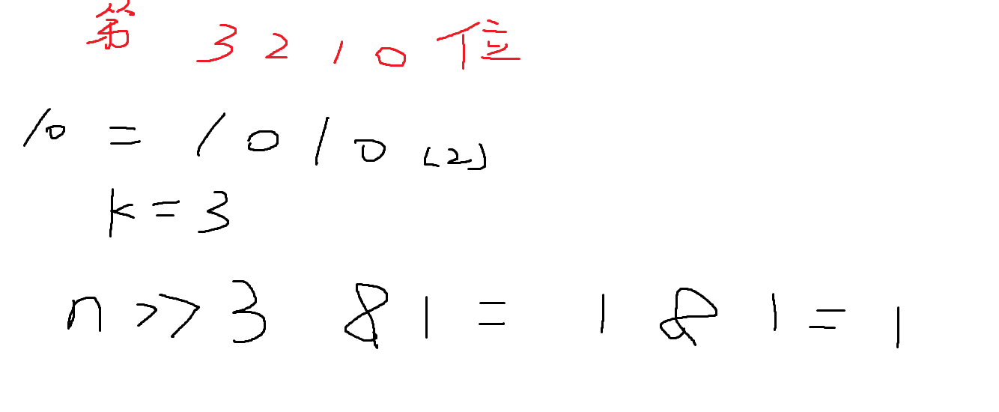

## 位运算

* 求一个数字n二进制表示的第k位数字： (最右边的数字称作第0位)

```c++
n >> k & 1;
```



* lowbit(x) 操作，返回x的最后一位1以及后面的数，是一个二进制数。

> lowbit的用法在于对于任意一个整数（不论正负），都能得到在目前的编译器下，这个数中所包含的二进制中1的个数。

```c++
x = 1010   lowbit(x) = 10
x = 101000  lowbit(x) = 1000
    
lowbit(x) = x & (-x)
```

C++里数据的存储是以补码的方式存储的，所以 `-x`就是`x`的取反后 + 1；

Example:

```
x = 10101000;
~x + 1 = 01011000
x & (~x + 1) = 1000
```


### 例题：

给定一个长度为 n 的数列，请你求出数列中每个数的二进制表示中 1 的个数。

#### 输入格式

第一行包含整数 n。

第二行包含 n个整数，表示整个数列。

#### 输出格式

共一行，包含 n个整数，其中的第 i个数表示数列中的第 i个数的二进制表示中 1 的个数。

$ 1≤n≤100000, $
$ 0≤数列中元素的值≤10^{9}$

#### 输入样例：

```
5
1 2 3 4 5
```

#### 输出样例：

```
1 1 2 1 2
```


时间复杂度为$O(nlog_{2}n)$


```c++
#include<iostream>
using namespace std;
int lowbit(int x){
    return x&(-x);
}
int main(){
    int n;
    cin>>n;
    while(n--){
        int x;
        cin>>x;

        int res=0;
        while(x) x-=lowbit(x),res++;

        cout<<res<<' ';
    }
    return 0;
}
```


如果这个题目用下面这种解决方法：

```c++
#include<iostream>
using namespace std;
int n;
int a,k;
int main(){
    scanf("%d",&n);
    for(int i=0;i<n;i++){
        scanf("%d",&a);
        k=0;
        while(a){
            k += a&1;
            a = a >> 1;
        }
        printf("%d ",k);
    }
    return 0;
}
```

注意：**遇到负数会出现死循环问题，因为负数右移，在高位补的是1.**


### Leetcode338 比特位计数

给你一个整数 `n` ，对于 `0 <= i <= n` 中的每个 `i` ，计算其二进制表示中 **`1` 的个数** ，返回一个长度为 `n + 1` 的数组 `ans` 作为答案。

**示例1：**

```
输入：n = 2
输出：[0,1,1]
解释：
0 --> 0
1 --> 1
2 --> 10
```

**示例2：**

```c++
输入：n = 5
输出：[0,1,1,2,1,2]
解释：
0 --> 0
1 --> 1
2 --> 10
3 --> 11
4 --> 100
5 --> 101
```


#### 思路

可以很快地写出时间复杂度为$O(n log n)$算法

```c++
class Solution {
public:

    int lowbit(int x){
        return x & (-x);
    }

    vector<int> countBits(int n) {
        vector<int> res;
        for(int i = 0; i <= n; i ++ ){
            int temp = i;
            int s = 0;
            while(temp){
                temp -= lowbit(temp);
                s += 1;
            }
            res.push_back(s);
        }
        return res;
    }
};
```


**注意：** 

重点提一下时间复杂度为O(n)的动态规划的算法。

动态规划的思考，一定要从最后的问题分解的角度，也就是结果往前推一步，应该是由哪些状态转移过来的？

要想知道整数`n`的二进制表示中`1`的个数，比如5的二进制表达为`111`, 那么它是由3(11) 再增添一位1 得到的。

- 状态表示： `f[i]`表示整数`i`的二进制表示中1的个数。
  - 属性: count
- 状态计算：`f[i] = f[ i / 2] + ( i & 1)`, 如果`i`是奇数，则 `i & 1` 等于1， 最后一位增添1；否则最后一位添0，二进制数中1的数目与 n / 2 中的保持一致。


```c++
class Solution {
public:
    vector<int> countBits(int n) {
        vector<int> f(n + 1, 0);
        for(int i = 1; i <= n; i++){
            f[i] = f[i >> 1] + (i & 1);    
        }

        return f;
    }
};
```


### Leetcode hot 100 , 只出现1次的数字

给定一个非空整数数组，除了某个元素只出现一次以外，其余每个元素均出现两次。找出那个只出现了一次的元素。

说明：

你的算法应该具有线性时间复杂度。 你可以不使用额外空间来实现吗？

**示例 1:**

```
输入: [2,2,1]
输出: 1
```

**示例 2:**

```
输入: [4,1,2,1,2]
输出: 4
```


#### 思路与解答

第一思路肯定是用一个容器来记录元素出现的次数，如下所示，但是这个思路开辟了额外的空间。

```c++
class Solution {
public:
    int singleNumber(vector<int>& nums) {
        unordered_map<int, int> count;
        for(auto i : nums){
            count[i] += 1;
        }
        int res;
        for(auto t : count){
            int a = t.first, b = t.second;
            if(b == 1){
                res = a;
                break;
            }
        }
        return res;
    }
};
```


要避免如何不开辟额外空间，这里使用了**异或**的性质：

异或具有三个性质：1. 交换律  2. 结合律  3. 两个相同的数异或后为0， 任何数和0异或都等于它本身。

那么对于此题，无论`nums`中的元素如何排列，只要对从前往后全部做一遍异或。最后单独留下的那个元素就是`res`。

```c++
class Solution {
public:
    int singleNumber(vector<int>& nums) {
        int res = 0;
        for(auto i : nums){
            res = res ^ i;
        }
        return res;
    }
};
```


