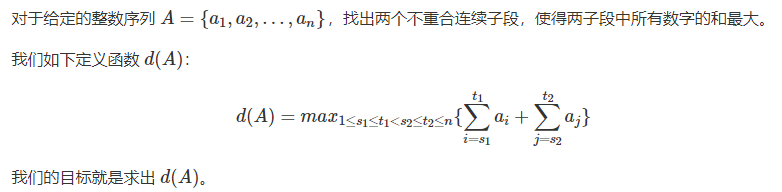

# 前后缀分解

前后缀分解： 即在一个序列中，要求从序列中的某一个点开始，前缀和后缀联合运算，求最优值的一种问题。

### 构建乘积数组
给定一个数组`A[0, 1, …, n-1]`，请构建一个数组`B[0, 1, …, n-1]`，其中B中的元素`B[i]=A[0]×A[1]×… ×A[i-1]×A[i+1]×…×A[n-1]`。

要求不能使用除法，思考能不能使用额外的常数空间解决问题。

```
输入：[1, 2, 3, 4, 5]

输出：[120, 60, 40, 30, 24]
```

**题目大意**：
即在序列A中，求出一个等长的序列B，其中的每一个元素的值，都等于序列中除开这个元素之外的所有元素的乘积。

如果能使用除法：1. 求出数组A的所有元素之积，再除以当前元素，得到数组B中的响应位置的元素。2. 其次要考虑有0元素的问题，不能除0.

既然不能使用除法，那就考虑别的方案。
可以先从前往后遍历一遍，存在一个p（prefix）数组中，`p[i] = a[1] * a[2] * ... * a[i-1]`, 同样；从后往前遍历一遍，存在一个s(suffix)数组中， `s[i] = a[n-1] * a[n-2] * ...* a[i +1]`. 那么要求的数组`B[i] = p[i] * s[i]`.
这样额外的空间复杂度是O(n), 观察到`p`数组和`s`数组都可以通过递推公式得到，并且之和之前计算过的一个元素有关，所以就可以用一个变量来代替。

计算结果如下：

```cpp
class Solution {
public:
    vector<int> multiply(const vector<int>& A) {
        int n = A.size();
        vector<int> p(n, 1);
        for (int i = 1; i < n; i ++) {
            p[i] = p[i-1] * A[i - 1];
        }
        
        for (int i = n - 1, s = 1; i >= 0; i --) {
            p[i] = p[i] * s;
            s *= A[i];
        }
        
        return p;
    }
};
```


### 最大的和
> [最大的和](https://www.acwing.com/problem/content/description/1053/)



```
输入样例：
1
10
1 -1 2 2 3 -3 4 -4 5 -5

输出样例：
13
```


题目大意：如果只是要求出一段序列长度的数字和最大，只要使用动态规划的经典递推公式即可： `f[i] = max(0, f[i-1]) + a[i]`; 

如果是要求出两段的数字的和最大, 只需要倒着再求一次后缀的最大子数组即可。

```cpp
#include <bits/stdc++.h>
using namespace std;

const int N = 5e4 + 10;
int w[N], g[N], h[N];
int main()
{
    int T;
    cin >> T;
    while (T --) {
        int n;
        cin >> n;
        for (int i = 1; i <= n; i ++) {
            cin >> w[i];
        }
        
        g[0] = INT_MIN;
        for (int i = 1, s = 0; i <= n; i ++) {
            s = max(s, 0) + w[i];
            g[i] = max(g[i-1], s);
            cout << i << ' ' << g[i] << endl;
        }
        
        h[n + 1] = INT_MIN;
        for (int i = n, s = 0; i >= 0; i --) {
            s = max(s, 0) + w[i];
            h[i] = max(h[i+1], s);
            cout << i << ' ' << h[i] <<endl;
        }
        
        int res = INT_MIN;
        for (int i = 1; i < n; i ++)    res = max(res, g[i] + h[i + 1]);
        cout << res << endl;
    }
    return 0;
}
```

