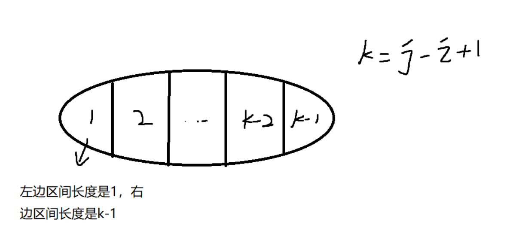
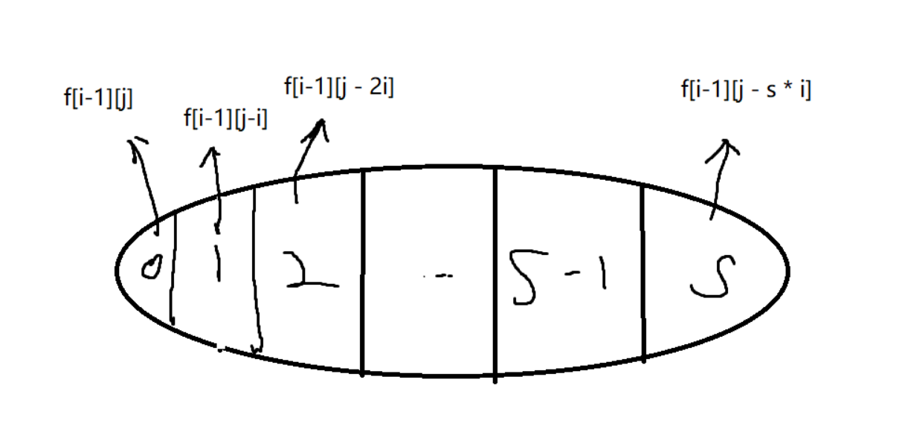
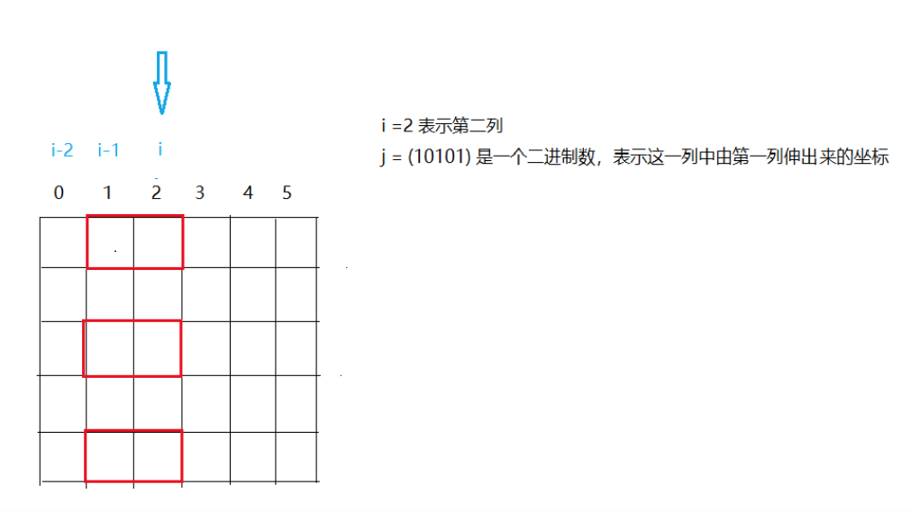
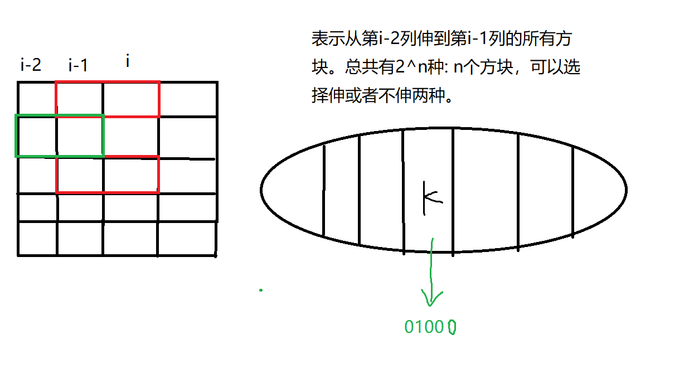
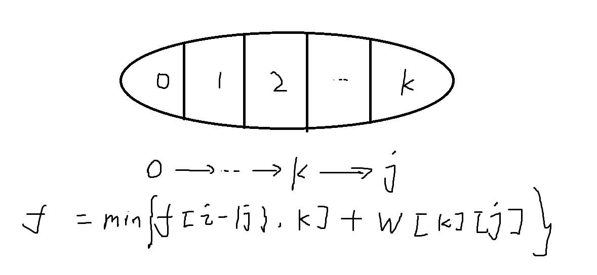

# 区间DP-数位统计DP-状态压缩DP

### 区间DP

例题：

设有 N 堆石子排成一排，其编号为 1，2，3，…，N。

每堆石子有一定的质量，可以用一个整数来描述，现在要将这 N 堆石子合并成为一堆。

每次只能合并相邻的两堆，合并的代价为这两堆石子的质量之和，合并后与这两堆石子相邻的石子将和新堆相邻，合并时由于选择的顺序不同，合并的总代价也不相同。

例如有 4 堆石子分别为 `1 3 5 2`， 我们可以先合并 1、2 堆，代价为 4，得到 `4 5 2`， 又合并 1，2堆，代价为 9，得到 `9 2` ，再合并得到 11，总代价为 4+9+11=24

如果第二步是先合并 2，3 堆，则代价为 7，得到 `4 7`，最后一次合并代价为 11，总代价为 4+7+11=22。

问题是：找出一种合理的方法，使总的代价最小，输出最小代价。

#### 输入格式

第一行一个数N 表示石子的堆数 N。

第二行 N 个数，表示每堆石子的质量(均不超过 1000)。

#### 输出格式

输出一个整数，表示最小代价。

#### 数据范围

1≤N≤300

#### 输入样例：

```
4
1 3 5 2
```

#### 输出样例：

```
22
```


#### 思路与解答

- 状态表示：
  - `f[i][j]`表示，从下标`i`~`j`开始的所有合并方式的集合。
  - 属性是min，表示所有合并方式的代价的最小值。
- 状态计算：画图

如何来切分状态呢？枚举最后一次合并的结果，最后一次合并的分割线可以在`1~N`之间的任意两个元素之间，



所以，状态计算`f[i][j] = min{ f[i][k]  + f[k+1][j] + sum(i,j)}`

`sum(i,j)`表示的是合并代价，即a[i] ~ a[j] 的所有数的和。可以用前缀和来计算： `sum(i,j) = s[j] - s[i-1].`


```c++
#include <bits/stdc++.h>

using namespace std;

const int N = 310;

int s[N], f[N][N];
int n;

int main(){
    scanf("%d", &n);
    for(int i = 1; i <= n; i ++)    scanf("%d", &s[i]);
    
    // 处理前缀和数组
    for(int i = 1; i <= n; i++)  s[i] += s[i-1];
    
    // 注意这里是枚举区间长度len,因为要保证每次的区间合并的时候，两边所有的小区间都计算过了。
    // 所以从小到达枚举区间长度
    for(int len = 2; len <= n; len ++){
        for(int i = 1; i + len -1 <= n; i++){
            int l = i, r = i + len - 1;
            // 这里设置成一个大数，是因为全局的f[N][N]默认是0
            f[l][r] = 1e8;
            for(int k = l; k < r; k ++)
            {
                f[l][r] = min( f[l][r] , f[l][k] + f[k+1][r] + s[r] - s[l-1]);
            }
        }
    }
    
    cout << f[1][n] << endl;
    return 0;
}
```


### 计数类DP问题

一个正整数 n 可以表示成若干个正整数之和，形如：n=n1+n2+…+nk，其中 n1≥n2≥…≥nk ,   k≥1。

我们将这样的一种表示称为正整数 n 的一种划分。

现在给定一个正整数 n，请你求出 n 共有多少种不同的划分方法。

#### 输入格式

共一行，包含一个整数 n。

#### 输出格式

共一行，包含一个整数，表示总划分数量。

由于答案可能很大，输出结果请对 $10^9+7$取模。

#### 数据范围

1≤n≤1000

#### 输入样例:

```
5
```

#### 输出样例：

```
7
```


#### 思路与解答：

- 状态表示：
  - 集合：将该问题看成是一个完全背包问题，正整数n表示， 一共有编号`1~n`个物品，它们的数量都是无限个，但是容积分别就是1~n. 将该问题转化成，从`1~n`中找到体积恰好是n的，所有的方案数。所以`f[i][j]`就表示，从前`i`个物品中，拿出体积恰好是`j`的物品的所有方案的集合。
  - 属性：count属性，`f[i][j]`表示的是所有方案的个数。
- 状态计算：



将`f[i][j]`按照第`i`个物品拿`s`份，分解成若干状态。

所以状态计算公式为: `f[i][j] = f[i-1][j] + f[i-1][j - i] + f[i - 1][ j - 2*i] + ... + f[i-1][j - s* i]`;

同理可以验证           `f[i][j - i] =         f[i - 1][j- i] + f[i-1][j - 2 * i] + .... + f[i-1][ j - s*i];`

所以： `f[i][j] = f[i-1][j] + f[i][j-i]`

然后进行空间优化：

`f[j] = f[j] + f[j - i]`


```c++
#include <bits/stdc++.h>

using namespace std;

const int N = 1010, M = 1e9 + 7;
int n;
int f[N];

int main(){
    cin >> n;

    // 一个数都不选，算一个方案
    f[0] = 1;
    
    for(int i = 1; i <= n; i ++)
        for(int j = i; j <= n; j++){
            f[j] = (f[j] + f[ j - i]) % M;
        }
    
    cout << f[n] << endl;
    
    return 0;
}
```


### 数位DP问题

> 数位DP的问题很多，有专门的技巧，这里暂时先只提一下数位统计DP里的基本思路

例题：

给定两个整数 a 和 b，求 a 和 b 之间的所有数字中 0∼9的出现次数。

例如，a=1024，b=1032，则 a 和 b 之间共有 9 个数如下：

```
1024 1025 1026 1027 1028 1029 1030 1031 1032
```

其中 `0` 出现 10 次，`1` 出现 10 次，`2` 出现 77次，`3` 出现 3 次等等…

#### 输入格式

输入包含多组测试数据。

每组测试数据占一行，包含两个整数 a 和 b。

当读入一行为 `0 0` 时，表示输入终止，且该行不作处理。

#### 输出格式

每组数据输出一个结果，每个结果占一行。

每个结果包含十个用空格隔开的数字，第一个数字表示 `0` 出现的次数，第二个数字表示 `1` 出现的次数，以此类推。

#### 数据范围

0<a,b<100000000

#### 输入样例：

```
1 10
44 497
346 542
1199 1748
1496 1403
1004 503
1714 190
1317 854
1976 494
1001 1960
0 0
```

#### 输出样例：

```
1 2 1 1 1 1 1 1 1 1
85 185 185 185 190 96 96 96 95 93
40 40 40 93 136 82 40 40 40 40
115 666 215 215 214 205 205 154 105 106
16 113 19 20 114 20 20 19 19 16
107 105 100 101 101 197 200 200 200 200
413 1133 503 503 503 502 502 417 402 412
196 512 186 104 87 93 97 97 142 196
398 1375 398 398 405 499 499 495 488 471
294 1256 296 296 296 296 287 286 286 247
```

#### 思路与解答

要求一堆数字中某个数出现了多少次，首先是分类讨论：

如果要寻找[1, abcdefg]中的数里， 1出现的个数，就得先求1在每一个位置上出现的次数。

比如要找第4位上出现的1的个数有几个，就是要找满足`1 <= xxx1yyy <= abcdefg`的数一共有多少个。设为ans个。

情况1：xxx∈[000,abc-1] , yyy∈[000,999] , ans += abc*1000 (abc 表示 有 abc个数)

> 如果前三位没填满，则后三位就可以随便填 

情况2： xxx == abc, yyy?

if(d<1) yyy不存在 , ans += 0
if(d==1) yyy∈[000,efg] , ans += efg+1
if(d>1) yyy∈[000,999] , ans += 1000

> 如果前三位填满了，后三位怎么填取决于当前这一位


遍历每一位数上的数字，累加起来就是一个数总共出现的数字。

这样就求出来了`[1,n]`的，如果最后想要求解`[l,r]`的，使用前缀和搞定。


但是，在遍历每一位上的数字的时候，也有一些特殊情况：

1. 当`x`在最高位出现的时候，不用考虑前半段：

```
bcdefg∈[00000, bcdefg], ans += bcdefg + 1;
```

2. 当`x`在最后一位上出现时，不用考虑后半段:

```c++
如果 g < x, 那么最后一位上不存在这样的数，ans += 0;
如果 g == x, 那么最后一位上有一个这样的数，ans += 1;
如果 g > x , xxxxxx ∈ [000000, abcdef] , ans += abcdef + 1
```


3. 如果我们需要讨论`0`出现的次数时，0不能放在最高位上，即`xxx ∈ [001, abc - 1]`


```c++
#include<bits/stdc++.h>

using namespace std;

const int N = 1e8 + 10;

int n,a,b;
int num[N];


// 求数组num[] 第r位到第l位的数是多少
int get_num(int l, int r){
    int ans = 0;
    for(int i = l; i >= r ; i-- ){
        ans = ans * 10 + num[i];
    }
    return ans;
}

// 求10^i
int pow10(int i){
    int ans = 1;
    while(i--){
        ans *= 10;
    }
    return ans;
}

int work(int n, int x){
    // 当a = 1时，a-1 = 0，所以还是需要特判一下
    if(n == 0)  return 0;
    int len = 0;
    // 把n的每一位数存储在num[]中,个位存储在下标为1的地方
    while(n){
        num[++len] = n % 10;
        n /= 10;
    }
    int ans = 0;
    if(x != 0){
        // 要寻找的数不为0
        for(int i = len; i > 0; i --){
            // for循环里的i表示第i位，先从高位往低位遍历
            if( i < len)    ans += get_num(len, i + 1) * pow10(i-1);
            // if(i < len) 表示正在讨论的数的位置不在首位上
            if( num[i] == x)    ans += get_num(i-1,1) + 1;
            else if(num[i] > x) ans += pow10(i-1);
            else                ans += 0;
        }
        
    }else{
        // x == 0, i != len；因为0不能放在一个数的最高位上
        for(int i = len - 1; i > 0; i--){
            ans += ( get_num( len, i + 1) - 1 ) * pow10(i-1);
            if( num[i] == x)    ans += get_num(i-1,1) + 1;
            else if(num[i] > x) ans += pow10(i-1);
            else                ans += 0;
        }
        
    }
    return ans;
}


int main(){
    while(scanf("%d%d", &a, &b) && a != 0 && b != 0){
        if( a > b ) swap(a,b);
        for(int i = 0; i <= 9; i ++){
            // 前缀和公式
            int ans = work(b, i) - work(a-1, i);
            printf("%d ", ans);
        }
        printf("\n");
    }
    
    return 0;
}
```


----


### 状态压缩DP

#### 例题1：棋盘放长方体方块

求把 N×M的棋盘分割成若干个 1×2 的的长方形，有多少种方案。

例如当 N=2，M=4 时，共有 5 种方案。当 N=2，M=3时，共有 3 种方案。

如下图所示：


#### 输入格式

输入包含多组测试用例。

每组测试用例占一行，包含两个整数 N 和 M。

当输入用例 N=0，M=0 时，表示输入终止，且该用例无需处理。

#### 输出格式

每个测试用例输出一个结果，每个结果占一行。

#### 数据范围

1≤N,M≤11

#### 输入样例：

```
1 2
1 3
1 4
2 2
2 3
2 4
2 11
4 11
0 0
```

#### 输出样例：

```
1
0
1
2
3
5
144
51205
```


#### 思路与解答：

先放横着的，再放竖着的。

> 其实先放竖着的也行，但是得旋转90度来看。
>
> 先放横着的，就是先满足列的约束条件，再满足行的约束条件。

总方案数 = 只放横着的小方块的**合法方案**数。

 如何判断一个放置方案是否合法：当我把横着的小方块填充好之后，再放竖着的小方块，正好能将这个塞满，则是合法的方案。所有空余的位置，能否填充满竖着的小方块。可以按列来看，每一列内部，只要所有连续的，空着的小方块个数是偶数个，就是合法的方案。

（即在每一列的内部，放竖着的小方块）


- 状态表示： `f[i][j]`已经将前`i-1`列所有横着的小方块摆好，并且从`i-1`列，伸出到第`i`列的状态是`j`的所有方案。`j`是一个二进制数(但是我们用十进制来表示)，如果某一行伸出来了，则`j`表示1，否则`j`表示0.
  - 属性： count属性，计数。
- 状态计算:  状态划分为`k`，表示有k个小方块从第`i-2`列伸到了`i-1`列。





状态的分解，要考虑**第i-2列的状态是如何转移到第i-1列上来的。**假设此时对应的状态数是`k`(第 i - 2 列到第i-1列伸出来的二进制数，比如00100)， k也是一个二进制数。它对应的方案数为`f[i-1][k]`.

`j与k`必须满足某种条件： 

1. `j & k == 0`（表示第i-2列横向放置到第i-1列的方块，与第i-1列横向放置到第i列的方块不冲突）
2. 所有连续空着的位置的数量必须是偶数。（这样才能放置好竖着的方块）

如果最后有M列，下标从0开始，答案就应该是`f[M][0]`, 代入状态表示的定义可以知道，`f[M][0]`表示前M-1列已经摆好，且没有小方块从M-1列伸出来。


```c++
#include<bits/stdc++.h>

using namespace std;

// M = 2 ^ N,表示最大的状态数是多少
const int N = 12, M = 1 << N;

typedef long long LL;
LL f[N][M];         // 第一维表示列，第二维表示所有可能的状态

// 存储每种状态是否有奇数个连续的0, 如果存在奇数个0，则是无效状态，为false
// 存储连续偶数个0，则为true.
// st[]数组表示的是一种公共的情况，每一列都可以用st[]来判断。
// 相当于可以通过st[]数组来判断这个状态是否含有奇数个0
bool st[M];

vector<vector<int>> state(M);

int m,n;

int main(){
    while( cin >> n >> m, n || m)   // 读入n和m，并且n,m不是两个0即可以继续输入
    {
        // 预处理1
        // 对于每种状态，先预处理每列不能有奇数个连续的0
        for(int i = 0; i < 1 << n; i ++){
            int cnt = 0;        // 记录每次连续的0的个数
            bool isValid = true;    // 某种状态没有奇数个0则标记为true
            
            for(int j = 0; j < n; j ++){
                
                if( i >> j & 1){            // 位运算，判断第j位是否是1
                    if(cnt & 1){     // 如果这一位为1，看前面连续的0的个数，如果是
                    // 奇数，则该状态不合法
                        isValid = false;
                        break;
                    }
                    cnt = 0;
                }else{
                    cnt ++;
                }
            }
            
            if(cnt & 1 )    isValid = false;
            
            st[i] = isValid;    // 状态i是否有奇数个连续的0的情况，输入到数组st中.
        }
        
        // 预处理2
        // 经过上面每种状态，对连续的0的判断，已经筛选掉了一些状态。
        // 下面来看进一步的判断：看第i-2列伸出来的和第i-1列伸出去的是否冲突
        
        for(int j = 0; j < 1 << n; j ++)        // 对于第i列的所有格子
        {
            state[j].clear();       // 每次清空上一次操作遗留的状态，防止影响本次状态
            for(int k = 0; k < 1 << n; k ++){   // 对于第i-1列的所有状态
                if( (j & k ) == 0 && st[j | k]){
                    // if第一个判断条件式表示第i-2列伸出来的，和第i-1列伸出来的不冲突()
                    // 第二个condition条件式表示：
                    // 第i-1列到底有几个1，即哪几行各自是被横着放了，占满了的
                    // 比如第i-2列插过来的是k = 10101, 第i-1列插出去的是j = 01000
                    // 那么 j | k = 11101, 表示第i-1列里只有一个位置是空着的
                    
                    
                    state[j].push_back(k);
                    // j表示第i列合法的状态
                    
                }
            }
        }
        
        memset(f , 0, sizeof f);
        f[0][0] = 1;
        
        for(int i = 1; i <= m; i ++){
            // 遍历每一列
            for(int j = 0; j < 1 << n; j ++){
                // 遍历每一个状态
                for(auto k : state[j]){
                    // 合法状态
                    // 当前的方案数 = 之前的i-1列所有状态k的累加
                    f[i][j] += f[i-1][k];
                }
            }
        }
        
        
        // f[m][0]表示 前m-1列都处理完，且没有伸出来的所有方案数
        cout << f[m][0] << endl;
        
    }

    return 0;
}

```


#### 例题2：hamilton路径

给定一张 n 个点的带权无向图，点从 0∼n−1 标号，求起点 0 到终点 n−1 的最短 Hamilton 路径。

Hamilton 路径的定义是从 0 到 n−1不重不漏地经过每个点恰好一次。

#### 输入格式

第一行输入整数 n。

接下来 n 行每行 n 个整数，其中第 i 行第 j 个整数表示点 i 到 j 的距离（记为 a[i,j]）。

对于任意的 x,y,z，数据保证 a[x,x]=0，a[x,y]=a[y,x] 并且 a[x,y]+a[y,z]≥a[x,z]。

#### 输出格式

输出一个整数，表示最短 Hamilton 路径的长度。

#### 数据范围

1≤n≤20
$0≤a[i,j]≤10^7$

#### 输入样例：

```
5
0 2 4 5 1
2 0 6 5 3
4 6 0 8 3
5 5 8 0 5
1 3 3 5 0
```

#### 输出样例：

```
18
```


#### 思路和解答：

- 状态表示：`f[i][j]` 表示所有从0走`j`, 并且经过的点是`i`的所有路径。i = 1110011（b）, 表示第0、1、4、5、6个点都走过了，但是第2、3个点没有走过。
  - 属性：Min，表示所有路径的长度的最小值。
- 状态计算：



取最后一步的状态进行分解，倒数第二步遍历所有`i`经过的点中的存在的`k`, 然后再加上从k到j的距离。

`f[i][j] = min( f[i][j], f[ i - (1 << j)][k] + w[k][j] )` 


```c++
#include <bits/stdc++.h>

using namespace std;

// M表示所有的走过的城市的一个状态
const int N = 20, M = 1 << N;

int n;
int w[N][N];

// f[i][j],i是一个二进制数，表示所有已经走过的点；j表示到达点j
int f[M][N];

int main(){
    cin >> n;
    for(int i = 0; i < n; i++)
        for(int j = 0; j < n; j ++)
            cin >> w[i][j];
    
    // 动态规划的属性是最小，所以初始化f时要求设置max
    memset(f, 0x3f, sizeof f);
    f[1][0] = 0;
    
    // 对所有的状态进行遍历
    for(int i = 0; i < 1 << n; i ++){
        for(int j = 0 ; j < n; j++)
        {
            if( i >> j & 1){
                // i的走过的路径里第j位是1
                for(int k = 0; k < n; k ++){
                    if( i - ( 1 << j) >> k & 1){
                        // 状态计算公式
                        f[i][j] = min(f[i][j], f[i - (1 << j)][k] + w[k][j]);
                    }
                }
            }
        }
    }
    
    cout << f[(1 << n) - 1][ n -1 ] << endl;
    
    return 0;
}
```

