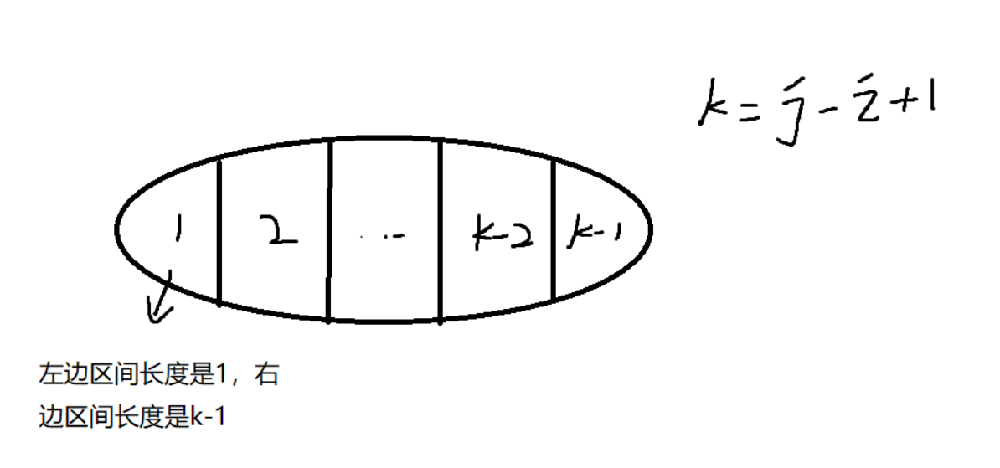
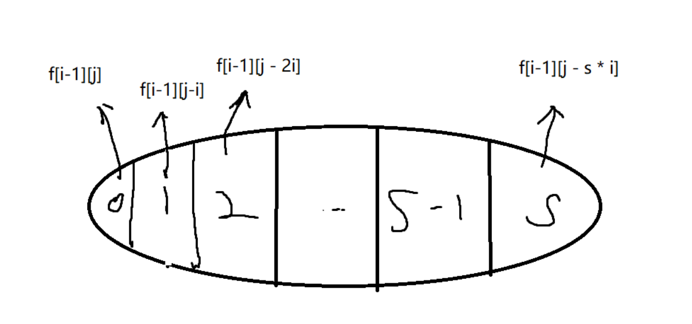

# 区间DP-数位统计DP

## 区间DP

区间DP是在一段区间上进行动态规划，一般做法是由长度较小的区间往长度较大的区间进行递推，最终得到整个区间的答案。

所有的区间`dp`问题枚举时，第一维通常是枚举区间长度，并且一般 `len = 1` 时用来初始化，枚举从 `len = 2` 开始；第二维枚举起点 i （右端点 j 自动获得，`j = i + len - 1`）

```cpp
for (int len = 1; len <= n; len++) {           // 枚举区间长度
    for (int i = 1; i + len - 1 <= n; i++) {   // 枚举起点
        int j = i + len - 1;           
        if (len == 1) {
            dp[i][j] = 初始值（根据实际情况选，如果属性是求最小值，初始值一般选择一个大数）
            continue;
        }

        for (int k = i; k < j; k++) {        // 枚举分割点，构造状态转移方程
            dp[i][j] = min(dp[i][j], dp[i][k] + dp[k + 1][j] + w[i][j]);
        }
    }
}
```


### 石子合并

设有 N 堆石子排成一排，其编号为 1，2，3，…，N。

每堆石子有一定的质量，可以用一个整数来描述，现在要将这 N 堆石子合并成为一堆。

每次只能合并相邻的两堆，合并的代价为这两堆石子的质量之和，合并后与这两堆石子相邻的石子将和新堆相邻，合并时由于选择的顺序不同，合并的总代价也不相同。

例如有 4 堆石子分别为 `1 3 5 2`， 我们可以先合并 1、2 堆，代价为 4，得到 `4 5 2`， 又合并 1，2堆，代价为 9，得到 `9 2` ，再合并得到 11，总代价为 4+9+11=24

如果第二步是先合并 2，3 堆，则代价为 7，得到 `4 7`，最后一次合并代价为 11，总代价为 4+7+11=22。

问题是：找出一种合理的方法，使总的代价最小，输出最小代价。

**输入格式**

第一行一个数N 表示石子的堆数 N。

第二行 N 个数，表示每堆石子的质量(均不超过 1000)。

**输出格式**

输出一个整数，表示最小代价。

**数据范围**

1≤N≤300

**输入样例：**

```
4
1 3 5 2
```

**输出样例：**

```
22
```


**思路与解答**

- 状态表示：
  - `f[i][j]`表示，从下标`i`~`j`开始的所有合并方式的集合。
  - 属性是min，表示所有合并方式的代价的最小值。
- 状态计算：画图

如何来切分状态呢？枚举最后一次合并的结果，最后一次合并的分割线可以在`1~N`之间的任意两个元素之间，



所以，状态计算`f[i][j] = min{ f[i][k]  + f[k+1][j] + sum(i,j)}`

`sum(i,j)`表示的是合并代价，即a[i] ~ a[j] 的所有数的和。可以用前缀和来计算： `sum(i,j) = s[j] - s[i-1].`


```c++
#include <bits/stdc++.h>

using namespace std;

const int N = 310;

int s[N], f[N][N];
int n;

int main(){
    scanf("%d", &n);
    for(int i = 1; i <= n; i ++)    scanf("%d", &s[i]);
    
    // 处理前缀和数组
    for(int i = 1; i <= n; i++)  s[i] += s[i-1];
    
    // 注意这里是枚举区间长度len,因为要保证每次的区间合并的时候，两边所有的小区间都计算过了。
    // 所以从小到大枚举区间长度
    for(int len = 2; len <= n; len ++){
        for(int i = 1; i + len -1 <= n; i++){
            int l = i, r = i + len - 1;
            // 这里设置成一个大数，是因为全局的f[N][N]默认是0
            f[l][r] = 1e8;
            for(int k = l; k < r; k ++)
            {
                f[l][r] = min( f[l][r] , f[l][k] + f[k+1][r] + s[r] - s[l-1]);
            }
        }
    }
    
    cout << f[1][n] << endl;
    return 0;
}
```


### 区间DP之环形石子合并问题

> [环形石子合并](acwing.com/problem/content/1070/)

数据范围： 1≤n≤200

题意分析：

与上一题不同的是，此题中的石子是环形摆放的，并且也只能合并**相邻的两堆石子**。环形相邻的题目解决方法通常有两种：

1. n个石头形成一个环形，每次合并把它看成是两个石头之间连一条边，那么要合并成一堆石头，需要合并n - 1次，这样就一定有一个缺口。把剩下的连通的部分拉直看成是一个区间，这样就可以套用上一题的方案。因此，枚举n个缺口，再用上面的方案，总的时间复杂度是$O(n * n^3) = O(n^4) ≈ 16 \times 10^8$. 肯定会超时。
2. 如果我们直接把这个环形链，变成连续两条直链相连，如下图所示： 


在这条长度为2*n的长链上按照上一题的，枚举长度 + 枚举左端点 + 枚举中间合并点，一共时间复杂度为$O(n^3)$.

解答如下：

```cpp
#include <cstring>
#include <iostream>
#include <algorithm>

using namespace std;

const int N = 410, INF = 0x3f3f3f3f;

int n;
int w[N], s[N];
int f[N][N], g[N][N];

int main()
{
    cin >> n;
    for (int i = 1; i <= n; i ++ )
    {
        cin >> w[i];
        w[i + n] = w[i];
    }
	
    // 前缀和数组
    for (int i = 1; i <= n * 2; i ++ ) s[i] = s[i - 1] + w[i];
	
    // 初始化
    memset(f, 0x3f, sizeof f);
    memset(g, -0x3f, sizeof g);

    for (int len = 1; len <= n; len ++ )
        for (int l = 1; l + len - 1 <= n * 2; l ++ )
        {
            int r = l + len - 1;
            if (l == r) f[l][r] = g[l][r] = 0;
            else
            {
                for (int k = l; k < r; k ++ )
                {
                    f[l][r] = min(f[l][r], f[l][k] + f[k + 1][r] + s[r] - s[l - 1]);
                    g[l][r] = max(g[l][r], g[l][k] + g[k + 1][r] + s[r] - s[l - 1]);
                }
            }
        }

    int minv = INF, maxv = -INF;
    for (int i = 1; i <= n; i ++ )
    {
        minv = min(minv, f[i][i + n - 1]);
        maxv = max(maxv, g[i][i + n - 1]);
    }

    cout << minv << endl << maxv << endl;

    return 0;
}
```


### 链式区间DP之合并权重相乘

> [acwing320 能量项链](https://www.acwing.com/problem/content/322/)

题意解析：

"设 N=4，4颗珠子的头标记与尾标记依次为 (2，3) (3，5) (5，10) (10，2)。" 每一颗珠子都可以看成是一个矩阵，最后求矩阵计算次数的最大值。

如何建模这种问题？ 4颗珠子，要满足头尾兼顾，实际上只需要存5个数即可： 2, 3, 5, 10, 2. 为什么要保留最后一个2呢？ 这里保留的其实不是2，而是最开始珠子的头标记。因为要让四个珠子合并成一个，它的头标记和尾标记一定是（2， 2）. 最后多保留一个方便计算乘积。

环形链变成两条单链连接后，从链`[L, R]`中的分界点K分开，最后合并的代价是`[L, K], [K, R]合并 = w[L] * w[K] * w[R]`.

```cpp
#include <iostream>
#include <algorithm>
#include <cstring>

using namespace std;

const int N = 210;
int f[N][N];
int w[N];
int n;

int main() {
    cin >> n;
    for (int i = 1; i <= n; i ++ ){
        cin >> w[i];
        w[i + n] = w[i];
    }
    
    for (int len = 3; len <= n + 1; len ++){
        for (int l = 1; l + len - 1 <= n * 2; l ++) {
            int r = l + len - 1;
            for (int k = l + 1; k < r; k ++) {
                f[l][r] = max(f[l][r], f[l][k] + f[k][r] + w[l] * w[k] * w[r]);
            }
        }
    }
    
    int res = 0;
    for (int i = 1; i <= n; i ++ )  res = max(res, f[i][i + n]);
    cout << res << endl;
    return 0;
}
```


### 区间DP之伪装成二叉树的问题

> [加分二叉树](https://www.acwing.com/problem/content/481/)

题意分析：

n个节点的二叉树中序遍历确定为(1, 2, 3, 4, ..., n)： 这句话的实质含义是就是这题的本质是一个区间DP问题。因为中序遍历的顺序确定，如果树的根节点为k，那么1~k-1一定位于根节点的左子树中，k + 1 ~ n一定位于根节点的右子树。并且递归下去同理。所以题目就转变为，寻找一个合适的根节点，让区间左边的权值 * 区间右边的权值 + 根节点权值 最大。

**第一问求最大得分**：

- 状态集合：`f[i][j]` 表示下标从`i`到`j`的区间中所有子树划分集合。
- 属性：`f[i][j] = x`， x表示最大加分。 初始状态`f[i][i]`, 终止状态`f[1][n]`。
- 状态计算：以k作为根节点切分区间。


`left = f[i][k-1]; right = f[k + 1][j]`， 特判一下当`k-1 == i`, `k+1 == j`的时候，左右子树的得分分别为1。

**第二问求最小字典序的分割方案：**

由于需要记录每次区间根节点的数值，因此多开辟一个`g[i][j] = k`，表示区间`i ~ j`加分最大时，根节点为k。

前序遍历要求字典序最小，因为前序遍历每次都先输出根节点，所以根节点的数值越小越好。所以第三层循环遍历k的时候，从小到大遍历，记录在`g[i][j]`中的数值k一定是满足条件中最小的。

用`dfs()`递归输出前序遍历结果。

```cpp
#include <iostream>
#include <cstring>
#include <algorithm>

using namespace std;

const int N = 35;
int f[N][N], g[N][N];
int w[N];
int n;

void dfs(int l, int r)
{
    if (l > r)  return;
    int k = g[l][r];
    cout << k << " ";
    dfs(l, k - 1);
    dfs(k + 1, r);
}

int main()
{
    cin >> n;
    for (int i = 1; i <= n; i ++) cin >> w[i];
    
    for (int len = 1; len <= n; len ++) {
        for (int i = 1; i + len - 1 <= n; i ++) {
            int j = i + len - 1;
            if (len == 1)   f[i][j] = w[i], g[i][j] = i;
            else{
                for (int k = i; k <= j; k ++) {
                    int left = (k == i ? 1 : f[i][k - 1]);
                    int right = (k == j ? 1 : f[k + 1][j]);
                    int score = left * right + w[k];
                    if (score > f[i][j]){
                        f[i][j] = score;
                        g[i][j] = k;
                    }    
                }
            }
        }
    }
    cout << f[1][n] << endl;
    dfs(1, n);
    return 0;
}
```


### 戳气球

> [Leetcode 312](https://leetcode.cn/problems/burst-balloons/?favorite=2cktkvj)

要求：戳破所有的气球，（气球上的数字构成一个**一维区间**），求获得硬币的**最大值**。

加粗的部分构成区间DP问题的特征。

```
样例1：
输入：nums = [3,1,5,8]
输出：167
解释：
nums = [3,1,5,8] --> [3,5,8] --> [3,8] --> [8] --> []
coins =  3*1*5    +   3*5*8   +  1*3*8  + 1*8*1 = 167

样例2：
输入：nums = [1,5]
输出：10
```

由于超出边界的数字，都看成1，所以可以给原来的nums数组前后都增加1.

- 状态表示： 状态`f[i][j]`为气球`[i + 1, j - 1]`左闭右闭区间的所有方案集合。

- 属性：max， 求所有方案硬币的最大值。
- 状态计算： `f[i][j] = max(f[i][j], f[i][k] + f[k][j] + a[i] * a[k] * a[j])`;

状态计算的含义是：k遍历所有`[i, j]`， 表示从第k个气球分开成两段，`f[i][k]`表示第`k`个气球前半段的最大值，即第i + 1个气球到第k - 1个气球的所有方案的最大值。`f[k][j]` 表示第`k`个气球的后半段的最大值，即第k + 1个气球到第j - 1个气球的最大值。

当前半段和后半段的气球都被戳破后，剩下`a[i], a[k], a[j]`三个气球，因此再加上`a[i] * a[k] * a[j]`.


```cpp
class Solution {
public:
    int maxCoins(vector<int>& nums) {
        int n = nums.size();
        vector<vector<int>> f = vector<vector<int>> (n + 2, vector<int> (n + 2, 0));
        vector<int> a(n + 2, 1);
        // 复制一份，前后加1
        for (int i = 1; i <= n; i ++)   a[i] = nums[i - 1];

        for (int len = 3; len <= n + 2; len ++) {
            for (int i = 0; i + len - 1 <= n + 1; i ++) {
                int j = i + len - 1;
                for (int k = i + 1; k < j; k ++) {
                    f[i][j] = max(f[i][j], f[i][k] + f[k][j] + a[i] * a[k] * a[j]);
                }
            }
        }
        // 最后返回整个区间
        return f[0][n + 1];
    }
};
```


## 计数类DP问题

一个正整数 n 可以表示成若干个正整数之和，形如：`n=n1+n2+…+nk`，其中 n1≥n2≥…≥nk ,   k≥1。

我们将这样的一种表示称为正整数 n 的一种划分。

现在给定一个正整数 n，请你求出 n 共有多少种不同的划分方法。

#### 输入格式

共一行，包含一个整数 n。

#### 输出格式

共一行，包含一个整数，表示总划分数量。

由于答案可能很大，输出结果请对 $10^9+7$取模。

#### 数据范围

1≤n≤1000

#### 输入样例:

```
5
```

#### 输出样例：

```
7
```


#### 思路与解答：

- 状态表示：
  - 集合：将该问题看成是一个完全背包问题，正整数n表示， 一共有编号`1~n`个物品，它们的数量都是无限个，但是容积分别就是1~n. 将该问题转化成，从`1~n`中找到体积恰好是n的，所有的方案数。所以`f[i][j]`就表示，从前`i`个物品中，拿出体积恰好是`j`的物品的所有方案的集合。
  - 属性：count属性，`f[i][j]`表示的是所有方案的个数。
- 状态计算：



将`f[i][j]`按照第`i`个物品拿`s`份，分解成若干状态。

所以状态计算公式为: `f[i][j] = f[i-1][j] + f[i-1][j - i] + f[i - 1][ j - 2*i] + ... + f[i-1][j - s* i]`;

同理可以验证           `f[i][j - i] =         f[i - 1][j- i] + f[i-1][j - 2 * i] + .... + f[i-1][ j - s*i];`

所以： `f[i][j] = f[i-1][j] + f[i][j-i]`

然后进行空间优化：

`f[j] = f[j] + f[j - i]`


```c++
#include <bits/stdc++.h>

using namespace std;

const int N = 1010, M = 1e9 + 7;
int n;
int f[N];

int main(){
    cin >> n;

    // 一个数都不选，算一个方案
    f[0] = 1;
    
    for(int i = 1; i <= n; i ++)
        for(int j = i; j <= n; j++){
            f[j] = (f[j] + f[ j - i]) % M;
        }
    
    cout << f[n] << endl;
    
    return 0;
}
```


