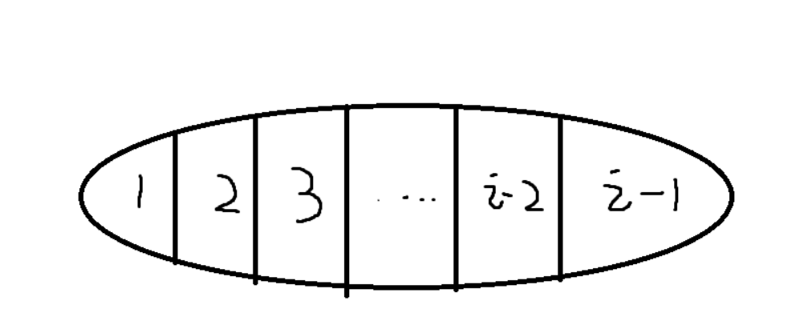

# 最长上升子序列题

### 最长上升子序列模板题

给定一个长度为 N 的数列，求数值严格单调递增的子序列的长度最长是多少。

#### 输入格式

第一行包含整数 N。

第二行包含 N 个整数，表示完整序列。

#### 输出格式

输出一个整数，表示最大长度。

#### 数据范围

1≤N≤1000
$−10^9≤数列中的数≤10^9$

#### 输入样例：

```
7
3 1 2 1 8 5 6
```

#### 输出样例：

```
4
```


#### 思路与解答：

样例中的4，是由`1,2,5,6`四个数组成。

* 状态表示：`f[i]`，表示以下标`i`结尾的所有子序列的集合。

  * 属性：max，`f[i]=x`，x为最长的子序列的长度

* 状态计算：（状态的计算要求能够计算之前的每一个状态，递推到现在的状态）

  

每一个`f[i]`都可以分解到前`i-1`个状态，所以`j = 1 ~ i-1`, 当`a[i] > a[j]`时，`f[i] = max(f[j] + 1)`, 时间复杂度为$O(n^2)$

```c++
#include<bits/stdc++.h>

using namespace std;

const int N = 1010;

int f[N], a[N];
int n;
int main(){
    scanf("%d", &n);

    for(int i = 1; i <=n; i ++){
        scanf("%d", &a[i]);
    }

    // 从前往后枚举每一个数组中的下标
    for(int i = 1; i <= n; i ++){
        f[i] = 1;  // 只有a[i]一个数，长度是1，这种情况出现在a[i]比之前的数都小的情况
        // 遍历它之前的每一个数
        for(int j = 1; j < i; j++){
            if(a[j] < a[i]){
                f[i] = max(f[i], f[j] + 1);
            }
        }
    }

    int res = 0;
    for(int i = 1; i <= n; i ++)    res = max(res, f[i]);

    cout << res << endl;

    return 0;
}
```


#### 优化版本的：

实际上，上述的时间复杂度可以做进一步的优化。

比如样例这`3 1 2 1 8 5 6`, 当我们从3看到1时，明显可以知道，虽然两者的`f[]`数组结果都为1，但是后续的数字如果接到1后面，可能达到的长度会更大。那么3实际上就没有意义了，可以将其排除掉不考虑。

因此我们可以把这个‘上升子序列’存在一个数组中，它是严格保持单调递增的，每当来一个数字a，我们就和这个子序列数组的最大一个数字（最后一个数字）进行比较，如果比它大，那么直接放在这个子序列数组的后面；反之，找到这个子序列数组里大于等于a的第一个数，并将其替换掉。

> 注意：这里子序列中的数，并不代表最终的最长上升子序列；而是基于一种贪心的思想：对于同样长度的递增子串，如果它的末尾越小，则它可能达到的长度就越长。这就是为什么要替换的原因。
>
> 例子: 数据是1 3 6 2 8 9， 最长上升子序列明显是 1 3 6 8 9， 但是严格单调的数组最终里保存的是1 2 6 8 9， 但是数组的长度表示的是最长子序列的长度。

总的时间复杂度是$O(nlogn)$

```c++
#include <bits/stdc++.h>

using namespace std;
int main(){
    int n;
    cin >> n;
    vector<int> a(n);
    for(int i = 0; i < n; i ++)
        scanf("%d", &a[i]);

    vector<int> stk;
    stk.push_back(a[0]);
    for(int i = 1; i < n; i ++){
        if(a[i] > stk.back())
            stk.push_back(a[i]);
        else{
            // lower_bound()的原理是二分查找，时间复杂度是O(logn);
            *lower_bound(stk.begin(), stk.end(), a[i]) = a[i];
        }
    }

    cout << stk.size() << endl;
    return 0;
}
```


### 最长上升子序列提高--先递增后递减

> [爬山](https://www.acwing.com/problem/content/1016/)

五一到了，ACM队组织大家去登山观光，队员们发现山上一共有N个景点，并且决定按照顺序来浏览这些景点，即每次所浏览景点的编号都要大于前一个浏览景点的编号。

同时队员们还有另一个登山习惯，就是不连续浏览海拔相同的两个景点，并且一旦开始下山，就不再向上走了。

队员们希望在满足上面条件的同时，尽可能多的浏览景点。

- 题意分析: 分析题目的时候，要将所说的条件转化。
  - 按照顺序浏览：说明把山的高度存在数组中，就只能从前往后遍历。
  - 不连续浏览海拔相同的两个景点：说明选择的高度只能满足严格单调关系。
  - 一旦开始下山，就不再向上走了：说明浏览的顺序应该是---先上后下。


特殊点在于先上后下的转折点--最高点，通过这个最高点来分类考虑。
从第1个点到第n个点分别作为最高点x，然后1 ~ x中计算最长上升子序列，在x + 1 ~ n中计算最长下降子序列(反向最长上升子序列)。

这样实际上有两种编程的方法：

1. 首先对1-n个点遍历，把其当成最高点，分别计算一个最长上升子序列和最长下降子序列。这样的时间复杂度$O(n^3)$。
2. 先进行一次预处理，从前往后从后往前的最长的序列长度记录在一张表格中；再对每一个点遍历，这时只需要查表就可以了，时间复杂度为$O(n^2)$.


```cpp
#include <iostream>
#include <cstring>
#include <algorithm>

using namespace std;

const int N = 1010;
int f[N], g[N];
int a[N];
int main()
{
    int n;
    cin >> n;
    for (int i = 1; i <= n; i ++)
    {
        cin >> a[i];
    }
    // 从前往后求dp数组f[]
    for (int i = 1; i <= n; i ++)
    {
        f[i] = 1;
        for (int j = 1; j < i; j ++)
        {
            if (a[j] < a[i])
            {
                f[i] = max(f[i], f[j] + 1);
            }
        }
    }
    // 从后往前求dp数组g[]
    for (int i = n; i >= 1; i --)
    {
        g[i] = 1;
        for (int j = n; j > i; j --)
        {
            if (a[i] > a[j])
            {
                g[i] = max(g[i], g[j] + 1);
            }
        }
    }

    int res = 0;
    // 这里f[i] + g[i] - 1是因为第i个点作为最高点，求了两次，删掉一次重复的即可。
    for (int i = 1; i <= n; i ++)   res = max(res, f[i] + g[i] - 1);
    cout << res << endl;
    return 0;
}
```


### 最长上升子序列之贪心拦截导弹

> [拦截导弹](https://www.acwing.com/problem/content/1012/)
> 某国为了防御敌国的导弹袭击，发展出一种导弹拦截系统。

但是这种导弹拦截系统有一个缺陷：虽然它的第一发炮弹能够到达任意的高度，但是以后每一发炮弹都不能高于前一发的高度。

某天，雷达捕捉到敌国的导弹来袭。

由于该系统还在试用阶段，所以只有一套系统，因此有可能不能拦截所有的导弹。

输入导弹依次飞来的高度（雷达给出的高度数据是不大于30000的正整数，导弹数不超过1000），计算这套系统最多能拦截多少导弹，如果要拦截所有导弹最少要配备多少套这种导弹拦截系统。

题意分析：

- 要求计算两个值：最多能拦截多少导弹(最长上升子序列)；要拦截所有的导弹，至少需要多少个序列。
- 计算至少需要多少个序列，是本题的难点。我们假设，当前来了一发导弹i，它的高度为h，目前已经有了x个序列，遍历这x个序列的最后一个元素，将h加入到这最后一个元素组中最小的元素之后。

这是一种贪心的思想，我们放到最小的元素后，这样使得所有的序列的个数最少（导弹拦截系统最少）。
贪心的证明：贪心解 = 最优解
经典的证明相等的方法： 贪心解 >= 最优解， 贪心解 <= 最优解。
贪心解 >= 真实最优解，不需要证明。 贪心解 <= 最优解，使用调整法。（反证法）

```cpp
#include <iostream>
#include <sstream>
#include <string>
using namespace std;
const int N = 1010;
int a[N], g[N], f[N];
int n;
int main()
{
    string line;
    getline(cin, line);
    stringstream ssin(line);
    while (ssin >> a[n]) n ++;
    
    int res = 0;
    for (int i = 0; i < n; i ++)
    {
        f[i] = 1;
        for (int j = 0; j < i; j ++)
        {
            if (a[j] >= a[i])   f[i] = max(f[i], f[j] + 1);
        }
        res = max(res, f[i]);
    }
    cout << res << endl;
    
    // 贪心求导弹装配的系统数
    // 贪心思路： 每来一个导弹的高度h，就遍历之前所有已有序列的最后一个值
    // 如果h大于之前所有的序列的最低高度，那就新开一个序列。
    // 如果小于其中某一个序列的最低高度，那么就将其末尾元素替换成当前h。
    int cnt = 0;
    // g[] 存储每一个导弹拦截系统最后一枚导弹的高度
    for (int i = 0; i < n; i ++)
    {
        int k = 0;
        // while从前往后循环，能保证一定找到子序列末尾最小的元素
        while (k < cnt && g[k] < a[i])  k++;
        g[k] = a[i];
        if (k >= cnt)   cnt ++;
    }
    cout << cnt << endl;
    return 0;
}
```


### 最长上升子序列之dfs暴搜

>  [导弹防御系统](https://www.acwing.com/problem/content/189/)

为了对抗附近恶意国家的威胁，R 国更新了他们的导弹防御系统。

一套防御系统的导弹拦截高度要么一直 **严格单调** 上升要么一直 **严格单调** 下降。

例如，一套系统先后拦截了高度为 3 和高度为 4 的两发导弹，那么接下来该系统就只能拦截高度大于 4 的导弹。

给定即将袭来的一系列导弹的高度，请你求出至少需要多少套防御系统，就可以将它们全部击落。

  1 <= n <= 50;   时空限制： 3s / 64MB

- 题意分析：

首先看到n的范围很小，而且时间限制为3s, 很有可能是暴搜。

此题和模板题的不同在于，我们每来一个导弹的高度，都要判断一下这个高度是属于严格单调上升的子序列的，还是严格单调下降子序列的。相当于做了一个决策，这种需要**对每一个元素做决策的过程**，要么**使用DP**(类似于背包问题中的选或者不选)， 要么**直接暴搜**（枚举每一种情况，来取最优）。

暴搜枚举，一般有BFS和DFS两种方法，但是BFS的缺点在于：1. 代码量较大，并且不太方便剪枝。 2. 所需要的存储空间较大。

因此，只要写暴搜，一般都用**DFS递归**的方法： 记录一个全局最值，在递归的过程中更新它。（感觉这种方法最好理解）

```cpp
#include <iostream>
#include <algorithm>
using namespace std;

const int N = 55;
int a[N], up[N], down[N];
int res, n;


// u 表示dfs次数, su 表示上升子序列个数
// sd 表示下降子序列个数
void dfs(int u, int su, int sd)
{
    if (su + sd >= res)     return;
    if (u == n)
    {
        res = su + sd;
        return;
    }

    // 情况1: 将当前数放到上升子序列中
    int k = 0;
    // 找到能放进a[u]的序列编号k，这里是基于贪心的思想；
    // 即如果要把一个元素x放在单调递增的序列后，那么应该放到序列末尾小于x的最大值之后。
    while (k < su && up[k] >= a[u])  k ++;
    // 用t来存储up[k]原来的值，保护现场
    int t = up[k];
    up[k] = a[u];
    if (k < su)     dfs(u + 1, su, sd);		// 没有增加新的序列
    else    dfs(u + 1, su + 1, sd);			// 增加了新的序列
    // 恢复现场
    up[k] = t;

    // 情况2: 将当前数放到下降子序列中, 同理基于贪心思想
    k = 0;
    while (k < sd && down[k] <= a[u])   k ++;
    t = down[k];
    down[k] = a[u];
    if (k < sd)     dfs(u + 1, su, sd);
    else    dfs(u + 1, su, sd + 1);
    down[k] = t;
}

int main()
{
    while (cin >> n, n != 0)
    {
        for (int i = 0; i < n; i ++)    cin >> a[i];
        res = n;
        dfs(0, 0, 0);
        cout << res << endl;
    }
    return 0;
}
```


### 最长公共上升子序列LCIS(Longest Common Increasing Subsequence)

> [最长公共上升子序列](https://www.acwing.com/problem/content/274/)
>
> LIS(Longest Increasing Subsequence) 最长上升子序列.
>
> LCS(Longest Common Subsequence) 最长公共子序列.

题目大意： 输入两个相同长度的序列，输出一个整数，表示这两个序列中最长公共子序列的长度。

例子如下：

**输入：**

```
4
2 2 1 3
2 1 2 3
```

**输出：**

```
2
```


- 状态表示： `f[i][j]`表示`a`序列中前`i`个数字，`b`序列中前`j`个数字，且当前以`b[j]`结尾的所有子序列的方案。
- 属性：max, 表示子序列的长度最大。
- 状态转移：

1. 考虑从`a数组`中前`i-1`个数字，`b`数组中前`j`个数字，且当前以`b[j]`结尾的子序列的方案转移过来：

`f[i][j] = max(f[i][j], f[i-1][j])`.

2. 考虑从a数组的前`i`个数字，b数组的前`k`个数字，且当前以`b[k]`结尾的子序列的方案转移过来：

`f[i][j] = max(f[i][j], f[i-1][k] + 1)`, $k \in [0, j - 1], a_i = b_j, b_j > b_k$

这里尽管考虑的是`a`数组的前`i`个数字，所以选择倒数第二个元素`f[i-1][k] + 1`，是因为`a[i] = b[k]`。

初始状态： `f[0][0]`.

目标状态： `f[n][i]`， 取`max`.

朴素版本，时间复杂度$O(n^3) ≈ 10^9$.基本一定会超时。

```cpp
#include <iostream>

using namespace std;

const int N = 3010;

int n;
int a[N], b[N];
int f[N][N];

int main()
{
    //input
    cin >> n;
    for (int i = 1; i <= n; i ++) cin >> a[i];
    for (int i = 1; i <= n; i ++) cin >> b[i];

    //dp
    for (int i = 1; i <= n; ++ i)
    {
        for (int j = 1; j <= n; ++ j)
        {
            f[i][j] = f[i - 1][j];
            if (a[i] == b[j])
            {
                for (int k = 0; k < j; ++ k)
                {
                    if (b[j] > b[k])
                    {
                        f[i][j] = max(f[i][j], f[i - 1][k] + 1);
                    }
                }
            }
        }
    }

    //find result
    int res = 0;
    for (int i = 0; i <= n; i ++) res = max(res, f[n][i]);
    cout << res << endl;

    return 0;
}

```

优化版本：所有DP问题的优化版本，都是不改变原逻辑的情况下做等价变形（可能原来的解释性会变得稍微差一些）。
考虑到上述第三层循环的本意是在`b[j]`之前找到可以转移过来的最大的`f[i-1][k]`的值，每次用到的状态都是第`i-1`阶段的。

所以：可以用一个最大的变量记录上一层的最大值。这样可以省去第三层循环。


```cpp
#include <iostream>

using namespace std;

const int N = 3010;

int n;
int a[N], b[N];
int f[N][N];

int main()
{
    //input
    cin >> n;
    for (int i = 1; i <= n; i ++) cin >> a[i];
    for (int i = 1; i <= n; i ++) cin >> b[i];

    //dp
    for (int i = 1; i <= n; i ++)
    {
        int maxv = 1;
        for (int j = 1; j <= n; j ++)
        {
            f[i][j] = f[i - 1][j];
            if (b[j] == a[i]) f[i][j] = max(f[i][j], maxv);
            if (b[j] < a[i]) maxv = max(maxv, f[i - 1][j] + 1);
        }
    }

    //find result
    int res = 0;
    for (int i = 0; i <= n; i ++) res = max(res, f[n][i]);
    cout << res << endl;

    return 0;
}

```
