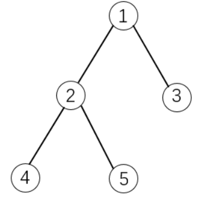
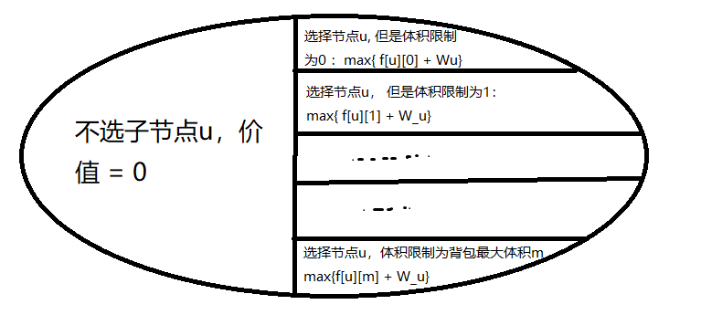
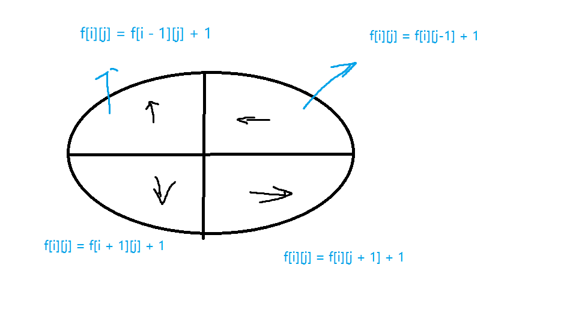

# 树形DP和记忆化搜索


### 树形DP：经典中的经典例题。【字节跳动笔试题】

> [没有上司的舞会](https://www.acwing.com/problem/content/287/)

Ural 大学有 N 名职员，编号为 1∼N。

他们的关系就像一棵以校长为根的树，父节点就是子节点的直接上司。

每个职员有一个快乐指数，用整数 Hi 给出，其中 1≤i≤N。

现在要召开一场周年庆宴会，不过，没有职员愿意和直接上司一起参会。

在满足这个条件的前提下，主办方希望邀请一部分职员参会，使得所有参会职员的快乐指数总和最大，求这个最大值。

#### 输入格式

第一行一个整数 N。

接下来 N 行，第 i 行表示 i 号职员的快乐指数 Hi。

接下来 N−1 行，每行输入一对整数 L,K，表示 K 是 L 的直接上司。

#### 输出格式

输出最大的快乐指数。

#### 数据范围

1≤N≤6000
$−128≤H_i≤127$

#### 输入样例：

```
7
1
1
1
1
1
1
1
1 3
2 3
6 4
7 4
4 5
3 5
```

#### 输出样例：

```
5
```


#### 思路和解答

整个题目的意思就是，每个树里的节点有一个权重；从这个树里选择一些节点，必须满足：如果选择了某个节点，那么它的直接子节点不能被选择。相反，如果选择了一个节点的直接子节点，那么这个节点也不能被选择。

问，所有选择的节点的权重的最大值。

- 状态表示：
  - 集合：`f[i][j]`， `j`只有两个值: 0和1。`f[u][0]`，表示不选择当前节点u， 从以u为根的子树中选择的方案。`f[u][1]`，表示选择当前节点u，也是从以`u`为根的子树中选。
  - 属性：max，即所有节点的权重的最大值。
- 状态计算：从根节点开始，选择根节点和不选根节点中挑出一个最大值。

`res = max( f[root][0], f[root][1] )` ; 

`f[u][0] = max(f[si][1], f[si][0])`, 其中`si`是`u`的直接子节点, 要遍历所有子节点选最大值。

`f[u][1] = f[s1][0] + f[s2][0] + ... + f[sn][0]`;  


```c++
#include <bits/stdc++.h>

using namespace std;

const int N = 6010;

int f[N][N], n;
int e[N],idx, ne[N], h[N];

// w存储节点权重
int w[N];
bool has_father[N];

// 树的添加边的操作
void add(int a, int b){
    e[idx] = b, ne[idx] = h[a], h[a] = idx++;
}

// 深度优先遍历，先要从根节点开始，不断向下递归到子节点，然后从下往上找。
void dfs(int u){
    f[u][1] = w[u];
    for(int i = h[u]; i != -1; i = ne[i]){
        int j = e[i];
        
        dfs(j);
        
        f[u][0] += max(f[j][1],f[j][0]);
        f[u][1] += f[j][0];
    }
}

int main(){
    scanf("%d", &n);
    for(int i = 1; i <= n; i ++){
        scanf("%d", &w[i]);
    }
    
    memset(h , -1, sizeof h);
    
    for(int i = 1; i < n; i ++){
        int a,b;
        scanf("%d%d", &a, &b);
        add(b,a);
        has_father[a] = true;
    }
    
    // 找根节点
    int root = 1;
    while(has_father[root]) root++;
    
    dfs(root);
    
    printf("%d\n", max(f[root][0] , f[root][1]));
    
    return 0;
}
```


### 有依赖的背包问题（树形DP）

> [有依赖的背包问题](https://www.acwing.com/problem/content/10/)

有 N 个物品和一个容量是 V 的背包。

物品之间具有依赖关系，且依赖关系组成一棵树的形状。如果选择一个物品，则必须选择它的父节点。

如下图所示：



如果选择物品5，则必须选择物品1和2。这是因为2是5的父节点，1是2的父节点。

每件物品的编号是 `i`，体积是 $v_i$，价值是 $w_i$，依赖的父节点编号是 $p_i$。物品的下标范围是 1…N。

求解将哪些物品装入背包，可使物品总体积不超过背包容量，且总价值最大。输出最大价值。

**题意分析：**

- 背包问题，数据构成一棵树的形式，所以一定是树形DP。那么一定需要**建图 + 找根节点**。采用有向图邻接表的方式建图。

- 树形DP问题，通用的状态表示:  `f[u][j]`; `u`表示：以`u`为“根”节点的子树， `j`表示当前子树的“体积”限制。即，以`u`为根的子树，在不同体积限制下，能够取得的最大价值是多少。
- 属性: max；
- 状态转移： 与之前一样，首先将状态分为两部分，选择当前子树根节点`u` + 不选择当前子树根节点`u`； 如果是不选`u`， 最大价值一定是0，因为`u`的子节点也全部不能选；如果选择`u`，则要考虑子节点的选择情况。**重点**：在选择子节点时，由于这棵树不是二叉树、三叉树等，子节点的个数未知，如果是按照所有子节点的选择与否来划分状态，每个子节点也有选择和不选两种，这样时间复杂度最坏是$O(2^n), n为全部节点数量$。 所以这里采用按照体积来划分状态，和状态表示相对应（实际上状态计算是依赖于状态表示的）。
- 
- 初始状态： `f[叶子节点][任意体积] = 0`
- 终止状态： `f[root][m]`


```cpp
#include <iostream>
#include <cstring>
#include <algorithm>

using namespace std;

const int N = 110;
int f[N][N];
int e[N], ne[N], h[N], idx;
int v[N], w[N];
int n, m;

void add(int a, int b){
    e[idx] = b, ne[idx] = h[a], h[a] = idx ++;
}

void dfs(int u){
    // 枚举u的所有子节点
    for(int i = h[u]; i != -1; i = ne[i]){
        int son = e[i];
        dfs(son);
        
        // 这里j的范围是>=0, 因为选择了父结点，但是子节点也可以不选
        for(int j = m - v[u]; j >= 0; j --){
            for(int k = 0; k <= j; k ++){
                f[u][j] = max(f[u][j], f[u][j - k] + f[son][k]);
            }
        }
    }
    
    // 默认选择父结点，增加上父结点w
    for(int i = m; i >= v[u]; i --){
        f[u][i] = f[u][i - v[u]] + w[u];
    }
    
    // 从树下往上开始选择，如果体积小于当前物品的体积： 
    // 则当前物品不能选，它的子节点也不能选，价值为0.
    for(int i = 0; i < v[u]; i ++){
        f[u][i] = 0;
    }
}

int main(){
    cin >> n >> m;
    int root;
    memset(h, -1, sizeof h);
    // 建图 + 找根节点
    for(int i = 1; i <= n; i ++){
        int p;
        cin >> v[i] >> w[i] >> p;
        if(p == -1) root = i;
        else    add(p, i);
    }
    
    // 递归的方式计算DP
    dfs(root);
    
    cout << f[root][m] << endl;
    return 0;
}
```


### 记忆化搜索

经典例题：

给定一个 R 行 C 列的矩阵，表示一个矩形网格滑雪场。

矩阵中第 i 行第 j 列的点表示滑雪场的第 i 行第 j 列区域的高度。

一个人从滑雪场中的某个区域内出发，每次可以向上下左右任意一个方向滑动一个单位距离。

当然，一个人能够滑动到某相邻区域的前提是该区域的高度低于自己目前所在区域的高度。

下面给出一个矩阵作为例子：

```
 1  2  3  4 5

16 17 18 19 6

15 24 25 20 7

14 23 22 21 8

13 12 11 10 9
```

在给定矩阵中，一条可行的滑行轨迹为 24−17−2−1。

在给定矩阵中，最长的滑行轨迹为 25−24−23−…−3−2−1，沿途共经过 25 个区域。

现在给定你一个二维矩阵表示滑雪场各区域的高度，请你找出在该滑雪场中能够完成的最长滑雪轨迹，并输出其长度(可经过最大区域数)。

#### 输入格式

第一行包含两个整数 R 和 C。

接下来 R 行，每行包含 C 个整数，表示完整的二维矩阵。

#### 输出格式

输出一个整数，表示可完成的最长滑雪长度。

#### 数据范围

1≤R,C≤300
0≤矩阵中整数≤10000

#### 输入样例：

```
5 5
1 2 3 4 5
16 17 18 19 6
15 24 25 20 7
14 23 22 21 8
13 12 11 10 9
```

#### 输出样例：

```
25
```


#### 思路与解答：

- 状态表示：
  - 集合：`f[i][j]`, 表示所有从i,j 开始滑的路径。
  - 属性: max， 表示所有路径的最大长度。
- 状态计算：



每一个初始点，都可以有四个方向可供选择，但是选择一个方向前，必须满足高度要小于原来的高度。


```c++
#include <bits/stdc++.h>

using namespace std;

const int N = 310;

// 状态
int f[N][N];
int h[N][N];
int n, m;

// 位置向量
int dx[4] = { 1, 0, -1, 0} ,dy[4] = {0, 1, 0, -1};

int dp(int x, int y){
    int &  v = f[x][y];
    // 如果该状态为起点的最长路径已经被搜索过了
    // 直接返回v
    if(v != -1)     return v;
    
    // 初始没有路径可走，也是长度为1
    v = 1;
    
    for(int i = 0; i < 4; i++)
    {
        int a = x + dx[i], b = y + dy[i];
        if( a >= 1 && a <= n && b >= 1 && b <= m && h[a][b] < h[x][y]){
            v= max(v, dp(a,b) + 1);
        }
        
    }
    
    return v;
}

int main(){
    cin >> n >> m;
    for(int i = 1; i <= n; i++)
        for(int j = 1; j <= m; j ++)
            cin >> h[i][j];
            
    memset(f, -1 , sizeof f);
    int res = 0;
    
    // 遍历所有可能的初始起点，输出其中的最大值
    for(int i = 1; i <= n ;i++)
        for(int j = 1; j <= m; j ++)
            res = max(res, dp(i,j));
            
    cout << res << endl;
    
    return 0;
}
```


### Leetcode 135分发糖果（记忆化搜索）

https://leetcode-cn.com/problems/candy/

老师想给孩子们分发糖果，有 N 个孩子站成了一条直线，老师会根据每个孩子的表现，预先给他们评分。

你需要按照以下要求，帮助老师给这些孩子分发糖果：

每个孩子至少分配到 1 个糖果。
评分更高的孩子必须比他两侧的邻位孩子获得更多的糖果。
那么这样下来，老师至少需要准备多少颗糖果呢？

```
输入：[1,0,2]
输出：5
解释：你可以分别给这三个孩子分发 2、1、2 颗糖果。
```


```
输入：[1,2,2]
输出：4
解释：你可以分别给这三个孩子分发 1、2、1 颗糖果。
     第三个孩子只得到 1 颗糖果，这已满足上述两个条件。
```


#### 思考与解答

此题的思路实际上是在这个数组中，从位置`i`开始，往左和往右看，如果左边`i-1`的位置和右边`i+1`的位置里的元素值比位于位置`i`的元素小，则取左右的糖果的最大值 + 1.

```c++
class Solution {
public:
    // 方向向量
    int dx[2] = {-1, 1};
    // 一维dp，存储糖果值
    vector<int> f;
    int n;
    int candy(vector<int>& ratings) {
        n = ratings.size();
        f.resize(n);
        fill(f.begin(), f.end(), -1);
        int res = 0;
        for(int i = 0; i < n ; i ++){
            res += dp(ratings, i);
        }
        return res;
    }

    // 经典记忆化搜索dp + 贪心思想
    int dp(vector<int> & ratings, int x){
        if(f[x] != -1)  return f[x];
        f[x] = 1;
        for(int i = 0; i < 2; i ++){
            int a = x + dx[i];
            if(a < 0 || a >= n)     continue;
            if( ratings[a] < ratings[x] )    f[x] = max(f[x], dp(ratings, a) + 1);
        }
        return f[x];
    }
};

```

