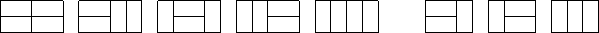

# 状态压缩DP

定义：所谓的状态压缩DP，是指一类问题，并不好直接的表示状态的集合，因此可以用一些编码技术，把状态压缩成编码（如二进制），用简单的方式表示出来。当需要表示一个集合有哪些元素时，往往需要利用2进制表示一个整数（此时通常二进制表示中的数字1表示存在某位，0表示不存在某位）。并且通过**位运算**来进行二进制的转移的算法。


### 例题1：棋盘放长方体方块

求把 N×M的棋盘分割成若干个 1×2 的的长方形，有多少种方案。

例如当 N=2，M=4 时，共有 5 种方案。当 N=2，M=3时，共有 3 种方案。

如下图所示：



#### 输入格式

输入包含多组测试用例。

每组测试用例占一行，包含两个整数 N 和 M。

当输入用例 N=0，M=0 时，表示输入终止，且该用例无需处理。

#### 输出格式

每个测试用例输出一个结果，每个结果占一行。

#### 数据范围

1≤N,M≤11

#### 输入样例：

```
1 2
1 3
1 4
2 2
2 3
2 4
2 11
4 11
0 0
```

#### 输出样例：

```
1
0
1
2
3
5
144
51205
```


#### 思路与解答：

先放横着的，再放竖着的。（因为要填放的小长方形是一行两列的，先放横的小方块更方便分析）

> 其实先放竖着的也行，但是得旋转90度来看。
>
> 先放横着的，就是先满足列的约束条件，再满足行的约束条件。

总方案数 = 只放横着的小方块的**合法方案**数。

 如何判断一个放置方案是否合法：当我把横着的小方块填充好之后，再放竖着的小方块，正好能将这个塞满，则是合法的方案。所有空余的位置，能否填充满竖着的小方块。可以按列来看，每一列内部，只要所有连续的，空着的小方块个数是偶数个，就是合法的方案。

（即在每一列的内部，放竖着的小方块）


- 状态表示： `f[i][j]`已经将前`i-1`列所有横着的小方块摆好，并且从`i-1`列，伸出到第`i`列的状态是`j`的所有方案。`j`是一个二进制数(但是我们用十进制来表示)，如果某一行伸出来了，则`j`表示1，否则`j`表示0.
- 属性： count属性，计数。
- 状态计算:  状态划分为`k`，表示有k个小方块从第`i-2`列伸到了`i-1`列。


状态的分解，要考虑**第i-2列的状态是如何转移到第i-1列上来的。**假设此时对应的状态数是`k`(第 i - 2 列到第i-1列伸出来的二进制数，比如00100)， k也是一个二进制数。它对应的方案数为`f[i-1][k]`.

`j与k`必须满足某种条件： 

1. `j & k == 0`（表示第i-2列横向放置到第i-1列的方块，与第i-1列横向放置到第i列的方块不冲突）
2. 所有连续空着的位置的数量必须是偶数。（这样才能放置好竖着的方块）

如果最后有M列，下标从0开始，答案就应该是`f[M][0]`, 代入状态表示的定义可以知道，`f[M][0]`表示前M-1列已经摆好，且没有小方块从M-1列伸出来。


```c++
#include<bits/stdc++.h>

using namespace std;

// M = 2 ^ N,表示最大的状态数是多少
const int N = 12, M = 1 << N;

typedef long long LL;
LL f[N][M];         // 第一维表示列，第二维表示所有可能的状态

// 存储每种状态是否有奇数个连续的0, 如果存在奇数个0，则是无效状态，为false
// 存储连续偶数个0，则为true.
// st[]数组表示的是一种公共的情况，每一列都可以用st[]来判断。
// 相当于可以通过st[]数组来判断这个状态是否含有奇数个0
bool st[M];

vector<vector<int>> state(M);

int m,n;

int main(){
    while( cin >> n >> m, n || m)   // 读入n和m，并且n,m不是两个0即可以继续输入，逗号表达式，整个表达式的内容是逗号后的。
    {
        // 预处理1
        // 对于每种状态，先预处理每列不能有奇数个连续的0
        for(int i = 0; i < 1 << n; i ++){
            int cnt = 0;        // 记录每次连续的0的个数
            bool isValid = true;    // 某种状态没有奇数个0标记为true
            
            for(int j = 0; j < n; j ++){
                if( i >> j & 1){            // 位运算，判断第j位是否是1
                    if(cnt & 1){     // 如果这一位为1，看前面连续的0的个数cnt，如果cnt是奇数则状态不合法
                        isValid = false;
                        break;
                    }
                    // 第j位是1，但是cnt是偶数
                    cnt = 0;
                }else{
                    cnt ++;
                }
            }
            
            if(cnt & 1 )    isValid = false;
            
            st[i] = isValid;    // 状态i是否有奇数个连续的0的情况，输入到数组st中.
        }
        
        // 预处理2
        // 经过上面每种状态，对连续的0的判断，已经筛选掉了一些状态。
        // 下面来看进一步的判断：看第i-2列伸出来的和第i-1列伸出去的是否冲突
        
        for(int j = 0; j < 1 << n; j ++)        // 对于第i列的所有格子
        {
            state[j].clear();       // 每次清空上一次操作遗留的状态，防止影响本次状态
            for(int k = 0; k < 1 << n; k ++){   // 对于第i-1列的所有状态
                if( (j & k ) == 0 && st[j | k]){
                    // if第一个判断条件式表示第i-2列伸出来的，和第i-1列伸出来的不冲突()
                    // 第二个condition条件式表示：
                    // 第i-1列到底有几个1，即哪几行各自是被横着放了，占满了的
                    // 比如第i-2列插过来的是k = 10101, 第i-1列插出去的是j = 01000
                    // 那么 j | k = 11101, 表示第i-1列里只有一个位置是空着的
                    
                    
                    state[j].push_back(k);
                    // j表示第i列合法的状态
                    
                }
            }
        }
        
        memset(f , 0, sizeof f);
        f[0][0] = 1;
        
        for(int i = 1; i <= m; i ++){
            // 遍历每一列
            for(int j = 0; j < 1 << n; j ++){
                // 遍历每一个状态
                for(auto k : state[j]){
                    // 合法状态
                    // 当前的方案数 = 之前的i-1列所有状态k的累加
                    f[i][j] += f[i-1][k];
                }
            }
        }
        
        
        // f[m][0]表示 前m-1列都处理完，且没有伸出来的所有方案数
        cout << f[m][0] << endl;
        
    }

    return 0;
}

```


### 例题2：hamilton路径

给定一张 n 个点的带权无向图，点从 0∼n−1 标号，求起点 0 到终点 n−1 的最短 Hamilton 路径。

>  Hamilton 路径的定义是从 0 到 n−1不重不漏地经过每个点恰好一次。

#### 输入格式

第一行输入整数 n。

接下来 n 行每行 n 个整数，其中第 i 行第 j 个整数表示点 i 到 j 的距离（记为 a[i,j]）。

对于任意的 x,y,z，数据保证 a[x,x]=0，a[x,y]=a[y,x] 并且 a[x,y]+a[y,z]≥a[x,z]。

#### 输出格式

输出一个整数，表示最短 Hamilton 路径的长度。

#### 数据范围

1≤n≤20
$0≤a[i,j]≤10^7$

#### 输入样例：

```
5
0 2 4 5 1
2 0 6 5 3
4 6 0 8 3
5 5 8 0 5
1 3 3 5 0
```

#### 输出样例：

```
18
```


#### 思路和解答：

- 状态表示：`f[i][j]` 表示所有从0走`j`, 并且经过的点是`i`的所有路径。i = 1110011（b）, 表示第0、1、4、5、6个点都走过了，但是第2、3个点没有走过。
  - 属性：Min，表示所有路径的长度的最小值。
- 状态计算：


取最后一步的状态进行分解，倒数第二步遍历所有`i`经过的点中的存在的`k`, 然后再加上从k到j的距离。

`f[i][j] = min( f[i][j], f[ i - (1 << j)][k] + w[k][j] )` 


```c++
#include <bits/stdc++.h>

using namespace std;

// M表示所有的走过的城市的一个状态
const int N = 20, M = 1 << N;

int n;
int w[N][N];

// f[i][j],i是一个二进制数，表示所有已经走过的点；j表示到达点j
int f[M][N];

int main(){
    cin >> n;
    for(int i = 0; i < n; i++)
        for(int j = 0; j < n; j ++)
            cin >> w[i][j];
    
    // 动态规划的属性是最小，所以初始化f时要求设置max
    memset(f, 0x3f, sizeof f);
    f[1][0] = 0;
    
    // 对所有的状态进行遍历
    for(int i = 0; i < 1 << n; i ++){
        for(int j = 0 ; j < n; j++)
        {
            if( i >> j & 1){
                // i的走过的路径里第j位是1
                for(int k = 0; k < n; k ++){
                    if( i - ( 1 << j) >> k & 1){
                        // 状态计算公式
                        f[i][j] = min(f[i][j], f[i - (1 << j)][k] + w[k][j]);
                    }
                }
            }
        }
    }
    
    cout << f[(1 << n) - 1][ n -1 ] << endl;
    
    return 0;
}
```


### Acwing 国王摆放--互相不能攻击

> https://www.acwing.com/problem/content/1066/

在n * n的棋盘上放值k个国王，国王可攻击相邻的 8 个格子，求使它们无法互相攻击的方案总数。

**题目分析**：

TODO: [待整理](https://www.acwing.com/solution/content/42890/)


```cpp
#include <iostream>
#include <cstring>
#include <algorithm>
#include <vector>
using namespace std;
// 避免溢出
typedef long long LL;
// N表示行数，多开一点是方便最后一步输出的时候不用重复遍历一遍所有拜访状态。
const int N = 12;

const int M = 1 << 10, K = 110;

int n, k;
vector<int> states;
vector<int> head[M];
int cnt[M];  // cnt 存储每个状态中1的个数

LL f[N][K][M];


// 检查如果状态存在两个相邻的1，那就不合法
bool check(int state)
{
    for (int i = 0; i < n; i ++){
        if ( (state >> i & 1) && ( (state >> (i+1)) & 1) )
            return false;
    }
    return true;
}

int count(int state)
{
    int res = 0;
    for (int i = 0; i < n; i ++)    res += ((state >> i) & 1);
    return res;
}

int main()
{
    cin >> n >> k;
    
    for (int i = 0; i < 1 << n; i ++){
        if (check(i)){
            states.push_back(i);
            cnt[i] = count(i);
        }
    }
    
    for (int i = 0; i < states.size(); i ++){
        for (int j = 0; j < states.size(); j ++){
            int a = states[i], b = states[j];
            if ( (a & b) == 0 && check(a | b) ){
                head[i].push_back(j);
            }
        }
    }
    
    f[0][0][0] = 1;
    
    for (int i = 1; i <= n + 1; i ++){
        for (int j = 0; j <= k; j ++){
            for (int a = 0; a < states.size(); a ++){
                for (int b : head[a]){
                    int c = cnt[states[a]];
                    if (j >= c){
                        f[i][j][a] += f[i-1][j-c][b];
                    }
                }
            }
        }
    }
    
    cout << f[n+1][k][0] << endl;
    return 0;
}
```

