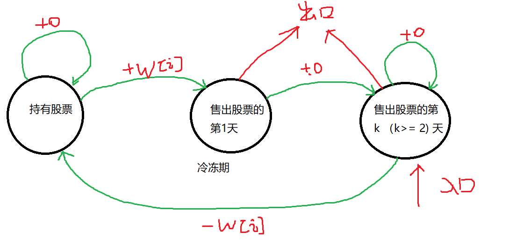

# 状态机模型
状态机可以简化为一系列有序的动作序列，状态机的题目的显著特点是：通常它着重描述的是一个过程，而不是一个结果。
如果学过语音HMM的同学肯定知道，HMM解码中经常要使用到前向后向的动态规划算法，所以状态机的算法思想也非常重要。

### 相邻节点之间不能连续选择
> [大盗阿福](https://www.acwing.com/problem/content/1051/)

题意分析：即相邻的商店不能连续抢劫, 每一个商店都只有被抢和不被抢两种状态。
利用状态机的思想如下图：

- 状态表示： `f[i][0]` 表示从抢完`1~i`号商店，并且当前的最后一个商店`i`没有被抢，`f[i][1]`表示抢完`1~i`号商店，当前最后一个商店i被抢。
- 状态计算：`f[i][0] = max(f[i-1][0], f[i-1][1])`; `f[i][1] = f[i-1][0] + w[i]`
- 属性：max

初始状态：`f[0][0] = 0`
终止状态: `max(f[n][0], f[n][1])`.

```cpp
#include <iostream>
#include <cstring>
#include <algorithm>

using namespace std;

const int N = 100010;
int f[N][2], a[N];

int main()
{
    int t;
    scanf("%d", &t);
    for (int i = 0; i < t; i ++ ){
        int n;
        scanf("%d", &n);
        // 这里状态机入口的设置也比较重要，因为状态机的虚拟入口只能是f[0][0].不能选择虚拟物品0.
        // f[0][0] = 0， f[0][1]不存在，f[0][1] = 负无穷（在取最大值时为不存在）
        f[0][0] = 0, f[0][1] = -0x3f3f3f3f;
        for (int j = 1; j <= n; j ++){
            scanf("%d", &a[j]);
            f[j][1] = f[j-1][0] + a[j];
            f[j][0] = max(f[j-1][1], f[j-1][0]);
        }
        int res = max(f[n][1], f[n][0]);
        printf("%d\n", res);
    }
    return 0;
}
```


滚动数组节省空间的做法：

```cpp
#include <iostream>
#include <cstring>
#include <algorithm>

using namespace std;

const int N = 100010;
int f[2], a[N];

int main()
{
    int t;
    scanf("%d", &t);
    for (int i = 0; i < t; i ++ ){
        int n;
        scanf("%d", &n);
        f[0] = 0, f[1] = -0x3f3f3f3f;
        for (int j = 1; j <= n; j ++){
            scanf("%d", &a[j]);
            // 注意这里要保留上一层的f[1], 否则f[1]会在下一句被修改。
            int temp = f[1];
            f[1] = f[0] + a[j];
            // 这里的f[0] = max(f[1], f[0]), max()的参数都是针对上一层的值。
            f[0] = max(temp, f[0]);
        }
        int res = max(f[1], f[0]);
        printf("%d\n", res);
    }
    return 0;
}
```


### 股票买卖

> [股票买卖](https://www.acwing.com/problem/content/description/1059/)

给定一个长度为 N 的数组，数组中的第 i 个数字表示一个给定股票在第 i 天的价格。

设计一个算法来计算你所能获取的最大利润，你最多可以完成 k 笔交易。

注意：你不能同时参与多笔交易（你必须在再次购买前出售掉之前的股票）。一次买入卖出合为一笔交易。

范围： $  1 <= N <= 10^5 , 1<=k<=100$, 时空限制：1s / 128MB;

输入示例：

```
3 2
2 4 1
```

输出示例：

```
2
```


- 题意分析：

任意一天的状态为: `f[i][j][0]`（表示已经到了第`i`天，正在进行第`j`次交易，0表示目前手中没有股票）；或者`f[i][j][1]`（表示已经到了第`i`天，正在进行第`j`次交易，1表示目前手中有股票（待售出））

状态图如下：


状态计算： `f[i][j][0] = max(f[i-1][j][0], f[i-1][j][1] + a[i])`;  (两条转移路径取最大值)
`f[i][j][1] = max(f[i-1][j][1], f[i-1][j-1][0] - a[i]);`

初始状态： `f[0 ~ n][0][0]`， 表示每天的股票数，没有经过交易，价值都为0. 其余都设置为负无穷，负无穷表示初始非法或者待计算的值。

终止状态： `f[n][1~K][0]`， 由于不一定需要将所有的交易次数全部使用完, 所以终止状态要选择这其中的最大值。

注意：可能有人对于状态的疑问在于`f[0][1 ~ K][0 or 1]`表示什么意思呢？  这实际上可以看成在第0天交易了k次，不断在当天买入和卖出（这也是有实际含义的）

```cpp
#include <iostream> 
#include <cstring>
#include <algorithm>

using namespace std;

const int N = 1e5 + 10, K = 110;
int a[N], f[N][K][2];
int n, k;
int main()
{
    scanf("%d%d", &n, &k);
    for (int i = 1; i <= n; i ++)    scanf("%d", &a[i]);
    
	// 初始化
    memset(f, -0x3f, sizeof(f));
    for (int i = 0; i <= n; i ++)   f[i][0][0] = 0;
    
    for (int i = 1; i <= n; i ++){
        // 交易次数最少从1开始，否则数组越界，产生不符合预期的结果。
        for (int j = 1; j <= k; j ++){
            f[i][j][0] = max(f[i-1][j][0], f[i-1][j][1] + a[i]);
            f[i][j][1] = max(f[i-1][j][1], f[i-1][j-1][0] - a[i]);
        }
    }
    
    int res = 0;
    for (int i = 1; i <= k; i ++)   res = max(res, f[n][i][0]);
    cout << res << endl;
    return 0;
}
```


观察到`f[i][j][0 or 1]`都之和`f[i-1][j][0 or 1]`有关，所以可以进行滚动数组求解，节省空间速度。

```cpp
#include <iostream> 
#include <cstring>
#include <algorithm>

using namespace std;

const int N = 1e5 + 10, K = 110;
int a[N], f[K][2];
int n, k;
int main()
{
    scanf("%d%d", &n, &k);
    for (int i = 1; i <= n; i ++)    scanf("%d", &a[i]);
    

    memset(f, -0x3f, sizeof f);
    f[0][0] = 0;
    
    for (int i = 1; i <= n; i ++){
        // 倒着求解和顺着求解这里都可以，是因为res是在一个范围内求最大值
        // 如果是背包问题中f[n][k]那种，一定得倒着求。
        for (int j = k; j >= 1; j --){
            f[j][0] = max(f[j][0], f[j][1] + a[i]);
            f[j][1] = max(f[j][1], f[j-1][0] - a[i]);
        }
    }
    
    int res = 0;
    for (int i = 1; i <= k; i ++)   res = max(res, f[i][0]);
    cout << res << endl;
    
    return 0;
}
```


#### Leetcode 股票交易，但是只交易一次

> [121买卖股票的最佳时机](https://leetcode.cn/problems/best-time-to-buy-and-sell-stock/)

给定一个数组 prices ，它的第 i 个元素 prices[i] 表示一支给定股票第 i 天的价格。

你只能选择 **某一天** 买入这只股票，并选择在 **未来的某一个不同的日子** 卖出该股票。设计一个算法来计算你所能获取的最大利润。

返回你可以从这笔交易中获取的最大利润。如果你不能获取任何利润，返回 0 。

- $1 <= prices.length <= 10^5$

- 0 <= prices[i] <= $10^4$

示例：

```
输入：[7,1,5,3,6,4]
输出：5
解释：在第 2 天（股票价格 = 1）的时候买入，在第 5 天（股票价格 = 6）的时候卖出，最大利润 = 6-1 = 5 。
     注意利润不能是 7-1 = 6, 因为卖出价格需要大于买入价格；同时，你不能在买入前卖出股票。
```

分析：

由于只要求交易一次，先买入后卖出，那么实际上，要求的是数组中后一个数latter与前一个数before的最大差值。

所以可以用一个数，来记录读取到当前下标下的值里的最小值，并且不断更新它。

```cpp
class Solution {
public:
    int maxProfit(vector<int>& prices) {
        int res = 0;
        for (int i = 0, min_p = INT_MAX; i < prices.size(); i ++){
            res = max(res, prices[i] - min_p);
            min_p = min(min_p, prices[i]);
        }
        return res;
    }
};
```


#### Leetcode 不限制交易次数，但是同时只能持有一只股票

> [122买卖股票的最佳时机2](https://leetcode.cn/problems/best-time-to-buy-and-sell-stock-ii/)

不限制交易次数，但是只能持有一只股票。

```
输入：prices = [7,1,5,3,6,4]
输出：7
解释：在第 2 天（股票价格 = 1）的时候买入，在第 3 天（股票价格 = 5）的时候卖出, 这笔交易所能获得利润 = 5 - 1 = 4 。
     随后，在第 4 天（股票价格 = 3）的时候买入，在第 5 天（股票价格 = 6）的时候卖出, 这笔交易所能获得利润 = 6 - 3 = 3 。
     总利润为 4 + 3 = 7 。
```

同样采用状态机模型，由于不限制交易次数，所以枚举交易次数的那个循环可以删掉。

**注意初始化**：状态机模型的初始化必须要找到状态机的入口和出口在哪。入口设置为0，非入口全部初始化为负无穷，表示非法。

```cpp
const int N = 3e4 + 10;
class Solution {
public:
    int f[N][2];
    int maxProfit(vector<int>& prices) {
        // 这里直接修改了参数prices, 提前加一个-1方便动态规划的推导
        // 写工程问题prices最好还是不要更改
        int n = prices.size();
        prices.insert(prices.begin(), -1);
        memset(f, -0x3f, sizeof(f));
        // 入口：未持有股票的时候
        for (int i = 0; i <= n; i ++)   f[i][0] = 0;
        int res = 0;
        for (int i = 1; i <= n; i ++){
            f[i][1] = max(f[i-1][1], f[i-1][0] - prices[i]);
            f[i][0] = max(f[i-1][0], f[i-1][1] + prices[i]);
        }

        res = max(res, f[n][0]);
        return res;
    }
};
```


#### 含有冷冻期

> [309含冷冻期](https://leetcode.cn/problems/best-time-to-buy-and-sell-stock-with-cooldown/)

给定一个整数数组prices，其中第  prices[i] 表示第 i 天的股票价格 。

设计一个算法计算出最大利润。在满足以下约束条件下，你可以尽可能地完成更多的交易（多次买卖一支股票）:

卖出股票后，你无法在第二天买入股票 (即冷冻期为 1 天)。
注意：你不能同时参与多笔交易（你必须在再次购买前出售掉之前的股票）

```
输入: prices = [1,2,3,0,2]
输出: 3 
解释: 对应的交易状态为: [买入, 卖出, 冷冻期, 买入, 卖出]
```

- 题意分析：同样采用状态机模型，但是由于加入了冷冻期，原来的“持有”和“非持有”状态就显得不够用，需要额外添加。示意图如下：



状态表示：

1. `f[i][0]`: 表示持有股票。

2. `f[i][1]`: 表示售出股票的第一天。
3. `f[i][2]`: 表示售出股票的第k(k >= 2)天。

状态计算：

`f[i][0] = max(f[i-1][0], f[i-1][2] - w[i]);`

`f[i][1] = f[i-1][0] + w[i];`

`f[i][2] = max(f[i-1][1], f[i-1][2])`

状态初始化：

入口设置为0， 非入口初始化为负无穷：`f[0][2] = 0`, `f[0][0] = f[0][1] = -0x3f3f3f3f`;

终止状态：

`max(f[n][1], f[n][2])`

```cpp
const int N = 5010;
class Solution {
public:
    int f[N][3];
    int maxProfit(vector<int>& prices) {
        int n = prices.size();
        vector<int> w = vector<int> (n + 1, -1);
        copy(prices.begin(), prices.end(), w.begin() + 1);

        f[0][2] = 0; 
        f[0][1] = f[0][0] = -0x3f3f3f3f;

        for (int i = 1; i <= n; i ++){
            f[i][0] = max(f[i-1][0], f[i-1][2] - w[i]);
            f[i][1] = f[i-1][0] + w[i];
            f[i][2] = max(f[i-1][2], f[i-1][1]);
        }

        return max(f[n][1], f[n][2]);
    }
};
```


#### 含有手续费

> [714股票买卖带手续费](https://leetcode.cn/problems/best-time-to-buy-and-sell-stock-with-transaction-fee/)

每一次交易额外有手续费需要扣除，实际上只要在收益上减去手续费即可。

```
const int N = 5e4 + 10;
class Solution {
public:
    int f[N][2];
    int maxProfit(vector<int>& prices, int fee) {
        int n = prices.size();
        prices.insert(prices.begin(), -1);
        memset(f, -0x3f, sizeof(f));
        for (int i = 0; i <= n; i ++)   f[i][0] = 0;
        int res = 0;
        for (int i = 1; i <= n; i ++){
            f[i][1] = max(f[i-1][1], f[i-1][0] - prices[i]);
            // 减去手续费
            f[i][0] = max(f[i-1][0], f[i-1][1] + prices[i] - fee);
        }

        res = max(res, f[n][0]);
        return res;
    }
};
```

