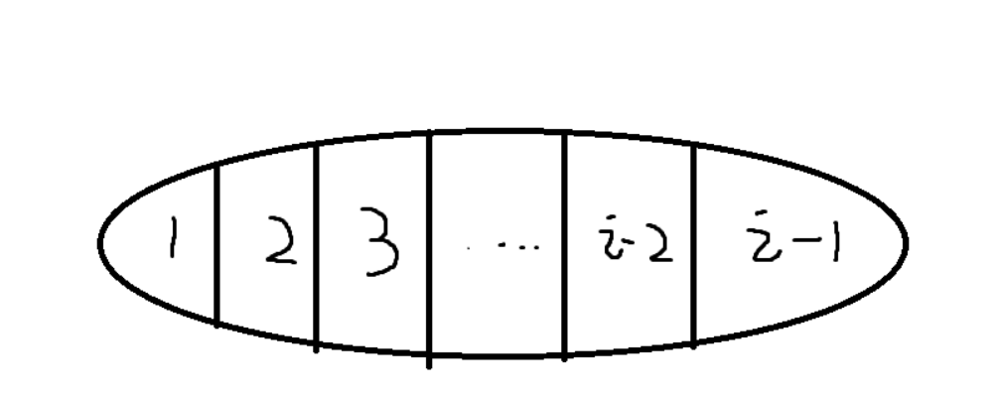
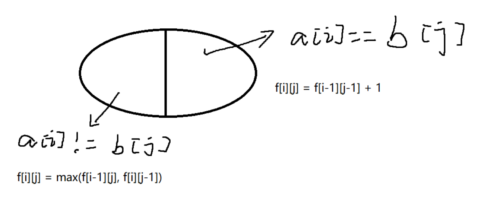
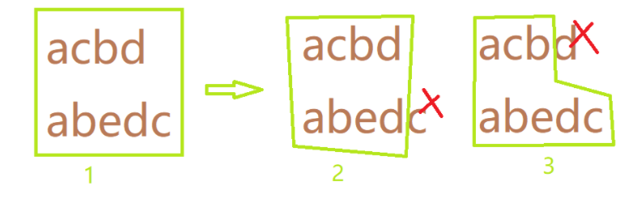
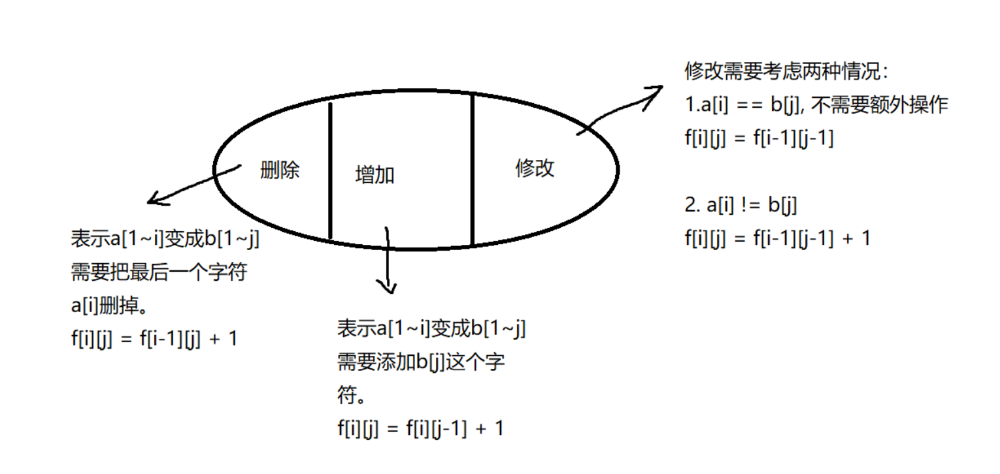

# 线性DP问题

线性DP问题，往往指那些，存在一个模糊的从前往后（从后往前），从小到大的某个顺序进行递推的DP问题。

### 例题1：数字三角形

给定一个如下图所示的数字三角形，从顶部出发，在每一结点可以选择移动至其左下方的结点或移动至其右下方的结点，一直走到底层，要求找出一条路径，使路径上的数字的和最大。

```
        7
      3   8
    8   1   0
  2   7   4   4
4   5   2   6   5
```

#### 输入格式

第一行包含整数 n，表示数字三角形的层数。

接下来 n 行，每行包含若干整数，其中第 i 行表示数字三角形第 i 层包含的整数。

#### 输出格式

输出一个整数，表示最大的路径数字和。

#### 数据范围

1≤n≤500
−10000≤三角形中的整数≤10000

#### 输入样例：

```
5
7
3 8
8 1 0 
2 7 4 4
4 5 2 6 5
```

#### 输出样例：

```
30
```


#### 解答和思路：

* 状态的表示：`f[i][j]`，其中`i`,`j`表示走到第i层，第j个数字为止的所有路径的集合；
  * 属性：max属性，路径和的最大值。
* 状态的计算：

`f[i][j] = max(f[i-1][j-1] , f[i-1][j]) + t[i][j]`

要考虑下一层的很多边界问题，如三角形的最左边和最右边的路径，只有一条。

```c++
#include<bits/stdc++.h>

using namespace std;

const int N = 510;

int t[N][N];

int f[N][N];
int n;

int main(){
    cin >> n;
    
    for(int i = 1; i <= n; i ++){
        for(int j = 1; j <= i; j++){
            cin >> t[i][j];
        }
    }
    // 初始边界
    f[1][1] = t[1][1];
    
    for(int i = 2; i <= n ; i ++){
        for(int j = 1; j <= i; j++){
            if( j == 1 ){
                f[i][j] = f[i-1][j] + t[i][j];
                continue;
            }   
            if( j == i){
                f[i][j] = f[i-1][j-1] + t[i][j];
                continue;
            } 
            f[i][j] = max(f[i-1][j-1] , f[i-1][j]) + t[i][j];
        }
    }
    // 用来debug的    
    // for(int i = 1; i <= n; i ++){
    //     for(int j = 1; j <= i; j ++){
    //         cout << f[i][j] << " ";
    //     }
    //     cout << endl;
    // }
    
    int res = -1e9;
    for(int i = 1; i <= n; i++)
        res = max(res, f[n][i]);
            
    cout << res << endl;
    
    return 0;
    
    
}
```


使用一维滚动数组，减小空间复杂度；


```c++
#include<bits/stdc++.h>

using namespace std;

const int N = 510;

int t[N][N];

int f[N];
int n;

int main(){
    cin >> n;
    
    for(int i = 1; i <= n; i ++){
        for(int j = 1; j <= i; j++){
            cin >> t[i][j];
        }
    }
    
    f[1] = t[1][1];
    
    for(int i = 2; i <= n ; i ++){
        for(int j = i; j >= 1; j--){
            if( j == 1 ){
                f[j] = f[j] + t[i][j];
                continue;
            }   
            if( j == i){
                f[j] = f[j-1] + t[i][j];
                continue;
            } 
            f[j] = max(f[j-1] , f[j]) + t[i][j];
        }
    }
        
    
    int res = -1e9;
    for(int i = 1; i <= n; i++)
        res = max(res, f[i]);
            
    cout << res << endl;
    
    return 0;
    
    
}
```


**倒着求路径，缩短了代码行数，少了边界的特判。这种思路非常妙！**

```c++
#include<bits/stdc++.h>
using namespace std;

const int N=510;
int f[N][N];
int n;

int main(){
    cin>>n;
    for(int i=1 ; i<=n; i++){
        for(int j=1; j<=i; j++){
            cin>>f[i][j];
        }
    }

    for(int i=n;i>=1;i--){
        for(int j=i;j>=1;j--){
            f[i][j]=max(f[i+1][j],f[i+1][j+1])+f[i][j];
        }
    }
    cout<<f[1][1]<<endl;
    return 0;
}
```


### 例题2： 最长上升子序列

给定一个长度为 N 的数列，求数值严格单调递增的子序列的长度最长是多少。

#### 输入格式

第一行包含整数 N。

第二行包含 N 个整数，表示完整序列。

#### 输出格式

输出一个整数，表示最大长度。

#### 数据范围

1≤N≤1000
$−10^9≤数列中的数≤10^9$

#### 输入样例：

```
7
3 1 2 1 8 5 6
```

#### 输出样例：

```
4
```


#### 思路与解答：

样例中的4，是由`1,2,5,6`四个数组成。

* 状态表示：`f[i]`，表示以下标`i`结尾的所有子序列的集合。

  * 属性：max，`f[i]=x`，x为最长的子序列。

* 状态计算：（状态的计算要求能够计算之前的每一个状态，递推到现在的状态）

  

每一个`f[i]`都可以分解到前`i-1`个状态，所以`j = 1 ~ i-1`, 当`a[i] > a[j]`时，`f[i] = max(f[j] + 1)`, 时间复杂度为$O(n^2)$

```c++
#include<bits/stdc++.h>

using namespace std;

const int N = 1010;

int f[N], a[N];
int n;
int main(){
    scanf("%d", &n);

    for(int i = 1; i <=n; i ++){
        scanf("%d", &a[i]);
    }

    // 从前往后枚举每一个数组中的下标
    for(int i = 1; i <= n; i ++){
        f[i] = 1;  // 只有a[i]一个数，长度是1，这种情况出现在a[i]比之前的数都小的情况
        // 遍历它之前的每一个数
        for(int j = 1; j < i; j++){
            if(a[j] < a[i]){
                f[i] = max(f[i], f[j] + 1);
            }
        }
    }

    int res = 0;
    for(int i = 1; i <= n; i ++)    res = max(res, f[i]);

    cout << res << endl;

    return 0;
}
```


#### 优化版本的：

实际上，上述的时间复杂度可以做进一步的优化。

比如样例这`3 1 2 1 8 5 6`, 当我们从3看到1时，明显可以知道，虽然两者的`f[]`数组结果都为1，但是后续的数字如果接到1后面，可能达到的长度会更大。那么3实际上就没有意义了，可以将其排除掉不考虑。

因此我们可以把这个‘上升子序列’存在一个数组中，它是严格保持单调递增的，每当来一个数字a，我们就和这个子序列数组的最大一个数字（最后一个数字）进行比较，如果比它大，那么直接放在这个子序列数组的后面；反之，找到这个子序列数组里大于等于a的第一个数，并将其替换掉。

> 注意：这里子序列中的数，并不代表最终的最长上升子序列；而是基于一种贪心的思想：对于同样长度的递增子串，如果它的末尾越小，则它可能达到的长度就越长。这就是为什么要替换的原因。
>
> 例子: 数据是1 3 6 2 8 9， 最长上升子序列明显是 1 3 6 8 9， 但是严格单调的数组最终里保存的是1 2 6 8 9， 但是数组的长度表示的是最长子序列的长度。


```c++
#include <bits/stdc++.h>

using namespace std;
int main(){
    int n;
    cin >> n;
    vector<int> a(n);
    for(int i = 0; i < n; i ++)
        scanf("%d", &a[i]);

    vector<int> stk;
    stk.push_back(a[0]);
    for(int i = 1; i < n; i ++){
        if(a[i] > stk.back())
            stk.push_back(a[i]);
        else{
            *lower_bound(stk.begin(), stk.end(), a[i]) = a[i];	  
        }
    }

    cout << stk.size() << endl;
    return 0;
}
```


### 例题3 ： 最长公共子序列

给定两个长度分别为 N 和 M 的字符串 A 和 B，求既是 A 的子序列又是 B 的子序列的字符串长度最长是多少。

#### 输入格式

第一行包含两个整数 N 和 M。

第二行包含一个长度为 N 的字符串，表示字符串 A。

第三行包含一个长度为 M 的字符串，表示字符串 B。

字符串均由小写字母构成。

#### 输出格式

输出一个整数，表示最大长度。

#### 数据范围

1≤N,M≤1000

#### 输入样例：

```
4 5
acbd
abedc
```

#### 输出样例：

```
3
```


#### 思路和解答：

解决DP问题的通用思路：

- 状态表示：`f[i][j]`, `i`表示A字符串以下标`i`结尾， `j`表示B字符串以下标`j`结尾； 属性是max，即所有以`i`下标为结尾的A串与，以`j`下标为结尾的B串的公共子序列的长度的最大值。
- 状态计算：画图



为什么当`a[i] != b[j]` 时， `f[i][j] = max(f[i-1][j],  f[i][j-1] )`? 



比如我们看上面这个序列，将最后的结果分解成子问题，a串最后一个字符`d` != `c`, 那么只有可能出现两种情况：1. b串最后一个字符`c`不在最长公共子序列（答案序列）中，将其排除； 2. a串最后一个字符`d`不在最长公共子序列中，将其排除。 

即状态1只能分成状态2，或者状态3；将其取最大值即可！


```c++
#include <bits/stdc++.h>

using namespace std;

const int N = 1010;

char a[N], b[N];
int n,m;
int f[N][N];

int main(){
    cin >> n >> m >> a + 1 >> b + 1;
    
    for(int i = 1; i <= n; i ++){
        for(int j = 1; j <= m; j++){
            if(a[i] == b[j])    f[i][j] = f[i-1][j-1] + 1;
            else{
                f[i][j] = max(f[i-1][j], f[i][j-1]);
            }
        }
    }
    cout << f[n][m]<<endl;
    
    return 0;
}
```


### 例题4：最少编辑距离

给定两个字符串 A 和 B，现在要将 A 经过若干操作变为 B，可进行的操作有：

1. 删除–将字符串 A 中的某个字符删除。
2. 插入–在字符串 A 的某个位置插入某个字符。
3. 替换–将字符串 A 中的某个字符替换为另一个字符。

现在请你求出，将 A 变为 B 至少需要进行多少次操作。

#### 输入格式

第一行包含整数 n，表示字符串 A 的长度。

第二行包含一个长度为 n 的字符串 A。

第三行包含整数 m，表示字符串 B 的长度。

第四行包含一个长度为 m 的字符串 B。

字符串中均只包含大写字母。

#### 输出格式

输出一个整数，表示最少操作次数。

#### 数据范围

1≤n,m≤1000

#### 输入样例：

```
10 
AGTCTGACGC
11 
AGTAAGTAGGC
```

#### 输出样例：

```
4
```


#### 思路与解答：

- 状态表示：`f[i][j]`表示的集合是，所有将a[1] ~ a[i] 变成 b[1] ~ b[j] 的所有操作方式。
  - 属性： min, 即所有操作方式中操作次数的最小值。（注意： 动态规划之所以比暴搜快，是因为它将很多情况汇聚成了一种表示方式）
- 状态计算（画图）：我们往往从大的问题往前找，这样的思路是分解成小的问题

因为所有的操作就三种，所以可以将状态划分成三部分：




```c++
#include<bits/stdc++.h>

using namespace std;

const int N = 1010;
char a[N],b[N];
int f[N][N];
int n,m;
int main(){
    cin >> n >> a + 1 >> m >> b + 1;
    
    // 边界初始化
    // 如果想让a串从0开始与b串相同，需要做i次添加操作
    for(int i = 0; i <=m; i ++) f[0][i] = i;
    
    // 如果想让a串从n开始与b串相同，需要做i次删除操作
    for(int i = 0; i <= n; i ++)    f[i][0] = i;
    
    for(int i = 1; i <= n; i ++){
        for(int j = 1; j <= m; j ++){
            // 删除、增加两项操作中的最小值
            f[i][j] = min(f[i-1][j] + 1, f[i][j-1] + 1);
            // 如果最后a[i] == b[j]，那么不需要替换操作
            if(a[i] == b[j]){
                f[i][j] = min(f[i][j], f[i-1][j-1]);
            }else{
                f[i][j] = min( f[i][j], f[i-1][j-1] + 1);
            }
        }
    }
    
    printf("%d\n", f[n][m]);
    
    
    return 0;
    
}
```


编辑距离的应用：

```c++
#include<bits/stdc++.h>

using namespace std;

const int N = 15, M = 1010;

int n, m;
int f[N][N];
char str[M][N];

int edit_distance(char a[], char b[])
{
    int la = strlen(a + 1), lb = strlen(b + 1);

    for (int i = 0; i <= lb; i ++ ) f[0][i] = i;
    for (int i = 0; i <= la; i ++ ) f[i][0] = i;

    for (int i = 1; i <= la; i ++ )
        for (int j = 1; j <= lb; j ++ )
        {
            f[i][j] = min(f[i - 1][j] + 1, f[i][j - 1] + 1);
            if(a[i] == b[j])
                f[i][j] = min(f[i][j], f[i-1][j-1]);
            else
                f[i][j] = min(f[i][j], f[i - 1][j - 1] + 1);
        }

    return f[la][lb];
}

int main()
{
    scanf("%d%d", &n, &m);
    for (int i = 0; i < n; i ++ ) scanf("%s", str[i] + 1);

    while (m -- )
    {
        char s[N];
        int limit;
        scanf("%s%d", s + 1, &limit);

        int res = 0;
        for (int i = 0; i < n; i ++ )
            if (edit_distance(str[i], s) <= limit)
                res ++ ;

        printf("%d\n", res);
    }

    return 0;
}

```


### Leetcode96 不同的二叉搜索树

给你一个整数 `n` ，求恰由 `n` 个节点组成且节点值从 `1` 到 `n` 互不相同的 **二叉搜索树** 有多少种？返回满足题意的二叉搜索树的种数。

**样例：**

```
输入：3
输出：5
解释：
给定 n = 3, 共有5种不同的二叉搜索树，如下所示：

   1         3     3      2      1
    \       /     /      / \      \
     3     2     1      1   3      2
    /     /       \                 \
   2     1         2                 3
```

- `1 <= n <= 19`

#### 思路与解答：

可以注意到，`1-10`数字组成的二叉搜索树的种数实际上和`2-11`数字组成的二叉搜索树的种数是一致的。所以实际上二叉搜索树的个数并不需要考虑树中节点的数值具体是多少，而是只需要考虑结点数值之间的相对关系就可以了。

- 状态集合：`f[i]`表示长度为`i`的区间所能表示的二叉搜索树的所有集合。
  - 属性是count。
- 状态计算：


当在区间`[L, R]`里选择结点K作为树的根节点时，`[L, K-1]`区间都可以作为根节点的左子树，`[K+1 , R]` 区间都可以作为根节点的右子树。那么以K作为根节点的所有二叉搜索树 的种数 = 左边区间的所有种数 $\times$ 右边区间的所有种数

```c++

class Solution {
public:
    int numTrees(int n) {
        vector<int> f(n + 1, 0);
        // 初始化边界
        f[0] = 1;
        for(int i = 1; i <= n; i++){
            // 第一层循环，枚举区间长度
            for(int j = 1; j <= i; j++){
                // 第二层循环，枚举位于区间内，以j结点为根节点的所有二叉搜索树的种数
                f[i] += f[j - 1] * f[i - j]; 
            }
        }
        return f[n];
    }
};
```


### Leetcode 1866 

[1866. 恰有 K 根木棍可以看到的排列数目 - 力扣（LeetCode） (leetcode-cn.com)](https://leetcode-cn.com/problems/number-of-ways-to-rearrange-sticks-with-k-sticks-visible/)

有 n 根长度互不相同的木棍，长度为从 1 到 n 的整数。请你将这些木棍排成一排，并满足从左侧 可以看到 恰好 k 根木棍。从左侧 可以看到 木棍的前提是这个木棍的 **左侧** 不存在比它 **更长的** 木棍。

例如，如果木棍排列为 [1,3,2,5,4] ，那么从左侧可以看到的就是长度分别为 1、3 、5 的木棍。
给你 n 和 k ，返回符合题目要求的排列 数目 。由于答案可能很大，请返回对 $10^9 + 7$ 取余 的结果。

```
输入：n = 3, k = 2
输出：3
解释：[1,3,2], [2,3,1] 和 [2,1,3] 是仅有的能满足恰好 2 根木棍可以看到的排列。


输入：n = 5, k = 5
输出：1
解释：[1,2,3,4,5] 是唯一一种能满足全部 5 根木棍可以看到的排列。
```


#### 思路与解答

- 状态表示：
  - 用`f[n][k]`来表示有n根木棍，恰好可以看到k根木棍的所有方案。
  - 属性： count，方案数。
- 状态计算：

从最后一根开始思考：


```c++
typedef long long LL;
const int N = 1010, mod = 1e9 + 7;
class Solution {
public:
    int f[N][N];
    int rearrangeSticks(int n, int k) {
        memset(f, 0 , sizeof f);
        for(int i = 1; i <= n; i ++)    f[i][i] = 1;

        for(int i = 2; i <= n; i ++)
            for(int j = 1; j <= i - 1; j ++)
                f[i][j] = (f[i-1][j-1] + (LL)(i - 1) * f[i-1][j] % mod) % mod;

        return f[n][k];
    }
};
```

