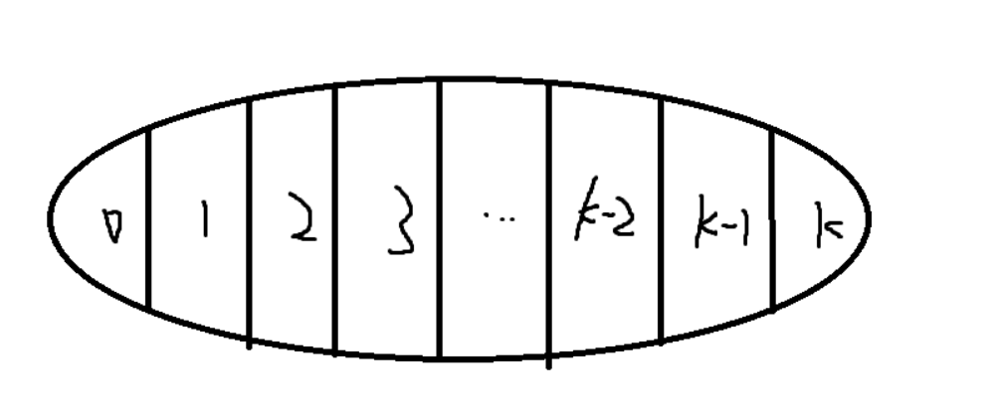

## 背包问题

所有的DP问题都要归结成2点：

* 如何表示状态：如果使用二维数组f\[i\][j]来表示状态，需要考虑清楚i,j表示什么，即每个状态的含义时什么。需要几维来表示一个状态。数组f\[][]表示的属性是什么？通常属性有max, min, count三种。

- 状态的计算： 如何一步步推导出最后的计算结果。


### 01背包问题

给定N个物品，它们的体积是$V_i$, 价格是$W_i$，**每个物品只能使用一次（可以不用）**。 

我们需要找一些物品，它们的体积之和是小于背包容量的，求能够获得的最大价值是多少？


例题：

有 N 件物品和一个容量是 V 的背包。每件物品只能使用一次。

第 i件物品的体积是 $v_i$，价值是 $w_i$。

求解将哪些物品装入背包，可使这些物品的总体积不超过背包容量，且总价值最大。
输出最大价值。

#### 输入格式

第一行两个整数，N，V，用空格隔开，分别表示物品数量和背包容积。

接下来有 N行，每行两个整数 $v_i,w_i$，用空格隔开，分别表示第 ii 件物品的体积和价值。

#### 输出格式

输出一个整数，表示最大价值。

#### 数据范围

0<N,V≤1000,
$0<v_i,w_i≤1000$

#### 输入样例

```
4 5
1 2
2 4
3 4
4 5
```

#### 输出样例：

```
8
```


#### 解答与思路：

解答最开始的两个问题: 

如何表示状态：使用一个二维数组`f[i][j]`来表示状态，其中`i`表示从`1~i`的物品中选择，不涉及大于序号`i`的物品；`j`表示物品的总体积不超过`j`。`f[i][j] = x`, x表示当从`1~i`个物品中挑选，并且总体积不超过`j`的最大价值是多少，显然是`max`属性。

如何进行推导？

我们可以把任何一个状态`f[i][j]`分成两个部分： 

1. 如果这个max状态里，不包含第`i`个物品，那么`f[i][j] = f[i-1][j]`;
2. 如果这个max状态，包含第`i`个物品，那么`f[i][j] = f[i-1][j - v[i]] + w[i]`；

所以结合在一起，取最大值，`f[i][j] = max(f[i-1][j] , f[i-1][j-v[i]] + w[i] )`.


```c++
#include <bits/stdc++.h>

using namespace std;

const int N = 1010;
// n 表示n件物品,m表示背包的总容积
int n,m;
// v来存放不同物品的体积，w来存放不同物品的价值
int v[N], w[N];
// f来存储状态
int f[N][N];

int main(){
    cin >> n >> m;
    for(int i = 1; i <= n; i ++){
        cin >> v[i] >> w[i];
    }
    // 由于f定义在全局变量中，初始化各个值都为0
    // 当i=0,表示从没有物品中选,f的值一定都是0
    for(int i = 1; i <= n; i++){
        for(int j = 0; j <= m; j ++){
            // 即当不选第i个物品时
            f[i][j] = f[i-1][j];
            // 当背包空间足够放第i个物品时
            if( j >= v[i])  f[i][j] = max(f[i][j], f[i - 1][ j - v[i]] + w[i]);
        }
    }
    cout << f[n][m] << endl;
    return 0;
}
```


接下来，我们又发现，`f[i][j]`的变化，只与`f[i-1]`层有关系，和之前的层都没有关系，所以可以用滚动数组做。

```c++
#include <bits/stdc++.h>

using namespace std;

const int N = 1010;
// n 表示n件物品,m表示背包的总容积
int n,m;
// v来存放不同物品的体积，w来存放不同物品的价值
int v[N], w[N];
// f来存储状态
int f[N][N];

int main(){
    cin >> n >> m;
    for(int i = 1; i <= n; i ++){
        cin >> v[i] >> w[i];
    }
    // 由于f定义在全局变量中，初始化各个值都为0
    // 当i=0,表示从没有物品中选,f的值一定都是0
    for(int i = 1; i <= n; i++){
        for(int j = m; j >= v[i]; j--)
 //     for(int j = v[i]; j <= m; j ++){        
            // 即当不选第i个物品时
            // f[j] = f[j]; 恒等式，所以可以删掉
            
            // 当背包空间足够放第i个物品时
            // if( j >= v[i])  f[i][j] = max(f[i][j], f[i - 1][ j - v[i]] + w[i]); 由于j >= v[i]， 循环才有意义，
            // 所以可以更改循环的初始值 为 j = v[i], 但是，又因为j - v[i] < j的， 如果直接删去第一维，那么f[j-v[i]] = f[i][j-v[i]]，
            // 是已经被计算过的。
            // 但是实际上我们计算的是f[i-1][j-v[i]], 如果我们倒着遍历j，那么计算f[j-v[i]] + w[i]时，f[j-v[i]]的数值是原来上一层的数据
            f[j] = max(f[j], f[j - v[i]] + w[i]); 
            
        }
    }
    cout << f[n][m] << endl;
    return 0;
}
```


---


### 完全背包

特点：**每件物品有无限个，只要能拿可以随便拿。**

例题：

有 N 种物品和一个容量是 V 的背包，每种物品都有无限件可用。

第 i 种物品的体积是 $v_i$，价值是 $w_i$。

求解将哪些物品装入背包，可使这些物品的总体积不超过背包容量，且总价值最大。
输出最大价值。

#### 输入格式

第一行两个整数，N，V，用空格隔开，分别表示物品种数和背包容积。

接下来有 N 行，每行两个整数 $v_i,w_i$，用空格隔开，分别表示第 i 种物品的体积和价值。

#### 输出格式

输出一个整数，表示最大价值。

#### 数据范围

0<N,V≤1000
$0<v_i,w_i≤1000$

#### 输入样例

```
4 5
1 2
2 4
3 4
4 5
```

#### 输出样例：

```
10
```


#### 解答与思路：

关于“如何表示状态？”这个问题，与01背包问题一致，都是用两维数据来表示当前的状态，并且数组的属性也是Max属性。

区别在于状态的计算上：

由于完全背包问题的特点是，物品数量的无限的，只要体积可以拿就行；所以我们可以将状态`f[i][j]`拆分：




把第`i`个物品拆分成：拿取0次，拿取1次，拿取2次... 拿取k次；

如k=0,则`f[i][j] = f[i-1][j]`, 遍历k，得到的公式是`f[i-1][j-k*v[i]] + k * w[i]`.

朴素解法的`f[i][j] = max(f[i-1][j-k*v[i] + k * w[i])`


$O(n^3)$的暴力做法，会导致`TLE`。

```c++
#include<bits/stdc++.h>

using namespace std;

const int N = 1010;
int n,m;

int f[N][N];
int v[N], w[N];
int main(){
    cin >> n >> m;
    for(int i = 1; i <= n; i ++){
        cin >> v[i] >> w[i];
    }

    for(int i = 1; i <= n; i ++){
        for(int j = 0; j <= m; j ++){
            // 下面这个是 j - k *v >= 0
            for(int k = 0; k * v[i] <= j; k++)
                f[i][j] = max(f[i][j], f[i-1][j - k * v[i]] + k* w[i]);
        }
    }
    
    cout << f[n][m] << endl;
    
    return 0;
}
```


优化时间复杂度的解法, 将三维降低为二维：

我们可以把上面朴素做法的公式拆开：

`f[i][j] = max(f[i-1][j], f[i-1][j-v] + w, f[i-1][j-2v] + 2w , ..)`

`f[i][j-v] = max(        f[i-1][j-v]    , f[i-1][j-2v] + w, ...)`

通过上下两式进行一个比较，可以得到：

`f[i][j] = max(f[i-1][j], f[i][j-v] + w)`

因此可以把第k所在的维度消去。


```c++
#include<bits/stdc++.h>

using namespace std;

const int N = 1010;
int n,m;

int f[N][N];
int v[N], w[N];
int main(){
    cin >> n >> m;
    
    // 背包问题都可以先从i=1开始
    for(int i = 1; i <= n; i ++){
        cin >> v[i] >> w[i];
    }
    
    for(int i = 1; i <= n; i ++){
        for(int j = 0; j <= m; j ++){
            f[i][j] = f[i-1][j];
            if( j >= v[i])  f[i][j] = max(f[i][j], f[i][j-v[i]] + w[i]);
        }
    }
    
    cout << f[n][m] << endl;
    
    return 0;
}
```


继续优化空间的解法：

```c++
#include<bits/stdc++.h>

using namespace std;

const int N = 1010;
int n,m;

int f[N];
int v[N], w[N];
int main(){
    cin >> n >> m;
    
    for(int i = 1; i <= n; i ++){
        cin >> v[i] >> w[i];
    }
    
    for(int i = 1; i <= n; i ++){
        for(int j = v[i]; j <= m; j ++){
            // 这里的f[j-v[i]]实际上是f[i][j-v[i]]，是同一层的，所以
            // 不需要将循环倒过来计算
            f[j] = max(f[j], f[j-v[i]] + w[i]);
        }
    }
    
    cout << f[m] << endl;
    
    return 0;
}
```


---


### 多重背包

每个物品的数量有限制，最多能拿多少个。

例题：

有 N 种物品和一个容量是 V 的背包。

第 i 种物品最多有 $s_i$ 件，每件体积是 $v_i$，价值是 $w_i$。

求解将哪些物品装入背包，可使物品体积总和不超过背包容量，且价值总和最大。
输出最大价值。

#### 输入格式

第一行两个整数，N，V，用空格隔开，分别表示物品种数和背包容积。

接下来有 N 行，每行三个整数 vi,wi,si，用空格隔开，分别表示第 i 种物品的体积、价值和数量。

#### 输出格式

输出一个整数，表示最大价值。

#### 数据范围

0<N,V≤100
$0<v_i,w_i,s_i≤100$

#### 输入样例

```
4 5
1 2 3
2 4 1
3 4 3
4 5 2
```

#### 输出样例：

```
10
```


#### 解答与思路

同样是解决DP问题，从两个问题开始：

状态如何表示：所有的背包问题都用二维数组来表示状态集合，`f[i][j]`， 表示从前`i`件物品中，拿出体积不超过`j`的所有物品； 属性是max属性。即`f[i][j]`中存储的是价值的最大值。

状态的计算：

与完全背包类似，也是将状态可以分成‘k’份 ，`f[i][j] = max(f[i-1][j - k * v[i]] + k * w[i])`

这里的`k`与完全背包不同的是，`k`有限制: `k * v[i] <= j && k <= s[i]`

* 朴素版本的解题为：

这是因为数据量，大约是O(10^6)级别，所以能通过。

```c++
#include<bits/stdc++.h>

using namespace std;

const int N = 110;

int n,m;
int v[N],w[N],s[N];

int f[N][N];

int main(){
    cin >> n >> m;
    for(int i = 1; i <= n; i++){
        cin >> v[i] >> w[i] >> s[i];
    }
    
    // 时间复杂度约为O(n^3)
    for(int i = 1; i <= n; i ++){
        for(int j = 0; j <= m; j++){
            for(int k = 0; k <= s[i] && k *v[i] <= j; k++){				// 这一行的condition要注意
                f[i][j] = max(f[i][j], f[i-1][j - v[i] *k] + k * w[i]);
            }
        }
    }
    
    cout << f[n][m]<< endl;
    
    return 0;
}
```


* 如果数据量进一步增大，为以下数据：

$$
0<N<=1000\\
0<V<=2000\\
0<v_i,w_i,s_i<=2000
$$

如果还按照上面的做法，时间复杂度约为O(10^9), 会超时；

所以需要采用别的方法，降低时间复杂度： 二进制优化打包法。

在第三层for循环里` for(int k = 0; k <= s[i] && k *v[i] <= j; k++){}`, 是枚举了每一个物品的每一项。如果我们将物品按照二进制的方式打包， 如果某个物品总共有11个，那么将其分为1 + 2 + 4 + 4； 这样就只需要枚举4次，原来需要枚举12次（0 ~ 11）；打打减小了枚举次数，而二进制在正整数集上又是完备的，所以这种优化方法非常合理。


```c++
#include<bits/stdc++.h>

using namespace std;

// 这里的N需要计算: N * 12 + 10; 12是因为2000在2^10 ~ 2 ^ 11之间，所以取12；
const int N = 12010, M = 2010;
int v[N], w[N];
int f[M];
int n,m;

int main(){
    scanf("%d%d", &n, &m);
    int cnt = 0;
    for(int i = 1; i <= n; i ++){
        int a,b,s;
        scanf("%d%d%d", &a, &b, &s);
        int k = 1;
        while( k <= s){
            cnt ++;
            v[cnt] = k * a;
            w[cnt] = k * b;
            s -= k;
            k *= 2;
        }
        // 存在s没有枚举完的情况
        if( s > 0){
            cnt ++;
            v[cnt] = a * s;
            w[cnt] = b * s;
        }
    }
    
    // 打包后转化成01背包问题
    n = cnt;
    for(int i = 1; i <= n; i ++){
        for(int j = m; j >= v[i]; j--){
            f[j] = max(f[j], f[j - v[i]] + w[i]);
        }
    }
    cout << f[m] << endl;
    
    
    return 0;
}
```


---


### 分组背包问题

每一组里面，只能选一个互斥的物品

典型例题:

有 N 组物品和一个容量是 V 的背包。

每组物品有若干个，同一组内的物品最多只能选一个。
每件物品的体积是 $v_{ij}$，价值是 $w_{ij}$，其中 i 是组号，j 是组内编号。

求解将哪些物品装入背包，可使物品总体积不超过背包容量，且总价值最大。

输出最大价值。

#### 输入格式

第一行有两个整数 N，V用空格隔开，分别表示物品组数和背包容量。

接下来有 N 组数据：

- 每组数据第一行有一个整数 $S_i$，表示第 i 个物品组的物品数量；
- 每组数据接下来有 $S_i$ 行，每行有两个整数 $v_{ij},w_{ij}$，用空格隔开，分别表示第 i 个物品组的第 j 个物品的体积和价值；

#### 输出格式

输出一个整数，表示最大价值。

#### 数据范围

0<N,V≤100
$0<S_i≤100$
$0<v_{ij},w_{ij}≤100$

#### 输入样例

```
3 5
2
1 2
2 4
1
3 4
1
4 5
```

#### 输出样例：

```
8
```


#### 解答与思路：

同样是解决两个问题：

- 状态的表示：`f[i][j]`
  - 表示的集合意义： 表示从前i组里选物品，并且总体积不超过j的所有集合
  - 属性：max，表示价值的最大值
- 状态的计算：
  - 集合划分：


$f[i][j] = max(f[i-1][j] , f[i-1][j - v[i][k]] + w[i][k])$


```c++
#include<bits/stdc++.h>

using namespace std;

const int N = 110;
int n,m;
// w[i][j]来存储第i组内第j个物品的价值
// v[i][j]来存储第i组内第j个物品的体积
// s[i] 表示第i组里的个数
int w[N][N], v[N][N], s[N];
int f[N];

int main(){
    cin >> n >> m;
    for(int i = 1; i <= n; i++){
        cin >> s[i];
        for(int j = 0; j < s[i]; j++){
            cin >> v[i][j] >> w[i][j];
        }
    }
    
    // 枚举所有的组
    for(int i = 1;i <= n; i++)
    // 背包容量，倒着枚举，因为会出现上一层的情况
        for(int j = m ; j >= 0; j--)
            for(int k = 0; k < s[i]; k ++)
                if( v[i][k] <= j )
                    f[j] = max(f[j], f[j - v[i][k]] + w[i][k]);
        
    cout << f[m] << endl;
    
    return 0;
}
```

