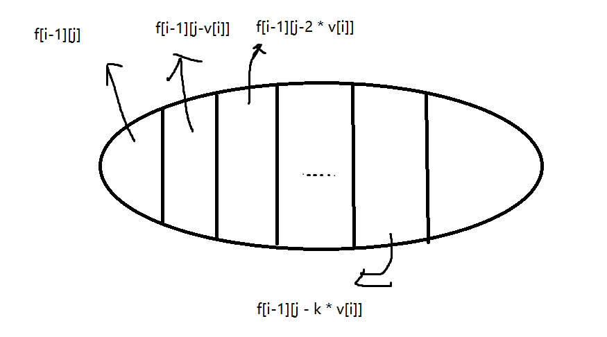
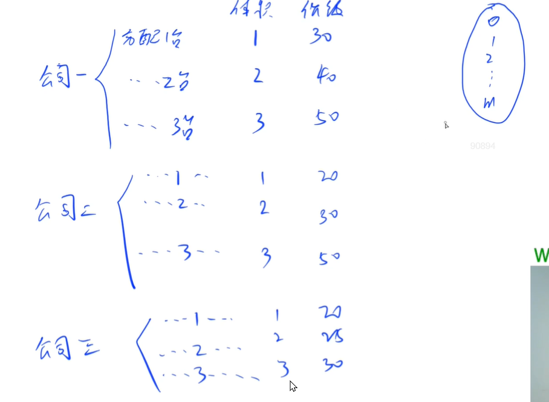

## 背包问题提高拓展

### 装箱问题

> (Acwing提高班装箱问题)[https://www.acwing.com/problem/content/1026/]

有一个箱子容量为 V，同时有 n 个物品，每个物品有一个体积（正整数）。

要求 n 个物品中，任取若干个装入箱内，使箱子的剩余空间为最小。


题意分析：

常见的背包问题中，有体积、价值两个因素，通常要求体积不超过总体积，价值最大；而这里要求，体积不超过总体积，体积最大。

因此可以将一个物品的价值 = 它的体积，利用0-1背包的通用解法来解决。

```c++
#include <iostream>
using namespace std;

const int N = 20010;
int f[N];

int n, m;
int main(){
    cin >> m;
    cin >> n;
    // 这里将体积输入与动态规划计算放在一个for循环里，可以减少对于空间的占用。
    for(int i = 1; i <= n; i ++){
        int v;
        cin >> v;
        for(int j = m; j >= v; j --){
            f[j] = max(f[j], f[j - v] + v);    
        }
    }
    cout << m - f[m] << endl;
    return 0;
}
```


### 二维费用背包问题


#### 二维费用中其中某一维最少

> (Acwing宠物小精灵)[https://www.acwing.com/problem/content/1024/]

题目中的二维费用有： 1. 精灵球的数量，要求不能超过小智拥有的总数量。 2. 皮卡丘的体力，要求大于0，并且保存的体力越多越好。

价值： 收获的宠物小精灵的个数。

所以原动态规划状态表示数组： `f[i][j][z]`,  `i`表示从1 ~i 个宠物中挑选； `j`表示不超过`j`个精灵球； `z`表示皮卡丘的体力。

压缩空间后： `f[j][z]`; 

```c++
#include <iostream>
#include <algorithm>

using namespace std;

const int N = 110, M = 1010;
int n, m, k;

int f[M][M];
int main(){
    cin >> n >> m >> k;
    // v1: the count of ball.
    // v2: the consume of body value.
    int v1, v2;
    
    for(int i = 1; i <= k; i ++){
        cin >> v1 >> v2;
        for(int j = n; j >= v1; j --){
            // 注意这里的z - 1 >= v2， 'z - 1' 的目的是皮卡丘的体力不能为0
            for(int z = m; z - 1 >= v2 ; z --){
                f[j][z] = max(f[j][z], f[j - v1][z - v2] + 1);
            }
        }
    }
    // 下面这2句是关键，要让收获的精灵球数量最多的情况下，皮卡丘剩下保持的体力越多，即：
    // 倒着遍历第二维的体力值，寻找到最少的下标。 一行中具体值： f[n][1] ~ f[n][x1] = 0; f[n][x1+1] ~ f[n][x2] = 1...
    int p = m;
    while(p > 0 && f[n][p] == f[n][m])  p --;
    
    cout << f[n][m] << " " << m - p << endl;
    return 0;
}
```


### 0-1背包求方案数

> [Acwing数字组合](https://www.acwing.com/problem/content/280/)

给定 $N$ 个正整数 $A_1,A_2,…,A_N$从中选出若干个数，使它们的和为 M，求有多少种选择方案。

**题意分析：**

挑选数，每个数都只有1个，并且有选择和不选两种情况，所以是0-1背包。将M看成是背包总体积，因此要求的是背包恰好装满一定的体积。

不压缩的版本：

- 状态表示：设`f[i][j]`中， `i`表示从第`1~i`个数中选，`j`表示选择的数的和恰好是`j`；

- 属性： `f[i][j]`的属性是: count. 表示方案数。

- 状态计算： `f[i][j] = f[i-1][j] + f[i-1][j - nums[i]]`. (即不选择第`i`个数，总和达到`j`的方案数 + 选择第`i`个数，总和达到`j`的方案数)

```c++
#include <iostream>
#include <cstring>
#include <algorithm>

using namespace std;
const int N = 110, M = 10010;

int n, m;
int f[N][M];
int nums[N];

int main(){
    cin >> n >> m;
    for(int i = 1; i <= n; i ++){
        cin >> nums[i];
    }
    // 注意：背包问题求方案数中, f[0][0] = 1， 这个条件必须要有.
    f[0][0] = 1;
    for(int i = 1; i <= n; i ++){
        for(int j = 0; j <= m; j ++){
            f[i][j] = f[i-1][j];
            if( j >= nums[i])
                f[i][j] += f[i-1][j-nums[i]];
        }
    }
    
    cout << f[n][m] << endl;
    return 0;
}
```


压缩维度，滚动数组版本：

```c++
#include <iostream>
#include <cstring>
#include <algorithm>

using namespace std;
const int N = 110, M = 10010;

int n, m;
int f[M];
int nums[N];

int main(){
    cin >> n >> m;
    for(int i = 1; i <= n; i ++){
        cin >> nums[i];
    }
    f[0] = 1;
    for(int i = 1; i <= n; i ++){
        // 倒着遍历
        for(int j = m; j >= nums[i]; j --){
            f[j] += f[j - nums[i]];
        }
    }
    cout << f[m] << endl;
    return 0;
}
```


### 完全背包求方案数

> [Acwing买书](https://www.acwing.com/problem/content/1025/)

小明手里有n元钱全部用来买书，书的价格为10元，20元，50元，100元。

问小明有多少种买书方案？（每种书可购买多本）

输入n, 代表总共钱数。输出一个整数，表示可以选择的方案个数。


**题意分析**：将书的价格看成背包问题中物品的体积。由于每本数都可以重复购买，并且没有数量限制，因此可以看成完全背包问题。

买书不要求价格正好覆盖所有要花的钱，

- 状态表示： `f[i][j]` 中，`i`表示从书的第`1 ~ i`种价格里挑选，总价格不超过`j`的所有购买方案集合。
- 属性： count. 表示`f[i][j]`里购买方案的总数。
- 状态计算： `f[i][j] = f[i-1][j] + f[i-1][j - v[i]] + f[i-1][j - 2 * v[i]] + ... + f[i-1][j - k * v[i]]`; 这里涉及完全背包问题的经典优化方法： `f[i][j] = f[i-1][j] + f[i][j - v[i]]`



所以不压缩的版本：

```c++
#include <iostream>
using namespace std;

const int N = 5, M = 1010;
int v[N], f[N][M];
int m;
int main(){
    cin >> m;
    v[1] = 10;
    v[2] = 20;
    v[3] = 50;
    v[4] = 100;
    // 初始化方案数
    f[0][0] = 1;
    for(int i = 1; i <= 4; i ++){
        for(int j = 0; j <= m; j ++){
            f[i][j] = f[i-1][j];
            for(int k = 1; j - k * v[i] >= 0; k ++){
                f[i][j] += f[i-1][j - k * v[i]];
            }
        }
    }
    cout << f[4][m] << endl;
    return 0;
}
```


压缩背包版本：

```c++
#include <iostream>
using namespace std;

const int N = 5, M = 1010;
int v[N], f[M];
int m;
int main(){
    cin >> m;
    v[1] = 10;
    v[2] = 20;
    v[3] = 50;
    v[4] = 100;
    
    f[0] = 1;
    for(int i = 1; i <= 4; i ++){
        for(int j = v[i]; j <= m; j ++){
            f[j] += f[j - v[i]];
        }
    }
    cout << f[m] << endl;
    return 0;
}
```


### 混合背包问题

> [混合背包问题](https://www.acwing.com/problem/content/7/)

有 N 种物品和一个容量是 V 的背包。

物品一共有三类：

- 第一类物品只能用1次（01背包）；
- 第二类物品可以用无限次（完全背包）；
- 第三类物品最多只能用 $s_i$ 次（多重背包）；

每种体积是 $v_i$，价值是 $w_i$。

求解将哪些物品装入背包，可使物品体积总和不超过背包容量，且价值总和最大。
输出最大价值。


题意分析： 这个题目将三种常见的背包问题混合起来，在同一个背包体积下，求最优解。

0-1背包：
$$
f[i][j] = max(f[i-1][j], f[i-1][j-v[i]] + w[i])
$$
完全背包：
$$
f[i][j] = max(f[i-1][j], f[i][j - v[i]] + w[i])
$$
多重背包：
$$
f[i][j] = max(f[i-1][j], f[i-1][j - v[i]] + w[i], f[i-1][j - 2*v[i]] + 2*w[i], ...)
$$
分析以上三种背包问题的公式，可以看到，无论选择哪种方法，实际上方法只影响当前“层”的计算公式，而不会影响之前的结果。

所以每次计算新一层（即考虑当前物品要不要选择）结果的时候，判断一下这个物品是哪一种背包模式，根据模式选择公式计算。

```cpp
#include <iostream>
#include <cstring>
#include <algorithm>
using namespace std;

const int N = 1010;

int f[N];
int n, m;

int main(){
    cin >> n >> m;
    for(int i = 1; i <= n; i ++){
        int v, w, s;
        cin >> v >> w >> s;
        if(s == 0){         // 完全背包
            for(int j = v; j <= m; j ++){
                f[j] = max(f[j], f[j - v] + w);
            }
        }else{
            if(s == -1) s = 1;      // 多重背包
            for(int k = 1; k <= s; k *= 2){
                for(int j = m; j >= k * v; j --)
                    f[j] = max(f[j], f[j - k * v] + k * w);
                s -= k;
            }
            if(s){
                for(int j = m; j >= s * v; j --){
                    f[j] = max(f[j], f[j - s * v] + s * w);
                }
            }
        }
    }
    cout << f[m] << endl;
    return 0;
}
```


### 背包问题求“体积”至多至少恰好等于

背包问题的三种“体积”表示方法：

1. 从前`i`个物品中挑选，物品体积**不超过**体积`j`的问题。（最常见）
2. 从前`i`个物品中挑选，物品体积**恰好等于**体积`j`的问题。
3. 从前`i`个物品中挑选，物品体积**至少**是体积`j`的问题。

这三种问题的分析方法、以及状态转移方程都是一样的。区别在给`f[N][M]`DP数组初始化时不同，以及求状态转移边界值不同：

**如果是求方案数，DP数组初始化为：**

1. 不超过体积`j`: `f[0][i] = 1; 0 <= i <= m; `其余`f[x][y]=0`.
2. 恰好等于体积`j`: `f[0][0] = 1; 其余为0`.
3. 至少为体积`j`: `f[0][0] = 1; 其余为0`.

**求“价值”最大最小问题，DP数组初始化为：**

1. 不超过体积`j`, 求价值最大（只会求价值最大）： `f[x][y] = 0, 1 <= x <= n,  0 <= y <= m`;
2. 恰好等于体积`j`, 求价值最大：`f[0][0] = 0`, 其余初始化为`f[x][y] = -INF`;
3. 恰好等于体积`j`，求价值最小：`f[0][0] = 0`, 其余初始化为`f[x][y] = +INF`;
4. 体积至少为`j`， 求价值最小（只会求价值最小）: `f[0][0] = 0`, 其余初始化为`f[x][y] = +INF`.


例题：二维费用体积至少为j， 求价值最小.

> [潜水员](https://www.acwing.com/problem/content/1022/)

潜水员为了潜水要使用特殊的装备。

他有一个带2种气体的气缸：一个为氧气，一个为氮气。

让潜水员下潜的深度需要各种数量的氧和氮。

潜水员有一定数量的气缸，每个气缸都有重量和气体容量。

潜水员为了完成他的工作需要特定数量的氧和氮。

他完成工作所需气缸的总重的最低限度的是多少？

例如：潜水员有5个气缸。每行三个数字为：氧，氮的（升）量和气缸的重量：

```
3 36 120

10 25 129

5 50 250

1 45 130

4 20 119
```

如果潜水员需要5升的氧和60升的氮则总重最小为249（1，2或者4，5号气缸）。

你的任务就是计算潜水员为了完成他的工作需要的气缸的重量的最低值。

**题意分析：** 完成特定的工作需要氧气和氮气，那么它俩共同组成二维费用。

- 状态表示：`f[i][j][k]`表示从前`i`个物品中选，且氧气含量至少是`j`， 氮气含量至少是`k`的所有选法集合。
- 属性：求"价值" 总重量的最小值。
- 状态计算：不包含第`i`个物品的选法：`f[i-1][j][k]`, 包含第`i`个物品的选法：`f[i-1][j - v1][k - v2] + w`; `f[i][j][k] = min(f[i-1][j][k] , f[i-1][j - v1][k - v2] + w)`

```cpp
// 注意以下压缩第一维后的循环中 j >= 0; k >= 0
for(int j = V;j >= 0;j --)
    for(int k = M;k >= 0;k --)
        f[j][k] = min(f[j][k], f[max(0, j - v)][max(0, k - m)] + w);
```

这是因为费用“体积”至少为j, k；但是费用比j, k大的方案也是合法的。

比如现在有`f[3][5]`表示，至少需要氧气3L， 至少需要氮气5L； 现在有一个气缸，里面含有氧气4L， 氮气4L；代入上述的状态转移方程后， `f[3][5] = min(f[3][5], f[max(0, 3 - 4)][max(0, 5 - 4)]) = min(f[3][5], f[0][1]);`

说明``f[3][5]`可以由费用体积是负的转化而来。


全部代码：

```cpp
#include <iostream>
#include <cstring>
#include <algorithm>
using namespace std;

const int N = 20, M = 80;
int f[M][M];
int n, m, k;

int main(){
    cin >> n >> m >> k;
    // 求费用最大，初始化为最大值。
    memset(f, 0x3f, sizeof f);
    f[0][0] = 0;
    while(k --){
        int v1, v2, w;
        cin >> v1 >> v2 >> w;
        for(int j = n; j >= 0; j --){
            for(int z = m; z >= 0; z --){
                f[j][z] = min(f[j][z], f[max(0, j - v1)][max(0, z - v2)] + w);
            }
        }
    }
    cout << f[n][m];
    return 0;
}
```


### 背包问题求字典序最小的具体方案

> [背包问题求具体方案](https://www.acwing.com/problem/content/12/)

有 N 件物品和一个容量是 V 的背包。每件物品只能使用一次。

第 i 件物品的体积是 vi，价值是 wi。

求解将哪些物品装入背包，可使这些物品的总体积不超过背包容量，且总价值最大。

输出**字典序最小**的方案。这里的字典序是指：所选物品的编号所构成的序列。物品的编号范围是 1…N。


**题意分析：**

0-1背包问题的变形，难点主要就是求解字典序排序最小的具体方案。

**输入格式:**

第一行两个整数，N，V，用空格隔开，分别表示物品数量和背包容积。
接下来有 N 行，每行两个整数 vi,wi，用空格隔开，分别表示第 i 件物品的体积和价值。
```
4 5
1 2
2 4
3 4
4 6
```
**输出格式：**
输出一行，包含若干个用空格隔开的整数，表示最优解中所选物品的编号序列，且该编号序列的字典序最小。
物品编号范围是 1…N。
```
1 4
```
这个样例，再不超过总体积5的情况下，有两种取物品的方式：
可以取1, 4; 也可以取2, 3;
但是为了得到字典序最小，结果为1,4.

1. 采用二维dp数组的方法，因为二维dp数组的第一维中包含物品次序的信息（从前i个物品中选）。
2. 为了选择字典序最小，二维dp数组循环的时，初始状态设置为`f[n][0]`, 终止状态设置为`f[1][m]`.这样做的好处是，我们从前往后(i = 1 --> i = n)找具体方案（路径）时，是字典序最小的方案。并且，需要注意的是，如果一个物品可以选也可以不选，它们都能够达到最大价值的方案，那么一定要选。因为后续物品的编号是一定大于当前物品的。
```cpp
#include <iostream>

using namespace std;

const int N = 1010;

int n, m;
int v[N], w[N];
int f[N][N];

int main(){
    cin >> n >> m;
    for(int i = 1; i <= n; i ++)    cin >> v[i] >> w[i];
    
    for(int i = n; i >= 1; i --)
    {
        for(int j = 0; j <= m; j ++)
        {
            f[i][j] = f[i + 1][j];
            if ( j >= v[i] )    f[i][j] = max(f[i][j], f[i + 1][j - v[i]] + w[i]);
        }
    }
    
    int j = m;
    for(int i = 1; i <= n; i ++){
        // 表示一定选择这个方案.
        if( j >= v[i] && f[i][j] == f[i + 1][j - v[i]] + w[i]){
            cout << i << " ";
            j -= v[i];
        }
    }
    
    return 0;
}
```


### 分组背包应用 + 背包问题方案转移路径寻找

> [机器分配](https://www.acwing.com/problem/content/1015/)， 建议直接读原题，题目意思多看几遍，有些不太好理解。

**题意分析**：

总公司有M台设备，说明背包“总体积”就是M，且不能超过M。下属有N个公司，每个公司都可以接收1~M台设备，并且接收不同数量的设备，改公司获利不同（不是等比例变化）。要求盈利最大，即价值最大。

可以把每个公司看成是一个分组，因为公司获得的设备数以及相应的盈利数是互相独立的，且选择是互斥的; 正好满足分组背包的性质。



```cpp
#include <iostream>
#include <cstring>
#include <algorithm>

using namespace std;

const int N = 10, M = 20;

int f[N][M];
int v[N][M], w[N][M];
// path + cnt用来存储路径
int path[M], cnt;

// use dfs to find path.
// reverse finding.
void dfs(int i, int j){
    if (i == 0) return;
    for(int a = 0; a <= j; a ++){
        // 所谓的转移路径，和图论中寻找最短路的路径有些相似
        // 来寻找当前点(i, j)是由哪个点转移过来的，再递归往前寻找
        if(f[i-1][j-a] + w[i][a] == f[i][j]){
            path[cnt++] = a;
            dfs(i-1, j-a);
            return;
        }
    }
}

int main(){
    int n, m;
    cin >> n >> m;
    for(int i = 1; i <= n; i ++){
        for(int j = 1; j <= m; j ++){
            v[i][j] = j;
            cin >> w[i][j];
        }
    }
    
    for(int i = 1; i <= n; i ++){
        for(int j = 0; j <= m; j ++){
            f[i][j] = f[i-1][j];
            for(int k = 1; k <= j; k ++){
                f[i][j] = max(f[i][j], f[i-1][j - v[i][k]] + w[i][k]);
            }
        }
    }
    cout << f[n][m] << endl;
    
    dfs(n, m);
    for(int i = cnt - 1, id = 1; i >= 0; i --, id++){
        cout << id << " " << path[i] << endl;
    }
    return 0;
}
```


### 背包问题求最优方案的方案数

有 N 件物品和一个容量是 V 的背包。每件物品只能使用一次。

第 i 件物品的体积是$v_i$，价值是 $w_i$。

求解将哪些物品装入背包，可使这些物品的总体积不超过背包容量，且总价值最大。

输出 **最优选法的方案数**。注意答案可能很大，请输出答案模 $10^9+7$ 的结果。


**题意分析：**

0-1背包问题求最优选法的方案数。回顾一下0-1背包问题的状态转移方程:
`f[i][j] = max(f[i-1][j], f[i-1][j - v] + w)`.
所以只需要再开一个数组`g[j]`，记录当体积限制为`j`的时候，最优方案的方案数。
```python
maxv = max(f[i-1][j], f[i-1][j-v] + w)
if maxv == f[i-1][j]:
    g[j] += g[j]
else:
    g[j] += g[j-v]
```

```cpp
#include <iostream>
#include <cstring>

using namespace std;

const int N = 1010, mod = 1e9 + 7;

int n, m;
// f[j]表示体积为j的限制下的最大价值
// g[j]表示体积为j的限制下的取最大价值的方案数
int f[N], g[N];

int main(){
    cin >> n >> m;
    // 初始化很重要，这里是当成体积恰好是m的背包问题来做。
    memset(f, -0x3f, sizeof f);
    f[0] = 0;
    g[0] = 1;
    
    for(int i = 0; i < n; i ++){
        int v, w;
        cin >> v >> w;
        for(int j = m; j >= v; j --){
            int maxv = max(f[j], f[j - v] + w);
            int cnt = 0;
            if(maxv == f[j])     cnt += g[j];
            if(maxv == f[j-v] + w)  cnt += g[j-v];
            g[j] = cnt % mod;
            f[j] = maxv;
        }
    }
    // res: 最大价值   
    int res = 0;
    for (int i = 0; i <= m; i ++)   res = max(res, f[i]);

    // 最大价值下的方案数
    int cnt = 0;
    for (int i = 0; i <= m; i ++){
        if (res == f[i])
            cnt = (cnt + g[i]) % mod;
    }
    cout << cnt << endl;
    return 0;
}
```

### 贪心 + 0-1背包问题
> [能量石](https://www.acwing.com/problem/content/736/)

**重点难点**：
1. 能量石是否选择(0-1背包问题),以及选择吃的顺序。这两个构成了二维变化，那么希望固定选择吃的顺序，这样就能只使用0-1背包来遍历所有的石头判断是否吃它。
2. 利用贪心的方法来证明某个顺序的吃法是最优的。

假设有两块能量石stone1, stone2， 它们的能量、所消耗的时间和能量损失用字母：E, S, L表示。
所以如果现在吃的顺序是stone1 -> stone2; 则获得的总能量$E_{all1} = E_1 + E_2 - (S_1 * L_2)$; 
如果有另一个吃的顺序stone2 -> stone1;  则获得的总能量$E_{all2} = E_2 + E_1 - (S_2 * L_1)$; 
假设我希望$E_{all1} > E_{all2}$, 则： $S_1 * L_2 < S_2 * L_1$, 变形后 $\frac{S_1}{L_1} < \frac{S_2}{L_2}$(由于L1有可能为0，所以排序时选择变形前的公式。).
这样就可以按照公式，先给所有的能量石排序，这样就能保证从前往后吃的顺序，一定是最优顺序。

1. 0-1背包，以所花的时间$S_i$作为“体积”，这样消耗的时间就是“恰好等于体积”，求“价值”最大的问题。最终价值为时间恰好=所有能量石的总时间，所得到的能量。 
2. 最后还要枚举一遍所有的时间，因为题目并没有要求每一块石头都必须得吃，所以需要枚举一遍0 ~ 吃完所有石头后的总时间，得到能量最大。

```cpp
#include <iostream>
#include <cstring>
#include <algorithm>

using namespace std;

// N = 100(每吃一个石头最大需要花费时间) * 100(总共石头数) + 10
const int N = 10010;
int f[N];
int n;
struct Stone{
    int s, e, l;
}stones[N];

bool cmp(const Stone & a, const Stone & b){
    return a.s * b.l < b.s * a.l;
}

int main(){
    int T;
    cin >> T;
    for(int k = 0; k < T; k ++){
        cin >> n;
        int m = 0;
        for(int i = 0 ; i < n; i ++){
            int s, e, l;
            cin >> s >> e >> l;
            stones[i] = {s, e, l};
            m += s;
        }
        sort(stones, stones + n, cmp);
        
        memset(f, -0x3f, sizeof f);
        f[0] = 0;
        for(int i = 0; i < n; i ++){
            int s = stones[i].s, e = stones[i].e, l = stones[i].l;
            for(int j = m; j >= s; j --){
                f[j] = max(f[j], f[j - s] + e - l * (j - s) );
            }
        }
        
        // 
        int res = 0;
        for(int i = 0; i <= m; i ++)     res = max(res, f[i]);
        printf("Case #%d: %d\n", k + 1, res);
    }
    
    return 0;
}
```

