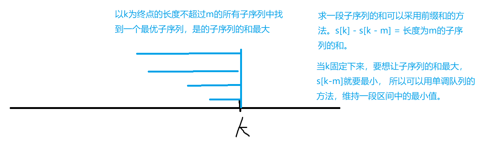

## 单调栈和单调队列

解决这些通用数据结构问题的思路是：先用暴力做法，然后找元素之间是否存在某些性质，可以使用某种数据结构来优化它们。

### 单调栈

单调栈是指： 栈中的元素始终保持一种“单调性”：

* 比如单调递增栈，是指每次入栈的元素都比栈顶元素大；那么栈顶一定是比该元素小的第一个数。
* 单调递减栈，指每次入栈的元素比栈顶元素小；


经典题目： 用来求数组中的某一个元素，**靠它最近的左（右）边第一个比它小（大） 的元素**；如果题目中需要找到这种特性，都可以**使用单调栈来求解**。

模板题目： 

给定一个长度为 $N$ 的整数数列，输出每个数左边第一个比它小的数，如果不存在则输出 $−1$。

#### 输入格式

第一行包含整数 N，表示数列长度。

第二行包含 N个整数，表示整数数列。

#### 输出格式

共一行，包含 N 个整数，其中第 i 个数表示第 i 个数的左边第一个比它小的数，如果不存在则输出 −1。

#### 数据范围

$1≤N≤10^{5}$
$1≤数列中元素≤10^{9}$

#### 输入样例：

```
5
3 4 2 7 5
```

#### 输出样例：

```
-1 3 -1 2 2
```


#### 思路：

```c++
每次入栈前判断是否栈顶元素满足某一单调关系;
	满足：继续入栈；
    否则：持续出栈；
```


```c++
#include<iostream>

using namespace std;

const int N = 1e5 + 10;
// 维持一个单调递增栈
int stack[N], top = -1;

int main(){
    int n;
    cin >> n;
    while( n --){
        int x;
        cin >> x;
        
        while( top != -1 && stack[top] >= x)    top--;
        
        if(top == -1)   cout <<"-1 ";
        else    cout << stack[top]<<" ";
        
        stack[++top] = x;
    }
    return 0;
}
```


#### 单调栈应用：Leetcode 739 每日温度
> [leetcode 739] (https://leetcode.cn/problems/daily-temperatures/)

给定一个整数数组 `temperatures` ，表示每天的温度，返回一个数组 `answer` ，其中 `answer[i]` 是指对于第 i 天，下一个更高温度出现在几天后。如果气温在这之后都不会升高，请在该位置用 0 来代替。

```
示例 1:
输入: temperatures = [73,74,75,71,69,72,76,73]
输出: [1,1,4,2,1,1,0,0]

示例 2:
输入: temperatures = [30,40,50,60]
输出: [1,1,1,0]

示例 3:
输入: temperatures = [30,60,90]
输出: [1,1,0]
```

**思路：**
这道题本质上就是去找到该下标距离它右边第一个比它大的元素。所以联想到单调栈的使用。
关键词： **第一个、大**, 所以是单调递减栈。

```cpp
class Solution {
public:
    stack<int> stk;
    vector<int> dailyTemperatures(vector<int>& temperatures) {
        int n = temperatures.size();
        vector<int> res(n, 0);
        for (int i = temperatures.size() - 1; i >= 0; i --) {
            while (stk.size() && temperatures[i] >= temperatures[stk.top()]){
                stk.pop();
            }
            if (stk.empty())  res[i] = 0;
            else   res[i] = stk.top() - i;
            
            stk.push(i);
        }
        return res;
    }
};
```


---


### 单调队列

单调队列是指，使用一个队列的数据结构，通过对入队的操作进行限制，让队列中的元素都保持一种“单调性”；从而使得出队时的元素满足一种“极性”。

> 通常用`deque`来实现单调队列, 而不是用普通的`queue`, 并且**队列中存储的是原始数组的下标。**


滑动窗口题目, deque存下标，顺序三步走：

1 判断队头的合法性，while(不空 + 队头时间判断)  队头出队;

2 取队头为最优解计算；

3 维护队列有序性，队尾入队 while(不空 + 最优化条件不满足) 队尾出队;


* 经典例题 ： 滑动窗口

给定一个大小为 $n≤10^{6}$ 的数组。

有一个大小为 k 的滑动窗口，它从数组的最左边移动到最右边。

你只能在窗口中看到 k 个数字。

每次滑动窗口向右移动一个位置。

以下是一个例子：

该数组为 `[1 3 -1 -3 5 3 6 7]`，k 为 3。

| 窗口位置            | 最小值 | 最大值 |
| :------------------ | :----- | :----- |
| [1 3 -1] -3 5 3 6 7 | -1     | 3      |
| 1 [3 -1 -3] 5 3 6 7 | -3     | 3      |
| 1 3 [-1 -3 5] 3 6 7 | -3     | 5      |
| 1 3 -1 [-3 5 3] 6 7 | -3     | 5      |
| 1 3 -1 -3 [5 3 6] 7 | 3      | 6      |
| 1 3 -1 -3 5 [3 6 7] | 3      | 7      |

你的任务是确定滑动窗口位于每个位置时，窗口中的最大值和最小值。

#### 输入格式

输入包含两行。

第一行包含两个整数 n 和 k，分别代表数组长度和滑动窗口的长度。

第二行有 n 个整数，代表数组的具体数值。

同行数据之间用空格隔开。

#### 输出格式

输出包含两个。

第一行输出，从左至右，每个位置滑动窗口中的最小值。

第二行输出，从左至右，每个位置滑动窗口中的最大值。

#### 输入样例：

```
8 3
1 3 -1 -3 5 3 6 7
```

#### 输出样例：

```
-1 -3 -3 -3 3 3
3 3 5 5 6 7
```


解法思路：

依次维持两个队列，一个队列中的元素从队头到队尾是递增的，每次出队的元素都是当下的最小元素，故这个队列为最小队列。

另一个队列中的元素从队头到队尾是递减的，每次出队的元素是当下的最大元素，称这个队列为最大队列。

**存储下标太巧妙了！不然必须得建立一个映射。**

```c++
#include<iostream>
#include<deque>

using namespace std;

deque<int> minQue;
deque<int> maxQue;

const int N = 1e6 + 10;

int num[N];

int main(){
    int n,k;
    cin >> n >> k;
    for(int i = 0 ; i  < n; i ++ ){
        scanf("%d",&num[i]);
    }
    
    for(int i = 0 ; i < n; i++){      
        // 处理出队的元素
        if(minQue.size() > 0 && i - k + 1 > minQue.front())   minQue.pop_front();
        // 处理进队的元素
        while(minQue.size() > 0 && num[minQue.back()]  >= num[i] )  minQue.pop_back();
        minQue.push_back(i);
        if( i >= k -1 )     printf("%d ", num[minQue.front()] );
    }
    printf("\n");
    
    for(int i = 0 ; i < n; i++){
        
        // 处理出队的元素
        if(maxQue.size() > 0 && i - k + 1 > maxQue.front())   maxQue.pop_front();
        
        // 处理进队的元素
        while(maxQue.size() > 0 && num[maxQue.back()]  <= num[i] )  maxQue.pop_back();
        
        maxQue.push_back(i);
        
        if( i >= k -1 )     printf("%d ", num[maxQue.front()] );
    }
    printf("\n");
    
    return 0;
}

// 加一个手写队列的版本
#include <iostream>
#include <cstring>
#include <algorithm>

using namespace std;

const int N = 1e6 + 10, INF = 1e9;
int a[N];
int q[N], hh, tt;
int n, k;

int main()
{
    scanf("%d%d", &n, &k);
    for (int i = 1; i <= n; i ++) {
        scanf("%d", &a[i]);
    }
    
    // deal with the min value
    hh = 0, tt = -1;
    for (int i = 1; i <= n; i ++) {
        while (hh <= tt && q[hh] < i - k + 1)   hh ++;
        while (hh <= tt && a[q[tt]] >= a[i])    tt --;
        q[ ++ tt] = i;
        if (i >= k)
            printf("%d ", a[q[hh]]);
    }
    puts("");
    
    // deal with the max value
    hh = 0, tt = -1;
    for (int i = 1; i <= n; i ++) {
        while (hh <= tt && q[hh] < i - k + 1)   hh ++;
        while (hh <= tt && a[q[tt]] <= a[i])    tt --;
        q[ ++ tt] = i;
        if (i >= k)
            printf("%d ", a[q[hh]]);
    }
    return 0;
}
```


```python3
"""
滑动窗口
"""
from collections import deque

def main():
    n,k =list(map(int,input().split()))
    nums = list( map(int, input().split() ))
    
    que = deque()
    for i in range(n):
        if que and i - k + 1 > que[0]:
            que.popleft()
        
        while que and nums[que[-1]] >= nums[i]:
            que.pop()
        
        que.append(i)
        if i >= k - 1:
            print(nums[que[0]], end = " ")
            
    que.clear()
    print("")
    for i in range(n):
        if que and i - k + 1 > que[0]:
            que.popleft()
        
        while que and nums[que[-1]] <= nums[i]:
            que.pop()
        
        que.append(i)
        if i >= k - 1:
            print(nums[que[0]], end = " ")

main()
```


```java
import java.io.*;
import java.util.*;


public class Main {


    public static void main(String[] args) throws IOException {
        BufferedReader in = new BufferedReader(new InputStreamReader(System.in));
        BufferedWriter out = new BufferedWriter(new OutputStreamWriter(System.out));
        String [] line1 = in.readLine().split(" ");
        int n = Integer.parseInt(line1[0]);
        int k = Integer.parseInt(line1[1]);
        String[] line2 = in.readLine().split(" ");

        int[] nums = new int[n];
        for(int i = 0; i < n; i++)
            nums[i] = Integer.parseInt(line2[i]);

        Deque<Integer> que = new LinkedList<Integer>();

        for(int i = 0; i< n; i++){
            if(!que.isEmpty() && i - k + 1 > que.peekFirst() )  que.removeFirst();

            while(!que.isEmpty() && nums[que.peekLast()] >= nums[i] )     que.removeLast();

            que.offerLast(i);
            if( i >= k - 1)     out.write(nums[que.peekFirst()] + " ");

        }
        out.write("\n");
        
        que.clear();
        
        for(int i = 0; i< n; i++){
            if(!que.isEmpty() && i - k + 1 > que.peekFirst() )  que.removeFirst();

            while(!que.isEmpty() && nums[que.peekLast()] <= nums[i] )     que.removeLast();

            que.offerLast(i);
            if( i >= k - 1)     out.write(nums[que.peekFirst()] + " ");

        }
        out.write("\n");
        
        out.flush();
        out.close();
    }
}

```


### 单调队列优化DP

#### 最大子序列和

> [最大子序列和](https://www.acwing.com/problem/content/137/)

输入一个长度为 n 的整数序列，从中找出一段长度不超过 m 的连续子序列，使得子序列中所有数的和最大。

注意： 子序列的长度至少是 1。
```
输入样例：
6 4
1 -3 5 1 -2 3
输出样例：
7
```

题意分析：
类似这种**从一个有限集合中**， 找一个最值的优化问题，基本都是通过DP优化。
子序列题，往往可以选择`f[i]`作为状态，表示以`i`为**终点**下标的所有集合。
那么题目就可以转变为：遍历所有的`f[i]`的值，选择一个最大值。



```cpp
#include <iostream>
#include <cstring>
#include <algorithm>

using namespace std;

const int N = 3e5 + 10, INF = 0x3f3f3f3f;

int hh, tt;
int s[N], q[N];

int n, m;

int main()
{
    scanf("%d%d", &n, &m);
    for (int i = 1; i <= n; i ++) {
        scanf("%d", &s[i]);
        s[i] += s[i-1];
    }
    // 这里hh = tt = 0, 表示队列中暂时先存了一个值s[0]
    // 为什么要存s[0]，是因为当求第一个元素的前缀和时，需要使用s[1] - s[0];
    hh = tt = 0;
    int res = -INF;
    for (int i = 1; i <= n; i ++) {
        // 为什么这里要使用i - m，而不是i-m+1？
        // 也是因为前缀和的求法，s[i] - s[i - m]才能得到长度为m的一段区间内的子序列和
        if (hh <= tt && q[hh] < i - m)  hh ++;
        res = max(res, s[i] - s[q[hh]] );
        while (hh <= tt && s[q[tt]] >= s[i])    tt --;  
        q[++ tt] = i;
    }
    printf("%d\n", res);
    return 0;
}
```

#### 最大子序列和变形（修建草坪）
> [修建草坪](https://www.acwing.com/problem/content/1089/) 

大致题意：一个长度为n的序列数组，要求最大连续序列的长度不超过k, 选择序列中的部分数，求得子序列的最大值。

样例：
```
输入样例：第一行输入n, k
5 2
1
2
3
4
5

输出：
12 = 1 + 2 + 4 + 5
```

分析：
序列求最值问题，一般都考虑动态规划求解。`f[i]`表示以下标i为结束的所有子序列集合，属性是max, `f[i]`的值x表示子序列中的和的最大值。

同样可以分解子问题：
假设不选下标为i的数，则`f[i] = f[i-1]`， 如果选择下标为i的数，则需要进一步划分: 以i为终点，从前选1, 2, 3, ... k 个元素构成一段子序列。
即 `a[i] + a[i-1] + a[i - 2] + ... a[i - j + 1] + a[i - j - 1] + ... + a[1]`.  其中 ` 1 <= j <= k`.
后半部分可以直接用`f[i-j-1]`表示，所以递推公式可以写成：
`f[i] = f[i-j-1] + s[i] -  s[i - j];` 其中`s[i]`为前缀和数组。

将等式变化的部分放在一起，不变的部分放在一起，即: `f[i] = f[i-j-1] - s[i-j] + s[i];` 要求`f[i]`最大，即变化的部分要取max,  令`g[x] = f[x-1] - s[x]`; 即可以维持一个单调队列，队列中的元素递减，队头取出 下标位于 `[i - k , i - 1]`之间的g的最大值。

必须要考虑一下`g[0]`的值，因为`g[0] = f[-1] - s[0]`,`f[-1]`实际上有意义，即`i = j`， 取前面一段的所有值，`f[-1] = 0`, 所以`g[0] = 0 - 0 = 0`; 

```cpp
#include <iostream>
#include <cstring>
#include <algorithm>

using namespace std;

typedef long long LL;

const int N = 1e5 + 10;
int n, k;
LL f[N], s[N];

LL q[N];
int hh, tt;

LL g(LL x) {
    if (x == 0)  return 0;
    return f[x-1] - s[x];
}

int main()
{
    scanf("%d%d", &n, &k);
    for (int i = 1; i <= n; i ++) {
        scanf("%lld", &s[i]);
        s[i] += s[i-1];
    }
    
    hh = tt = 0;
    for (int i = 1; i <= n; i ++) {
        while (hh <= tt && q[hh] < i - k) hh++;
        f[i] = max(f[i-1], g(q[hh]) + s[i]);
        while (hh <= tt && g(q[tt]) < g(i))  tt--;
        q[ ++ tt] = i;
    }

    cout << f[n] << endl;

    return 0;
}
```