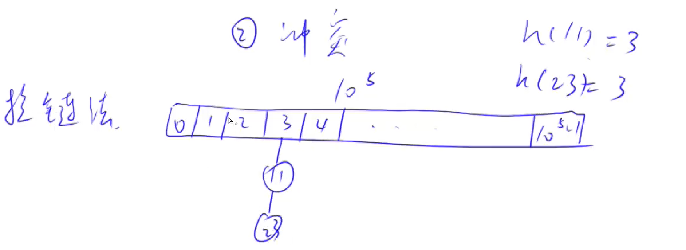
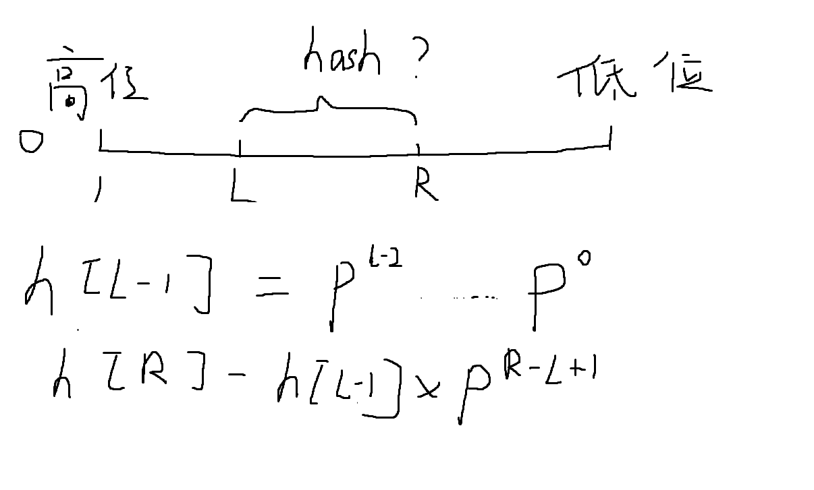

## 哈希表

作用： 把一个比较庞大的空间映射到一个比较小的空间，比如0 ~N；

通过一个hash() :

1. 直接取模操作`x mod 1e5` ;（**取模的长度一般要来取一个质数，离2的整次幂尽可能远，使得冲突的概率最小**）
2. 两个数映射到同一个数，产生冲突：解决冲突一般有两种方式：开放寻址法，拉链法


### 经典例题：

维护一个集合，支持如下几种操作：

1. `I x`，插入一个数 x；
2. `Q x`，询问数 x 是否在集合中出现过；

现在要进行 N 次操作，对于每个询问操作输出对应的结果。

#### 输入格式

第一行包含整数 N，表示操作数量。

接下来 N 行，每行包含一个操作指令，操作指令为 `I x`，`Q x` 中的一种。

#### 输出格式

对于每个询问指令 `Q x`，输出一个询问结果，如果 x 在集合中出现过，则输出 `Yes`，否则输出 `No`。

每个结果占一行。

#### 数据范围

$1≤N≤10^5$
$-10^9≤x≤10^9$

#### 输入样例：

```
5
I 1
I 2
I 3
Q 2
Q 5
```

#### 输出样例：

```
Yes
No
```


### 拉链法

基本思路：开一个一维数组来存储hash值，如果产生冲突，那么就把冲突的值依次放在`index`的下面，就像连接了一条链（单链表）。示意图如下：

一般情况下，拉链的长度都不会太高，**时间复杂度近似为O(1)**。

基本操作： 添加，查找；

```c++
#include<iostream>
#include<algorithm>
#include<cstring>
using namespace std;

const int N = 1e5 + 3;   // 大于1e5的第一个质数

// 类似于图论
int h[N], e[N], ne[N], idx;

// h[]数组存的是x在e[]数组中的,链表的第一个下标
void insert(int x){
    // C++ 里负数对一个正数取模：可以先计算除法，得到商
    // 用余数 = 被除数 - 商 * 除数 的方法得到，仍为负数
    // + N 再 % N的目的是让余数变成一个正数
    int k = ( x % N + N) % N;
    e[idx] = x;
    ne[idx] = h[k];
    h[k] = idx++;
}

bool find(int x){
    int k = ( x % N + N) % N;
    for(int i = h[k]; i != -1; i= ne[i]){
        if(e[i] == x)
            return true;
    }

    return false;
}

int main(){
    int n;
    scanf("%d", &n);
    
    memset(h, -1, sizeof(h));
    while( n --){
        char op[2];
        // 读入一个字符串比读入一个字符更好，会把空格删除掉
        scanf("%s",op);
        if(op[0] == 'I'){
            int x;
            scanf("%d",&x);
            insert(x);
            
        }else{
            int x;
            scanf("%d",&x);
            if(find(x))    printf("Yes\n");
            else    printf("No\n");
        }
    }
    return 0;
}
```


### 寻找第一个大于$10^5$质数的方法

这里是使用双重循环， 遍历寻找的方法，且遍历的范围不可能大于sqrt(i)；

```c++
#include<iostream>
using namespace std;
int main(){
    for(int i = 1e5; ; i++){
        bool flag = true;
        
        for(int j = 2; j * j <= i; j++){
            if( i % j == 0){
                flag = false;
                break;
            }
        }
        if(flag){
            printf("%d",i);
            break;
        }   
    }
    return 0;
}
```


### 开放寻址法

思路：只开了一个一维数组，但是数组长度大概是要求的2~3倍，冲突概率比较低。处理冲突：“上厕所”，从第k个坑位开始找`h(x) = k`，直到找到第一个空的坑位为止。

一般的操作： **添加和查找**

```c++
#include<iostream>
#include<algorithm>
#include<cstring>
using namespace std;

const int N = 2e5 + 3;   // 大于2e5的第一个质数
// 规定一个表示为空的数，每个字节都是0x3f
const int nullempty = 0x3f3f3f3f;

int h[N];

// find()函数的功能，如果在h[]数组中找到x，返回它的下标；否则返回x应该插入的位置
int find(int x){
    int k = ( x % N + N) % N;
    
    while( h[k] != nullempty && h[k] != x){
        k++;
        // 如果找到最后一个坑位，返回最开始的一个坑位
        if(k == N)  k = 0;
    }
    return k;
}

int main(){
    int n;
    scanf("%d", &n);
    // 设置每个字节的值都是0x3f
    memset(h, 0x3f, sizeof(h));
    while( n --){
        char op[2];
        // 读入一个字符串比读入一个字符更好，会把空格删除掉
        scanf("%s",op);
        int x;
        scanf("%d",&x);
        int k = find(x);
        if(op[0] == 'I'){
            h[k] = x;
        }else{
            // 注意这里的判断条件是h[k]！
            if( h[k] != nullempty)  printf("Yes\n");
            else    printf("No\n");
        }
    }
    return 0;
}
```


### 字符串哈希方式(字符串前缀hash法)

```c++
str = "ABCABCDEYXACWing"
	h[0] = 0
    h[1] = "A的hash值"
    h[2] = "AB的hash值"
    h[3] = "ABC的hash值"
```

思路： 把字符串看成是一个P进制数，比如"ABCD", "A"是第一位上的数，“B"是第二位上的数，假如字符串里都是大写字母，那么A看成1，B看成2；”ABCD“就可以写成$1*p^3 + 2*p^2 + 3 * p^3 + 4*p^0$这样就可以将一个字符串转化成一个整数；这个数字如果非常大，可以对这个数字进行取模mod Q, 使得最后的数值不大于Q( 0 ~ Q-1)；

>  注意，不能映射成0，因为如果A = 0， 那么字符串AA = 0， AAA = 0；使得多个字符串都会映射成0

**经验：P = 131 或者13331， Q = $ 2^{64};$ 这种情况在99%情况下不会产生冲突。** 


前缀hash和这种思路结合一下，可以得到任意长度，任意子串的hash值；



这里$ h[R] - h[L-1] * P^{R-L+1} $ 是把L - 1位置的hash数与h[R]对应的hash数的长度对齐；比如一段字符串aabba，长度为5， 现在把a映射到1， b 映射到2；那么‘"aabba"这一段的数值就是”11221“， 而"bba"这一段的数值应该是"221", 如何得到这个221？ 

**"aa"映射为11，把11 * 10  ^3 = 11000, 再把11221 - 11000 = 221； 即得到bba的hash值。**


技巧：因为要使用`mod Q`, 所以可以把对应的值的类型变为`unsigned long long `，这样如果一个数很大，则它会产生溢出（相当于取模了）。

h[i]数组可以通过递推提前求出来： **`h[i] = h[i-1] * p + str[i]`**


#### 经典例题：字符串哈希（字符串的很多题都可以用这种方法解！）

给定一个长度为 n 的字符串，再给定 m 个询问，每个询问包含四个整数 $ l1,r1,l2,r2 $， 请你判断$ [l1,r1],  [l2,r2] $这两个区间所包含的字符串子串是否完全相同。

字符串中只包含大小写英文字母和数字。

#### 输入格式

第一行包含整数 n 和 m，表示字符串长度和询问次数。

第二行包含一个长度为 n 的字符串，字符串中只包含大小写英文字母和数字。

接下来 m 行，每行包含四个整数$ l1,r1,l2,r2 $，表示一次询问所涉及的两个区间。

注意，字符串的位置从 1 开始编号。


#### 输出格式

对于每个询问输出一个结果，如果两个字符串子串完全相同则输出 `Yes`，否则输出 `No`。

每个结果占一行。

#### 数据范围

$ 1≤n,m≤10^5 $

#### 输入样例：

```
8 3
aabbaabb
1 3 5 7
1 3 6 8
1 2 1 2
```

#### 输出样例：

```
Yes
No
Yes
```


#### 题解

```c++
#include<iostream>

using namespace std;

typedef unsigned long long ULL;
const int P = 131;
const int N = 1e5 + 10;
char str[N];
// p的数值是为了求p的多少次方而使用的
ULL h[N], p[N];

ULL get(int l, int r){
    return h[r] - h[l - 1] * p[r - l + 1];
}


int main(){
    int n,m;
    scanf("%d%d", &n, &m);
    scanf("%s", str + 1);
    p[0] = 1;
    for(int i = 1; i <= n; i++){
        p[i] = p[i - 1] * P;
        h[i] = h[i-1] * P + str[i];
    }
    while( m -- ){
        int l1,r1,l2,r2;
        scanf("%d%d%d%d", &l1, &r1, &l2, &r2);
        if(get(l1, r1) == get(l2,r2))   printf("Yes\n");
        else    printf("No\n");
    }
    
    return 0;
}
```


---

### 哈希表 + 动态规划经典题目

#### Leetcode 139单词拆分（Word break）

> 来源： https://leetcode-cn.com/problems/word-break/

给你一个字符串 s 和一个字符串列表 wordDict 作为字典，判定 s 是否可以由空格拆分为一个或多个在字典中出现的单词。

说明：拆分时可以重复使用字典中的单词。

```
示例1:
输入: s = "leetcode", wordDict = ["leet", "code"]
输出: true
解释: 返回 true 因为 "leetcode" 可以被拆分成 "leet code"。

示例2:
输入: s = "applepenapple", wordDict = ["apple", "pen"]
输出: true
解释: 返回 true 因为 "applepenapple" 可以被拆分成 "apple pen apple"。
     注意你可以重复使用字典中的单词。

示例3: 
输入: s = "catsandog", wordDict = ["cats", "dog", "sand", "and", "cat"]
输出: false

提示：

1 <= s.length <= 300
1 <= wordDict.length <= 1000
1 <= wordDict[i].length <= 20
s 和 wordDict[i] 仅有小写英文字母组成
wordDict 中的所有字符串 互不相同

```


思路：

如果直接在字符串s的所有空格进行暴力拆分，假设n = s.size(); 那么时间复杂度应该是$O(2^n)$， 是指数级别的，一定会爆复杂度。考虑用动态规划算法来进行优化。

不妨让字符串的开头增加一个"  ", 方便动态规划状态计算时对应关系。

- 状态表示：`f[x]`表示所有下标从1~x的字符的所有合法划分方案，即切分后的单词在字典`wordDict`中。
  - 属性： `bool`值，（有可能要进行逻辑运算）
- 状态计算：


那么如何判断字符串的一段子序列是否在字典中出现过呢？

哈希表的一大作用就是快速判断一个元素是否在表中出现过，要想在近似`O(1)`的时间内找到一个元素是否存在哈希表中，这里可以使用字符串哈希方法，将字符串转化成一个P进制数，判断一个数是否在一个数组中出现过。


```c++
class Solution {
public:
    bool wordBreak(string s, vector<string>& wordDict) {
        typedef unsigned long long ULL;
        unordered_set<ULL> hash;
        const int P = 131;
        // 构建字典的hash表, 这样从字典中查找字符串的时间复杂度是O(1)
        for( auto & word : wordDict){
            ULL h = 0;
            for(auto c : word){
                h = h * P + c;
            }
            hash.insert(h);
        }

        // 从前往后找s中隐藏的wordDict值
        int n = s.size();
        s = " " + s;
        vector<bool> f(n + 1);
        // f[0] = true 这里要思考一下，因为动态规划必须要考虑边界条件，它表示当没有字符的时候，能不能用wordDict中的元素来表示呢？答案是可以，因为wordDict中的元素本来就可不需要用到
        f[0] = true;
        // 注意循环边界，i的循环边界这里可以< n, 因为j <= n
        for(int i = 0; i < n ; i ++){
            // 如果f[i] = true, 即1~i中可以被wordDict中的单词进行切分
            if(f[i]){
                ULL h =	 0;
                for(int j = i + 1; j <= n; j ++){
                    h = h * P + s[j];
                    if(hash.count(h))   f[j] = true;
                }
            }
        }
        return f[n];
    }
};
```


#### Leetcode 140 单词拆分2

> https://leetcode-cn.com/problems/word-break-ii

给定一个非空字符串 s 和一个包含非空单词列表的字典 wordDict，在字符串中增加空格来构建一个句子，使得句子中所有的单词都在词典中。返回所有这些可能的句子。

说明：

分隔时可以重复使用字典中的单词。
你可以假设字典中没有重复的单词。

```
输入:
s = "catsanddog"
wordDict = ["cat", "cats", "and", "sand", "dog"]
输出:
[
  "cats and dog",
  "cat sand dog"
]


输入:
s = "pineapplepenapple"
wordDict = ["apple", "pen", "applepen", "pine", "pineapple"]
输出:
[
  "pine apple pen apple",
  "pineapple pen apple",
  "pine applepen apple"
]
解释: 注意你可以重复使用字典中的单词。
```


思路：

与上一题的区别在于需要返回所有拆分后的情况case。

可以借鉴上一题关于`f[n]`数组的设置，给暴搜剪枝。


```c++
class Solution {
public:
    vector<bool> f;
    vector<string> res;
    unordered_set<string> hash;
    int n;
    vector<string> wordBreak(string s, vector<string>& wordDict) {
        n = s.size();
        f.resize(n + 1);
        // 构造字典的hash表
        for(auto word : wordDict){
            hash.insert(word);
        }

        f[n] = true;
        // dp用来预处理s和f，来得到f[]
        for( int i = n - 1; i > 0; i --){
            for(int j = i; j < n; j ++){
                // 下面count(substr())的写法的时间复杂度也是O(n)
                // 之所以不用字符串哈希法，因为暴搜是指数级别的复杂度，远远高于多项式级别
                if(hash.count(s.substr( i, j - i + 1)) && f[j + 1] ){
                    f[i] = true;
                }
            }
        }
        // dfs()暴搜
        dfs( s, 0, "");
        return res;
    }

    // dfs暴搜的递归写法，非常好，要学会！
    void dfs(string & s, int u, string path){
        if( u == n){
            // 弹出最后一个空格
            path.pop_back();
            res.push_back(path);
        }else{
            // u是搜索的起始位置
            for(int i = u; i < n; i ++){
                // f[i + 1] = true表示 0 ~ i + 1 是可以在字典里进行合法划分的
                if(hash.count(s.substr( u , i - u + 1)) && f[i+1]){
                    dfs(s , i + 1, path + s.substr(u , i - u + 1) + ' ');
                }
            }
        }

    }

};
```


### Leetcode 347 前K个高频元素

> https://leetcode-cn.com/problems/top-k-frequent-elements/

给你一个整数数组 `nums` 和一个整数 `k` ，请你返回其中出现频率前 `k` 高的元素。你可以按 **任意顺序** 返回答案。

```
示例1：
输入: nums = [1,1,1,2,2,3], k = 2
输出: [1,2]

示例2：
输入: nums = [1], k = 1
输出: [1]
```

- 提示：

$1 <= nums.length <= 10^5$
k 的取值范围是 [1, 数组中不相同的元素的个数]
题目数据保证答案唯一，换句话说，数组中前 k 个高频元素的集合是唯一的


**思路：**

最简单的思路就是首先遍历一遍nums数组，统计一个元素出现的次数，然后按照出现次数从大到小排序，将前K个出现次数的元素输出。

时间复杂度为O(nlogn)。

```c++
class Solution {
public:
    vector<int> topKFrequent(vector<int>& nums, int k) {
        vector<int> res;
        // 计数用的hashmap
        unordered_map<int, int > hash;
        for(auto i : nums){
            hash[i] += 1;
        }
        typedef pair<int, int> PII;
        // 构造一个小根堆
        priority_queue<PII, vector<PII> , greater<PII> > q;
        int i = 0; 
        for(auto & it: hash){
            // 存储前k个元素放入小根堆中
            if( i < k){
                i += 1;
                // 由于pair的元素自动进行比较是首先以first元素进行比较
                // 如果first元素相同，再调整为second元素
                // 所以存储的时候需要将次数放在pair的first的位置
                q.push(make_pair(it.second, it.first));
            }else{
                // 不断更新小根堆的值
                if(it.second > q.top().first){
                    q.pop();
                    q.push(make_pair(it.second, it.first));
                }
            }
        }

        for(int i = 0; i < k; i ++){
            res.push_back(q.top().second);
            q.pop();
        }

        return res;
        
    }
};
```


考虑一下是否有O(n)的算法呢？O(n)的算法就是要求不断地扫描所有数据。

因此可以借鉴一下计数排序的思想：设置一个计数数组s[], `s[i] = x `，表示这个数组中，出现`i`次的有x个数。

首先也是构造一个哈希表，存储所有元素的次数映射；将出现元素的次数放在计数数组中。

给计数数组画一条分隔线，处于分割线右边的元素即为高频词汇的线。

```c++
class Solution {
public:
    vector<int> topKFrequent(vector<int>& nums, int k) {
        unordered_map<int, int> count;
        for(auto x : nums)  count[x] ++;
        int n = nums.size();
        // 计数排序的思想，s[]计数排序数组
        vector<int> s(n + 1);
        for( auto [x , c] : count){
            s[c] ++;            
        }
        int i = n, t = 0;
        while( t < k)   t += s[i--];
        vector<int> res;
        for(auto [x , c] : count){
            // 大于分割线次数的
            if(c > i){
                res.push_back(x);
            }
        }
        return res;
        
    }
};
```


