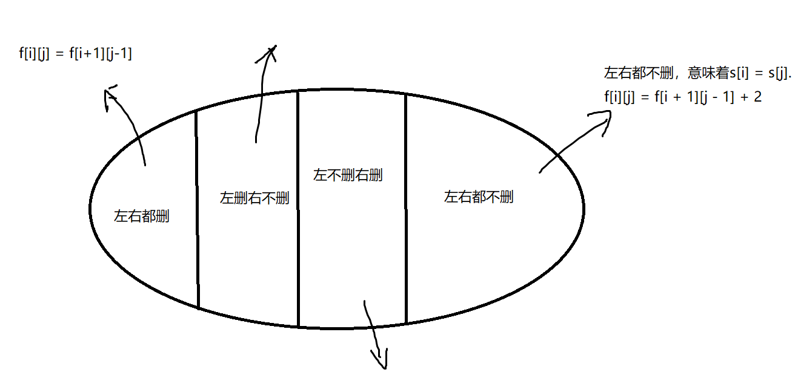

# 回文串题目总结

回文串的定义： 即判断一个字符串从前往后读，和从后往前读是否相同。比如`aba`, `abba`等。

考察点很多：字符串处理，双指针，动态规划（区间DP）等。


### 例题1：验证回文子串

> [Leetcode 125](https://leetcode.cn/problems/valid-palindrome/submissions/)

如果在将所有大写字符转换为小写字符、并移除所有非字母数字字符之后，短语正着读和反着读都一样。则可以认为该短语是一个 回文串 。

字母和数字都属于字母数字字符。

给你一个字符串 s，如果它是 回文串 ，返回 true ；否则，返回 false 。

```
输入: s = "A man, a plan, a canal: Panama"
输出：true
解释："amanaplanacanalpanama" 是回文串。
```


**思路：**

先处理所有大写字符，小写字符，数字字符，不需要加的字符去掉。

再用双指针算法判断是否为回文串。

```cpp
class Solution {
public:
    bool isPalindrome(string s) {
        string as;
        for (int i = 0; i < s.size(); i ++) {
            if (s[i] >= 'A' && s[i] <= 'Z')     as += s[i] + 32;
            else if (s[i] >= 'a' && s[i] <= 'z')    as += s[i];
            else if (isdigit(s[i])) as += s[i];
        }
        bool flag = true;
        for (int i = 0, j = as.size() - 1; i < j; i ++, j --) {
            if (as[i] != as[j]) {
                flag = false;
                break;
            }
        }
        return flag;
    }
};
```


### 例题2： 最长回文子串

> [Leetcode 5](https://leetcode.cn/problems/longest-palindromic-substring/)

给你一个字符串 `s`，找到 `s` 中最长的回文子串。

回文串的一大技巧：枚举中心点，从中间往两边延展，遇到第一个不满足的就断开。

重点是需要分奇偶的情况。

```cpp
class Solution {
public:
    string longestPalindrome(string s) {
        string res;
        // 遍历中心点
        for (int i = 0; i < s.size(); i ++) {
            // 回文串长度为奇数，枚举两边
            int l = i - 1, r = i + 1;
            while (l >= 0 && r < s.size() && s[l] == s[r]) l --, r ++;
            if (res.size() < r - l - 1) res = s.substr(l + 1, r - l - 1);
			// 回文串长度为偶数，枚举中间两个节点，l为中间左节点，r为中间右节点
            l = i, r = i + 1;
            while (l >= 0 && r < s.size() && s[l] == s[r]) l --, r ++;
            if (res.size() < r - l - 1) res = s.substr(l + 1, r - l - 1);            
        }
        return res;
    }
};
```


### 例题3： 回文子串

> [Leetcode 647](https://leetcode.cn/problems/palindromic-substrings/?favorite=2cktkvj)

给你一个字符串 s ，请你统计并返回这个字符串中 回文子串 的数目。

子字符串 是字符串中的由连续字符组成的一个序列。

具有不同开始位置或结束位置的子串，即使是由相同的字符组成，也会被视作不同的子串。

```
输入：s = "abc"
输出：3
解释：三个回文子串: "a", "b", "c"

输入：s = "aaa"
输出：6
解释：6个回文子串: "a", "a", "a", "aa", "aa", "aaa"
```

**思路：**

从原题范围可以看到，子串的长度不超过1000，所以时间复杂度可以选择O(n^2)的算法。

如果枚举两个边界 + 遍历一遍的暴力做法，时间复杂度 O(n^3)。可能会超时。

同样采取从最中心节点，往两边遍历的方法。

```c++
class Solution {
public:
    int countSubstrings(string s) {
        int res = 0;
        for (int i = 0; i < s.size(); i ++) {
            // 枚举长度为奇数的情况
            for (int j = i, k = i; j >= 0 && k < s.size(); j --, k ++) {
                if (s[j] != s[k])   break;
                res ++;
            }
            // 枚举长度为偶数的情况
            for (int j = i, k = i + 1; j >= 0 && k < s.size(); j --, k ++) {
                if (s[j] != s[k])   break;
                res ++;
            }
        }
        return res;
    }
};
```


### 例题4：最长回文序列

> [Leetcode 516](https://leetcode.cn/problems/longest-palindromic-subsequence/)

给你一个字符串 s ，找出其中最长的回文子序列，并返回该序列的长度。

子序列定义为：不改变剩余字符顺序的情况下，删除某些字符或者不删除任何字符形成的一个序列。

 ```
 输入：s = "bbbab"
 输出：4
 解释：一个可能的最长回文子序列为 "bbbb" 。
 ```


回文序列是可以不连续的，因此只能考虑用动态规划做。

动态规划解题的设置状态的小技巧，看最后题目问什么，就设什么为状态。

比如该题最后问，整个字符串中最长的回文子序列的长度。那就设`f[i][j]`为从字符串下标i ~ 下标j的所有子序列的集合。`f[i][j] = x`， x为最长回文序列的长度。

状态计算：

由于子序列中可以删除或者不删除某些字符，因此状态的计算可以按照两个边界是否包含（是否被删除）来进行分类:



四个状态，中间两个状态有些‘暧昧’。

左删右不删： 这种情况实际上不等于 `f[i+1][j]`, 因为`f[i+1][j]`可以表示右端点不存在的情况，当然也可以表示存在的情况。因此实际上`f[i+1][j]` 的所有情况是包含左删右不删的情况的。 `f[i + 1][j] >= 左删右不删`。

同理： `f[i][j-1]` >= 左不删右删 

又可以发现，左右都删也是被`f[i][j-1]`和`f[i + 1][j]`的情况所包含的。

因此状态计算方程： `if (s[i] == s[j])  f[i][j] = f[i+1][j-1] + 2;`, `f[i][j] = max(f[i][j], max(f[i+1][j],  f[i][j-1]))`;

```cpp
class Solution {
public:
    int longestPalindromeSubseq(string s) {
        int n = s.size();
        vector<vector<int>> f(n, vector<int> (n, 0));
        // 区间dp，先枚举长度
        for (int len = 1; len <= n; len ++) {
            for (int i = 0; i + len - 1 < n; i ++) {
                int j = i + len - 1;
                if (len == 1)   f[i][j] = 1;
                else {
                    if (s[i] == s[j])   f[i][j] = f[i+1][j-1] + 2;
                    else {
                        f[i][j] = max(f[i][j], max(f[i+1][j], f[i][j - 1]));
                    }
                }
            }
        }
        return f[0][n-1];
    }
};
```

