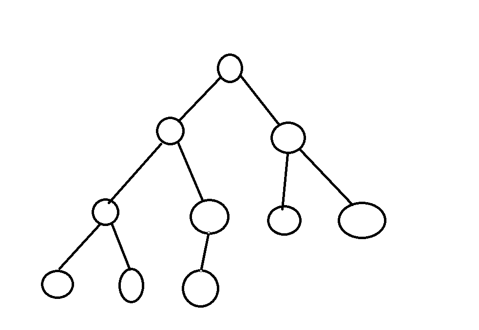
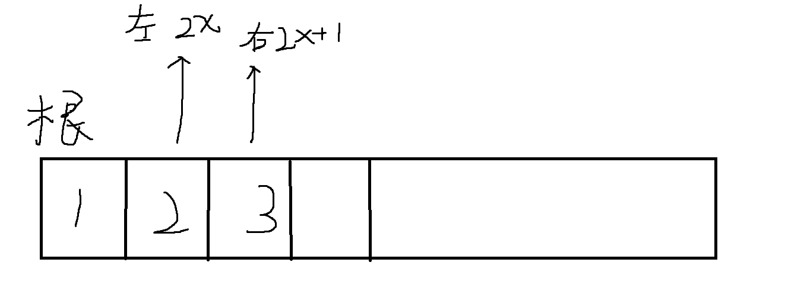

# 手写堆

### 基本操作

堆有5个基本操作，以最小堆为例：

1. 插入操作
2. 求集合当中的最小值
3. 删除最小值
4. 删除任意一个元素
5. 修改任意一个元素


前三个操作`STL`中的优先队列可以实现。


**堆的本质是一棵完全二叉树：除了最后一层的结点外，上面所有结点都是非空的。并且最后一层的结点从左到右是依次排布的。**

以小根堆为例：每个点的值都是小于它的左右子节点的值。



用一维数组来实现一棵树：( 下标从1开始比较方便，如果从0开始，2*x还是0)



`down(x)和 up(x)`： 把结点往下调整（即最小堆中大数向下沉）和往上调整（即最小堆中小数向上浮），可以实现上面最开始的5个操作。

只需要用两个函数即可完成上述5个操作

1. 插入操作( 在整个堆的最后一个位置插入x )：

```c++
heap[++ msize] = x; up(msize);
```


2. 求整个堆的最小值：`heap[1]`
3. 删除最小值： 用我们整个堆的最后一个元素**覆盖掉**堆顶的元素，msize -- , 然后再把堆顶的元素`down()`一遍，维持堆的性质。为什么要这么做呢？ 因为我们使用一维数组来模拟，而数组里删除位于头部的元素非常困难，而删除位于尾部的元素就比较简单。

```c++
heap[1] = heap[msize];
msize--;
down(1)
```

4. 删除任意一个元素: 

```c++
heap[k] = heap[msize]; msize--; down(k); up(k);			// down()和up()只会执行一个，都写上就行。
```

5. 修改一个元素：

```c++
heap[k] = x; dowx(k); up(k);
```


down() 和 up() 的时间复杂度都是$log(n)$

```c++
// 递归写down函数
void down(int u){
    int t = u;
    int leftChild = u * 2;
    int rightChild = u * 2 + 1;
    if( leftChild <= msize && h[leftChild] < h[t])	t = leftChild;
    if( rightChild <= msize && h[rightChild] < h[t])	t = rightChild;
    if( t != u ){
        swap(h[t], h[u]);
        down(t);
    }
}

// 迭代写up函数
void up(int u){
    while( u / 2 >= 1 && h[u] < h[u / 2]){
        swap( h[u/2], h[u]);
        u >>= 1;
    }
}
```


### 经典例题1：堆排序

输入一个长度为 n 的整数数列，从小到大输出前 m 小的数。

#### 输入格式

第一行包含整数 n 和 m。

第二行包含 n 个整数，表示整数数列。

#### 输出格式

共一行，包含 m 个整数，表示整数数列中前 m 小的数。

#### 数据范围

$$1≤m≤n≤10^5 \\
1≤元素大小≤10^9$$

#### 输入样例：

```
5 3
4 5 1 3 2
```

#### 输出样例：

```
1 2 3
```

#### 解答

```c++
#include<bits/stdc++.h>

using namespace std;
const int N = 1e5 + 10;
// 手写堆，维持一个堆的大小的msize
int h[N], msize;
int m,n;

// 小根堆大数向下传递，递归写down
void down(int x){
    int t = x;
    int leftchild = t * 2;
    int rightchild = t * 2 + 1;
    if(leftchild <= msize && h[leftchild] < h[t])   t = leftchild;
    if(rightchild <= msize && h[rightchild] < h[t]) t = rightchild;
    if(t != x){
        swap(h[t], h[x]);
        down(t);
    }
}

int main(){
    scanf("%d%d", &m, &n);
    for(int i = 1; i <= m ; i++)
        scanf("%d", &h[i]);
    msize = m;
    // 先建堆， 时间复杂度 n/2 * logn
    for(int i = msize /2 ; i >= 1; i--){
        down(i);
    }
    
    // 输出最小元素
    for(int i = 1; i <= n ; i++){
        printf("%d ", h[1]);
        h[1] = h[msize];
        msize --;
        down(1);
    }
    
    return 0;
}
```


### 经典例题2： 模拟堆操作

维护一个集合，初始时集合为空，支持如下几种操作：

1. `I x`，插入一个数 x；
2. `PM`，输出当前集合中的最小值；
3. `DM`，删除当前集合中的最小值（数据保证此时的最小值唯一）；
4. `D k`，删除第 k 个插入的数；
5. `C k x`，修改第 k 个插入的数，将其变为 x；

现在要进行 N 次操作，对于所有第 2 个操作，输出当前集合的最小值。

#### 输入格式

第一行包含整数 N。

接下来 N 行，每行包含一个操作指令，操作指令为 `I x`，`PM`，`DM`，`D k` 或 `C k x` 中的一种。

#### 输出格式

对于每个输出指令 `PM`，输出一个结果，表示当前集合中的最小值。

每个结果占一行。

#### 数据范围

$$ 1≤N≤10^5 \\
−10^{9}≤x≤10^{9} $$
数据保证合法。

#### 输入样例：

```
8
I -10
PM
I -10
D 1
C 2 8
I 6
PM
DM
```

#### 输出样例：

```
-10
6
```


#### 思路

问题的难点在于**如何将模拟堆中的h[]的下标idx 与 第x个数插入的x对应起来 **。

设置两个数组`h2c[]`和`c2h[]`， 其中`h2c[]`数组表示heap堆数组的下标对应第几个插入；

`c2h[]` 数组表示下标（第几个插入的元素）对应在heap堆数组中的下标是多少；


#### 解答

```c++
#include<bits/stdc++.h>
using namespace std;
const int N = 1e5 + 10;
int h[N], msize, h2c[N], c2h[N];
int n, cnt;

// 每一次交换由于h数组改变了位置，所以c2h和h2c同时要改变，并且要注意顺序；
void heap_swap(int a, int b){
    swap(c2h[h2c[a]] , c2h[h2c[b]]);
    swap(h2c[a], h2c[b]);
    swap(h[a],h[b]);
}

void down(int x){
    int t = x;
    int leftchild = x * 2;
    int rightchild = x * 2 + 1;
    if(leftchild <= msize && h[leftchild] < h[t])   t =leftchild;
    if(rightchild <= msize && h[rightchild] < h[t]) t = rightchild;
    if(t != x){
        heap_swap(t, x);
        down(t);
    }
}

void up(int x){
    while(x / 2 >= 1 && h[x] < h[x / 2]){
        heap_swap( x , x/2 );
        x >>= 1;
    }
}

int main(){
    scanf("%d", &n);
    cnt = 0;
    while(n--){
        string op;
        cin >> op;
        if(op == "I"){
            int x;
            scanf("%d", &x);
            h[++msize] = x;
            h2c[msize] = ++cnt;
            c2h[cnt] = msize;
            up(msize);
        }else if(op == "PM"){
            printf("%d\n", h[1]);
        }else if(op == "DM"){
            // 删除最小的元素，这里注意要使用heap_swap
            heap_swap(1, msize);
            msize --;
            down(1);          
        }else if(op == "D"){
            int k;
            scanf("%d", &k);
            int t = c2h[k];
            heap_swap(t,msize);
            msize--;
            down(t);up(t);
      
        }else{
            // c k x
            int k,x;
            scanf("%d%d", &k, &x);
            int t = c2h[k];
            h[t] = x;
            down(t);
            up(t);
        }
    }
    
    return 0;
}
```


```c++
#include<iostream>
#include<algorithm>
#include<unordered_map>
#include<string>
using namespace std;

const int N = 1e5 + 10;
int n, h[N], msize, insNo;
unordered_map<int, int> ins2idx;
unordered_map<int, int> idx2ins;

void m_swap(int a, int b){
    int temp_insert_no = idx2ins[a];
    idx2ins[a] = idx2ins[b];
    idx2ins[b] = temp_insert_no;
    
    ins2idx[idx2ins[b]] = b;
    ins2idx[idx2ins[a]] = a;
    
    swap(h[a], h[b]);

}
// 使用printh来调试
void printh(){
    cout <<"print h[]: ";
    for(int i = 1; i <= msize; i ++){
        cout << h[i] << " ";
    }
    cout << endl;
}

void down(int u){
    int t = u;
    int left_child = u * 2;
    int right_child = u * 2 + 1;
    if(left_child <= msize && h[left_child] < h[t])  t = left_child;
    if(right_child <= msize && h[right_child] < h[t])   t = right_child;
    if(t != u){
        m_swap(t, u);
        down(t);
    }
}

void up(int u){
    while(u / 2 >= 1 && h[u] < h[u / 2]){
        m_swap(u, u / 2);
        u >>= 1;
    }
}

void insert(int x){
    h[++msize] = x;
    ins2idx[++insNo] = msize;
    idx2ins[msize] = insNo;
    up(msize);
    
}

void DM(){
    m_swap(1, msize);
    msize --;
    down(1);
}

void DK(int k){
    int idx = ins2idx[k];
    m_swap(idx, msize);
    msize --;
    down(idx); up(idx);
}

void CK(int k, int x){
    int idx = ins2idx[k];
    h[idx] = x;
    up(idx); down(idx);
}

int main(){
    cin >> n;
    while( n --){
        string op;
        cin >> op;
        if(op == "I"){
            int x;
            cin >> x;
            insert(x);
            // printh();
        }else if(op == "PM"){
            cout << h[1] << endl;
            // printh();
        }else if(op == "D"){
            int k;
            cin >> k;
            DK(k);
            // printh();
        }else if(op == "DM"){
            DM();
            // printh();
        }else{
            int k,x;
            cin >> k >> x;
            CK(k, x);
            // printh();
        }
    }
    return 0;
    
}
```

