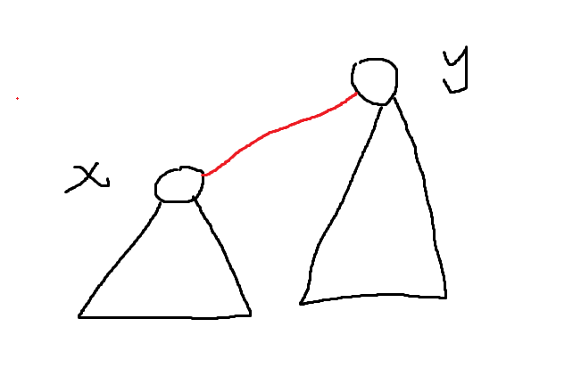
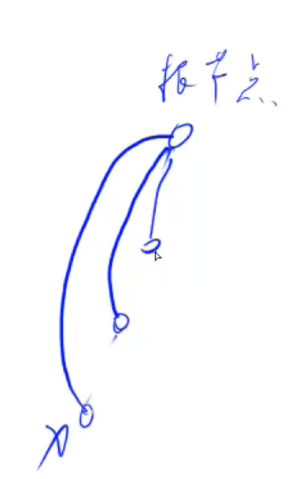

## 并查集

基本操作：在近乎O(1)的时间复杂度之内，完成这两个操作。

1. 将两个集合合并。
2. 询问两个元素是否在同一个集合当中。


暴力做法：

设置一个belong数组，存储目标数所在的集合，比如belong[x] = a, 表示数x属于集合a; 

如果要询问两个元素是否在同一个集合当中：

```c++
if(belong[x] == belong[y])   // 时间复杂度O(1)
```

但是如果要将两个集合合并，比如一个集合中有1000个元素，另一个集合中有2000个元素；合并后的集合总共三千个元素，暴力做法会：

```c++
for( Collection A ){
    belong[a] = belong[B]     //时间复杂度为O(n)
}
```


---

### 基本思想：

用树（不一定是二叉树）的方式来维持每一个集合, 树根的编号就是整个集合的编号。每个节点存储它的父结点，`p[x] 表示x的父结点`。

问题1： 如何判断树根？`if(p[x] == x)` , 将`p[x]`数组中的每一个值初始化为`x`

问题2： 如何求X的集合编号?  `while(p[x] != x)  x = p[x];`     **这里的时间复杂度是树的高度**。

问题3： 如何合并两个集合？

`x` 是 x的集合编号，`y` 是y的集合编号， `p[x] = y`表示将x的集合的父结点变成`y`，这样就使得能够第一个集合x可以直接插入到集合y的下面，成为y的子节点；





问题2可以进行优化（**路径压缩优化**）：一旦找到一条路径的根节点编号，就将这条路上的所有结点的父结点直接指向该集合的根节点。使得求X的集合编号的时间复杂度近乎变为`O(1)`.

 


### 典型例题1： 模板题

一共有 n 个数，编号是 1∼n，最开始每个数各自在一个集合中。

现在要进行 m 个操作，操作共有两种：

1. `M a b`，将编号为 a 和 b 的两个数所在的集合合并，如果两个数已经在同一个集合中，则忽略这个操作；
2. `Q a b`，询问编号为 a 和 b 的两个数是否在同一个集合中；

#### 输入格式

第一行输入整数 n 和 m。

接下来 m 行，每行包含一个操作指令，指令为 `M a b` 或 `Q a b` 中的一种。

#### 输出格式

对于每个询问指令 `Q a b`，都要输出一个结果，如果 a 和 b在同一集合内，则输出 `Yes`，否则输出 `No`。

每个结果占一行。

#### 数据范围

$1≤n,m≤10^5$

#### 输入样例：

```
4 5
M 1 2
M 3 4
Q 1 2
Q 1 3
Q 3 4
```

#### 输出样例：

```
Yes
No
Yes
```


#### 解答

```c++
#include<iostream>
using namespace std;

const int N = 1e5 + 10;
int p[N];
//关键操作
int find(int x){        //返回x的祖宗节点 + 路径压缩优化
    if(p[x] != x)   p[x] = find(p[x]);			//如果x的父亲结点不等于x(即不是根结点)，那么就把x的父结点变为根节点
    return p[x];
}


int main(){
    
    int n,m;
    cin >> n >> m;
    for(int i = 1 ; i <= n; i++)    p[i] = i;
    while(m -- ){
        char op[2];
        int a,b;
        scanf("%s%d%d", op, &a,&b);
        
        if(op[0] == 'M')    p[find(a)] = find(b);
        else{
            if( find(a) == find(b))     printf("Yes\n");
            else    printf("No\n");
        }
    }
    return 0;
}
```


### 典型例题2: 无向图连通块

给定一个包含 n 个点（编号为 1∼n）的无向图，初始时图中没有边。

现在要进行 m个操作，操作共有三种：

1. `C a b`，在点 a 和点 b 之间连一条边，a 和 b 可能相等；
2. `Q1 a b`，询问点 a 和点 b 是否在同一个连通块中，a 和 b 可能相等；
3. `Q2 a`，询问点 a 所在连通块中点的数量；

#### 输入格式

第一行输入整数 n和 m。

接下来 m 行，每行包含一个操作指令，指令为 `C a b`，`Q1 a b` 或 `Q2 a` 中的一种。

#### 输出格式

对于每个询问指令 `Q1 a b`，如果 a 和 b 在同一个连通块中，则输出 `Yes`，否则输出 `No`。

对于每个询问指令 `Q2 a`，输出一个整数表示点 a 所在连通块中点的数量

每个结果占一行。

#### 数据范围

$1≤n,m≤10^5$

#### 输入样例：

```
5 5
C 1 2
Q1 1 2
Q2 1
C 2 5
Q2 5
```

#### 输出样例：

```
Yes
2
3
```


#### 思路

与典型例题1的思路一致，用并查集来实现无向图中连通块的处理,与例题1相比,多了一个操作:询问当前连通块( 集合 )里的元素个数; 所以多使用了一个`msize()`数组;

在合并集合的操作过程中,`msize[ find(b) ] += msize[ find(a) ]` ,相当于我们只需要集合(树的)根结点的`msize[ ]`值有效即可．

#### 解答

```c++
#include<iostream>
#include<string>
using namespace std;

const int N = 1e5 + 10;

int p[N],msize[N];
int n,m;

int find( int x){
    if( p[x] != x)      p[x] = find(p[x]);
    return p[x];
}


int main(){
    cin >> n >> m;
    for(int i = 1 ; i<= n; i++){
        p[i] = i;
        msize[i] = 1;
    }
    
    while( m --){
        string op;
        cin >> op;
        if( op == "C"){
            int a,b;
            scanf("%d%d",&a,&b);
            if(find(a) == find(b))  continue;
            msize[find(b)] += msize[find(a)];
            p[ find(a) ] = find(b);

        }else if(op == "Q1"){
            int a,b;
            scanf("%d%d",&a,&b);
            if( find(a) == find(b))     printf("Yes\n");
            else    printf("No\n");
        }else{
            int x;
            scanf("%d",&x);
            printf("%d\n",msize[ find(x) ]);
        }
        
    }
    return 0;
}
```


### 典型例题3：维持关系集

动物王国中有三类动物 A,B,C这三类动物的食物链构成了有趣的环形。

A 吃 B，B 吃 C，C 吃 A。

现有 N 个动物，以 1∼N 编号。

每个动物都是 A,B,C 中的一种，但是我们并不知道它到底是哪一种。

有人用两种说法对这 N个动物所构成的食物链关系进行描述：

第一种说法是 `1 X Y`，表示 X 和 Y 是同类。

第二种说法是 `2 X Y`，表示 X 吃 Y。

此人对 N 个动物，用上述两种说法，一句接一句地说出 K 句话，这 K 句话有的是真的，有的是假的。

当一句话满足下列三条之一时，这句话就是假话，否则就是真话。

1. 当前的话与前面的某些真的话冲突，就是假话；
2. 当前的话中 X 或 Y 比 N 大，就是假话；
3. 当前的话表示 X 吃 X，就是假话。

你的任务是根据给定的 N 和 K 句话，输出假话的总数。

#### 输入格式

第一行是两个整数 N 和 K，以一个空格分隔。

以下 K 行每行是三个正整数 D，X，Y，两数之间用一个空格隔开，其中 D 表示说法的种类。

若 D=1，则表示 X 和 Y 是同类。

若 D=2，则表示 X 吃 Y。

#### 输出格式

只有一个整数，表示假话的数目。

#### 数据范围

1≤N≤50000,
0≤K≤100000

#### 输入样例：

```
100 7
1 101 1 
2 1 2
2 2 3 
2 3 3 
1 1 3 
2 3 1 
1 5 5
```

#### 输出样例：

```
3
```


#### 思路：

* 用并查集的树来维持一个关系：吃与被吃；由于只存在3种动物，每一个动物都属于这三种之一，且每一个动物都有自己的天敌, 和捕食者。**所以这道题的关键就是开三个拓展域。**

* 注意：以后用扩展的并查集合来维护关系


#### 解答：


```c++
#include<bits/stdc++.h>

using namespace std;

// x 同类域； x + n 捕食域； x+n+n 天敌域
// 由于最多有5万只动物，所以三个集合关系最多只需要150010
const int N = 1.5e5 + 10;
int p[N];
int n,k;
// 并查集模板
int find(int x){
    if(p[x] != x)   p[x] = find(p[x]);
    return p[x];
}


int main(){
    scanf("%d%d", &n, &k);
    // 注意这里的3*n的初始化
    for(int i = 1; i <= 3*n ; i ++)    p[i] = i;
    int res = 0;
    for(int j = 1; j<= k; j++)
    {
        int k,a,b;
        scanf("%d%d%d", &k, &a, &b);
        if(a > n || b > n){
            res++;
            continue;
        }  
        if(k == 1){
            // 如果a和b是同类，但是a在b的捕食域中, 或者a在b的天敌域中；错话
            if(find(a) == find(b + n) || find(a) == find(b + n+n))
            {
                res ++;
                continue;
            }else
            {
                // 三个域同时更新
                p[find(a)] = find(b);
                p[find(a + n)] = find(b + n);
                p[find(a + n + n)] = find( b+ n+n);
            }
        }else{
            // 如果a吃b，即a是b的天敌；但是a与b同类或者a在b的捕食域中
            if(find(a) == find(b) || find(a) == find(b + n)){
                res++;
                continue;
            }else{
                // 注意要更新三个关系：
                //a的捕食域中有b
                p[find(a + n)] = find(b);
                // a在b的天敌域中
                p[find(a)] = find(b + n + n);
                // a的天敌 在 b的捕食域中
                p[find(a + n + n)] = find(b + n);
            }
            
        }
    }
    printf("%d\n", res);
    return 0;
}
```


### Leetcode 周赛例题

给你一个整数 `n` ，表示有 `n` 个专家从 `0` 到 `n - 1` 编号。另外给你一个下标从 0 开始的二维整数数组 meetings ，其中 `meetings[i] = [xi, yi, timei]` 表示专家 `xi `和专家 `yi `在时间 `timei `要开一场会。一个专家可以同时参加 多场会议 。最后，给你一个整数 `firstPerson` 。

专家 0 有一个 秘密 ，最初，他在时间 0 将这个秘密分享给了专家 `firstPerson` 。接着，这个秘密会在每次有知晓这个秘密的专家参加会议时进行传播。更正式的表达是，每次会议，如果专家 `xi` 在时间` timei `时知晓这个秘密，那么他将会与专家 `yi `分享这个秘密，反之亦然。

秘密共享是 瞬时发生 的。也就是说，在同一时间，一个专家不光可以接收到秘密，还能在其他会议上与其他专家分享。

在所有会议都结束之后，返回所有知晓这个秘密的专家列表。你可以按 任何顺序 返回答案。


[5941. 找出知晓秘密的所有专家 - 力扣（LeetCode） (leetcode-cn.com)](https://leetcode-cn.com/problems/find-all-people-with-secret/)


#### 思路与解答

分享秘密，肯定涉及到集合的查找与合并，明显使用到了并查集。

但是这里涉及到了并查集的两个优化：**按秩合并， 路径压缩**。


```c++
class union_set{
public:
    vector<int> parent;
    // ranker表示并查集树的秩，也就是并查集树的深度
    vector<int> ranker;
    union_set(int n){
        parent.resize(n);
        ranker.resize(n);
        for(int i = 0; i < n;++i){
            parent[i] = i;
            ranker[i] = 1;
        }
    }
    int find(int x){
		if(patent[x] != x)	parent[x] = find(parent[x]);
        return parent[x];
    }
    bool unionElement(int x,int y){
        int fx = find(x),fy = find(y);
        if(fx == fy)return false;
        // 确保每次将深度小的子树连在深度大的树下
        if(ranker[fx] < ranker[fy])
            swap(fx,fy);
        parent[fy] = fx;
        // 只有两颗树深度相同时，合并在一起，树的深度才会增加
        if(ranker[fx] == ranker[fy])
            ++ranker[fx];
        return true;
    }
    
    // 分享一种新的unionElement的方法
    /*
    bool unionElement(int x,int y){
        int fx = find(x),fy = find(y);
        if(fx == fy)return false;
        if( ranker[fx] < ranker[fy]){
            parent[fx] = fy;
            ranker[fy] += ranker[fx];
        }else{
            parent[fy] = fx;
            ranker[fx] += ranker[fy];
        }
        return true;
    }
    */
    bool isConnected(int x,int y){
        int fx = find(x),fy = find(y);
        return fx == fy;
    }
    // disconnect解除连接
    bool disConnect(int x){
        parent[x] = x;
        return true;
    }
};
class Solution {
public:
    vector<int> findAllPeople(int n, vector<vector<int>>& meetings, int firstPerson) {
        // 这里sort也可以写成cmp的形式
        sort(meetings.begin(),meetings.end(),[](auto &lhs,auto &rhs){
           return lhs[2] < rhs[2]; 
        });
        union_set q(n);
        q.unionElement(0,firstPerson);
        int m = meetings.size();
        for(int i = 0; i < m;++i){
            //同一时间的建立连接
            int j = i+1;
            while(j < m && meetings[j][2] == meetings[i][2])    ++j;
            //开始合并，将同时发生的会议的所有与会者合并
            for(int k = i; k < j;++k){
                q.unionElement(meetings[k][0],meetings[k][1]);
            }
            //然后判断是不是跟已知的专家在一块儿
            for(int k = i; k < j;++k){
                // 如果不是和0号专家在同一个圈子里
                if(!q.isConnected(meetings[k][0],0)){
                    q.disConnect(meetings[k][0]);
                    q.disConnect(meetings[k][1]);
                }
            }
            i = j-1;
        }
        vector<int> res;
        for(int i = 0; i < n;++i){
            if(q.isConnected(0,i))  res.push_back(i);
        }
        return res;
    }
};
```

