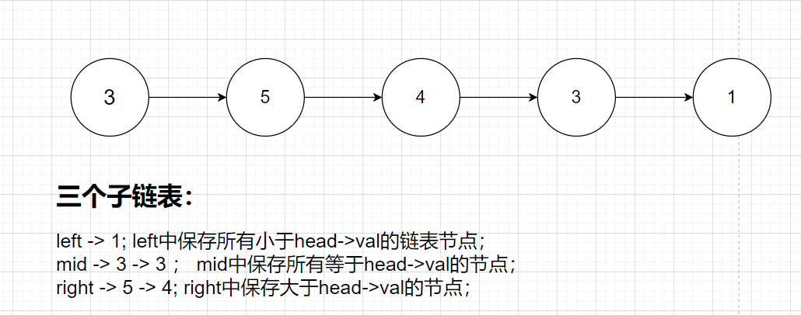

## 快速排序和归并排序

### 快速排序

算法步骤：

1. 确定分界点（array[ (l + r) / 2] 或者随机数 ）
2. 调整区间
3. 递归处理左右两段


**调整区间**： 即把大于等于分界点的数都放在分界点右边，小于分界点的数都放在分界点左边。一般采用双指针算法。

```c++
#include<bits/stdc++.h>

using namespace std;

const int N = 1e5 + 10;

int a[N];

void quick_sort(int l, int r){
    if( l >= r) return;
    // 注意这里的分界点一定不能选择下标， 不能选择int x = (l + r) >> 1;
    int x = a[( l + r) >> 1];
    int i = l - 1, j = r + 1;
    while( i < j ){
        do i ++ ; while(a[i] < x);
        do j -- ; while(a[j] > x);
        if( i < j)  swap(a[i], a[j]);
    }
    quick_sort(l, j);
    quick_sort(j + 1, r);
}

int main(){
    int n;
    scanf("%d", &n);
    
    for(int i = 0 ; i < n ; i ++){
        scanf("%d" , &a[i]);
    }
    
    quick_sort(0, n - 1);
    
    for(int i = 0; i < n ; i ++){
        printf("%d ", a[i]);
    }
    
    return 0;
    
}
```


#### 单链表快速排序

给定一个单链表，请使用快速排序算法对其排序。

要求：期望平均时间复杂度为 O(nlogn)，期望额外空间复杂度为 O(logn)。

**思考题：** 如果只能改变链表结构，不能修改每个节点的val值该如何做呢？

**数据范围**

链表中的所有数大小均在 int 范围内，链表长度在 [0,10000]

**输入样例：**

```
[5, 3, 2]
```

**输出样例：**

```
[2, 3, 5]
```


**思路：**

题目中要求的只改变链表结构，不改变每一个节点的val值是非常正确的，因为通常链表中每个节点不止含有一个value属性，往往还包含很多属性；如果要改变val值，那么通常就会连带着很多属性都要更改，这样的复杂度是系统不可接受的。而如果只改变指针指向，那就非常好。

同样采用快排的思路，找边界值: 这里边界值我们就可以选择head->val；

调整区间： 



每次调整完区间后，再递归处理左右两段；

```c++
/**
 * Definition for singly-linked list.
 * struct ListNode {
 *     int val;
 *     ListNode *next;
 *     ListNode(int x) : val(x), next(NULL) {}
 * };
 */
class Solution {
public:
    ListNode* get_tail(ListNode* head){
        while(head -> next) head = head -> next;
        return head;
    }

    ListNode* quickSortList(ListNode* head) {
        // 如果没有数,或者只有一个数
        if(!head || !head -> next) return head;
        
        // 相当于三段链表的虚拟头节点
        auto left = new ListNode(-1), mid = new ListNode(-1), right = new ListNode(-1);
        auto ltail = left, mtail = mid, rtail = right;
        // 边界值
        int val = head -> val;
        // 从前往后遍历一遍链表
        for(auto p = head; p; p = p -> next){
            if( p -> val < val) ltail = ltail -> next = p;        //等价于尾插法 ltail -> next = p; ltail = p;  
            else if( p -> val == val)   mtail = mtail -> next = p;
            else    rtail = rtail -> next = p;
        }
        // 给结尾一个结束标志
        ltail -> next = mtail -> next = rtail -> next = NULL;
        // 递归处理两段
        left -> next = quickSortList(left -> next);
        right -> next = quickSortList(right -> next);
        
        // 拼接三个链表
        get_tail(left) -> next = mid -> next;
        // 这里从mid开始也可以
        get_tail(left) -> next = right -> next;
        
        // delete掉新指针 其实更严谨
        auto p = left-> next;
        delete left;
        delete mid;
        delete right;
        
        return p;

    }
};
```


### 归并排序

```c++
#include<bits/stdc++.h>

using namespace std;

const int N = 1e5 + 10;
int n;
int a[N];

void printa(int a){
    cout << a << " ";
}

void merge(int l1, int r1,int l2,int r2){
    int i = l1, j = l2;
    // 这里要注意，要开辟新的数组，又因为是动态开辟的，所以选择指针；
    int *temp = new int[r2 - l1 + 1];
    int index = 0;
    while(i <= r1 && j <= r2){
        if(a[i] < a[j]) {
            temp[index++] = a[i++];
        }else{
            temp[index++] = a[j++];
        }
    }
    while(i <= r1){
        temp[index++] = a[i++];
    }
    
    while(j <= r2)  temp[index++] = a[j++];
    
    for(int k = 0; k < index; k++){
        a[l1 + k] = temp[k];
    }
}

void merge_sort(int l, int r){
    if( l >= r) return;
    int mid = l + r >> 1;
    merge_sort(l, mid);
    merge_sort(mid + 1, r);
    merge(l, mid, mid + 1, r);
}

int main(){
    cin >> n;
    for(int i = 0 ; i < n; i ++)
        scanf("%d", &a[i]);
    merge_sort(0, n-1);
    
    // for_each() 遍历算法
    for_each(a, a + n, printa);
    
    return 0;

        
}
```


#### 用归并排序的思想解决逆序对问题

```c++
#include<bits/stdc++.h>

using namespace std;

const int N = 1e5 + 10;
int n;
int a[N];
unsigned long long res;

void printa(int a){
    cout << a << " ";
}

void merge(int l1, int r1,int l2,int r2){
    int i = l1, j = l2;
    int *temp = new int[r2 - l1 + 1];
    int index = 0;
    while(i <= r1 && j <= r2){
        if(a[i] <= a[j]) {
            temp[index++] = a[i++];
        }else{
            // 仅仅加了这样一句，res += r1 - i + 1; 很巧妙，值得体会
            res += r1 - i + 1;
            temp[index++] = a[j++];
        }
    }
    while(i <= r1){
        temp[index++] = a[i++];
    }
    
    while(j <= r2)  temp[index++] = a[j++];
    
    for(int k = 0; k < index; k++){
        a[l1 + k] = temp[k];
    }
}

void merge_sort(int l, int r){
    if( l >= r) return;
    int mid = l + r >> 1;
    merge_sort(l, mid);
    merge_sort(mid + 1, r);
    merge(l, mid, mid + 1, r);
}

int main(){
    cin >> n;
    for(int i = 0 ; i < n; i ++)
        scanf("%d", &a[i]);
    merge_sort(0, n-1);
    
    cout << res << endl;
    
    return 0;

        
}
```

