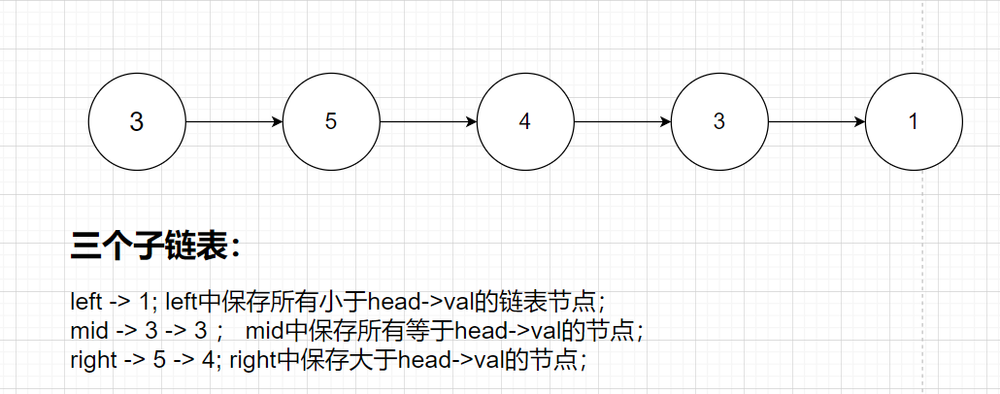

# 	排序算法

排序算法是一类非常经典和实用的算法。


## 快速排序和归并排序

### 快速排序

算法步骤：

1. 确定分界点（array[ (l + r) / 2] 或者随机数 ）
2. 调整区间
3. 递归处理左右两段


**调整区间**： 即把大于等于分界点的数都放在分界点右边，小于分界点的数都放在分界点左边。一般采用双指针算法。

```c++
#include<bits/stdc++.h>

using namespace std;

const int N = 1e5 + 10;

int a[N];

void quick_sort(int l, int r){
    // recursive condition
    if( l >= r) return;
    // 注意这里的分界点一定不能选择下标， 不能选择int x = (l + r) >> 1在while循环里比较;
    // 一定要把这个分界点的值在循环前设置出来, 因为在while()循环中，mid = (l + r) >> 1， a[mid]这个数的值是会因为交换而变的
    int x = a[( l + r) >> 1];
    int i = l - 1, j = r + 1;
    while( i < j ){
        do i ++ ; while(a[i] < x);
        do j -- ; while(a[j] > x);
        if( i < j)  swap(a[i], a[j]);
    }
    /*
    while( i < j ){
		while(a[i] < x)  i ++;
		while(a[j] > x)  j --;
		if(i < j)   swap(a[i], a[j]);
	}
    */
    quick_sort(l, j);
    quick_sort(j + 1, r);
}

int main(){
    int n;
    scanf("%d", &n);
    
    for(int i = 0; i < n; i ++){
        scanf("%d" , &a[i]);
    }
    
    quick_sort(0, n - 1);
    
    for(int i = 0; i < n ; i ++){
        printf("%d ", a[i]);
    }
    
    return 0;
    
}
```


```java
public static void quick_sort(int l, int r) {
    if (l >= r) return;
    int x = a[(l + r) >> 1];
    int i = l - 1, j = r + 1;
    while (i < j) {
        do i ++; while (a[i] < x);
        do j --; while (a[j] > x);
        if (i < j) {
            int temp = a[i];
            a[i] = a[j];
            a[j] = temp;
        }
    }
    quick_sort(l, j);
    quick_sort(j + 1, r);
}
```


#### 单链表快速排序

给定一个单链表，请使用快速排序算法对其排序。

要求：期望平均时间复杂度为 O(nlogn)，期望额外空间复杂度为 O(logn)。

**思考题：** 如果只能改变链表结构，不能修改每个节点的val值该如何做呢？

**数据范围**

链表中的所有数大小均在 int 范围内，链表长度在 [0,10000]

**输入样例：**

```
[5, 3, 2]
```

**输出样例：**

```
[2, 3, 5]
```


**思路：**

题目中要求的只改变链表结构，不改变每一个节点的val值是非常正确的，因为通常链表中每个节点不止含有一个value属性，往往还包含很多属性；**如果要改变val值，那么通常就会连带着很多属性都要更改**，这样的复杂度是系统不可接受的。而如果只改变指针指向，那就非常好。

同样采用快排的思路，找边界值:  这里边界值我们就可以选择`head->val`；

调整区间： 



每次调整完区间后，再递归处理左右两段；

```c++
/**
 * Definition for singly-linked list.
 * struct ListNode {
 *     int val;
 *     ListNode *next;
 *     ListNode(int x) : val(x), next(NULL) {}
 * };
 */
class Solution {
public:
    ListNode* get_tail(ListNode* head){
        while(head -> next) head = head -> next;
        return head;
    }

    ListNode* quickSortList(ListNode* head) {
        // 如果没有数,或者只有一个数
        if(!head || !head -> next) return head;
        
        // 相当于三段链表的虚拟头节点
        auto left = new ListNode(-1), mid = new ListNode(-1), right = new ListNode(-1);
        auto ltail = left, mtail = mid, rtail = right;
        // 边界值
        int pivot = head -> val;
        // 从前往后遍历一遍链表
        for(auto p = head; p; p = p -> next){
            if( p -> val < pivot) ltail = ltail -> next = p;        //等价于尾插法 ltail -> next = p; ltail = p;  
            else if( p -> val == pivot)   mtail = mtail -> next = p;
            else    rtail = rtail -> next = p;
        }
        // 给结尾一个结束标志
        ltail -> next = mtail -> next = rtail -> next = NULL;
        // 递归处理两段
        left -> next = quickSortList(left -> next);
        right -> next = quickSortList(right -> next);
        
        // 拼接三个链表
        get_tail(left) -> next = mid -> next;
        // 这里从mid开始也可以, 因为已经拼接好了
        get_tail(left) -> next = right -> next;
        
        // delete掉新指针 其实更严谨
        auto p = left -> next;
        delete left;
        delete mid;
        delete right;
        return p;
    }
};
```


### 归并排序

```c++
#include<bits/stdc++.h>

using namespace std;

const int N = 1e5 + 10;
int n;
int a[N];

void printa(int a){
    cout << a << " ";
}

void merge(int l1, int r1,int l2,int r2){
    int i = l1, j = l2;
    // 这里要注意，要开辟新的数组，又因为是动态开辟的，所以选择指针；
    int *temp = new int[r2 - l1 + 1];
    int index = 0;
    while(i <= r1 && j <= r2){
        if(a[i] < a[j]) {
            temp[index++] = a[i++];
        }else{
            temp[index++] = a[j++];
        }
    }
    while(i <= r1){
        temp[index++] = a[i++];
    }
    
    while(j <= r2)  temp[index++] = a[j++];
    
    for(int k = 0; k < index; k++){
        a[l1 + k] = temp[k];
    }
}

void merge_sort(int l, int r){
    if( l >= r) return;
    int mid = l + r >> 1;
    merge_sort(l, mid);
    merge_sort(mid + 1, r);
    merge(l, mid, mid + 1, r);
}

int main(){
    cin >> n;
    for(int i = 0 ; i < n; i ++)
        scanf("%d", &a[i]);
    merge_sort(0, n-1);
    // for_each() 遍历算法
    for_each(a, a + n, printa);
    return 0;
}
```


#### 用归并排序的思想解决逆序对问题

```c++
#include<bits/stdc++.h>

using namespace std;

const int N = 1e5 + 10;
int n;
int a[N];
// C++写算法题，设置变量的时候一定要小心溢出
unsigned long long res;

void printa(int a){
    cout << a << " ";
}

void merge(int l1, int r1,int l2,int r2){
    int i = l1, j = l2;
    int *temp = new int[r2 - l1 + 1];
    int index = 0;
    while(i <= r1 && j <= r2){
        if(a[i] <= a[j]) {
            temp[index++] = a[i++];
        }else{
            // 仅仅加了这样一句，res += r1 - i + 1; 很巧妙，值得体会
            res += r1 - i + 1;
            temp[index++] = a[j++];
        }
    }
    while(i <= r1){
        temp[index++] = a[i++];
    }
    
    while(j <= r2)  temp[index++] = a[j++];
    
    for(int k = 0; k < index; k++){
        a[l1 + k] = temp[k];
    }
}

void merge_sort(int l, int r){
    if( l >= r) return;
    int mid = l + r >> 1;
    merge_sort(l, mid);
    merge_sort(mid + 1, r);
    merge(l, mid, mid + 1, r);
}

int main(){
    cin >> n;
    for(int i = 0 ; i < n; i ++)
        scanf("%d", &a[i]);
    merge_sort(0, n-1);
    cout << res << endl; 
    return 0;    
}
```


#### 单链表归并排序

> [Leetcode 148 排序链表](https://leetcode.cn/problems/sort-list/)
>
> 下面这个做法时间复杂度O(nlogn), 由于涉及到递归，需要系统栈，所以空间复杂度O(n)

```cpp
/**
 * Definition for singly-linked list.
 * struct ListNode {
 *     int val;
 *     ListNode *next;
 *     ListNode() : val(0), next(nullptr) {}
 *     ListNode(int x) : val(x), next(nullptr) {}
 *     ListNode(int x, ListNode *next) : val(x), next(next) {}
 * };
 */
class Solution {
public:
    ListNode* sortList(ListNode* head) {
        if (head == nullptr || head -> next == nullptr) return head;
        // 利用快慢指针找到中间节点，并将其分为 [head, fast], [slow, (tail)] 两段
        ListNode* fast = head;
        ListNode* slow = head;
        while (!fast->next && !fast->next->next) {
            fast = fast->next->next;
            slow = slow->next;
        }

        fast = slow;
        slow = slow->next;
        fast->next = nullptr;
		// 利用递归分隔两段
        auto l1 = sortList(head);
        auto l2 = sortList(slow);
        // 合并两段有序链表
        return merge_list(l1, l2);
    }

    ListNode* merge_list(ListNode* l1, ListNode* l2) {
        // 虚拟头结点dummy
        ListNode* dummy = new ListNode(-1);
        ListNode* current = dummy;
        // 归并排序合并的思想
        while (l1 != nullptr && l2 != nullptr) {
            if (l1->val < l2->val) {
                current->next = l1;
                l1 = l1->next;
            }else {
                current->next = l2;
                l2 = l2->next;
            }
            current = current->next;
        }

        current->next = (l1 != nullptr ? l1 : l2);
        return dummy->next;
    }
};

```


## 计数排序

计数排序： 是一种稳定的线性时间排序算法，主要采用空间换时间的策略。

基本思想：使用一个额外的数组或者map： counter。 counter[i]是待排序数组中值为i的元素的个数。 counter的长度取决于待排序数组中数据的范围（等于待排序数组的最大值和最小值的差 + 1）， 再进行一次**分配，收集**处理。

### leetcode347 前K个高频元素

> [leetcode 347](https://leetcode.cn/problems/top-k-frequent-elements/)

给你一个整数数组 nums 和一个整数 k ，请你返回其中出现频率前 k 高的元素。你可以按 任意顺序 返回答案。要求时间复杂度优于$O(nlogn)$

```
示例 1:

输入: nums = [1,1,1,2,2,3], k = 2
输出: [1,2]
示例 2:

输入: nums = [1], k = 1
输出: [1]
```


**解答思路：**

采用计数排序的思想，首先设置一个`unordered_map`存储所有元素出现的次数.

再设置一个额外的数组`s`来表示“次数桶子”。`s[i] = 2`表明在`nums[]`数组中，出现i次的元素有两个。

```cpp
class Solution {
public:
    vector<int> topKFrequent(vector<int>& nums, int k) {
        unordered_map<int, int> counter;
        for (auto i : nums) counter[i] ++;
        int n = nums.size();
        // s表示次数的集合，s[1] = 2; 表明出现频次是1的有2个元素
        vector<int> s (n + 1, 0);
        for (auto [key, value] : counter) {
            s[value] ++;
        }

        vector<int> res;
        int i = n;
        // 从高频率的桶子开始找出现频次的边界i
        for ( ; i >= 0 && k > 0; i --) {
            if (s[i] != 0)  k -= s[i];
        }

        for (auto [key, value] : counter) {
            if (value > i) {
                res.push_back(key);
            }
        }

        return res;
    }
};
```

