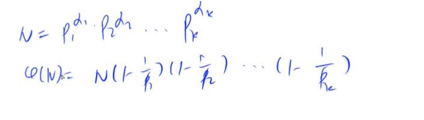
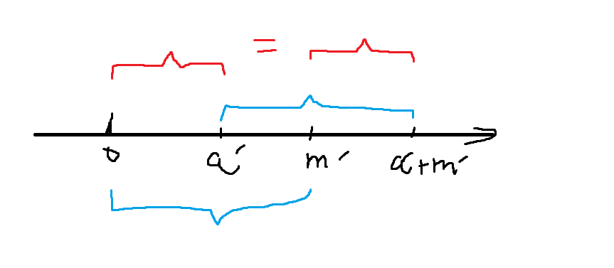

# 求欧拉函数

$\varphi(n)$ : 表示1~n 中与n互质的数的个数。


比如n = 6, 在 1、2、3、4、5、6 ； $\varphi(n) $ = 2;  

其中1、5与6互质。




N = 6 = 2 * 3；

证明： 容斥原理； 

* 从1~N中去掉p1,p2,...pk的所有倍数的个数： 

$$
N - \frac{N}{p_1} - \frac{N}{p_2}-\frac{N}{p_3}-...-\frac{N}{p_k}
$$

* 加上所有$P_{i}*P_{j}$的倍数

$$
N - \frac{N}{p_1} - \frac{N}{p_2}-\frac{N}{p_3}-...-\frac{N}{p_k} + \frac{N}{p_1p_2} + \frac{N}{p_1p_3} + ...
$$


* 减去所有$P_{i}*P_{j}*P_{k}$

**最后的公式**是：
$$
N(1-\frac{1}{p_1})(1-\frac{1}{p_2})...(1-\frac{1}{p_k})
$$


欧拉定理：

若a与n互质，则$a^{\varphi(n)} = 1 \quad (\mod n)$,  即a的欧拉函数n的次幂， 再mod n ， 等于1。


## 单纯求一个数的欧拉函数


```c++
#include<bits/stdc++.h>

using namespace std;


int main(){
    int n;
    cin >> n;
   
    while( n --){
        int a;
        cin >> a;
        
        int res = a;
        
        for(int i = 2; i <= a / i; i++){
            if(a % i == 0){
                res = res / i * (i - 1);
                while(a % i == 0)   a/=i;
            }
        }
        
        // 因为不能有小数，都是整数运算，所以公式要变形一下
        if( a > 1)  res = res / a * ( a -1 );
        
        cout << res << endl;
    }
    
    
    return 0;
}
```


## 筛选法求欧拉函数

欧拉函数的性质： 积性函数，如果m,n互质，则

$\varphi(mn) = \varphi(m)*\varphi(n)$

* 质数`i`的欧拉函数为`phi[i] = i - 1 `: 1 ~ (i - 1) 均与 `i`  互质，总共i - 1个。
* 当`i`不是质数的时候， 用最小质因子来计算：
  * 如果$i \% p ==0$;  gcd(i,p) = p ;   $\varphi(i) = i*(1-\frac{1}{p_1})*...*(1-\frac{1}{p_k})$
  * `phi[primes[j] * i]` 分为两种情况：


$$
if(i \mod p_{j}==0): \\
\varphi(p_{j}*i) = p_{j}*i * (1-\frac{1}{p_1})*...*(1-\frac{1}{p_k}) = p_{j}*\varphi(i) \\\
else: (i \mod p_{j} != 0):	说明i 与 p_{j}互质，但是i不一定是质数\\
\varphi(p_{j}*i)=  \varphi(p_{j}) * \varphi(i)=(p-1) * \varphi(i)
$$

### 典型例题：

给定一个正整数 n，求 1∼n 中每个数的欧拉函数之和。

#### 输入格式

共一行，包含一个整数 n。

#### 输出格式

共一行，包含一个整数，表示 1∼n中每个数的欧拉函数之和。

#### 数据范围

$1≤n≤10^6$

#### 输入样例：

```
6
```

#### 输出样例：

```
12
```


#### 解答：


```c++
#include<bits/stdc++.h>

using namespace std;
const int N = 1e6 + 10;
int primes[N], euler[N], cnt;
// st[] = false 表示是质数； st[] = true 表示是合数
bool st[N];
// 由于欧拉函数之和可能会超过int的范围，所以使用long long
typedef long long LL;

    
LL get_ruler(int n){
    // 欧拉函数[1] = 1是初始化，1与1互质
    euler[1] = 1;
    for(int i = 2; i <= n; i++){
        if(!st[i]){
            primes[cnt++] = i;
            // 当i为质数
            euler[i] = i - 1;
        }
        
        for(int j = 0; primes[j] <= n / i; j ++){
            st[primes[j] * i ] = true;
            if( i % primes[j] == 0){
                euler[primes[j] * i] = primes[j] * euler[i];
                break;
            }else{
                euler[primes[j] * i] = (primes[j] - 1) * euler[i];
            } 
        }
    }
    LL res = 0;
    for(int i = 1; i <= n; i ++)    res += euler[i];
    
    return res;
    
    
}

int main(){
    int n;
    scanf("%d", &n);
    cout << get_ruler(n) << endl;
    
    return 0;
}
```


## 欧拉函数典型例题2：Acwing 3999 最大公约数

给定两个正整数 a,m, 其中 a<m。

请你计算，有多少个小于 m 的非负整数 x 满足：

gcd(a,m)=gcd(a+x,m)

#### 输入格式

第一行包含整数 T，表示共有 T 组测试数据。

每组数据占一行，包含两个整数 a,m。

#### 输出格式

每组数据输出一行结果，一个整数，表示满足条件的非负整数 x 的个数。

#### 数据范围

前三个测试点满足，1≤T≤10.
所有测试点满足，$ 1≤T≤50，1≤a<m≤10^10 $

#### 输入样例：

```
3
4 9
5 10
42 9999999967
```

#### 输出样例：

```
6
1
9999999966
```

#### 解答和思路

数学问题的算法题首先要有思路
$$
\begin{align}
& 不妨设 d = gcd(a , m) = gcd( a + x , m); \\
& \because d | a ,\quad d| m, \quad d|(a + x)\\
& \therefore d | x \\
& a' = \frac{a}{d},\quad m' = \frac{m}{d}, \quad x' = \frac{x}{d} \\
& (a' + x' , m') = 1 \quad(即 a'+x'与m'的最大公约数是1， 也即a'+x'与m'互质) \\
& \because 0<=x<=m \\
& \therefore 0<= x' <= m' \\
& 所以题目意思转变为， 求[a', a'+ x')中有多少个数与m'互质 \\


\end{align}
$$

$$
\begin{align}
& [0,a') 区间与[m', a'+m')区间对于m'取模的结果相同 \\
& 所以最后转变为求[0,m')中与m'互质的个数有多少个，即欧拉函数\varphi(m')
\end{align}
$$


```c++
#include<bits/stdc++.h>

using namespace std;

typedef long long LL;

LL gcd(LL a, LL b){
    if(b == 0)  return a;
    else{
        return gcd(b, a % b);
    }
}

LL solve(LL a, LL m){
    LL d = gcd(m,a);
    LL mm = m / d;
    LL ans = mm;
    for(int i = 2; i <= mm / i; i++){
        if(mm % i == 0){
            ans = ans / i * (i - 1);
            while(mm % i == 0)  mm /= i;
        }
    }
    
    if(mm > 1)  ans = ans / mm *(mm - 1);
    return ans;
    
    
}

int main(){
    int n;
    cin >> n;
    while(n--){
        LL a,m;
        cin >> a >> m;
        cout << solve(a, m) << endl;
    }
    
    return 0;
}
```