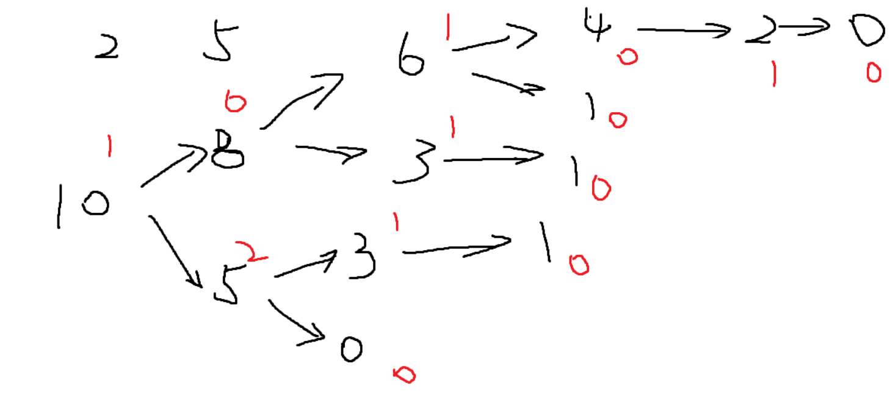

## 简单博弈论

### Nim游戏

概念梳理：

- 先手必胜态：双方都绝顶聪明，每次都采取最优策略玩游戏，只要先手通过某一个操作，让后手处于“先手必败态”，则他此时是先手必胜态。
- 先手必败态：无论采取何种策略，只要另一名玩家用响应的策略，必输的状态。

以一个题目为例：

给定 n 堆石子，两位玩家轮流操作，每次操作可以从任意一堆石子中拿走任意数量的石子（可以拿完，但不能不拿），最后无法进行操作的人视为失败。

问如果两人都采用最优策略，先手是否必胜。

#### 输入格式

第一行包含整数 n。

第二行包含 n 个数字，其中第 i 个数字表示第 i 堆石子的数量。

#### 输出格式

如果先手方必胜，则输出 `Yes`。

否则，输出 `No`。

#### 数据范围

$1≤n≤10^5$,
$1≤ 每堆石子数 ≤10^9$

#### 输入样例：

```
2
2 3
```

#### 输出样例：

```
Yes
```


#### 思路和解答：

当两名玩家A、B，玩只有两堆石头，每堆石头数分别是2，3；则先手A可以先在数量为3的那堆石头中拿一块石头，使之变成2,2；这样，无论B怎么拿取石头，A只要跟他保持镜像的策略，最终一定是B没有石头可拿，B必败。

**公式**：设所有石头堆里的石头数目分别是$a_{1},a_{2}, a_{3},a_{4}...a_{n}$, 只要满足$a_{1} \wedge a_{2}\wedge a_{3}\wedge a_{4}... \wedge a_{n} != 0$ 则先手必胜，他要做的策略就是拿出某些石子，使得$a_{1} \wedge a_{2}\wedge a_{3}\wedge a_{4}... \wedge a_{n} = 0$ ,让后手处于‘先手必败态’ 。

先手拿取的策略是什么呢？

假设$a_{1} \wedge a_{2}\wedge a_{3}\wedge a_{4}... \wedge a_{n} = x != 0$, 且x的二进制表达中最高位1在第k位。则$a_{1},a_{2}, a_{3},a_{4}...a_{n}$中必然有一位数$a_i$的第k位是1，则先手A需要在$a_i$中拿取$a_i - (a_i \wedge x)$的石子数，让$a_i$减小成$a_i \wedge x$， 这样$a_{1} \wedge a_{2}\wedge a_{3}\wedge a_{4}... \wedge a_{n} = 0$ .结束

为什么选用异或$\wedge$ 这个运算符来计算呢？ 因为只有两个相同的数异或，才能得到答案为0，否则答案都是非零的。


```c++
#include <bits/stdc++.h>

using namespace std;

int n;
int main(){
    int res = 0;
    scanf("%d", &n);
    while( n --){
        int x;
        scanf("%d", &x);
        res ^= x;
    }
    
    if(res == 0)   puts("No");
    else    puts("Yes");
    
    return 0;
}
```


### Nim游戏---台阶

现在，有一个 n 级台阶的楼梯，每级台阶上都有若干个石子，其中第 i 级台阶上有 $a_i$ 个石子(i≥1)。

两位玩家轮流操作，每次操作可以从任意一级台阶上拿若干个石子放到下一级台阶中（不能不拿）。

已经拿到地面上的石子不能再拿，最后无法进行操作的人视为失败。

问如果两人都采用最优策略，先手是否必胜。

#### 输入格式

第一行包含整数 n。

第二行包含 n 个整数，其中第 i 个整数表示第 i 级台阶上的石子数 $a_i$。

#### 输出格式

如果先手方必胜，则输出 `Yes`。

否则，输出 `No`。

#### 数据范围

$1≤n≤10^5,$
$1≤a_i≤10^9.$

#### 输入样例：

```
3
2 1 3
```

#### 输出样例：

```
Yes
```


#### 解答与思路

台阶型的Nim游戏，先说结论：**只需要看奇数阶层的台阶上的石子数量，如果$a_{1} \wedge a_{3} \wedge ... \wedge a_{2x+1} = 0  $ , 则先手必败，若不等于0，则先手必胜： 先手的操作只需要通过搬移石子，让奇数阶上的石子的数量异或后为0。**

证明：
先手时，如果奇数台阶异或非0，根据经典Nim游戏，先手总有一种方式使奇数台阶异或为0，于是先手留了奇数台阶异或为0的状态给后手
于是轮到后手：
①当后手移动偶数台阶上的石子时，先手只需将对手移动的石子继续移到下一个台阶，这样奇数台阶的石子相当于没变，于是留给后手的又是奇数台阶异或为0的状态
②当后手移动奇数台阶上的石子时，留给先手的奇数台阶异或非0，根据经典Nim游戏，先手总能找出一种方案使奇数台阶异或为0
因此无论后手如何移动，先手总能通过操作把奇数异或为0的情况留给后手，当奇数台阶全为0时，只留下偶数台阶上有石子。
（核心就是：先手总是把奇数台阶异或为0的状态留给对面，即总是将必败态交给对面）

因为偶数台阶上的石子要想移动到地面，必然需要经过偶数次移动，又因为奇数台阶全0的情况是留给后手的，因此先手总是可以将石子移动到地面，当将最后一个（堆）石子移动到地面时，后手无法操作，即后手失败。

因此如果先手时奇数台阶上的值的异或值为非0，则先手必胜，反之必败！


```c++
#include<bits/stdc++.h>

using namespace std;

int main(){
    int n;
    scanf("%d", &n);
    int res = 0;
    for(int i = 1; i <= n; i++){
        int x;
        scanf("%d", &x);
        if(i & 1){
            res ^= x;           // 初始化为0的目的是，0与任何数x异或 = x;
        }
    }
    if(res == 0)    puts("No");
    else    puts("Yes");
    
    
    return 0;
}
```


### Nim游戏---集合

给定 n 堆石子以及一个由 k 个不同正整数构成的数字集合 S。

现在有两位玩家轮流操作，每次操作可以从任意一堆石子中拿取石子，每次拿取的石子数量必须包含于集合 S，最后无法进行操作的人视为失败。

问如果两人都采用最优策略，先手是否必胜。

#### 输入格式

第一行包含整数 k，表示数字集合 S 中数字的个数。

第二行包含 k 个整数，其中第 i 个整数表示数字集合 S 中的第 i 个数 $s_i$。

第三行包含整数 n。

第四行包含 n 个整数，其中第 i 个整数表示第 i 堆石子的数量 $h_i$。

#### 输出格式

如果先手方必胜，则输出 `Yes`。

否则，输出 `No`。

#### 数据范围

1≤n,k≤100,
$1≤s_i,h_i≤10000$

#### 输入样例：

```
2
2 5
3
2 4 7
```

#### 输出样例：

```
Yes
```


#### 解答与思路：

结论：**当所有石子数目$x_i$ 的sg函数异或结果$sg(x_1) \wedge sg(x_2) \wedge sg(x_3) ....\wedge sg(x_n) = 0$, 则先手必输，反之若不等于0，则先手必胜！ **


SG函数定义：

在有向图游戏中，对于每个节点x，设从x出发共有k条有向边，分别到达节点y1, y2, ..., yk，定义SG(x)为x的后继节点y1, y2, ..., yk 的SG函数值构成的集合再执行mex(S)运算的结果，即：SG(x) = mex({SG(y1), SG(y2), ..., SG(yk)})

特别地，整个有向图游戏G的SG函数值被定义为**有向图游戏起点s的SG函数值**，即SG(G) = SG(s)。


Mex运算：

设S表示一个非负整数集合。定义mex(S)为求出不属于集合S的最小非负整数的运算，即：
mex(S) = min{x}, x属于自然数，且x不属于S。


那么每一堆石子数目的sg()函数怎么求解呢？

画图：



假设仅有一堆石子，数目为10块，现在有两种取石子的方案，一次取2颗和一次取5颗；这样所有取石子的方案就会形成一棵状态树。定义所有末尾状态的sg()函数值为0，倒着推，可以得到整个图游戏的sg()为sg(10) = 1;


所以如果有n堆石子，就有n个这样的状态图，每一张图都需要计算一遍它的sg()函数值。


```c++
#include <bits/stdc++.h>

using namespace std;
const int N = 110, M = 10010;
int n,m;
// s[]表示石子个数，f[]表示SG函数的值
int s[N], f[M];

// 记忆化搜索，动态规划的一种实现方式
// 由于每一堆石子的拿与不拿都是一棵二叉树，每一个节点表示一个状态，存储能够当前还剩
// 多少块石子
// 用递归深度遍历一遍所有的状态；
int sg(int x){
    // 如果这个x已经被计算过了，直接返回，避免时间复杂度达到指数级别
    if(f[x] != -1)  return f[x];
    // 每次递归都新定义一个哈希表,新定义一个哈希表的原因是，根据sg函数的定义，推测某个状态的sg函数时
    // 只需要考虑与它紧紧相邻的那个节点的sg()值
    unordered_set<int> S;
    // 遍历一遍所有可以选择拿石子的方案
    for(int i = 0; i < m; i ++){
        // sum是要拿的石子数
        int sum = s[i];
        // 如果当前剩下的石子数大于可以拿的石子数
        // 则拿走，并将新状态保存到一个哈希表中
        if(x >= sum)    S.insert(sg(x - sum));
    }

    // 从小到达遍历所有的非负数
    for(int i = 0; ; i++){
        // 如果当前这个数i没有在S中存在过，则根据sg函数的定义，返回这个值
        // 并将sg函数值存储到f[]数组中
        if(!S.count(i))
            return f[x] = i;
    }

}

int main(){
    cin >> m;
    for(int i = 0 ;i < m; i ++){
        cin >> s[i];
    }

    cin >> n;
    //f[]数组初始化为-1
    memset(f,-1,sizeof f);

    for(int i = 0; i < n; i ++){
        int x;
        cin >> x;
        res ^= sg(x);
    }

    if(res) puts("Yes");
    else    puts("No");


    return 0;
}
```


### Nim游戏--拆分

给定 n 堆石子，两位玩家轮流操作，每次操作可以取走其中的一堆石子，然后放入两堆**规模更小**的石子（新堆规模可以为 0，且两个新堆的石子总数可以大于取走的那堆石子数），最后无法进行操作的人视为失败。

问如果两人都采用最优策略，先手是否必胜。

#### 输入格式

第一行包含整数 n。

第二行包含 n 个整数，其中第 i 个整数表示第 i 堆石子的数量 $a_i$。

#### 输出格式

如果先手方必胜，则输出 `Yes`。

否则，输出 `No`。

#### 数据范围

$1≤n,a_i≤100$

#### 输入样例：

```
2
2 3
```

#### 输出样例：

```
Yes
```


#### 思路与解答

SG定理：

即a[i]可以拆分成`(b[i],b[j])`,为了避免重复规定`b[i]>=b[j]`,即：`a[i]>=b[i]>=b[j]`
相当于一个局面拆分成了两个局面，由SG函数理论，多个独立局面的SG值，等于这些局面SG值的异或和。
因此需要存储的状态就是`sg(b[i])^sg(b[j])`（与集合-Nim的唯一区别）

```c++
#include<bits/stdc++.h>

using namespace std;

const int N = 110;

int n;
int f[N];

int sg(int x){
    if(f[x] != -1 ) return f[x];
    
    unordered_set<int> S;
    
    for(int i= 0; i < x; i++){
        for(int j = 0; j <= i; j++){
            S.insert(sg(i) ^ sg(j));					// 这一步是关键的，与上一步有所区分。
        }
    }

    //Mex操作
    
    for(int i = 0; ; i ++){
        if(!S.count(i)){
            return f[x] = i;
        }
    }
}

int main(){
    int n;
    cin >> n;
    
    int res = 0;
    
    memset(f, -1, sizeof f);
    
    for(int i = 0; i < n; i ++){
        int x; 
        cin >> x;
        res ^= sg(x);
    }
    if(res)     puts("Yes");
    else    puts("No");
    
    return 0;
}
```

