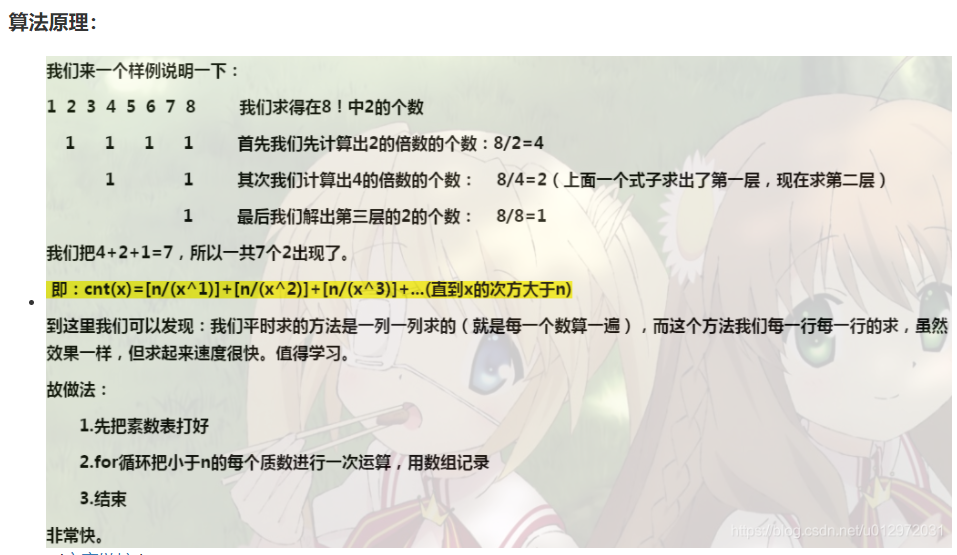
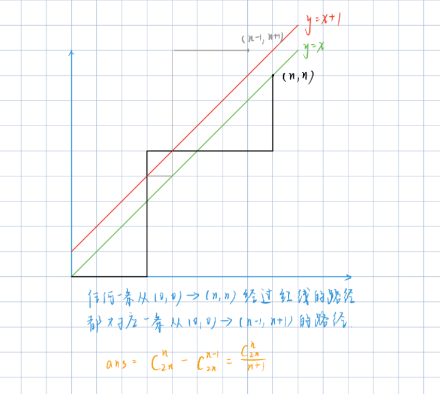
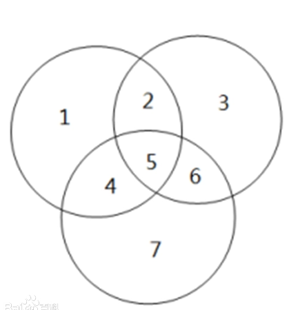

# 组合计数（阶乘分解，卡特兰数）-容斥原理

## 阶乘分解经典例题

给定整数 N，试把阶乘 N! 分解质因数，按照算术基本定理的形式输出分解结果中的 $p_i$ 和 $c_i$ 即可。

#### 输入格式

一个整数 N。

#### 输出格式

N!分解质因数后的结果，共若干行，每行一对 $p_i,c_i$，表示含有 $p_{i}^{c_{i}} $项。按照 $p_i$ 从小到大的顺序输出。

#### 数据范围

$1≤N≤10^6$

#### 输入样例：

```
5
```

#### 输出样例：

```
2 3
3 1
5 1
```

#### 样例解释

$5!=120=2^3∗3∗5$


#### 解答和思路



$8！= 2^7 \times3^2 \times 5 \times 7 $

```c++
#include<bits/stdc++.h>

using namespace std;

const int N = 1000010;

int primes[N],cnt;
bool st[N];

// 线性筛，筛出所有小于n的质数
void get_primes(int n){
    for(int i = 2; i <= n ; i++){
        if(!st[i])  primes[cnt++] = i;
        // 注意primes[j] <= n / i;
        for(int j = 0 ; primes[j] <= n / i; j ++){
            st[primes[j] * i] = true;
            if( i % primes[j] == 0)  break;
        }
    }
}

int main(){
    int n;
    cin >> n;
    // 首先把质数放入primes[]数组中
    get_primes(n);
    
    //从小到达列举所有的质数，并将这一轮中所有质数p的倍数全部计数一遍
    for(int i = 0; i < cnt; i ++){
        int p = primes[i];
        // s表示个数，t表示temp
        int s = 0, t = n;
        while(t) {                          // n / p + n / p^2 + 
            s += t / p;
            t /= p;
        }
        printf("%d %d\n", p, s);
    }
    
    return 0;
    
}


```


## 组合计数

记公式：

公式1： $C_{a}^{b} = \frac{a\times(a-1) \times ... \times(a - b + 1)}{ 1 \times 2 \times 3 ... \times b}$

公式2： $C_{a}^{b} = C_{a-1}^{b-1} + C_{a-1}^{b}$

公式3： 运用Lucas定理： $C_{a}^{b} = C_{a \mod p}^{b \mod p} \times C_{a /p}^{b/p} (\mod p)$

并且组合计数，一定要考虑数据范围。

### 例题：组合计数1 预处理方法

给定 n 组询问，每组询问给定两个整数 a，b，请你输出 $C_{a}^{b}mod(10^9+7)$的值。

#### 输入格式

第一行包含整数 n。

接下来 n 行，每行包含一组 a 和 b。

#### 输出格式

共 n 行，每行输出一个询问的解。

#### 数据范围

1≤n≤10000,
1≤b≤a≤2000

#### 输入样例：

```
3
3 1
5 3
2 2
```

#### 输出样例：

```
3
10
1
```


时间复杂度最大为：$O(a^2)≈ 4e6$级别

```c++
#include<bits/stdc++.h>

using namespace std;

const int N = 2010, mod = 1e9 + 7;

int c[N][N];

void init(){
    for(int i = 0; i < N; i ++)
        for(int j = 0; j <= i; j++)					// j <= i 就是C的上限的数不能超过下面的数。
            if(!j)  c[i][j] = 1;
            else    c[i][j] = (c[i-1][j] + c[i - 1][j - 1]) % mod;
}

int main(){
    init();
    int n;
    cin >> n;
    while( n --){
        int a,b;
        cin >> a>> b;
        cout << c[a][b]<< endl;
    }
    return 0;
}
```


### 例题2：组合计数2

给定 n 组询问，每组询问给定两个整数 a，b，请你输出 $C_{b}^{a} \mod (10^9+7)$ 的值。

#### 输入格式

第一行包含整数 n。

接下来 n 行，每行包含一组 a 和 b。

#### 输出格式

共 n 行，每行输出一个询问的解。

#### 数据范围

1≤n≤10000,
1≤b≤a≤10^5

#### 输入样例：

```
3
3 1
5 3
2 2
```

#### 输出样例：

```
3
10
1
```


#### 解答与思路

此题的询问数的数据不同，如果按照上一题的思路, 时间复杂度为$O(a^2) = 1e10$, 一定会超时，因此需要用其它方法。

$C_{b}^{a} = \frac{a!}{(a-b)! b!}$， 利用这个公式来求解，又由于除法的取模运算不太方便，容易爆数据量，所以将除法转换成乘法加取模的形式，即使用乘法逆元的方法（且1e9+7是一个质数，可以采用快速幂的方法求逆元）

$C_{b}^{a}  = fact[a] \times infact[a-b] \times infact[b] $

时间复杂度为$O(Nlogp)$

```c++
#include <bits/stdc++.h>

using namespace std;

const int N = 1e5 + 10, mod = 1e9 + 7;

typedef long long LL;

LL fact[N], infact[N];

LL qmi(LL a, LL k, LL p){
    LL res = 1;
    while(k){
        if( k & 1)  res = (LL) res * a % p;
        a = (LL) a * a % p;
        k >>= 1;
    }
    return res;
}


int main(){
    
    fact[0] = infact[0] = 1;
    for(int i = 1; i < N; i ++)
    {
        fact[i] = fact[i - 1] * i % mod;
        infact[i] = qmi(fact[i], mod - 2, mod) % mod;			// 这一步和下面一步都可以
        // infact[i] = infact[i-1] * qmi(i, mod - 2, mod) % mod;
    }
    
    int n;
    scanf("%d", &n);
    while(n --){
        int a,b;
        scanf("%d%d", &a, &b);
        LL res = (LL)fact[a] * infact[a-b] % mod * infact[b] % mod;
        printf("%ld\n", res);
    }
    
    return 0;
}
```

> 注意：数据范围如果计算不清楚，直接使用LL就好了，没必要用int再转换为LL, 除非之后工程内存上的严格要求。


### 例题3：组合计数3

题意与前两个题目一致，差别在于数据范围。

$ 1<=b<=a<=10^{18}$

$1<=n<=20$

$1<=p<=10^{5}$

第三题的数据范围是，询问数少，但是C(a,b)的数爆大，无论是使用直接预处理还是预处理逆元数组，都会爆复杂度。

运用Lucas定理： $C_{a}^{b} = C_{a \mod p}^{b \mod p} \times C_{a /p}^{b/p} (\mod p)$


```c++
#include <iostream>
#include <algorithm>

using namespace std;

typedef long long LL;
int p;

// 快速幂模板 a^k % p
int qmi(int a, int k)
{
    int res = 1;
    while (k)
    {
        if (k & 1) res = (LL)res * a % p;
        a = (LL)a * a % p;
        k >>= 1;
    }
    return res;
}

/*
int C(int a, int b)
{
    // 提前结束，加速代码运行速度
    if (b > a) return 0;

    int res = 1;
    // 运用快速幂求逆元，Cab的定义
    for (int i = 1, j = a; i <= b; i ++, j -- )
    {
        res = (LL)res * j % p;
        res = (LL)res * qmi(i, p - 2) % p;
    }
    return res;
}
*/

// 推荐使用下面的方法，qmi函数只执行一次
LL C(LL a, LL b){
    if(b > a)   return 0;
    LL x = 1, y = 1;
    for(int i = 0; i < b; i++){
        x = x * (a - i) % p;
        y = y * (i + 1) % p;
    }
    return x * qmi(y,p-2) % p;

}


int lucas(LL a, LL b)
{
    // 运用递归写lucas表达式 先写if边界条件
    if (a < p && b < p) return C(a, b);
    return (LL)C(a % p, b % p) * lucas(a / p, b / p) % p;
}


int main()
{
    int n;
    cin >> n;

    while (n -- )
    {
        LL a, b;
        cin >> a >> b >> p;
        cout << lucas(a, b) << endl;
    }

    return 0;
}

```


### 组合计数4： 如果要求的是不含取mod

使用公式：$C_{b}^{a} = \frac{a!}{(a-b)! b!}$ ， 对分子分母同时分解质因数，然后上下相消，简化计算

```c++
#include<bits/stdc++.h>

using namespace std;


const int N = 5010;

int primes[N], cnt;
int sum[N];
bool st[N];

// 线性筛
void get_primes(int n)
{
    for (int i = 2; i <= n; i ++ )
    {
        if (!st[i]) primes[cnt ++ ] = i;
        for (int j = 0; primes[j] <= n / i; j ++ )
        {
            st[primes[j] * i] = true;
            if (i % primes[j] == 0) break;
        }
    }
}

// 得到分解质因数后的指数项
int get(int n, int p)
{
    int res = 0;
    while (n)
    {
        res += n / p;
        n /= p;
    }
    return res;
}

// 高精度乘法
vector<int> mul(vector<int> a, int b)
{
    vector<int> c;
    int t = 0;
    for (int i = 0; i < a.size(); i ++ )
    {
        t += a[i] * b;
        c.push_back(t % 10);
        t /= 10;
    }
    while (t)
    {
        c.push_back(t % 10);
        t /= 10;
    }
    return c;
}


int main()
{
    int a, b;
    cin >> a >> b;

    get_primes(a);

    // 把质数最后得到的指数放在sum[]数组中
    for (int i = 0; i < cnt; i ++ )
    {
        int p = primes[i];
        sum[i] = get(a, p) - get(a - b, p) - get(b, p);
    }

    vector<int> res;
    res.push_back(1);

   
    for (int i = 0; i < cnt; i ++ )
        for (int j = 0; j < sum[i]; j ++ )
            res = mul(res, primes[i]);

    for (int i = res.size() - 1; i >= 0; i -- ) printf("%d", res[i]);
    puts("");

    return 0;
}
```


### 卡特兰数的计算及其应用

给定 n 个 0 和 n 个 1，它们将按照某种顺序排成长度为 2n 的序列，求它们能排列成的所有序列中，能够满足任意前缀序列中 0 的个数都不少于 1 的个数的序列有多少个。

输出的答案对$10^9+7$  取模。

#### 输入格式

共一行，包含整数 $n$。

#### 输出格式

共一行，包含一个整数，表示答案。

#### 数据范围

$1≤n≤10^5$

#### 输入样例：

```
3
```

#### 输出样例：

```
5
```


#### 解答和思路



即所有的方案数等于卡特兰数： $\frac{1}{n+1} \times C_{2n}^{n}$

求组合数的方法要注意数据范围，预处理的方式时间复杂度为O(n^2)

```c++
#include<bits/stdc++.h>

using namespace std;

typedef long long LL;
int n;
const int N = 2e5 + 10, mod = 1e9 + 7;

LL fact[N], infact[N];

// 快速幂求乘法逆元
LL qmi(LL a, LL k, LL p){
    // 注意这里的res初始化为1
    LL res = 1;
    while(k){
        if(k & 1)   res = res * a % p;
        a = a * a % p;
        k >>= 1;
    }
    return res;
}

int main(){
    scanf("%d", &n);
    LL res = 0;
    fact[0] = infact[0] = 1;
    for(int i = 1; i < N; i ++){
        fact[i] = fact[i-1] * i % mod;
        infact[i] = qmi(fact[i], mod - 2, mod) % mod;
    }
    
    
    res = fact[2 * n] * infact[n] % mod * infact[n] % mod
            * qmi(n + 1, mod - 2, mod) % mod;
    
    printf("%lld", res);
    return 0;
    
    
}
```


**卡特兰数的应用：**

* 进出栈问题：一个足够大的进栈序列1,2,3,4.....n，求出所有不同的出栈序列数？
* 求n+1个叶子的二叉树的个数？


- 地图路径搜索问题。
- 通过连接顶点而将n边的凸多边形分成三角形的方法个数。


## 容斥原理

原理：在考虑一个计数问题，要确保所有的计数没有重复，没有遗漏。为了使集合重叠部分不被重复计算，人们研究出一种新的计数方法，这种方法的基本思想：先把包含于某个集合中的所有对象的数目计算出来，再把计数时重复计算的数目排斥出去；这种计算方式叫做容斥原理。




上图是三个集合的韦恩图，把每一个大集合分别记作A,B,C；它的容斥关系公式如下：

$|A \cup B \cup C| = |A| + |B| + |C| - |A \cap B| - |A \cap C| - |B \cap C| + |A \cap B \cap C|$

所以对于一般情况：

n个集合相互容斥，所有计数个数计算公式为:

$ |S1| - |S2| + |S3| - |S4| + ... + (-1)^{n-1}|Sn|$

S1表示所有1个集合数目中的元素个数的和， S2表示所有2个集合交集的情况....


那么对于有n个集合的一般情况下，上述公式展开后有多少项呢？

所有1个集合的数目有 $C_{n}^{1}$个，所有2个集合的交集的情况个数有$C_{n}^{2}$, 所有3个集合交集的情况个数有$C_{n}^{3}$， n个集合交集的情况数目有$C_{n}^{n}$。 

总的展开项有 $C_{n}^{1} + C_{n}^{2}+C_{n}^{3} + .. + C_{n}^{n} = 2^{n} - 1$个。

我们把每一项用一个**m位的二进制数**来表示，比如m = 5，总共有5个集合A,B,C,D,E相互容斥，其中一个（状态）二进制数为00101; 那么我们要求的项是是|S2|中的 A和C的交集的个数。


系数$(-1)^{n-1}$中n就是当前的状态表示, 即二进制数中有多少个1。

时间复杂度$O(2^n)$。

### 容斥原理应用经典例题

给定一个整数 n 和 m 个不同的质数$ p_1,p_2,…,p_m$。

请你求出 1∼n 中能被 $ p_1,p_2,…,p_m$ 中的至少一个数整除的整数有多少个。

#### 输入格式

第一行包含整数 n 和 m。

第二行包含 m 个质数。

#### 输出格式

输出一个整数，表示满足条件的整数的个数。

#### 数据范围

1≤m≤16,
$1≤n,pi≤10^9$

#### 输入样例：

```
10 2
2 3
```

#### 输出样例：

```
7
```


#### 解答和思路

1~10中能被2整除的数有{2,4,6,8,10}, 能被3整除的数有： {3,6,9}，既能被2整除，又能被3整除的数有:{ 6} 。所以所有满足条件的个数为5 + 3 - 1 = 7.

对于该题，我们不需要知道能被某个质数整除的数具体是哪些，只需要知道能被它整除的数有多少个，即集合中的个数： $\lfloor \frac{n}{2} \rfloor$, 如果要求既能被2整除，又能被3整除的数有多少个，由于题目中都是质数，所以它们的乘积就是它们的最小公倍数，个数就是|n / (2 *3)|。 


```c++
 #include<bits/stdc++.h>

using namespace std;

const int N = 20;
int p[N];
typedef long long LL;
int n,m;
int main(){
    scanf("%d%d", &n, &m);
    for(int i = 0; i < m; i ++)
        scanf("%d", &p[i]);
        
    int res = 0;			// 用res表示最后的结果
    for(int i = 1; i < (1 << m); i ++){     	// 1 << m : 1右移m位表示2^m, 初始化为1表示至少选择第一个集合
        int t = 1;						// 用t来表示质数乘积，它们的最小公倍数
        int s = 0;						// 用s来表示多少个集合交集的个数，用于后面判断正负号
        for(int j = 0; j < m; j++){			// 分别枚举m位二进制数中的每一位
            if( i >> j & 1){				//如果是1, 表示选用第j个集合
                if((LL) t * p[j] > n){			// 乘积大于n， 不能在24行更新t， 否则 n / t = 0， 
                    t = -1;
                    break;
                }
                t *= p[j];
                s++;
            }
        }
        
        if(t == -1) continue;
        if(s & 1)   res += n / t;			// 如果s是奇数，（-1）^{n-1}是正数
        else    res -= n / t;
        
    }
    printf("%d", res);
    
    return 0;
}
```


