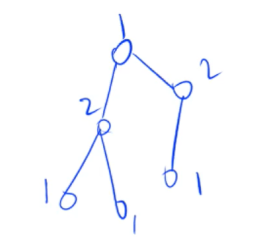

# 最小生成树和二分图

## 最小生成树

**算法的取舍**： 稠密图主要使用朴素版Prim算法， 稀疏图主要使用Kruskal算法。

### Prim（普利姆）算法

和Dijkstra算法一样

* **稠密图**上主要使用朴素版Prim算法，时间复杂度$O(n^2)$
* **稀疏图**里主要使用堆优化版本的Prim算法, 时间复杂度为$O(mlogn)$， 一般不常用。

#### 朴素Prim算法

模板步骤：

```c++
dist[i] <- +∞;
bool s[] 表示当前已经在连通块里的所有点;
for(int i = 1 ; i <=n; i++){
    t <- 找到s[]集合外距离最近的点;
    用t更新其他点到集合s[]的距离;
    s[t] = true;
}
```

#### 经典例题：

给定一个 n 个点 m 条边的无向图，图中可能存在重边和自环，边权可能为负数。

求最小生成树的树边权重之和，如果最小生成树不存在则输出 `impossible`。

给定一张边带权的无向图 G=(V,E)，其中 V 表示图中点的集合，E 表示图中边的集合，n=|V|，m=|E|。

由 V 中的全部 n 个顶点和 E 中 n−1 条边构成的无向连通子图被称为 G 的一棵生成树，其中边的权值之和最小的生成树被称为无向图 G 的最小生成树。

#### 输入格式

第一行包含两个整数 n 和 m。

接下来 m 行，每行包含三个整数 u,v,w，表示点 u 和点 v 之间存在一条权值为 w 的边。

#### 输出格式

共一行，若存在最小生成树，则输出一个整数，表示最小生成树的树边权重之和，如果最小生成树不存在则输出 `impossible`。

#### 数据范围

$$1≤n≤500,
1≤m≤10^5,
图中涉及边的边权的绝对值均不超过 10000。$$

#### 输入样例：

```
4 5
1 2 1
1 3 2
1 4 3
2 3 2
3 4 4
```

#### 输出样例：

```
6
```

#### 解答

```c++
#include<bits/stdc++.h>

using namespace std;
// 设置节点数和无穷大
const int N = 510 ,INF = 0x3f3f3f3f;

int n,m;

// 节点数最大是500，边的数目最大是十万，所以是稠密图，用邻接矩阵来存储
int g[N][N];
// 这个点到集合的距离
int dist[N];

bool st[N];


int prim(){
    memset(dist, 0x3f, sizeof(dist));
    int sum = 0;
    
    for(int i = 1; i <= n; i++){
        int t = -1;
        for(int j = 1; j <= n ; j++){
            if(!st[j] && ( t == -1 || dist[t] > dist[j])){
                t = j;
            }
        }

        // 这一步一定得在选出t之后马上加上，因为不连通的图就不存在最小生成树，直接返回INF
        if(i != 1 && dist[t] == INF){
            return INF;
        }
        
        // 先累加权值，再来更新，否则如果有负权值的自环，dist[j]会越来越小
        if( i != 1 )    sum += dist[t];
                
        for(int j = 1; j<=n; j++){
            // 与Dijkstra算法不同，这里min(dist[j] , g[t][j]) 
            dist[j] = min(dist[j], g[t][j] );
        }
        
        st[t] = true;
    }
    
    return sum;
}


int main(){
    scanf("%d%d", &n,&m);
    memset(g, 0x3f, sizeof(g));
    
    while( m --){
        int u,v,w;
        scanf("%d%d%d", &u, &v, &w);
        g[u][v] = g[v][u] = min(g[u][v] , w);
    }
    
    int t = prim();
    if(t == INF){
        puts("impossible");
    }else{
        printf("%d\n", t);
    }
    
    return 0;
}
```


### Kruskal 算法

Kruskal算法的时间复杂度主要花费在对图中边的排序上，时间复杂度为$O(mlogm)$.

模板：

```c++
将所有边按照权重从小到大排序;  	//O(mlogm)
从小到大枚举每一条边a -> b, 权重c：
    // 下面的if实际上是并查集的应用， O(m)
    if(a,b不连通){
    	将这条边加入到集合中;
    }
```

#### 经典例题：

给定一个 n 个点 m 条边的无向图，图中可能存在重边和自环，边权可能为负数。

求最小生成树的树边权重之和，如果最小生成树不存在则输出 `impossible`。

给定一张边带权的无向图 G=(V,E)，其中 V 表示图中点的集合，E 表示图中边的集合，n=|V|，m=|E|。

由 V 中的全部 n 个顶点和 E 中 n−1 条边构成的无向连通子图被称为 G 的一棵生成树，其中边的权值之和最小的生成树被称为无向图 G 的最小生成树。

#### 输入格式

第一行包含两个整数 n 和 m。

接下来 m行，每行包含三个整数 u,v,w，表示点 u 和点 v 之间存在一条权值为 w 的边。

#### 输出格式

共一行，若存在最小生成树，则输出一个整数，表示最小生成树的树边权重之和，如果最小生成树不存在则输出 `impossible`。

#### 数据范围

$$1≤n≤10^5,
1≤m≤2∗10^5,
图中涉及边的边权的绝对值均不超过 1000。$$

#### 输入样例：

```
4 5
1 2 1
1 3 2
1 4 3
2 3 2
3 4 4
```

#### 输出样例：

```
6
```


#### 解答

```c++
#include<bits/stdc++.h>

using namespace std;

const int N = 2e5 + 10;

// 不需要邻接表或者邻接矩阵来存储所有边
int n,m;

int p[N];

struct Edge{
    int a,b,w;
    bool operator< (const Edge &W) const{
        return w < W.w;
    }
}edges[N];


int find(int x){
    if(p[x] != x)  p[x] = find(p[x]);
    return p[x];
}

int main(){
    scanf("%d%d", &n, &m);
    
    for(int i = 0 ; i< m; i++){
        int a,b,w;
        scanf("%d%d%d", &a, &b, &w);
        edges[i] = {a,b,w};
    }
    
    sort(edges, edges + m);
    
    // 并查集的初始化
    for(int i = 1; i <= n ; i++)    p[i] = i;
    // res存的是最小生成树边的权重之和；
    // cnt存的是当前加入了多少条边;
    int res = 0, cnt = 0;
    for(int i = 0 ; i< m; i++){
        int a = edges[i].a, b = edges[i].b, w = edges[i].w;
        // a = a的祖宗节点
        a = find(a), b = find(b);
        if(a != b){
            p[a] = b;
            res += w;
            cnt ++;
        }
    }
    
    if(cnt < n - 1 ){
        puts("impossible");
    }else{
        printf("%d\n", res);
    }
    
    return 0;
    
}
```


## 二分图

二分图定义：可以把一个图中的所有节点划分成两块，使得所有的边都在两块之间，而每个块内部没有边；

**利用图论中的结论：一个图是二分图，当且仅当一个图中不含奇数环（一个环里的边的数目是奇数）。**

### 染色法判断一个图是否是二分图

时间复杂度是$O(m + n)$。由于图中不含有奇数环，所以染色过程中是一定没有矛盾的。



总结：如果一个图可以用染色法，将所有的节点染色（用深度优先遍历的方法染色）并且不产生矛盾，则这个图是一个二分图，反之不是。

#### 经典例题：

给定一个 n 个点 m 条边的无向图，图中可能存在重边和自环。

请你判断这个图是否是二分图。

#### 输入格式

第一行包含两个整数 n 和 m。

接下来 m 行，每行包含两个整数 u 和 v，表示点 u 和点 v 之间存在一条边。

#### 输出格式

如果给定图是二分图，则输出 `Yes`，否则输出 `No`。

#### 数据范围

$1≤n,m≤10^5$

#### 输入样例：

```
4 4
1 3
1 4
2 3
2 4
```

#### 输出样例：

```
Yes
```

#### 解答：

```c++
#include<bits/stdc++.h>

using namespace std;

const int N = 1e5 + 10, M = 2e5 + 20;

int n,m;
// 稀疏图，使用邻接矩阵的存储方式
int h[N], e[M], ne[M], idx;
// 记录每一个节点的染色
int color[N];

void add(int a,int b){
    e[idx] = b, ne[idx] = h[a], h[a] = idx++;
}

bool dfs(int u, int c){
    color[u] = c;
    
    for(int i = h[u]; i != -1; i = ne[i]){
        int j = e[i];
        if(!color[j]){
            // 如果节点j没有被染色
            if(!dfs(j,3 - c))   return false;
        }else{
            // 当前已经染过颜色
            if(color[j] == c)   return false;
        }
    }
    
    return true;
}

int main(){
    scanf("%d%d", &n, & m);
    
    memset(h , -1, sizeof(h));
    while( m -- ){
        int a,b;
        scanf("%d%d", &a, &b);
        add(a,b);
        add(b,a);
    }
    
    bool flag = true;
    
    for(int i = 1; i <= n; i++){
        // 暂时还未被染色
        if(!color[i]){
            if(!dfs(i, 1)){
                flag = false;
                break;
            }
        }
    }
    
    if(flag) puts("Yes");
    else    puts("No");
    
    return 0;
}
```


### 匈牙利算法（求二分图的最大匹配）

给定一个二分图，两块中的结点开始匹配，成功匹配的含义是：任意两条边，不会共用同一个结点。匈牙利算法返回匹配数目最大的匹配数。

时间复杂度最坏是$O(mn)$, 实际运行时间一般远小于$O(mn)$。


#### 思路

每次匹配的时候，如果当前匹配的结点已经属于别的结点，看一下，当前匹配的结点能否匹配别的结点。尝试了所有可能后，都无法满足自己的需求，才放弃。


#### 经典例题：

给定一个二分图，其中左半部包含 n1 个点（编号 1∼n1），右半部包含 n2 个点（编号 1∼n2），二分图共包含 m 条边。

数据保证任意一条边的两个端点都不可能在同一部分中。

请你求出二分图的最大匹配数。

> 二分图的匹配：给定一个二分图 G，在 G 的一个子图 M 中，M 的边集 {E} 中的任意两条边都不依附于同一个顶点，则称 M 是一个匹配。
>
> 二分图的最大匹配：所有匹配中包含边数最多的一组匹配被称为二分图的最大匹配，其边数即为最大匹配数。

#### 输入格式

第一行包含三个整数 n1、 n2 和 m。

接下来 m 行，每行包含两个整数 u 和 v，表示左半部点集中的点 u 和右半部点集中的点 v 之间存在一条边。

#### 输出格式

输出一个整数，表示二分图的最大匹配数。

#### 数据范围

$$1≤n1,n2≤500;
1≤u≤n1;
1≤v≤n2;
1≤m≤10^5$$

#### 输入样例：

```
2 2 4
1 1
1 2
2 1
2 2
```

#### 输出样例：

```
2
```


#### 解答

```c++
#include<bits/stdc++.h>
using namespace std;

const int N =510, M = 1e5 + 10;

int n1,n2,m;

// 边只需要存储从左边指向右边的所有边
int h[N], e[M], ne[M], idx;
int match[N];

// 判重，不要每次搜同一个结点
bool st[N];

void add(int a,int b){
    e[idx] = b, ne[idx] = h[a], h[a] = idx++;
}

bool find(int x){
    for(int i = h[x]; i != -1; i = ne[i]){
        int j = e[i];
        if(!st[j]){
            st[j] = true;
            if( match[j] == 0 || find(match[j])){
                // 如果女生还没有匹配任何男生,或者女生匹配的男生可以找到其余女生
                match[j] = x;
                return true;
            }
        }
    }
    return false;
}

int main(){
    scanf("%d%d%d", &n1, &n2, &m);
    memset(h , -1, sizeof(h));
    
    while( m -- ){
        int a,b;
        scanf("%d%d", &a, &b);
        add(a,b);
    }
    
    // res是所有结点的数量
    int res = 0;
    for(int i = 1; i <= n1; i ++)
    {
        memset(st, false, sizeof(st));
        if(find(i)) res ++;    
    }
    
    printf("%d\n", res);
    
    return 0;
}
```

