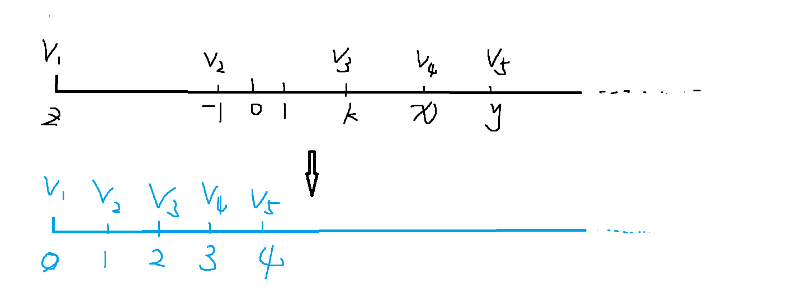

## 离散化

所谓区间离散化：指的是，如果一根数轴上只有部分稀疏的点有具体的值，其余点都是0；那么就可以将这些**带有值的点**映射到一根新的数轴上存下来，**减小了空间复杂度，降低了任务难度**。

示意图如下所示：



### 经典例题：区间和 Acwing802

假定有一个无限长的数轴，数轴上每个坐标上的数都是 0。

现在，我们首先进行 n 次操作，每次操作将某一位置 x 上的数加 c。

接下来，进行 m 次询问，每个询问包含两个整数 l 和 r，你需要求出在区间 [l,r]之间的所有数的和。

#### 输入格式

第一行包含两个整数 n 和 m。

接下来 n 行，每行包含两个整数 x 和 c。

再接下来 m 行，每行包含两个整数 l 和 r。

#### 输出格式

共 m 行，每行输出一个询问中所求的区间内数字和。

#### 数据范围

$−10^9≤x≤10^9$,
$1≤n,m≤10^5,$
$−10^9≤l≤r≤10^9$
$−10000≤c≤10000$

#### 输入样例：

```
3 3
1 2
3 6
7 5
1 3
4 6
7 8
```

#### 输出样例：

```
8
0
5
```


#### 题解如下：

```c++
#include<iostream>
#include<vector>
#include<algorithm>

using namespace std;
// 3e5 + 10 是为了将询问区间和原来的初始区间都放入a里
const int N = 3e5 + 10;
typedef pair<int,int> PII;

int a[N],s[N];
vector<PII> add,query;

vector<int> alls;

// 二分查找
int bfind( int x){
    int l = 0;
    int r = alls.size() - 1;
    while( l < r){
        int mid = l + r >> 1;
        if( alls[mid] >= x)  r = mid;
        else l = mid + 1;
    }
    return l + 1;
}

int main(){
    int n,m;
    cin >> n >> m;
    while(n --){
        int x,c;
        scanf("%d%d", &x,&c);
        add.push_back( {x,c} );
        alls.push_back(x);
    }
    
    while( m-- ){
        int l,r;
        scanf("%d%d", &l,&r);
        query.push_back( { l , r} );
        alls.push_back(l);
        alls.push_back(r);
    }
    
    // 对alls进行离散化： 排序 + 去重；这两句很重要
    sort(alls.begin() , alls.end() );
    alls.erase( unique(alls.begin() , alls.end() ), alls.end() );
    
    // 找到对应离散后的下标的元素，添加上值
    for( auto item : add){
        int x = bfind(item.first);
        a[x] += item.second;        
    }
    
    // 前缀和
    for(int i = 1 ; i <= alls.size(); i++)  s[i] = s[i-1] + a[i];
    
    // 处理询问
    for(auto item : query){
        int l = bfind(item.first);
        int r = bfind(item.second);
        printf("%d\n", s[r] - s[l-1]);
    }
    
    return 0;
}
```

