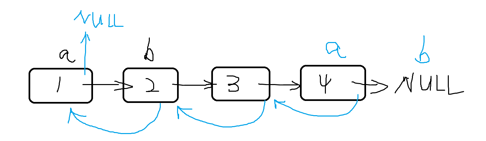

# 链表

传统的`struct ListNode`在`new`动态开辟数组的时候，速度太慢，容易超时。如果已知长度，最好使用静态链表

* 单链表：邻接表： 存储图，存储树
* 双链表

----

静态单链表：e[N] 存储数组中的值，用 ne[N]来存储结点的`next`指针，idx表示当前用到了哪个结点。

`e[] 和ne[] `用下标关联起来。具体规则如下：空集用-1来表示。


```c++
#include <bits/stdc++.h>
using namespace std;
const int N = 1e5 + 10;
int e[N], head, ne[N], idx;

void init() {
    head = -1;
    idx = 0;
}

void insert(int x) {
    e[idx] = x;
    ne[idx] = head;
    head = idx++;
}

void remove() {
    head = ne[head];
}

int main() {
    init();
    for (int i = 0; i < 3; i ++) {
        insert(i);
    }
    for (int i = head; i != -1; i = ne[i]) {
        cout << e[i] << endl;
    }
    return 0;
}
/*
output:
2
1
0
*/
```


Struct/class 形式的单链表：

```c++
#include <bits/stdc++.h>
using namespace std;

struct ListNode {
    int val;
    ListNode* next;
    ListNode() : val(0), next(nullptr) {}
    ListNode(int x) : val(x), next(nullptr) {}
    ListNode(int x, ListNode* node) : val(x), next(node) {}
};


int main() {
    ListNode* head = new ListNode();
    ListNode* p = head;
    // 尾插法
    for (int i = 0; i < 3; i ++) {
        ListNode* node = new ListNode(i);
        p->next = node;
        p = p -> next;
    }
    // 写算法不需要释放内存，但是写工程需要释放内存
    ListNode* tail = p;
    for (p = head->next; p != nullptr; p = p->next) {
        cout << p->val << endl;
    }
    for (p = head; p != tail; ) {
        ListNode* latter = p->next;
        delete(p);
        p = latter;
    }
    delete(tail);
    
    return 0;
}
```


## Acwing 826, 单链表操作模板题目：

```c++
#include<iostream>
#include<string>
using namespace std;

const int N = 1e5 + 10;

int e[N], ne[N], head, idx;

void insertHead(int x){
    e[idx] = x;
    ne[idx] = head;
    head = idx;
    idx ++;
}

void insertK(int k,int x){
    e[idx] = x;
    ne[idx] = ne[k];
    ne[k] = idx;
    idx++;
}

void deleteK(int k){
    // 注意，在第k个插入的数的后一个数，不一定是第k+1个插入的数，不能写成ne[k] = ne[k + 1]
    ne[k] = ne[ne[k]];
}

void printAll()
{
    // 注意边界条件 i != -1 ， 而不是e[i] != -1;
    for(int i = head; i != -1; i = ne[i]){
        printf("%d ",e[i]);
    }
}

int main(){
    int m;
    cin >> m;
    head = -1;
    idx = 0;
    while( m --){
        int k,x;
        char op;
        cin >> op;
        //注意switch语句中，op只能是char或者int类型
        switch( op ){
            case 'H':
                cin >> x;
                insertHead(x);
                break;

            case 'I':
                cin >> k >> x;
                // 注意这里的下标要减一，因为原数组是从下标0开始
                insertK(k - 1,x);
                break;

            case 'D':
                cin >> k;
                // 删除头结点需要单独考虑
                if( k == 0){
                    head = ne[head]; 
                }else{
                    deleteK(k - 1);
                }

                break;

        }
    }
    printAll();


    return 0;
}
```


## 双链表：Acwing 827模板题

* 双链表的题型跟单链表类似，也用数组来实现，但是此时需要三个数组`e[N],l[N],r[N]`，分别存储所在下标的值，左链接的下标，右链接的下标。
* 使用下标为0作为左端点，下标1作为右端点。

```c++
#include<iostream>
#include<string>
using namespace std;

const int N = 100010;

int e[N], l[N], r[N], idx;

void initial() {
    // 下标0作为左端点，下标1作为右端点
    r[0] = 1;
    l[1] = 0;
    idx = 2;
}

void insert(int k, int x) {
    e[idx] = x;
    r[idx] = r[k];
    l[idx] = k;
    // 注意下面两步的顺序一定不能出错，先判断k的右结点的左线 = 新插入位置
    // k结点的右连线更改为新插入位置
    l[r[k]] = idx;
    r[k] = idx;
    idx++;
}

void remove(int k) {
    l[r[k]] = l[k];
    r[l[k]] = r[k];
}


void printAll() {
    for (int i = r[0]; i != 1; i = r[i]) {
        printf("%d ", e[i]);
    }
}

int main() {
    int m;
    cin >> m;
    int k, x;
    initial();
    while (m--) {
        string op;
        cin >> op;
        if (op == "R") {
            cin >> x;
            insert(l[1], x);
        }
        else if (op == "L") {
            cin >> x;
            insert(0, x);
        }
        else if (op == "D") {
            cin >> k;
            remove(k + 1);
        }
        else if (op == "IL") {
            cin >> k >> x;
            insert(l[k + 1], x);
        }
        else {
            //op == "IR"
            cin >> k >> x;
            insert(k + 1, x);
        }
    }
    printAll();
    return 0;
}
```


## 链表的几个模板

- 链表向前走k步，如果链表长度>=k，返回第k个节点位置；如果链表长度小于k，则返回null;

```java
private ListNode getEnd(ListNode head, int k) {
    while (head != null) {
        head = head.next;
        k --;
        if (k == 0)	break;
    }
    return head;
}
```


## leetcode 141 环形链表1

给你一个链表的头节点 `head` ，判断链表中是否有环。

如果链表中有某个节点，可以通过连续跟踪 `next` 指针再次到达，则链表中存在环。 为了表示给定链表中的环，评测系统内部使用整数 `pos` 来表示链表尾连接到链表中的位置（索引从 0 开始）。如果 `pos` 是 -1，则在该链表中没有环。注意：`pos` 不作为参数进行传递，仅仅是为了标识链表的实际情况。

如果链表中存在环，则返回`true` 。 否则，返回 `false` 。
链接：https://leetcode-cn.com/problems/linked-list-cycle

**思路：**

利用快慢双指针法，时间复杂度为O(n).

慢指针从head开始，每次前进一步，快指针从`head`开始，每次行动两步。

```c++
/**
 * Definition for singly-linked list.
 * struct ListNode {
 *     int val;
 *     ListNode *next;
 *     ListNode(int x) : val(x), next(NULL) {}
 * };
 */
class Solution {
public:
    bool hasCycle(ListNode *head) {
        // 如果head为空或者没有next（只有一个节点），肯定无环
        if(!head || !head -> next)  return false;
        auto s = head, f = head -> next;
        while(f){
            s = s -> next;
            f = f -> next;
            // 如果快指针走到末尾，为NULL了
            if(!f) return false;
            f = f -> next;
            // 如果slow和fast指针相遇，则一定有环
            if(s == f){
                return true;
            }
        }
        return false;
    }
};
```


## Leetcode 142环形链表2

**环形链表2**:给定一个链表，返回链表开始入环的**第一个节点**。 如果链表无环，则返回 `null`。

[142. 环形链表 II - 力扣（LeetCode） (leetcode-cn.com)](https://leetcode-cn.com/problems/linked-list-cycle-ii/)

快慢指针都从head开始，与上一题不同的是，如何找“入环点”？

设A点是入环点，B点是快慢指针相遇的点，当慢节点走了`x + y` 步到达B点时，快节点走了`2 * (x + y)` 步，不妨可以假设一点C，从A到C经过的步数是`X`。从`C`走到入环点A也有`y`步。

那么当快慢指针相遇的时候，把慢指针退回到head处，快指针在B点不动，这样当两者再次相遇时，所遇到的节点就是入环点。


```c++
/**
 * Definition for singly-linked list.
 * struct ListNode {
 *     int val;
 *     ListNode *next;
 *     ListNode(int x) : val(x), next(NULL) {}
 * };
 */
class Solution {
public:
    ListNode *detectCycle(ListNode *head) {
        if(!head || !head->next)    return NULL;
        // 快慢指针都从head节点开始
        auto s = head, f = head;
        while(f){
            s = s -> next;
            f = f -> next;
            if(!f)  return NULL;
            f = f -> next;  
            // 关键
            if( s == f){
                s = head;
                while( s != f){
                    s = s-> next;
                    f = f -> next;
                }
                return s;
            }
        }
        return NULL;
    }
};
```


## 经典面试题： 反转链表

定义一个函数，输入一个链表的头结点，反转该链表并输出反转后链表的头结点。

**思考题：**

- 请同时实现迭代版本和递归版本。

**数据范围**

链表长度 `[0,30]`。

**样例**

```
输入:1->2->3->4->5->NULL

输出:5->4->3->2->1->NULL
```


1. 迭代版本



```c++
/**
 * Definition for singly-linked list.
 * struct ListNode {
 *     int val;
 *     ListNode *next;
 *     ListNode(int x) : val(x), next(NULL) {}
 * };
 */
class Solution {
public:
    ListNode* reverseList(ListNode* head) {
        // 特判head为空和只存在一个结点的时候
        if(!head || !head -> next)  return head;
        auto pre_node = head, cur_node = head -> next;
        // 当cur_node不为空的时候
        while(cur_node){
            auto nx_node = cur_node -> next;
            cur_node -> next = pre_node;
            pre_node = cur_node;
            cur_node = nx_node;
        }
        // 这一行一定记得要加上
        head -> next = NULL;
        return pre_node;
    }
};

```


重点关注递归版本：

首先考虑`reverseList`函数能做什么，它能够将当前的head结点到最后的结点中的所有结点连接关系翻转，并返回新链表的头结点，也就是原链表的尾结点。

所以我们可以先递归处理 `reverseList(head->next)`，这样我们可以将以`head->next`为头节点的链表翻转，并得到原链表的尾节点tail，此时head->next是新链表的尾节点，我们令它的next指针指向head，并将head->next指向空即可将整个链表翻转，且新链表的头节点是tail。

时间复杂度：链表中每个节点被遍历一次，时间复杂度O(n)。 空间复杂度：总共递归n层，系统栈的空间复杂度O(n), 所以总共需要额外O(n)的空间。

```c++
/**
 * Definition for singly-linked list.
 * struct ListNode {
 *     int val;
 *     ListNode *next;
 *     ListNode(int x) : val(x), next(NULL) {}
 * };
 */
class Solution {
public:
    ListNode* reverseList(ListNode* head) {
        if (!head || !head->next) return head;
        ListNode *tail = reverseList(head->next);
        // 下面这一步很重要
        head->next->next = head;
        head->next = nullptr;
        return tail;
    }
};
```


## 约瑟夫环问题

### 最经典的问题：[围圈报数](https://www.acwing.com/problem/content/3562/)

使用循环链表模拟解决的方法如下：

```cpp
#include <iostream>
#include <cstring>
#include <algorithm>

using namespace std;

struct LinkNode
{
    int val;
    LinkNode *next;
    LinkNode(): val(0), next(nullptr) {}
    LinkNode(int x) : val(x), next(nullptr) {}
    ~LinkNode(){
        delete next;
    }
};

int main()
{
    int t;
    cin >> t;
    while (t --) {
        int n;
        scanf("%d", &n);
        // 先构造一个哨兵节点，方便添加元素
        LinkNode *head = new LinkNode();
        LinkNode *u = head;
        for (int i = 1; i <= n; i ++) {
            LinkNode *tmp = new LinkNode(i);
            u -> next = tmp;
            u = u -> next;
        }
        // 循环链表
        head = head -> next;
        u ->  next = head;
        while (n --) {
            for (int i = 1; i < 3; i ++) {
                head = head -> next;
                u = u -> next;
            }
            cout << head -> val << " ";
            // 链表删除元素
            u -> next = head -> next;
            head = head -> next;
        }
        cout << endl;
    }
    return 0;
}
```


如果要想知道最后一轮剩下的玩家的编号，可以使用著名的**约瑟夫环递推**公式：

假设（以后遇到的约瑟夫环问题都需要这么假设，真实的编号如果是从1开始，可以在最后的结果上加1即可）最后一轮胜出者当前编号是0，即`f(1) = 0`, 每一轮都找到胜出者在上一轮中的编号：`f(i) = (f(i-1) + m) % i`, 

m表示每次报数的个数，比如3，表示报到3的人淘汰。所以上一题如果要求最后一轮留下的人，代码可以这么写。

```cpp
#include <iostream>
#include <cstring>
#include <algorithm>

using namespace std;

const int N = 60;
int main()
{
    int t;
    cin >> t;
    while (t --) {
        int n;
        cin >> n;
        // res = 0 是假设最后一轮剩下的人编号是0
        int res = 0;
        // i从2开始，到n结束。
        for (int i = 2; i <= n; i ++) {
            res = (res + 3) % i;
        }
        cout << res + 1 << endl;
    }
    return 0;
}
```


### 改编问题：[招聘](https://www.acwing.com/problem/content/description/1457/)

这个问题在于，每次淘汰掉的报数的数字是不同的，即`m`是变化的，这个需要根据题目要求修改。可以写一个简单的手动验证一下。
```cpp
#include <iostream>

using namespace std;

const int N = 1e3 + 10;
int a[N];

int main()
{
    int T;
    cin >> T;
    while (T --) {
        int n, m;
        cin >> n >> m;
        for (int i = 0; i < m; i ++)    cin >> a[i];
        
        int res = 0;
        for (int i = 2; i <= n; i ++) {
            res = (res + a[ (n - i) % m]) % i;
        }
        cout << res << endl;
    }
    return 0;
}
```


## 深拷贝带随机指针的链表

> [Leetcode 138 深拷贝带随机指针链表] (https://leetcode.cn/problems/copy-list-with-random-pointer/)
> 

这道题是链表中最经典的问题之一，两个思想都很巧妙，要掌握：1. 在原链表每个节点后复制一个相同节点。 2. 新增dummy节点分开长链表中的部分节点。

**题意解析：**
链表中的特点就是只能由上一个元素传递过来访问，充分利用这个性质，可以首先在所有链表元素的后面再插入一个相同数值的节点。

接下来再处理随机指针，通过这条巧妙的语句：`p->next->random = p->random->next`;

最后将复制链表和原链表分开：
新增dummy节点，更加方便分开。

```cpp
/*
// Definition for a Node.
class Node {
public:
    int val;
    Node* next;
    Node* random;
    
    Node(int _val) {
        val = _val;
        next = NULL;
        random = NULL;
    }
};
*/

class Solution {
public:
    Node* copyRandomList(Node* head) {
    // 插入一个相同的节点
        for (auto p = head; p; p = p->next->next) {
            auto q = new Node(p->val);
            q->next = p->next;
            p->next = q;
        }

        for (auto p = head; p; p = p->next->next) {
            if (p->random) {
                p->next->random = p->random->next;
            }
        }

		// 增加一个dummy节点来分开两个链表，也很巧妙
        auto dummy = new Node(-1), cur = dummy;
        for (auto p = head; p; p = p->next) {
            auto q = p->next;
            cur->next = q;
            cur = cur->next;
            // 还原原链表
            p->next = q->next;
        }
        return dummy->next;
    }
};
```


## Leetcode 328 奇偶链表

> (https://leetcode.cn/problems/odd-even-linked-list/)

给定单链表的头节点 head ，将所有索引为奇数的节点和索引为偶数的节点分别组合在一起，然后返回重新排序的列表。

第一个节点的索引被认为是 奇数 ， 第二个节点的索引为 偶数 ，以此类推。

请注意，偶数组和奇数组内部的相对顺序应该与输入时保持一致。

你必须在 O(1) 的额外空间复杂度和 O(n) 的时间复杂度下解决这个问题。

```
输入: head = [1,2,3,4,5]
输出: [1,3,5,2,4]
```


**解答思路：**

1. 链表题，二叉树的题目：先判空和只有一个节点的情况。
2. 画图做，遍历的时候**按照遍历轮次**来画图，找停止循环的条件。
3. `odd_tail->next = odd_u = odd_u->next->next;` 这种连等的写法是从右往左看，非常简洁。代码清晰。

```cpp
/**
 * Definition for singly-linked list.
 * struct ListNode {
 *     int val;
 *     ListNode *next;
 *     ListNode() : val(0), next(nullptr) {}
 *     ListNode(int x) : val(x), next(nullptr) {}
 *     ListNode(int x, ListNode *next) : val(x), next(next) {}
 * };
 */
class Solution {
public:
    ListNode* oddEvenList(ListNode* head) {
        // 判空
        if (head == nullptr || head->next == nullptr)   return head;
        ListNode* odd_head, *odd_tail, *even_head, *even_tail;
        odd_head = odd_tail = head;
        even_head = even_tail = head->next;
        ListNode *odd_u = odd_tail;
        ListNode *even_u = even_tail;
        // 停止循环的条件
        while (odd_tail->next != nullptr && even_tail->next != nullptr) {
            odd_tail->next = odd_u = odd_u->next->next;
            if (odd_u)  odd_tail = odd_u;
            even_tail->next = even_u = even_u->next->next;
            if (even_u) even_tail = even_u;
        }
        odd_tail->next = even_head;
        return odd_head;
    }
};
```

