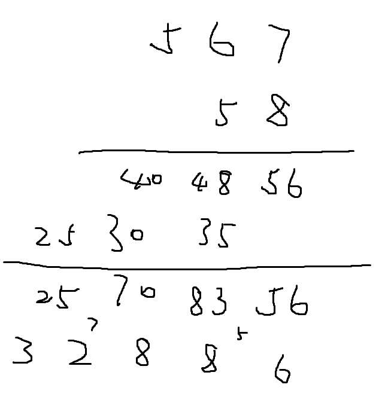

## 高精度 * 低精度

思路：

用`vector<int> A`里的每一个数去乘以b，将每次的结果%10的值，存到`res`里，进位传递到下一个循环里。

```c++
#include <iostream>
#include <vector>
#include <algorithm>
using namespace std;

const int N = 1e5 + 10;

vector<int> multi(vector<int> &A, int b)
{
    // 函数内的局部变量，注意一定要初始化
    int c = 0;
    int t = 0;
    vector<int> res;
    for(int i = 0; i < A.size(); i++){
        t = A[i] * b + c;
        res.push_back(t % 10);
        c = t / 10;
    }
    while (c)
    {
        res.push_back(c % 10);
        c /= 10;
    }

    // 乘法也要去除前导0,如果输入是12345 和 0, 那么结果是00000， 不对的。
    while (res.size() > 1 && res.back() == 0)
        res.pop_back();

    return res;
}

int main()
{
    string a;
    int b;
    cin >> a >> b;

    vector<int> A;
    vector<int> C;
    // 把个位存在vector数组中的开始位
    for (int i = a.size() - 1; i >= 0; i--)
        A.push_back(a[i] - '0');
    C = multi(A, b);

    for (int i = C.size() - 1; i >= 0; i--)
        printf("%d", C[i]);

    return 0;
}
```


## 高精度 * 高精度

思路：




```c++
#include <iostream>
#include <vector>

using namespace std;


vector<int> mul(vector<int> &A, vector<int> &B) {
    vector<int> C(A.size() + B.size(), 0); // 初始化为 0，且999*99最多 5 位

    for (int i = 0; i < A.size(); i++)
        for (int j = 0; j < B.size(); j++)
            C[i + j] += A[i] * B[j];

    int t = 0;
    for (int i = 0; i < C.size(); i++) { // i = C.size() - 1时 t 一定小于 10
        t += C[i];
        C[i] = t % 10;
        t /= 10;
    }

    while (C.size() > 1 && C.back() == 0) C.pop_back(); // 必须要去前导 0，因为最高位很可能是 0
    return C;
}

int main() {
    string a, b;
    cin >> a >> b; // a = "1222323", b = "2323423423"

    vector<int> A, B;
    for (int i = a.size() - 1; i >= 0; i--)
        A.push_back(a[i] - '0');
    for (int i = b.size() - 1; i >= 0; i--)
        B.push_back(b[i] - '0');

    auto C = mul(A, B);

    for (int i = C.size() - 1; i >= 0; i--)
        cout << C[i];

    return 0;
}
```

